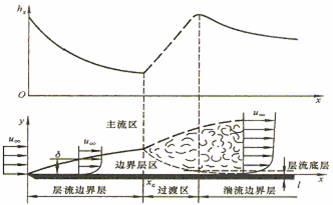

# 第一节 对流换热概述

## 一、对流换热

流体与固体壁面直接接触时所发生的热量传递过程

#### 对流换热与热对流不同

对流换热既有热对流，也有导热；不是基本传热方式

#### 对流换热的特点

* 导热与热对流同时存在的复杂热传递过程，影响因素很多
* 必须有直接接触（流体与壁面）和宏观运动
* 必须有温差

#### 对流换热的基本计算式

牛顿冷却公式
$$
\Phi=hA(t_w-t_\infty)=\frac{t_w-t_\infty}{1/(hA)}=\frac{\Delta t}R[W]
$$
对流换热系数 $h[W/(m^2\cdot℃)]$

对流热阻 $\frac1{hA}[K/W]$ 
$$
q=\frac\Phi A=h(t_w-t_f)
$$
如何确定 $h$ 及增强换热的措施是对流换热的核心问题

## 二、对流换热的影响因素及对流换热的分类

#### 影响因素：

* 流动起因
* 流动状态
* 流体有无相变
* 换热表面的几何因素
* 流体的热物理性质等

#### 对流换热的分类：

1. ##### 流动起因 $(h_{强制}>h_{自然})$

   * 自然对流：流体因各部分温度不同而引起的密度差异所产生的流动
   * 强制对流：由外力（如：泵、风机、水压头）作用所产生的流动
   * 混合对流：强制对流和自然对流并存的流动

2. ##### 流动状态 $(h_{紊流}>h_{层流})$

   对流换热的热阻主要集中在紧贴壁面的边界层内：

   * 层流：整个流场呈一簇互相平行的流线

     传热依靠层与层之间的导热，热阻较大。

   * 紊流：流体质点做复杂无规则的运动（湍流）

     层流底层很薄，热阻较小

3. ##### 流体有无相变 $(h_{相变}>>h_{单相})$

   * 单相换热

   * 相变换热：凝结、沸腾、升华、凝固、融化等

     相变换热特点：

     * 流体温度不变
     * 交换的热量是潜热，比显热大得多
     * 对流动的扰动增强

4. ##### 换热表面的几何因素

   * 内流，内部流动对流换热：管内或槽内
   * 外掠，外部流动对流换热：外掠平板、圆管、管束
   * 定性尺寸 $l:$ 
     * 对换热有决定意义的特征尺寸
     * 表征换热表面几何形状对换热的影响

5. ##### 流体的热物理性质：

   * 导热： $\lambda[W/(m\cdot℃)]$

   * 比热容： $c[J/(kg\cdot℃)]$

   * 密度： $\rho[kg/m^3]$

   * 动力粘度： $\mu[N\cdot s/m^2]$

   * 体胀系数： $\beta[1/K]$
     $$
     \beta=\frac1v\left(\frac{\partial v}{\partial T}\right)_p=-\frac1\rho\left(\frac{\partial\rho}{\partial T}\right)_p=\frac1T\quad(对于理想气体)
     $$

   因温度不同，物性不同。选用某特征温度作为定性温度，分析流体物性。

一般来说：

$\lambda\uarr\Rightarrow h\uarr$ （流体内部和流体与壁面间导热热阻小）

$\rho、c\uarr\Rightarrow h\uarr$ （单位体积流体能携带更多能量）

$\mu\uarr\Rightarrow h\darr$ （有碍流体流动、不利于热对流）

$\beta\uarr\Rightarrow h_{自然}\uarr$ （自然对流换热增强）

综上所述，表面传热系数是众多因素的函数：
$$
h=f(u,t_w,t_f,\lambda,c_p,\rho,\beta,\mu,l,\Omega)\\
(流速u，壁面温度t_w，流体温度t_f，导热系数\lambda，比热容c_p，流体密度\rho，体积膨胀系数\beta，动力粘度\mu，特征尺寸因素l)
$$

## 三、表面传热系数的确定方法

### 1、微分方程式的数学解法

* 精确解法（分析解）：根据边界层理论，得到边界层微分方程组——常微分方程——求解
* 近似积分法：假设边界层内的速度分布和温度分布，解积分方程
* 数值解法（近年来发展迅速）：可求解很复杂问题：三维、紊流、变物性、超音速

### 2、实验法

用相似理论指导

# 第二节 边界层概念

当粘性流体流过物体表面时，会形成速度梯度很大的**流动边界层**（Boundary layer，1904年德国普朗特）；

当壁面与流体间有温差时，会产生温度梯度很大的温度边界层（热边界层）。

## 一、流动边界层

任何流体都有粘性，由于粘性，就会产生速度差。由牛顿粘性定律：
$$
\tau=\mu\frac{\partial u}{\partial y}
$$

### 边界层结构

1. 层流

   流体分层流动，沿壁面的法线方向

   * 没有热对流
   * 仅为热传导

   由于流体的导热系数较低，所以层流层导热热阻很大，且随边界层厚度增加而增加。

2. 紊流

   紊流主体区：

   * 流体质点剧烈混合
   * 并充满漩涡
   * 强烈热对流
   * 几乎没有热阻

   层流底层：紧靠壁面处，粘滞力会占绝对优势，使粘附于壁的一极薄层仍然会保持层流特征

## 二、热边界层

当壁面与流体间有温差时，会产生温度梯度很大的温度边界层（热边界层）
$$
y=0，\theta=T_w-T=\theta_w=0\\
y=\delta_t，\theta=T_w-T=0.99\theta_f
$$
流动边界层与热边界层的状况决定了热量传递过程和边界层内的温度分布

$\delta$ 与 $\delta_t$  的物理意义：分别反映流体分子和流体微团的动量和热量扩散的深度（ $\delta$ 与 $\delta_t$  不一定相等）
$$
\tau=\mu\frac{\partial u}{\partial y}=\frac\mu\rho\frac{\partial(\rho u)}{\partial y}=v\frac{\partial(\rho u)}{{\partial y}}\\
运动扩散系数——v=\frac\mu\rho[m^2/s]\\
q=\lambda\frac{\partial t}{\partial y}=\frac\lambda{\rho c}\frac{\partial(\rho ct)}{\partial y}=a\frac{\partial(\rho ct)}{{\partial y}}\\
热扩散系数——a=\frac\lambda{\rho c}[m^2/s]\\
\frac{\delta_t}\delta\approx\mathrm{Pr^{-\frac13}}=\left(\frac va\right)^{-\frac13}
$$

# 第三节 对流换热的微分方程组

> 理论依据：热力学+流体力学

$$
\begin{align}
对流换热微分方程组\\
\mathrm{Governing\ equations}
\end{align}
\begin{cases}
对流换热过程微分方程式\\
流体连续性方程(速度场)\\
流体动量微分方程(速度场)\\
流体能量微分方程(温度场)
\end{cases}
$$

以不可压缩、牛顿黏性、常物性流体的二维对流换热为例

### 一、对流换热过程微分方程式

壁x处的对流换热量：
$$
q_x=h_x(t_w-t_f)_x=h_x\Delta t_x
$$

### 二、连续性方程

二维常物性稳态流动

质量守恒原理：稳态流动时，流入微元体的质量等于流出的质量。

### 三、动量微分方程式

纳维——斯托克斯方程

二维常物性稳态流动

动量守恒定律（牛顿第二运动定律）：作用在微元体上的各外力的总和等于它的惯性力，作用力=质量·加速度。

### 四、能量微分方程式

能量守恒原理：进入微元体的净热量应等于微元体能量的增量。

### 五、控制方程

$$
\begin{cases}
\frac{\partial u}{\partial x}+\frac{\partial v}{\partial y}=0\\
\rho\left(\frac{\partial u}{\partial \tau}+u \frac{\partial u}{\partial x}+v \frac{\partial u}{\partial y}\right)=X-\frac{\partial p}{\partial x}+\mu\left(\frac{\partial^{2} u}{\partial x^{2}}+\frac{\partial^{2} u}{\partial y^{2}}\right)\\
\rho\left(\frac{\partial v}{\partial \tau}+u \frac{\partial v}{\partial x}+v \frac{\partial v}{\partial y}\right)=Y-\frac{\partial p}{\partial y}+\mu\left(\frac{\partial^{2} v}{\partial x^{2}}+\frac{\partial^{2} v}{\partial y^{2}}\right)\\
\rho c_{p}\left(\frac{\partial t}{\partial \tau}+u \frac{\partial t}{\partial x}+v \frac{\partial t}{\partial y}\right)=\lambda\left(\frac{\partial^{2} t}{\partial x^{2}}+\frac{\partial^{2} t}{\partial y^{2}}\right) \\
h_{x}=-\frac{\lambda}{\Delta t_{x}}\left(\frac{\partial t}{\partial y}\right)_{w, x}
\end{cases}
$$

5个未知量： $h、u、v、t、p$ ，因动量方程高度非线性，难以数学求解。通过数量级分析简化，得出边界层方程组，进而求解。

# 第四节 边界层微分方程

## 一、数量级分析

* 边界层内基本变量的数量级

  |  变量  | $x$  |   $y$    | $u$  |   $v$    | $t$  |
  | :----: | :--: | :------: | :--: | :------: | :--: |
  | 数量级 |  1   | $\delta$ |  1   | $\delta$ |  1   |

* 导数数量级由其自变量和因变量而定
  $$
  \frac{\partial t}{\partial x}\sim\frac11=1\\
  \frac{\partial}{\partial y}\left(\frac{\partial t}{\partial y}\right)\sim\frac{1/\delta}\delta=\frac1{\delta^2}
  $$

* 同类型的物理量，作用效果相当时，其数量级相同，黏滞力与惯性力的数量级相当，若 $\rho\sim o(1)$ 则， $\mu\sim o(\delta^2)$ 。

* 各方向上的动量微分方程的相对量

  $X$ 方向上的惯性力 $>>Y$ 方向惯性力

  忽略 $Y$ 方向上的动量方程式

* 边界层内的压力梯度，忽略 $Y$ 方向上的
  $$
  \frac{\partial p}{\partial x}\sim\frac{dp}{dx}=-\rho u_\infty\frac{du_\infty}{dx}
  $$

* 外掠平板层流，当 $u_\infty=\mathrm{const}$ 时：
  $$
  \frac{dp}{dx}=-\rho u_\infty\frac{du_\infty}{dx}=0
  $$
  边界层动量微分方程：
  $$
  u \frac{\partial u}{\partial x}+v \frac{\partial u}{\partial y}=v \frac{\partial^{2} u}{\partial y^{2}}
  $$
  边界层能量微分方程：
  $$
  u \frac{\partial t}{\partial x}+v \frac{\partial t}{\partial y}=a \frac{\partial^{2} t}{\partial y^{2}}
  $$
  若： $v=a$ 则： $\delta=\delta_t$
  $$
  \mathrm{Pr}=\frac va\quad数量级
  \begin{cases}
  0.01\quad液态金属\\
  0.6～0.7\quad气体\\
  100～1000\quad油类
  \end{cases}
  $$

## 二、外掠平板层流边界层对流换热微分方程分析

$$
\begin{cases}
\frac{\partial u}{\partial x}+\frac{\partial v}{\partial y}=0\\
u \frac{\partial u}{\partial x}+v \frac{\partial u}{\partial y}=v \frac{\partial^{2} u}{\partial y^{2}}  \Longrightarrow 速度场\begin{cases}
\frac{\delta}{x}=5.0 \mathrm{Re}_{x}^{-\frac12} \\
\frac{C_{f, x}}{2}=0.332 \mathrm{Re}_{x}^{-\frac12}
\end{cases}\\
u \frac{\partial t}{\partial x}+v \frac{\partial t}{\partial y}=a \frac{\partial^{2} t}{\partial y^{2}} \Longrightarrow 温度场\\
h_{x}=-\frac{\lambda}{\Delta t}\left(\frac{\partial t}{\partial y}\right)_{w, x}\Longrightarrow h_{x}=0.332 \frac{\lambda}{x} \operatorname{Re}_{x}^{\frac12} \operatorname{Pr}^{\frac13}
\end{cases}
$$

准则关联式： 
$$
Nu_x=\frac{h_xx}\lambda=0.332\mathrm{Re}_x^\frac12\operatorname{Pr}^{\frac13}\\
h=2 h_{x}，N u=2 N u_{x}
$$
论：化多变量为少变量，可指导问题分析、实验研究与数据修整