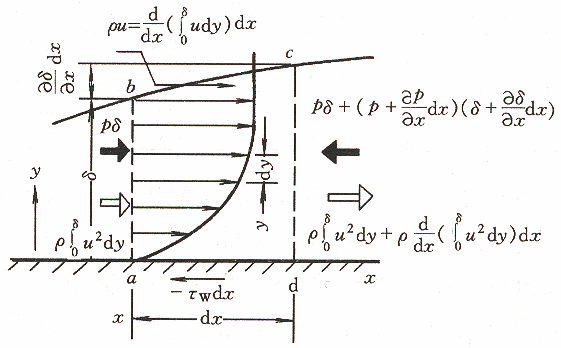

# 第一节 对流换热概述

## 一、对流换热

流体与固体壁面直接接触时所发生的热量传递过程

#### 对流换热与热对流不同

对流换热既有热对流，也有导热；不是基本传热方式

#### 对流换热的特点

* 导热与热对流同时存在的复杂热传递过程，影响因素很多
* 必须有直接接触（流体与壁面）和宏观运动
* 必须有温差

#### 对流换热的基本计算式

牛顿冷却公式

$$
\Phi=hA(t_w-t_\infty)=\frac{t_w-t_\infty}{1/(hA)}=\frac{\Delta t}R[W]
$$

对流换热系数 $h[W/(m^2\cdot℃)]$

对流热阻 $\frac1{hA}[K/W]$ 

$$
q=\frac\Phi A=h(t_w-t_f)
$$

如何确定 $h$ 及增强换热的措施是对流换热的核心问题

## 二、对流换热的影响因素及对流换热的分类

#### 影响因素：

* 流动起因
* 流动状态
* 流体有无相变
* 换热表面的几何因素
* 流体的热物理性质等

#### 对流换热的分类：

1. ##### 流动起因 $(h_{强制}>h_{自然})$

   * 自然对流：流体因各部分温度不同而引起的密度差异所产生的流动
   * 强制对流：由外力（如：泵、风机、水压头）作用所产生的流动
   * 混合对流：强制对流和自然对流并存的流动

2. ##### 流动状态 $(h_{紊流}>h_{层流})$

   对流换热的热阻主要集中在紧贴壁面的边界层内：

   * 层流：整个流场呈一簇互相平行的流线

     传热依靠层与层之间的导热，热阻较大。

   * 紊流：流体质点做复杂无规则的运动（湍流）

     层流底层很薄，热阻较小

3. ##### 流体有无相变 $(h_{相变}>>h_{单相})$

   * 单相换热

   * 相变换热：凝结、沸腾、升华、凝固、融化等

     相变换热特点：

     * 流体温度不变
     * 交换的热量是潜热，比显热大得多
     * 对流动的扰动增强

4. ##### 换热表面的几何因素

   * 内流，内部流动对流换热：管内或槽内
   * 外掠，外部流动对流换热：外掠平板、圆管、管束
   * 定性尺寸 $l:$ 
     * 对换热有决定意义的特征尺寸
     * 表征换热表面几何形状对换热的影响

5. ##### 流体的热物理性质：

   * 导热系数： $\lambda[W/(m\cdot℃)]$

   * 比热容： $c[J/(kg\cdot℃)]$

   * 密度： $\rho[kg/m^3]$

   * 动力粘度： $\mu[N\cdot s/m^2]$

   * 体胀系数： $\beta[1/K]$
     
     $$
     \beta=\frac1v\left(\frac{\partial v}{\partial T}\right)_p=-\frac1\rho\left(\frac{\partial\rho}{\partial T}\right)_p=\frac1T\quad(对于理想气体)
     $$

   因温度不同，物性不同。选用某特征温度作为定性温度，分析流体物性。

一般来说：

$\lambda\uarr\Rightarrow h\uarr$ （流体内部和流体与壁面间导热热阻小）

$\rho、c\uarr\Rightarrow h\uarr$ （单位体积流体能携带更多能量）

$\mu\uarr\Rightarrow h\darr$ （有碍流体流动、不利于热对流）

$\beta\uarr\Rightarrow h_{自然}\uarr$ （自然对流换热增强）

综上所述，表面传热系数是众多因素的函数：

$$
h=f(u,t_w,t_f,\lambda,c_p,\rho,\beta,\mu,l,\Omega)\\
(流速u，壁面温度t_w，流体温度t_f，导热系数\lambda，比热容c_p，流体密度\rho，体积膨胀系数\beta，动力粘度\mu，特征尺寸因素l)
$$

## 三、表面传热系数的确定方法

### 1、微分方程式的数学解法

* 精确解法（分析解）：根据边界层理论，得到边界层微分方程组——常微分方程——求解
* 近似积分法：假设边界层内的速度分布和温度分布，解积分方程
* 数值解法（近年来发展迅速）：可求解很复杂问题：三维、紊流、变物性、超音速

### 2、实验法

用相似理论指导

# 第二节 边界层概念

当粘性流体流过物体表面时，会形成速度梯度很大的**流动边界层**（Boundary layer，1904年德国普朗特）；

当壁面与流体间有温差时，会产生温度梯度很大的温度边界层（热边界层）。

## 一、流动边界层

任何流体都有粘性，由于粘性，就会产生速度差。由牛顿粘性定律：

$$
\tau=\mu\frac{\partial u}{\partial y}
$$

### 边界层结构

1. 层流

   流体分层流动，沿壁面的法线方向

   * 没有热对流
   * 仅为热传导

   由于流体的导热系数较低，所以层流层导热热阻很大，且随边界层厚度增加而增加。

2. 紊流

   紊流主体区：

   * 流体质点剧烈混合
   * 并充满漩涡
   * 强烈热对流
   * 几乎没有热阻

   层流底层：紧靠壁面处，粘滞力会占绝对优势，使粘附于壁的一极薄层仍然会保持层流特征

## 二、热边界层

当壁面与流体间有温差时，会产生温度梯度很大的温度边界层（热边界层）

$$
y=0，\theta=T_w-T=\theta_w=0\\
y=\delta_t，\theta=T_w-T=0.99\theta_f
$$

流动边界层与热边界层的状况决定了热量传递过程和边界层内的温度分布

$\delta$ 与 $\delta_t$  的物理意义：分别反映流体分子和流体微团的动量和热量扩散的深度（ $\delta$ 与 $\delta_t$  不一定相等）

$$
\tau=\mu\frac{\partial u}{\partial y}=\frac\mu\rho\frac{\partial(\rho u)}{\partial y}=v\frac{\partial(\rho u)}{{\partial y}}\\
运动扩散系数——v=\frac\mu\rho[m^2/s]\\
q=\lambda\frac{\partial t}{\partial y}=\frac\lambda{\rho c}\frac{\partial(\rho ct)}{\partial y}=a\frac{\partial(\rho ct)}{{\partial y}}\\
热扩散系数——a=\frac\lambda{\rho c}[m^2/s]\\
\frac{\delta_t}\delta\approx\mathrm{Pr^{-\frac13}}=\left(\frac va\right)^{-\frac13}
$$

# 第三节 对流换热的微分方程组

> 理论依据：热力学+流体力学

$$
\begin{align}
对流换热微分方程组\\
\mathrm{Governing\ equations}
\end{align}
\begin{cases}
对流换热过程微分方程式\\
流体连续性方程(速度场)\\
流体动量微分方程(速度场)\\
流体能量微分方程(温度场)
\end{cases}
$$

以不可压缩、牛顿黏性、常物性流体的二维对流换热为例

### 一、对流换热过程微分方程式

壁x处的对流换热量：

$$
q_x=h_x(t_w-t_f)_x=h_x\Delta t_x
$$

### 二、连续性方程

二维常物性稳态流动

质量守恒原理：稳态流动时，流入微元体的质量等于流出的质量。

### 三、动量微分方程式

纳维——斯托克斯方程

二维常物性稳态流动

动量守恒定律（牛顿第二运动定律）：作用在微元体上的各外力的总和等于它的惯性力，作用力=质量·加速度。

### 四、能量微分方程式

能量守恒原理：进入微元体的净热量应等于微元体能量的增量。

### 五、控制方程

$$
\begin{cases}
\frac{\partial u}{\partial x}+\frac{\partial v}{\partial y}=0\\
\rho\left(\frac{\partial u}{\partial \tau}+u \frac{\partial u}{\partial x}+v \frac{\partial u}{\partial y}\right)=X-\frac{\partial p}{\partial x}+\mu\left(\frac{\partial^{2} u}{\partial x^{2}}+\frac{\partial^{2} u}{\partial y^{2}}\right)\\
\rho\left(\frac{\partial v}{\partial \tau}+u \frac{\partial v}{\partial x}+v \frac{\partial v}{\partial y}\right)=Y-\frac{\partial p}{\partial y}+\mu\left(\frac{\partial^{2} v}{\partial x^{2}}+\frac{\partial^{2} v}{\partial y^{2}}\right)\\
\rho c_{p}\left(\frac{\partial t}{\partial \tau}+u \frac{\partial t}{\partial x}+v \frac{\partial t}{\partial y}\right)=\lambda\left(\frac{\partial^{2} t}{\partial x^{2}}+\frac{\partial^{2} t}{\partial y^{2}}\right) \\
h_{x}=-\frac{\lambda}{\Delta t_{x}}\left(\frac{\partial t}{\partial y}\right)_{w, x}
\end{cases}
$$

5个未知量： $h、u、v、t、p$ ，因动量方程高度非线性，难以数学求解。通过数量级分析简化，得出边界层方程组，进而求解。

# 第四节 边界层微分方程

## 一、数量级分析

* 边界层内基本变量的数量级

  |  变量  | $x$  |   $y$    | $u$  |   $v$    | $t$  |
  | :----: | :--: | :------: | :--: | :------: | :--: |
  | 数量级 |  1   | $\delta$ |  1   | $\delta$ |  1   |

* 导数数量级由其自变量和因变量而定
  
  $$
  \frac{\partial t}{\partial x}\sim\frac11=1\\
  \frac{\partial}{\partial y}\left(\frac{\partial t}{\partial y}\right)\sim\frac{1/\delta}\delta=\frac1{\delta^2}
  $$

* 同类型的物理量，作用效果相当时，其数量级相同，黏滞力与惯性力的数量级相当，若 $\rho\sim o(1)$ 则， $\mu\sim o(\delta^2)$ 。

* 各方向上的动量微分方程的相对量

  $X$ 方向上的惯性力 $>>Y$ 方向惯性力

  忽略 $Y$ 方向上的动量方程式

* 边界层内的压力梯度，忽略 $Y$ 方向上的
  
  $$
  \frac{\partial p}{\partial x}\sim\frac{dp}{dx}=-\rho u_\infty\frac{du_\infty}{dx}
  $$

* 外掠平板层流，当 $u_\infty=\mathrm{const}$ 时：
  
  $$
  \frac{dp}{dx}=-\rho u_\infty\frac{du_\infty}{dx}=0
  $$
  
  边界层动量微分方程：
  
  $$
  u \frac{\partial u}{\partial x}+v \frac{\partial u}{\partial y}=v \frac{\partial^{2} u}{\partial y^{2}}
  $$
  
  边界层能量微分方程：
  
  $$
  u \frac{\partial t}{\partial x}+v \frac{\partial t}{\partial y}=a \frac{\partial^{2} t}{\partial y^{2}}
  $$
  
  若： $v=a$ 则： $\delta=\delta_t$
  
  $$
  普朗特数:\mathrm{Pr}=\frac va\quad数量级
  \begin{cases}
  0.01\quad液态金属\\
  0.6～0.7\quad气体\\
  100～1000\quad油类
  \end{cases}
  $$

## 二、外掠平板层流边界层对流换热微分方程分析

$$
\begin{cases}
\frac{\partial u}{\partial x}+\frac{\partial v}{\partial y}=0\\
u \frac{\partial u}{\partial x}+v \frac{\partial u}{\partial y}=v \frac{\partial^{2} u}{\partial y^{2}}  \Longrightarrow 速度场\begin{cases}
\frac{\delta}{x}=5.0 \mathrm{Re}_{x}^{-\frac12} \\
\frac{C_{f, x}}{2}=0.332 \mathrm{Re}_{x}^{-\frac12}
\end{cases}\\
u \frac{\partial t}{\partial x}+v \frac{\partial t}{\partial y}=a \frac{\partial^{2} t}{\partial y^{2}} \Longrightarrow 温度场\\
h_{x}=-\frac{\lambda}{\Delta t}\left(\frac{\partial t}{\partial y}\right)_{w, x}\Longrightarrow h_{x}=0.332 \frac{\lambda}{x} \operatorname{Re}_{x}^{\frac12} \operatorname{Pr}^{\frac13}
\end{cases}
$$

准则关联式： 

$$
努赛尔数:Nu_x=\frac{h_xx}\lambda=0.332\mathrm{Re}_x^\frac12\operatorname{Pr}^{\frac13}\\
h=2 h_{x}，N u=2 N u_{x}
$$

论：化多变量为少变量，可指导问题分析、实验研究与数据修整

# 第五节 边界层积分方程

## 一、基本思想

边界层微元段应包括固体边界及边界层外边界在内，对此建立动量、能量守恒的表达式，即边界层积分方程。

假设对边界层中的速度分布及温度分布的函数，函数中应包含未知的 $\delta$ 、 $\delta t$ 和一些待定常数，常用多项式函数。

利用边界上的条件确定速度、温度分布函数中的待定常数，然后将假设的分布函数代入积分方程，解出 $δ$ 、 $δt$ 的计算公式。

根据已经求出的速度分布及温度分布计算固体边界上的速度变化率和温度变化率，然后按定义推出阻力系数及 $Nu$ 数的表达式。

## 二、边界层动量积分方程式

$$
\begin{align}
&bc面动量:  \rho u_{\infty} \frac{d}{d x}\left(\int_{0}^{\delta} u d y\right) d x \\
&ab面动量：  \rho \int_{0}^{\delta} u^{2} d y \\
&cd面动量:\rho \int_{0}^{\delta} u^{2} d y+\rho \frac{d}{d x}\left(\int_{0}^{\delta} u^{2} d y\right) d x
\end{align}\\
$$

微元段的净动量：

$$
\quad-\rho \frac{d}{d x}\left[\int_{0}^{\delta} u\left(u_{\infty}-u\right) d y\right] d x+\rho \frac{d u_{\infty}}{d x}\left(\int_{0}^{\delta} u d y\right) d x
$$

微元段所受X方向力：

$$
-\tau_w dx-\frac{dx}{d x} d x\cdot\delta 
$$

边界层动量积分方程式：

{x}^{-1 / 2} 

$$
\rho \frac{d}{d x}\left[\int_{0}^{\delta} u\left(u_{\infty}-u\right) d y\right] d x+0=\tau_{w}
$$

外掠平板层流边界层速度方程：

$$
\left\{\begin{array}{l}u=a+b y+c y^{2}+d y^3 \\
y=0: u=0,\left(\frac{\partial^{2} u}{\partial y^{x}}\right)_{w}=0 \\
y=\delta:u=u_x,\left(\frac{\partial u}{\partial y}\right)_{\delta}=0\end{array}\right.\\
\Longrightarrow\frac{u}{u_{\infty}}=\frac{3}{2}\frac{y}{\delta}-\frac{1}{2}\left(\frac{y}{\delta}\right)^{3} \\
$$

边界层厚度：

$$
\frac{\delta}{x}=4.64 \mathrm{Re}_x^{-\frac12}
$$

## 三、边界层能量积分方程式

为简化方程的推导，假设

1. 给定壁温，主流温度、主流速度，且从 $x=0$ 处开始稳态对流换热；
2. 流体为常物性，且 $\mathrm{Pr}>1$ ；
3. 无内热源，不考虑热耗散，仅考虑 $y$ 方向上的导热

能量守恒：流体带入的能量一壁面导出的能量+流体带出的能量

边界层能量积分方程式：

$$
\frac{d}{d x}\left[\int_{0}^{\delta} u\left(t_{f}-t\right) d y\right] d x=a\left(\frac{\partial t}{\partial y}\right)_w
$$

外掠平板层流边界层温度方程：

$$
\frac{t-t_{w}}{t_{f}-t_{w}}=\frac{\theta}{\theta_{f}}=\frac{3}{2} \frac{y}{\delta_{t}}-\frac{1}{2}\left(\frac{y}{\delta_{t}}\right)^{3}
$$

热边界层厚度：

$$
\quad \delta_{t}=\frac{\operatorname{Pr}^{-1 / 3}}{1.025} \delta=4.52 x \operatorname{Re}^{-1 / 2} \operatorname{Pr}^{-1 / 3}=4.52 \mathrm{Pr}^{-1 / 3} \sqrt{\frac{v x}{u_{x}}}
$$

局部表面传热系数：

$$
\begin{align}
&h_{x}=0.332 \frac{\lambda}{x} \operatorname{Re}_{x}^{1 / 2} \operatorname{Pr}^{1 / 3}\\
&N u_{x}=\frac{h_{x} x}{\lambda}=0.332 \operatorname{Re}_{x}^{1 / 2} \operatorname{Pr}^{1 / 3} \\
&S t_{x}=\frac{N u_{x}}{\operatorname{Re} \cdot \operatorname{Pr}}=\frac{h}{\rho c_{p} u_{x}}
\end{align}
$$

* 例题2： $20^{\circ} \mathrm{C}$ 空气在常压下以 $33.9 \mathrm{~m} / \mathrm{s}$ 的速度外掠长 $250 \mathrm{~mm}$ 的平板，壁温 $t_w=60^{\circ} \mathrm{C}$ 。

  1. 求 $x=250 \mathrm{~mm}$ 处下列各项： $\delta$ 、 $\delta t$ 、 $h x$ 、 $h$ 及全板 的换热量 $\Phi$ （板宽为 $1m$ ）； 
  2. 沿板长方向计算 $\delta$、 $\delta t$ 、 $hx$ 随 $x$ 的变化，并绘制曲线以显示各参数的变化趋势。

# 第六节 对流换热的实验研究方法

> 实验研究是对流换热研究中的主要和可靠手段

#### 问题：如何进行实验研究？

$$
h=f(u,t_w,t_f,\lambda,c_p,\rho,\beta,\mu,l,\Omega)\\
或~h=f(u,\lambda,c_p,\rho,\mu,l)
$$

换热系数是众多因素的函数

* 如果采取逐个研究各变量的影响，实验工作量极为庞大、也极难进行 $(5^{10}\approx1000万、5^6\approx16万)$ 
* 有些影响因素相互制约和影响（如：温度和热物性）
* 实验结果如何推广

##### ——相似理论指导下的实验研究

## 一、相似原理

#### 实验过程中应解决的问题

1. 如何进行实验
2. 实验数据如何整理
3. 整理的结果如何推广应用的问题

#### 解决方法

1. 实验时，应测量各准则数中包含的全部物理量；流体的物性参数值根据**定性温度**确定
2. 实验结果整理成准则数关联式，实验次数 $5^2≈25$
3. 基于相似判定，实验结果可以推广应用到与实验系统相似的现象

### 1、相似的性质

几何相似：对应边成比例

物理相似：影响物理现象的所有物理量场分别相似

* 注意：
  1. 必须是同类现象；
  2. 物理量场的相似倍数间有特定的制约关系；
  3. 注意物理量的时间性和空间性。

相似的性质：两物理现象相似时，各物理量场分别相似。

——实验设定各准则数包含的物理量（问题1）

### 2、准则与准则关系式

根据理论分析，可以将 $h=f(u,\lambda,c_p,\rho,\mu,l)$ 整理成准则关系式的形式 $Nu=f(\mathrm{Re,Pr})$

$$
\begin{align}
&Nu=\frac{hl}\lambda\qquad努塞尔特数(含有待求的h),表示对流换热的强弱大小\\
&\mathrm{Re}=\frac{ul}\nu\qquad雷诺数(一般已知),表示强迫流动的流态和强弱大小\\
&\mathrm{Pr}=\frac{v}{a}\qquad普朗特数(一般已知),表示流体物性对对流换热的影响,(流动边界层与热边界层厚度之比)\\
&\mathrm{Gr}=\frac{\beta g(t_w-t_f)l^3}{v^2}=\frac{\beta g\Delta tl^3}{v^2}\qquad格拉晓夫数(一般已知, 与强迫对流时的\mathrm{Re}相当),表示自然流动的流态和强弱大小\\
\end{align}
$$

无相变受迫稳态对流换热，且自然对流不可忽略:

$$
\mathrm{Nu}=f(\mathrm{Re}, \mathrm{Pr}, \mathrm{Gr})
$$

若自然对流忽略不计：

$$
\quad \mathrm{Nu}=f(\mathrm{Re}, \mathrm{Pr}) 
$$

空气受迫紊流换热：

$$
\quad \mathrm{Nu}=f(\mathrm{Re}) 
$$

自然对流换热：

$$
\quad \mathrm{Nu}=f(G r, \mathrm{Pr})
$$

——按关联式整理实验数据（问题2）

### 3、判别相似的条件

同类现象——如：同为“管内紊流强迫对流换热”

单值性条件相似——几何条件、物理条件、时间条件、边界条件

同名已定准则数相等—— $\mathrm{Re数、Gr数、Pr数}$ 均在实验时的同名准则范围内

满足上述条件的现象必定相似。

——实验结果的推广与运用（问题3）

## 二、定性温度、定型尺寸和特征速度

1. 定性温度：相似特征数中所包含的物性参数, 如： $\lambda、\nu、\operatorname{Pr}$  等，往往取决于温度

   <u>确定物性的温度即定性温度</u>

   * 流体温度： $t_f$
     * 流体沿平板流动换热时： $t_{f}=t_{\infty}$ 
     * 流体在管内流动换热时： $t_{f}=\left(t_{f}^{\prime}+t_{f}^{\prime \prime}\right) / 2$ 
   * 热边界层的平均温度： $t_{m}=\left(t_{w}+t_{f}\right) / 2$
   * 壁面温度： $t_w$

   使用特征数关系式时，必须与其定性温度一致 

2. 定型尺寸：包含在相似准则数中的几何长度；$\mathrm{Re、Gr、Nu}$ 中的长度

   <u>应取对于流动和换热有显著影响的几何尺度。</u>如：

   * 管内流动换热：取直径 $d$
   * 沿平板流动换热：取板长 $l$ 或坐标 $x$

3. 特征速度： $\mathrm{Re}$ 数中的流体速度
   * 流体外掠平板或绕流圆柱：取来流速度 $u_\infty$
   * 管内流动：取截面上的平均速度 $u_m$
   * 流体绕流管束：取最小流通截面的最大速度 $u_{max}$

## 三、相似原理的应用

#### 1、指导实验安排和数据整理

准则关系式的具体函数形式、定性温度、定型尺寸等的确定具有一定的经验性

目的：完满表达实验数据的规律性、便于应用

* 准则关联式形式：
  
  $$
  Nu=c\mathrm{Re''Pr''}\\
  Nu=c\mathrm{(Gr Pr)''}
  $$

  式中， $c、n、m$ 等需由实验数据确定

* 关联式中待定常数的确定：

  图解法：采用双对数坐标图

  最小二乘法（大量实验数据时）

#### 2、指导模化试验

* 模化试验：用不同实物几何尺度的模型（缩小的模型)来研究实际装置中所进行的物理过程的试验。
* 近似模化：只要求对过程由决定性影响的条件满足相似原理的要求。

例如：对流稳态对流换热相似的要求可减少为流场几何相似、边界条件相似、 $\mathrm{Re}$ 相等、 $\mathrm{Pr}$ 相等，而物性场的相似则通过引入定性温度来近似实现。