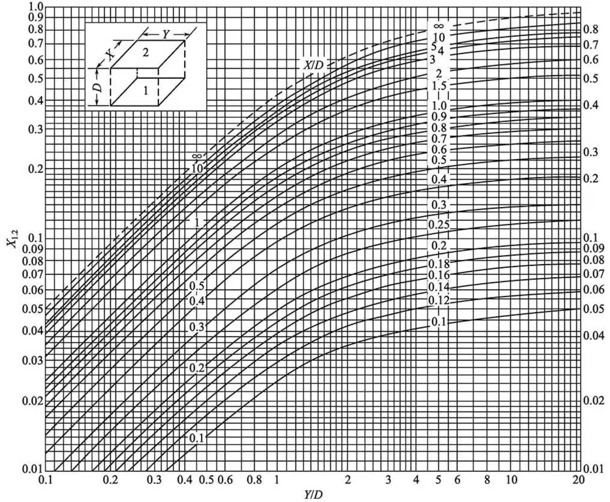

本章的分析讨论前提：

1. 空腔模型

   * 物体是向各个方向辐射
   * 其它物体也参与辐射
   * 一般不需要知道两物体间的辐射散热，而是物体表面的得失热量

   所以计算的对象必须是包含所研究的表面在内的封闭腔。

2. 空腔中为透明介质——不参与物体之间的辐射换热

3. 实际物体均认为是漫灰体

4. 物体表面温度均匀

# 第一节 两黑体表面间的辐射换热

## 一、两黑体表面间的辐射换热

设有两黑体表面组成封闭空腔

表面1： $A_1、T_1$ ，为非凹表面

表面2： $A_2、T_2$ 

表面1发射的辐射能为 $\Phi_{b1}=A_1E_{b1}$ 

其中落到表面2上的部分为 $\Phi_{b(1\to2)}=X_{12}E_{b1}A_1$ 

由于表面2为黑体，投射的能量被全部吸收

$$
X_{1,2}=\frac{\Phi_{b(1\to2)}}{\Phi_{b1}}
$$

$X_{1,2}$ 取决于 $A_1$ 和 $A_2$ 的形状、大小、距离及相对位置

$X_{1,2}$ —— $A_1$ 对于 $A_2$ 的几何形状系数，或**角系数**

在讨论角系数时，由于假定：

1. 所研究的表面是漫射的；
2. 所研究的表面上温度均匀一致

在这两个假定下，物体的表面温度及发射率的改变只影响到该物体向外发射的辐射能大小，而不影响在空间的相对分布，因此不影响辐射能落到其他表面上的百分数

于是，角系数就是一个纯几何因子，与两个表面的温度及发射率没有关系

实际工程问题虽然不一定满足这些假定，但由此造成的偏差一般均在工程计算允许励范围之内，因此这种处理方法工程上广为采用。

这一结论，适用于漫灰表面，所以对黑体更适用。

表面 $A_1$ 和 $A_2$ 间的净辐射换热量：

$$
\Phi_{b(12)}=\frac{\left(E_{b 1}-E_{b 2}\right)}{\frac{1}{X_{1,2} A_{1}}}=\frac{\left(E_{b 1}-E_{b 2}\right)}{\frac{1}{X_{2,1} A_{2}}}
$$

$\Phi_{b(12)}$ ——热流

$\left(E_{b 1}-E_{b 2}\right)$ ——辐射热势

$\frac{1}{X_{1,2} A_{1}},\frac{1}{X_{2,1} A_{2}}$ ——空间辐射热阻

即：组成封闭空腔的二黑体表面，若面积和温度为已知，那么角系数一旦确定，辐射换热量就可以求出来。

## 二、角系数的确定方法

### 1、一些特殊情况

$$
X_{1,2}=1
$$

### 2、积分——查图法

### 3、代数法

* 目的：扩大线图或公式的应用，计算表面间角系数
* 理论基础：角系数的互换性、完整性、分解性

1. 角系数的完整性

   根据角系数的定义，角系数完整性为：

   封闭系统中的任意非凹表面（如表面1）对其他所有表面的角系数的总和等于1，即：
   
   $$
   X_{1,2}+X_{1,3}=1\\
   X_{2,1}+X_{2,3}=1\\
   X_{3,1}+X_{3,2}=1
   $$

2. 角系数的互换性
   
   $$
   A_1X_{1,2}=A_2X_{2,1}\\
   A_1X_{1,3}=A_3X_{3,1}\\
   A_2X_{2,3}=A_3X_{3,2}\\\\
   X_{1,2}=\frac{A_{1}+A_{2}-A_{3}}{2 A_{1}} ; \quad X_{1,3}=\frac{A_{1}+A_{3}-A_{2}}{2 A_{1}} ; \quad X_{2,1}=\frac{A_{2}+A_{1}-A_{3}}{2 A_{2}} ; \\
   X_{2,3}=\frac{A_{2}+A_{3}-A_{1}}{2 A_{2}} ; \quad X_{3,1}=\frac{A_{3}+A_{1}-A_{2}}{2 A_{3}} ; \quad X_{3,2}=\frac{A_{3}+A_{2}-A_{1}}{2 A_{3}} .
   $$
   
3. 角系数的分解性
   
   $$
   X_{1,2} \neq X_{3,2}+X_{4,2} \\
   A_{1} X_{1,2}=A_{3} X_{3,2}+A_{4} X_{4,2} \\
   X_{2,1}=X_{2,3}+X_{2,4} \\
   A_{1} X_{1,2}=A_{1} X_{1,5}+A_{1} X_{1,6} \\
   \text { 即: } X_{1,2}=X_{1,5}+X_{1,6} \\
   X_{1,2}=\sum_{i=1}^{n} X_{1,2 i}
   $$
   
   接受面可以分解，施予面不可分解

4. 交叉线法

   适用于两个未构成封闭空腔的非凹表面
   
   $$
   X_{1,2}=\frac{(ad+bc)-(ac+bd)}{2ab}\\
   X_{1,2}=\frac{交叉线长度之和-非交叉线长度之和}{2倍表面1的横断面线长度}
   $$

# 第二节 灰体表面间的辐射换热

## 一、两灰体表面间的辐射换热

黑体表面： $\alpha=1\quad\therefore\rho=0$ ——黑体不反射

灰体表面： $\alpha<1\quad\therefore\rho>0$ ——灰体反射

在灰体表面存在：多次吸收、反射现象

### 1、有效辐射 $J$

假设：灰体； $\tau=0$ ；投射辐射 $G$ 

有效辐射 $J$ ：单位时间内、离开灰体单位表面积的总能量

有效辐射 $J$ 为灰体本身的辐射（辐射力 $E$ ）与反射辐射 $(\rho G)$ 之和：
$$
J=E+\rho G=\varepsilon E_b+\rho G\quad[W/m^2]
$$
从表面外部或内部分析（换热量）：
$$
\frac{\Phi_1}{A_1}=q_1=J_1-G_1=E_1-\alpha_1G_1=\varepsilon_1E_{b1}-\alpha_1G_1\quad[W/m^2]
$$
对于灰体： $\alpha_1=\varepsilon_1;\quad J_1=E_1+\rho_1G1=\varepsilon_1E_{b1}+(1-\varepsilon_1)G_1$ 

灰表面的辐射换热量：
$$
\Phi_1=\frac{\varepsilon_1}{1-\varepsilon_1}A_1(E_{b1}-J_1)=\frac{E_{b1}-J_1}{\frac{1-\varepsilon_1}{\varepsilon_1A_1}}\quad[W]
$$
表面辐射热阻： $\frac{1-\varepsilon}{\varepsilon A}$ ，只取决于辐射表面的大小和黑度。黑度和面积越大、表面辐射热阻越小

如果灰体获得热量：
$$
\Phi_1=\frac{J_1-E_{b1}}{\frac{1-\varepsilon_1}{\varepsilon_1A_1}}\quad[W]
$$
对于黑体： $α=ε=1$ ，表面辐射热阻为 $0,\ J=E_b$ 

### 2、二灰体表面之间进行换热

角系数分别为 $X_{1,2}、X_{2,1}$
$$
\text { 稳态条件下: } \Phi_{1}=\Phi_{(12)}=\Phi_{2}\\
\Phi_{1}=\frac{E_{b 1}-J_{1}}{\frac{1-\varepsilon_{1}}{\varepsilon_{1} A_{1}}}[W] \quad \Phi_{(12)}=\frac{J_{1}-J_{2}}{\frac{1}{A_{1} X_{1,2}}} \text { [W] }\quad \Phi_{2}=\frac{J_{2}-E_{b 2}}{\frac{1-\varepsilon_{2}}{\varepsilon_{2} A_{2}}}[W]\\
\Phi_{(12)}=\frac{E_{b 1}-E_{b 2}}{\frac{1-\varepsilon_{1}}{\varepsilon_{1} A_{1}}+\frac{1}{A_{1} X_{1,2}}+\frac{1-\varepsilon_{2}}{\varepsilon_{2} A_{2}}}=\frac{\sigma_{b}\left(T_{1}^{4}-T_{2}^{4}\right)}{\frac{1-\varepsilon_{1}}{\varepsilon_{1}A_1}+\frac{1}{A_{1} X_{12}}+\frac{1-\varepsilon_{2}}{\varepsilon_{2} A_{2}}}
$$
几种特例： $X_{1,2}=1$ 

1. ##### 表面1非凹

   $$
   \Phi_{(12)}=\frac{\sigma_{b}\left(T_{1}^{4}-T_{2}^{4}\right)}{\frac{1-\varepsilon_{1}}{\varepsilon_{1} A_{1}}+\frac{1}{A_{1}}+\frac{1-\varepsilon_{2}}{\varepsilon_{2} A_{2}}}=\frac{A_{1} \sigma_{b}\left(T_{1}^{4}-T_{2}^{4}\right)}{\frac{1}{\varepsilon_{1}}+\frac{A_{1}}{A_{2}} \frac{1-\varepsilon_{2}}{\varepsilon_2}}
   $$

2. ##### 小物体在大环境中

   若 $A_1>>A_1$ ，而 $\varepsilon_2$ 较大：
   $$
   \Phi_{12}=\varepsilon_1A_1\sigma_b(T_1^4-T_2^4)
   $$

#### 举例：车间内供热管道

自然对流散热量
$$
\Phi_c=hA_1(T_1-T_f)
$$
辐射散热量 $(X_{1,2}=1)$ 
$$
\Phi_{(12)}=\frac{E_{b 1}-E_{b 2}}{\frac{1-\varepsilon_{1}}{\varepsilon_{1} A_{1}}+\frac{1}{A_{1} X_{1,2}}+\frac{1-\varepsilon_{2}}{\varepsilon_{2} A_{2}}}=\frac{A_{1}\left(E_{b 1}-E_{b 2}\right)}{\frac{1}{\varepsilon_{1}}+\frac{A_{1}}{A_{2}} \frac{1-\varepsilon_{2}}{\varepsilon_2}}
$$
若 $A_2>>A_1$ ，而 $\varepsilon_2$ 较大：
$$
\Phi_{12}=\varepsilon_1A_1(E_{b 1}-E_{b 2})=\varepsilon_1A_1\sigma_{b}\left(T_{1}^{4}-T_{2}^{4}\right)
$$

### 3、二相距较近并平行放置的大平板

$$
\Phi_{(12)}=\frac{\sigma_{b}\left(T_{1}^{4}-T_{2}^{4}\right)}{\frac{1-\varepsilon_{1}}{\varepsilon_{1} A_{1}}+\frac{1}{A_{1} X_{1,2}}+\frac{1-\varepsilon_{2}}{\varepsilon_{2} A_{2}}} \\
X_{1,2}=X_{2,1}=1 ; \\
A_{1}=A_{2}=A; \\
\Phi_{(12)}=\frac{A_{1} \sigma_{b}\left(T_{1}^{4}-T_{2}^{4}\right)}{\frac{1}{\varepsilon_{1}}+\frac{1}{\varepsilon_{2}}-1}
$$

## 三、封闭空腔三个灰表面间的辐射换热

网络法：通过网络图求解辐射换热方法

为了确定每个表面的换热量，必须知道每个表面的有效辐射 $J_1、J_2、J_3$ 

#### 网络法小结：

1. 画出等效网络图

2. 列出节点的热流方程

3. 求解节点代数方程得出节点处表面有效辐射

4. 按下面公式确定每个表面的净辐射换热量
   $$
   \Phi_i=\frac{E_{bi}-J_i}{\frac{1-\varepsilon_i}{\varepsilon_iA_i}}\quad[W]
   $$

注意：用网络法求不出多个表面组成的封闭系统中任意两个表面之间的辐射换热量