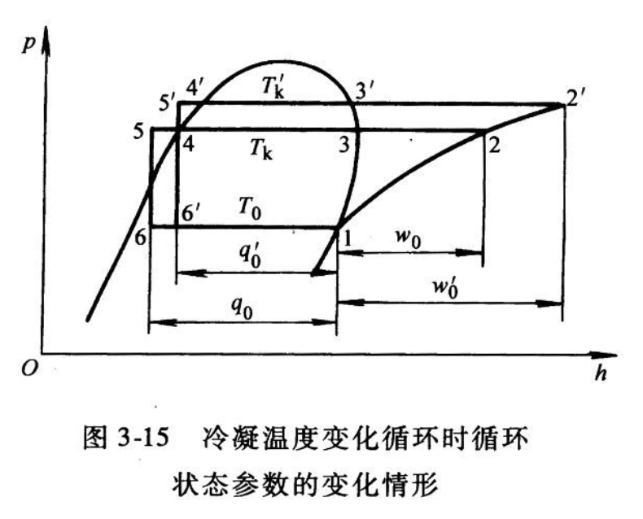
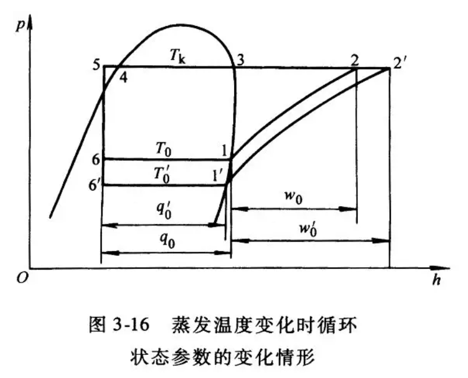
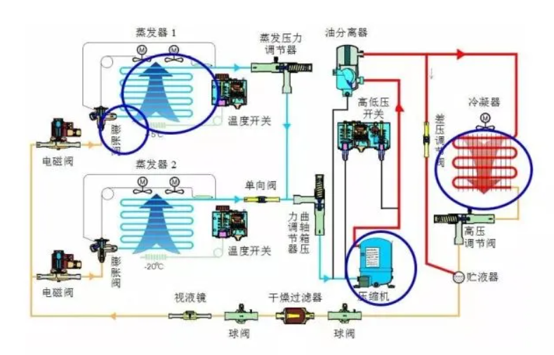
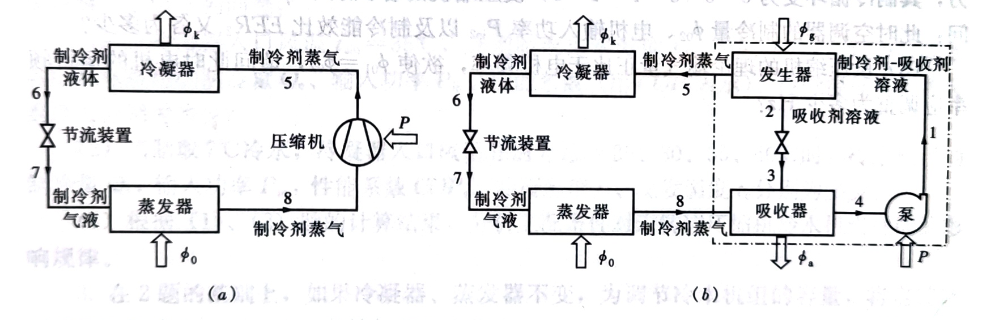

# 题型

1. 填空题5题
2. 单选题10题
3. 主观题5题

# 第一章 蒸气压缩式制冷的热力学原理

1. 实际制冷循环三个特点
   1. 用膨胀阀代替膨胀机（产生节流损失，随 $T_k-T_0$ 增大而加大，与制冷剂的物理性质有关）
   2. 蒸汽的压缩在过热区进行，而不是在湿蒸汽区进行（湿蒸汽：液击，占用汽缸容积。产生过热损失，与制冷剂的物理性质有关）
   3. 两个传热过程均为等压过程，且热源和制冷剂之间具有传热温差。
   
2. 热力计算

   单位质量制冷能力（蒸发器 *出口的焓* 减 *入口的焓* 是制冷量）：

   $$
   q_0=h_1-h_4[kJ/kg]
   $$

   单位容积制冷能力：

   $$
   q_v=\frac{q_0}{v_1}[kJ/m^3]
   $$

   若总制冷量为$\phi_0[kW]$，则制冷剂质量流量：

   $$
   M_r=\frac{\phi_0}{q_0}[kg/s]
   $$

   制冷剂体积流量：

   $$
   V_r=M_r v_1=\frac{\phi_0}{q_v}[m^3/s]
   $$

   冷凝负荷：

   $$
   \phi_k=M_rq_k=M_r(h_2-h_3)[kW]
   $$

   压缩机理论耗功率：

   $$
   P_{th}=M_rw=M_r(h_2-h_1)[kW]
   $$

   理论制冷系数：

   $$
   \varepsilon_{th}=\frac{\phi_0}{P_{th}}=\frac{q_0}{w}=\frac{h_1-h_4}{h_2-h_1}=\frac{制冷量[kW]}{耗功量[kW]}
   $$

   制冷效率：
   
   $$
   \eta_R=\frac{\varepsilon_{th}}{\varepsilon_c}=\frac{理论制冷系数}{理想制冷系数}=\varepsilon_{th}\times\frac{T_k-T_0}{T_0}
   $$

3. 改善措施

   1. 膨胀阀前液态制冷剂再冷却（设置再冷却器3’，设置回热器1‘）
   2. 回收膨胀功（膨胀机与压缩机串联）
   3. 多级压缩制冷循环（中间冷却器，闪发蒸汽分离器）

4. 多级压缩制冷循环：工作流程（设计）、流程图、压焓图p15

   ###### 双级蒸汽压缩制冷的中间压力

   1. 制冷系数最大为原则

      $$
      t_m=0.4t_k+0.6t_0+3^\circ C
      $$

   2. 按高低压级压缩机的压缩比相等为原则

      $$
      \frac{p_m}{p_0}=\frac{p_k}{p_m}\\
      \Longrightarrow p_m=\sqrt{p_0\cdot p_k}\\
      p_m\longrightarrow \varepsilon_{max}
      $$

   3. 按选配好的高低压级压缩机的容积比确定中间压力，此时高低压级压缩机的理论输气量之比为定值，因此选择的中间压力要与此容积比相适应，通常采用试算法确定。

   ###### 关于制冷剂质量流量

   1. 完全冷却

      $$
      M_{r1}=\frac{Q_0}{q_0}=\frac{Q_0}{h_1-h_8}\\
      M_{r1}=(h_2-h_3)+M_{r1}(h_5-h_7)=M_{r2}(h_3-h_6)\\
      能量平衡（进总焓=出总焓）\\
      M_{r2}=\frac{(h_2-h_3)+(h_5-h_7)}{h_3-h_6}M_{r1}\\
      M_r=M_{r1}+M_{r2}=\frac{h_2-h_7}{(h_3-h_6)(h_1-h_7)}Q_0(kg/s)
      $$

   2. 不完全冷却

      $$
      M_{r1}=\frac{Q_0}{q_0}=\frac{Q_0}{h_1-h_8}\\
      h_3=h_3'+\frac{M_{r1}}{M_{r1}+M_{r2}}(h_2-h_3')\\
      M_r=M_{r1}+M_{r2}=\frac{h_3'-h_7}{(h_3'-h_6)(h_0-h_8)}Q_0
      $$

5. 热平衡（1-19）原理

   $$
   M_{r1}h_5+M_{r1}h_2+M_{r2}h_6=(M_{r1}+M_{r2})h_3+M_{r1}h_7
   $$
   
6. 跨界式循环（ $CO_2$ ）

   一些低温制冷剂在普通制冷范围内，利用冷却水或室外空气作为冷却介质时，压缩机的排气压力位于制冷剂临界压力之上，而蒸发压力位于临界压力之下，故将此类循环称为跨临界循环。

   特点：

   * 空气冷却器
   * 流动、换热的热物理特性：热流密度、质量流量
   * 适用于较大温差变温热源

   最优高压侧压力：

   $$
   p_{2opt}=(2.778-0.015t_0)t_3+(0.381t_0-9.34)
   $$

   $p_{2opt}$ ——最优高压侧压力，100kPa

   $t_3$ ——气体冷却器出口温度，℃

   $t_0$ ——蒸发温度，℃

   $\mathrm{CO_2}$ 跨临界循环的改善：1、蒸汽回热循环；2、双击压缩回热循环；3、用膨胀机回收膨胀功

7. 降压运行

   高压常温的制冷剂液体流过膨胀阀后，就节流膨胀变为低压、低温的制冷剂液体。节流降压后制冷剂开始蒸发吸热。

# 第二章 制冷剂和载冷剂

1. 气瓶颜色p44

   氨瓶漆成黄色，氟利昂瓶漆成银灰色，并在钢瓶表面标有装存制冷剂的名称。

# 第三章 压缩机

1. 离心压缩机：制冷量较大，喘振原因&预防

   ###### 离心式压缩机的喘振：

   * 喘振是引起压缩机事故发生率最高的因素，几乎所有的压缩机事故都与喘振有直接或间接的关系

   * 喘振是离心式压缩机固有的特性

   * 原因：当压缩机吸气口压力或流量突然降低，低过最低允许工况点时，压缩机内的气体由于流量发生变化会出现严重的旋转脱离，形成突变失速（指气体在叶道进口的流动方向和叶片进口角出现很大偏差），这时叶轮不能有效提高气体的压力，导致压缩机出口压力降低。但是系统管网的压力没有瞬间相应的降下来，从而发生气体从系统管网向压缩机倒流，当系统管网压力降至低于压缩机出口压力时，气体又向管网流动。如此反复，使机组与管网发生周期性的轴向低频大振幅的气流振荡现象。离心冷水机组在低负荷运行时，压缩机导叶开度减小，参与循环的制冷剂流量减少。压缩机排量减小，叶轮达到压头的能力也减小。而冷凝温度由于冷却水温未改变而维持不变，则此时就可能发生旋转失速或喘振。

   * 喘振的判别：

     1. 看：压缩机进口流量和出口压力，出现周期性、大幅度地脉动（测量仪表指针大幅度地摆动）
     2. 听：压缩机出口管道有周期性的气流脉动噪音，发出时高时低的周期性气流吼叫声。
     3. 看：压缩机机体和轴承的振动，其振幅急剧增高，机组强烈震动，压缩机后的管道上出现大振幅、低频率的强烈震动。

     出现上述情况之一，说明已经接近或进入喘振状态。

   ###### 喘振的部位

   * 有叶片式扩压器，一般是扩压器先发生喘振
   * 无叶片式扩压器，叶轮内先发生喘振
   * 多机压缩机在最末几级容易发生喘振，只要一级发生喘振，就会扩展到整个机组。

   ###### 发生喘振的规律

   * 管网的性能曲线不变,压缩机的性能曲线变化。例如，转速变化、进气温度变化、进气压力变化、分子量变化时，有可能发生喘振，但不是必然的。压缩机性能曲线不变，管网的性能曲线变化。例如，管网压力高、管网阻塞等。
   * 压缩机性能曲线变化的同时，管网性能曲线也变化，这种情况更容易发生喘振。例如，压缩机在开车升速或停机过程中，两条曲线同时变化，必须保持协调。

   ###### 压缩机的防喘振

   * 设置防喘振控制调节系统
   * 使压缩的运行工况点始终处于喘振线的右侧。在喘阵线的右侧预先设计好一条“保护曲线”（控制线），当压缩机运行工况点从右侧逐渐移向保护曲线时，就逐步开启连接压缩机出口和进口之间的回流阀，从而扩大压缩机进口流量，防止运行况点进入喘振区。

2. 性能参数p82

   1. 制冷量
      
      $$
      \phi_0=m_{re}q_0=m_{re}(h_{e,o}-h_{e,i})\ [kW]\\
      \phi_0=\eta_vV_h\frac{h_{e,o}-h_{e,i}}{v_1}\ [kW]
      $$
      
      $m_{re}$ ——蒸发器中制冷剂的质量流量， $kg/s$ 

      $q_0$ ——单位质量制冷剂的制冷能力， $kJ/kg$ 

      $h_{e,i}$ ——蒸发器入口制冷剂比焓， $kJ/kg$ 

      $h_{e,o}$ ——蒸发器出口制冷剂比焓， $kJ/kg$ 

      $V_h$ ——压缩机的理论输气量， $m^3/s$ 

      $\eta_v$ ——压缩机的容积效率

      $v_1$ ——压缩机吸气制冷剂比容， $m^3/kg$ 

   2. 制热量
      
      $$
      \phi_0=m_{rc}q_k=m_{rc}(h_{c,i}-h_{c,o})\ [kW]\\
      \phi_k=\eta_vV_h\frac{h_{c,i}-h_{c,o}}{v_1}\ [kW]
      $$
      
      $m_{rc}$ ——冷凝器中制冷剂的质量流量， $kg/s$ 

      $q_k$ ——单位质量制冷剂的冷凝负荷， $kJ/kg$ 

      $h_{c,i}$ ——冷凝器入口制冷剂比焓， $kJ/kg$ 

      $h_{c,o}$ ——冷凝器出口制冷剂比焓， $kJ/kg$ 

   3. 耗功率
      
      $$
      P_{in}=\frac{P_{th}}{\eta_{el}}\ [kW]
      $$
      
      $P_{th}$ ——等熵压缩功率， $kW$ 

      $\eta_{el}$ ——压缩机的电效率：
      
      $$
      \eta_{el}=\eta_{i}\eta_{m}\eta_{d}\eta_{mo}
      $$
      
      $\eta_{i}$ ——指示效率

      $\eta_{m}$ ——机械效率

      $\eta_{d}$ ——传动效率

      $\eta_{mo}$ ——电机效率

   4. 性能系数
      
      $$
      \mathrm{COP_c}=\frac{\phi_0}{P_{in}}=\frac{制冷量}{耗功量}\\
      \mathrm{COP_h}=\frac{\phi_k}{P_{in}}=\frac{制热量}{耗功量}
      $$

      * 制冷时： $t_k\uarr,t_0不变,\mathrm{COP}\darr(\mathrm{COP=\frac{冷\darr}{耗\uarr}})$ 
      * 制热时： $t_k=C,t_0\darr,\mathrm{COP}\darr(\mathrm{COP}=\frac{热\darr}{耗\uarr})$
      * 水源热泵、地源热泵的原理和节能原理

3. 工况对压缩机性能影响（**重点**）p86两图

   

   

4. 蒸发温度适中，冷凝温度

# 第四章 换热设备

1. 风冷冷凝器——冷热水

   水冷——不能冷热水p90

   水冷式冷凝器（壳管式、套管式、板式）

   风冷式冷凝器（自然对流、强制对流）

   蒸发式冷凝器

2. 风冷冷凝器室外机设置注意事项（**重点**）

   * ###### 结霜、结露出现的条件和处理方法：

     1. 条件（原因）：室外的温度比较低，湿度比较大
     2. 方法：
        * 改成正循环（室外蒸发器变成冷凝器，室内冷凝器变成蒸发器）
        * 从压缩机的出口支一个小管子去室外，使室外机不至于结霜（常采用）
        * 直接在室外机组上绕电阻丝，靠电阻丝发热化霜

3. 蒸发器满液式与非满液式优缺点以及其他蒸发器适用类型p110

   1. 满液式蒸发器

      优点：结构紧凑、传热性能好、制造工艺简单。

      缺点：蒸发温度 $t_0$ 过低时水冻结，胀裂传热管；水容量小，热稳定性差，水温易发生较大变化。

      应用：多用于氨制冷系统。近年来，R22冷水机组中使用增多。 

   2. 非满液式蒸发器

      按冷却介质分为冷却液体干式蒸发器、冷却空气干式蒸发器（直接蒸发式空气冷却器）。其中冷却液体干式蒸发器主要有干式壳管式、焊接板式蒸发器。

      优点：充液量少，为管内容积40%左右，沸腾温差小，润滑油可顺利返回压缩机，冷损少，缓解冻结危险，不易造成液击。

      缺点：有较多的传热面与气态制冷剂接触，传热效果不如满液式蒸发器。

      应用：氟利昂制冷系统

4. 其他换热器所处位置和发挥作用p129

   * 再冷却器（提高制冷系统的制冷能力；有利于液态制冷剂的输送）

     获得较大再冷度：使冷凝器底部的部分传热管浸没在被冷凝下来的液态制冷剂中；设置再冷器

   * 回热器（对于R12、R134a、R502通过回热提高制冷装置的制冷系数；使得节流装置前制冷剂液体过冷以免汽化，保证正常节流；使蒸发器出口制冷剂蒸汽中夹带的液体汽化，以防止压缩机液击故障。）

   * 中间冷却器（双级压缩制冷装置的关键设备，用于同时冷却低压级压缩机的排气和高压制冷剂液体，使之获得较大的过冷度。中间冷却器内具有的压力称作中间压力，该压力下制冷剂液体保持一定的液面高度。）

   * 冷凝-蒸发器（复叠式制冷装置，既是高温级循环的蒸发器，又是低温级循环的冷凝器）

     套管式、绕管式、壳管式

   * 气体冷却器（ $\mathrm{CO_2}$ 超临界循环制冷系统，用来冷却压缩后的高温高压气体）

     微通道平行流气体冷却器

# 第五章 节流装置和辅助设备

1. 节流阀：内外平衡式？内平衡外平衡？节流阀作用？毛细管电磁阀联系？

   **外平衡热力膨胀阀：**主要用于蒸发压力损失或压力降较大，流动阻力大，蒸发盘管长，温度波动大，节流后蒸发压力比蒸发器出口端压力高出较多的系统。如果此时采用内平衡式膨胀阀，将会导致开阀过热度增大和不能充分发挥蒸发器的传热面积，使制冷效率降低。

   外平衡热力膨胀阀优点：比较准确的控制蒸发器的出口过热度，充分的利用蒸发器的换热面积，提高机组能效。

   **内平衡膨胀阀：**主要用于蒸发器的阻力较小，压力损失不大，流动阻力小，蒸发温度波动小，管路短的场合。当蒸发器阻力较大，压力损失较大或具有分液头时，应选用外平衡式膨胀阀。

   内平衡热力膨胀阀的优点：不需要连接为平衡管，减少机组安装工艺，减少机组使用过程中故障点，价格较便宜。

   **节流阀作用**：

   * 对高压液态制冷剂进行节流降压，保证冷凝器与蒸发器之间的压力差，以使蒸发器中的液态制冷剂在要求的低压下吸热蒸发，从而达到制冷降温的目的；同时使冷凝器中的气态制冷剂在给定的高压下放热冷凝。
   * 调节供入蒸发器的制冷剂流量，以适应蒸发器热负荷变化，从而避免因部分制冷剂在蒸发器中为及时蒸发汽化，而进入制冷压缩机，引起湿压缩甚至液击事故；或因供液不足，导致蒸发器的传热面积为充分利用，引起制冷压缩机的吸气压力降低、过热度增大，制冷能力下降。

   **毛细管**：结构简单，无运动部件，价格低廉；使用时系统不装设贮液器，制冷剂充注量少，而且压缩机停止运转后，冷凝器与蒸发器内压力可较快地自动达到平衡，减轻电动机的启动负荷。毛细管的主要缺点是调节性能较差，供液量不能随工况变化而任意调节，因此，宜用于蒸发温度变化范围不大，负荷比较稳定的场合。

2. 辅助设备的位置p145

   ###### 一、贮液器

   1、高压贮液器

   用途是贮存高压液体，设置在冷凝器之后，保证制冷系统在冷负荷变化时制冷剂供液量调节的需要。

   2、低压贮液器

   这种设置在低压侧的贮液器，一般用于大型氨制冷裝置中，如氨泵循环的冷藏库等。结构与高压贮液器基本相同，仅仅是工作压力较低。其用途除氨泵供液系统中贮存进入蒸发器前的低压液体之外，还有专供蒸发器融霜或检修时用于排液；或用于贮存低压回气经气液分离器分离出来的氨液。

   ###### 二、气液分离器

   卧式壳管型满液式蒸发器的上部一般设有集气包，可以起到气液分离的作用，若满液式蒸发器本身没有气液分离装置时，在蒸发器出口应设置气液分离器，靠气流速度的降低和方向的改变，将低压气态制冷剂中携带的液滴分离出来，以防止压缩机发生湿压缩或液击现象。

   ###### 三、制冷剂的净化设备

   由于系统渗入空气或润滑油分解等，制冷系统中总会有不可凝气体（主要是空气）存在，这些气体在冷凝器表面附近聚集，形成气膜热阻，降低了冷凝器的传热效果，引起压缩机排气压力和排气温度的升高，致使制冷机的耗功率增加，制冷量降低。

   ###### 四、过滤器和干燥器

   1、过滤器

   制冷压缩机的进气口应装有过滤器，以防止铁屑、铁锈等污物进入压缩机，损伤阀片和气缸。膨胀阀等各种调节控制用阀类前也应安装过滤器，以防止污物阻塞阀孔或破坏阀芯的严密性。

   2、干燥器

   制冷系统中不但有污物，还会有水分，这是由于系统干燥不严格以及制冷剂不纯（含有水分）。水能溶解于氟利昂制冷系统中，它的溶解度与温度有关，温度下降，水的溶解度就小。

   ###### 五、润滑油的分离及收集设备

   制冷机工作时需要润滑油在机内起润滑、冷却和密封作用。系统在运行过程中润滑油往往随压缩机排气进入冷凝器甚至蒸发器，使它们的传热效果降低，影响整个制冷装置技术性能的发挥。

   1、油分离器

   将制冷压缩机排出的高压蒸气中的润滑油进行分离，以保证装置安全高效地运行。

   2、集油器

   对于氟利昂制冷系统，油分离器分离出的润滑油一般都是通过分离器下部的手动阀或浮球式自动放油阀直接送回压缩机的曲轴箱。

   而在氨制冷系统中， 除了油分离器以外，冷凝器、贮液器和蒸发器等设备的底部均积存有润滑油，为了收集和放出这些润滑油，应装置集油器。

   集油器为钢板制成的筒状容器，其上部设有进油管、放油管、回气管和压力表接管等。

   目前生产的集油器有三种规格，其直径分别为150、200和300mm。制冷量小于250～300kW，采用直径150mm者；制冷量大于600～700kW，采用直径300mm者。

   ###### 六、不凝性气体分离器

   压力越高， 温度越低，气态制冷剂与空气混合物中空气的质量百分比越大。也就是说，在高压条件下放空气时，损失的制冷剂最少。不凝性气体分离器就是保证在**高压和低温**条件下放空气的设备。

   不凝性气体分离器实际上是个冷却设备。分离器圆形筒体为钢板卷焊制成，内装有冷却盘管，外敷保温层。

   采用开启式制冷压缩机，尤其是经常处于低温和低于大气压力下运行的制冷系统，都应该装设不凝性气体分离器。对于空气调节用全封闭或半封闭制冷压缩机，一般可不装设不凝性气体分离器。

   ###### 七、安全设备与观察镜

   制冷系统中常用的安全设备有安全阀、熔塞和紧急泄氨器等。

   1、安全阀
   
   微启式弹簧安全阀：当压力超过规定数值时，阀门自动开启，将制冷剂排出系统。

   2、熔塞

   在预定温度下会熔化来释放压力。熔塞禁止用于可燃、易爆或有毒的制冷剂系统中。

   3、观察镜

   观察镜又称视镜，在制冷装置的某些关键部位（如蒸发器入口，油分离器出口，贮液器等）装上它，用以指示制冷装置管路中制冷剂液体流动情况、回油状况及液位状况。

3. 控制机构位置p156-157

   ###### 一、制冷剂压力调节阀

   制冷剂压力调节阀主要包括蒸发压力调节阀、冷凝压力调节阀和压缩机吸气压力调节阀。

   1、蒸发压力调节阀

   * 直动和控制，安装在蒸发器出口
   * 原理：受蒸发压力的影响控制。

   2、压缩机吸气压力调节阀

   * 作用：压力过高或过低，主要是排除压力过高的影响

   3、冷凝压力调节阀

   * 压力过高或过低的影响
   * 风冷冷凝器的压力调节

   

   ###### 二、压力开关和温度开关

   1、压力开关：当吸排气压力发生变化，超出正常的工作压力范围时，切断电源，强制压缩机停机，以保护压缩机。

   * 低压开关：压缩机功耗增大，效率降低，对于食品冷冻冷藏会导致冷却物的温度无谓地降低，增加视频的干耗，使品质下降。若低压侧压力低于大气压力，还会导致空气、水分渗入制冷系统。因此，必须将压缩机的吸气压力控制在一安全值以上。
   * 高压开关：当压缩机开机后排气管阀门未打开、制冷剂充注量过多、冷凝器风扇故障、不凝气体含量增多都会引发系统排气压力过高的故障。排气压力过高会导致压缩机排气温度超高，致使润滑油和制冷剂损坏，还有可能烧毁电机绕组和损伤排气阀门。当高压超过设备的承受极限时，还可能发生爆炸，造成安全事故。
   * 高低压开关：是高压开关和低压开关的结合体，用于同时控制制冷系统中压缩机的吸气压力和排气压力。
   * 油压差开关：采用油泵强制供油的压缩机，如果油压不足，就不能保证油路正常循环，严重时会烧毁压缩机，因此在该系统设置油压差开关进行保护。

   2、温度开关：用于控制和调节冷库、冰箱等设备的冷藏温度，以及采用空调器房间的室内温度，也可以用于制冷系统的温度保护和温度检测，如压缩机的排气温度、油温等。（压力式、双金属式、电阻式、电子式）

   ###### 三、电磁阀

   受电气信号控制而自动进行开关动作的自控阀门，用于自动接通和切断制冷管路，属于流量控制元件的一种。

   四通阀：用于热泵型空调机组或者你循环热气除霜系统中。

4. 制冷管路设计原则

   * 管材：氟利昂管路常采用铜管，系统容量较大时也可采用无缝钢管。氨管则采用无缝钢管，禁止使用铜或铜合金管或管件。
   * 设计总原则：为了减少管道耗材、制冷剂冲灌量以及系统的压力降、配管应尽可能短而直。
   * 管路布置原则：管道的布置应不妨碍对压缩机及其他设备的正常观察、操作和管理，不妨碍设备的检修和交通通道以及门窗的开关 
   * 管径确定方法：
     1. 压力降限制
     2. 速度限制
     3. 最低带油速度

# 第六章 蒸汽压缩式制冷装置及运行调节

1. 制冷系统流程图（连线）p171

   

2. 空调用蒸气压缩式制冷制冷机组，看ppt

3. 变频&涡旋容量调节p194

# 第七章 吸收式制冷和热泵

1. 蒸气压缩式&吸收式 图要会画

   

2. （7-2）

   蒸汽压缩式制冷： $\phi_k=\phi_0+P(W)$ 

   吸收式制冷： $\phi_g+\phi_0+P=\phi_a+\phi_k=\phi_e$ 

   其中，

   $\phi_g$ ——发生器中热媒对溶液系统的加热量

   $\phi_0$ ——蒸发器中被冷却介质对系统的加热量（即制冷量）

   $P$ ——溶液泵功率

   $\phi_a$ ——在吸收器中放热量

   $\phi_k$ ——在冷凝器中放热量

   $\phi_e$ ——系统对周围环境的放热量

3. 吸收溶液对

   其中低沸点的工质(或称组分)为制冷剂，高沸点的工质为吸收剂，如果还有第三种工质，那它是扩散剂。使用双组分工质的制冷机称为吸收式制冷机；使用三组分工质的则称为吸收 - 扩散式制冷机，一般用作冰箱制冷机。通常，把两种沸点相差很大的工质组成为工质对。

   ###### 对吸收剂，应有的特性如下：

   1. 有强烈吸收制冷剂的能力；
   2. 在相同压力下，它的沸腾温度应比制冷剂的沸腾温度高的多；
   3. 不应有爆炸、燃烧的危险，并对人体无毒害；
   4. 对金属材料的腐蚀性小；
   5. 价格低，易取得。

   可供考虑使用的制冷剂-吸收剂溶液很多，按溶液中含有的制冷剂种类区分分为水类、氨类、乙醇类和氟里昂类。

   ###### 吸收式制冷机工质对应具有如下特征：

   1. 两个组分的沸点相差要大，当溶液沸腾时，被蒸发出来的只能是制冷剂；
   2. 吸收剂必须具备强的吸收能力，既在相同压力下能强烈吸收温度比它低的制冷剂；
   3. 制冷剂的蒸发潜热要大，而吸收剂的比热要小；
   4. 成本低，容易得，对金属腐蚀小

4. 7-10流程图P211

   

5. 循环倍率，吸收范围

   * 循环倍率 $f$ 物理意义：它表示在发生器中每产生 $1kg$ 制冷剂所需要的制冷剂-吸收剂的循环量(kg)。
     
     $$
     f=\frac FD=\frac{\xi_s}{\Delta\xi}
     $$
     
     $D$ ——从发生器流入冷凝器的制冷剂流量， $kg/s$ 

     $F$ ——从吸收器进入发生器的制冷剂-吸收剂稀溶液流量， $kg/s$ 

     $\Delta \xi$ ——放气范围，表示浓溶液与稀溶液的浓度差，即
     
     $$
     \Deltaξ=ξ_s-ξ_w
     $$

6. 参数是怎么确定的p212

7. 单效双效典型流程图p216p218

# 第八章

1. 开式系统&闭式系统（**重点**）扬程

   最高点与水泵高度的高差形成扬程

   闭式系统管道高度不构成扬程

   

2. 直接连接&间接连接

   间接连接系统常用于高层和超高层建筑，降低高层建筑中制冷机组的承压。若不能放膨胀水箱，则要使用气压罐。

   间接系统可能引起制冷系数的下降

   

3. 异程系统&同程系统

   同程：每个末端的主供水管和回水管的长度一致，保证每一台机组的水力平衡及冷量平衡
   
   * 主立管同程
   * 水平同程
   * 大同程小异程：每个房间内每台机组间为异程，不同房间的机组为同程
   
   

# 雨课堂题

## 第三、四章

1. 【多】容积式压缩机包含哪些?
   * **活塞式**
   * **螺杆式**
   * 离心式
   * **滚动转子式**
   
2. 【单】压缩机有吸排气阀的有？
   * 离心
   * 螺杆
   * **活塞**
   * 涡旋式
   
3. 【单】活塞式压缩机冷凝器可以采用？
   * 空气冷却
   * 水冷却
   * 空气-水冷却
   * **以上都可以**
   
   活塞式压缩机冷凝器冷量比较小，对 $t_k$ 敏感度小，喷淋式室外机（空气-水冷却）
   
4. 【单】离心式压缩机冷凝器可以采用？
   * 空气冷却
   * **水冷却**
   * 空气-水冷却
   * 以上都可以
   
   离心式冷量大，必须用水冷，吸收式制冷也必须用水冷却，吸收器冷凝器都要带走热量。
   
5. 【多】以下压缩机，可以实现同时吸气、排气的有？
   * 离心
   * **滚动转子**
   * **涡旋**
   * 螺杆
   
6. 【多】大型螺杆压缩式制冷机组采用的调节方法是下哪些项？
   * **变频调节**
   * **滑阀调节**
   * **转速调节**
   * 气缸个数调节
   
7. 【多】压缩机的额定功率工况有哪些？
   * **蒸发温度**
   * **冷凝温度**
   * **过冷度和过热度**
   * **环境温度**
   
8. 【单】蒸发温度降低时，压缩机的耗功变化是？
   * 增大
   * 减少
   * **先增大后减少**
   * 先减小后增大
   
9. 【多】影响活塞式压缩机容积效率因素有？
   * **余隙**
   * **节流降压**
   * **缸体温度**
   * **气缸密封**
   
10. 【多】风冷热泵机组冬季制热时，当室外机发生结霜，导致室外盘管传热系数下降的因素中，下列哪几项为正确？
    * **翅片管表面传热系数下降**
    * **霜层的厚度增加**
    * 霜层的导热系数增加
    * **管内的制冷剂放热系数下降**
    
    导热系数减小，所以要化霜。
    
11. 【多】关于离心式冷水机组的正确说法,应是下列哪几项？
    * **当单台制冷量大于1758KW时，相同冷量的离心式冷水机组的COP值一般高于螺杆式冷水机组**
    * **离心式机组有开启式、半封闭式和封闭式三种**
    * 离心式机组的电源只有380V一种
    * **离心式冷水机组的制冷剂流量过小时，易发生喘振**
    
12. 【多】空气源热泵热水机，采用涡旋式压缩机，当环境温度不变，机组的供回水温差不变，供水温度提高时，下列哪几项表述是正确的？
    * **压缩机的耗功增加**
    * 压缩机的耗功减小
    * 压缩机的能效比增加
    * **压缩机的能效比减小**
    
    $t_0$ 不变，冷凝温度 $t_k$ 肯定比供热温度再高一点。
    
13. 【单】根据我国现行标准，以下关于制冷剂环境友好的表述，何项是错误的？
    * 丙烷属于环境友好的制冷剂
    * **氨不属于环境友好的制冷剂**
    * R134a属于环境友好的制冷剂
    * R410a不属于环境友好的制冷剂
    
14. 【单】某螺杆式冷水机组，在运行过程中制冷剂流量与蒸发温度保持不变，冷却水供水温度降低，其水量保持不变，若用户符合侧可适应机组制冷量的变化，下列哪项的结果是正确的？
    * 冷水机组的制冷量减小，耗功率减小
    * **冷水机组的制冷量增大，耗功量减小**
    * 冷水机组的制冷量不变，耗功率减小
    * 冷水机组的制冷量不变，耗功率增加
    
    $t_0$ 不变， $t_k$ 降低
    
15. 【单】在制冷系统运行工况基本不变的情况下，当制冷量增加时，采用毛细管或采用热力膨胀阀的制冷系统过热度变化应为下列哪一项？
    * 二者的过热度均要增大
    * 采用毛细管的过热度加大
    * **采用热力膨胀阀的过热度加大**
    * 热力膨胀阀的过热度基本不变
    
    $q_0$ 变化大一点，要求 $M$ 增加，毛细管不能调节流量，过热度增加/过热度增加，热力膨胀阀开度增加。
    
16. 【单】逆卡诺循环是在两个不同的热源之间进行的理想制冷循环，此两个热源为下列哪一项？
    * 温度可任意变化的热源
    * **定温热源**
    * 必须有一个是定温热源
    * 温度按一定规律变化的热源
    
17. 【多】影响冷凝器换热的因素有哪些？
    * **不凝性气体**
    * **冷凝器表面的粗糙度**
    * **蒸汽含油**
    * **管材**
    
18. 【单】为了防止制冷系统产生冰塞（冰堵），在以下哪一个位置设置干燥的说法正确？
    * 压缩机的排出端
    * 冷凝器进出管上
    * 压缩机吸气端
    * **供液管中**
    
    结晶发生在热交换器的浓溶液侧及浓溶液出口处
    
19. 【多】离心式压缩机运行过程发生“喘振”现象的原因，可能是下列哪几项？
    * 气体流量过大
    * **气体流量过小**
    * **冷却水温过高**
    * 冷却水温过低
    
    气流过小来回窜动， $t_k$ 温度过高，一定用水冷。
    
20. 【单】有三种容积式单级制冷压缩机，当实际工况压缩比≥4时，压缩机的等熵效率由低到高的排序应是下列选项的哪一个？
    * **活塞式压缩机滚动转子式压缩机涡旋式压缩机**
    * 滚动转子式压缩机涡旋式压缩机活塞式压缩机
    * 涡旋式压缩机滚动转子式压缩机活塞式压缩机
    * 活塞式压缩机涡旋式压缩机滚动转子式压缩机
    
21. 【单】对于同一台冷水机组，如果其他条件不变机组冷凝器的冷却水侧污垢系数增加后，导致的结果是下列哪一项？
    * 冷凝器的换热能力加大
    * **冷水机组的耗电量加大**
    * 冷水机组的制冷系数加大
    * 冷水机组的冷凝温度降低
    
    $t_k$ 增加，所以耗电增加。
    
22. 【单】单级压缩式制冷回热循环可采用的制冷工质的表述，正确的应是下列何项？
    * R22和R717都可采用回热制冷循环
    * R22和R717都不可采用回热制冷循环
    * **R22和R502都可采用回热制冷循环**
    * R22和R502都不可采用回热制冷循环
    
23. 【多】双级蒸汽压缩式制冷循环的合理中间压力 $p$ ，可以根据不同情况采用下列哪几项方法计算？
    *  **$p=(p_冷\times p_蒸)^{0.5}$ （正确）** 
    * **温度 $t$ 所对应的饱和压力， $t=0.4t_冷+0.6t_蒸+3°C$** 
    * **按现有双机制冷压缩机的高、低压压缩机的容积比确定**
    *  $P=0.5\times(p_冷+p_蒸)$ （错误）
    
24. 【多】单级蒸汽压缩式制冷循环，压缩机吸入管道存在的压力降，对制冷性能有下列哪几项影响？
    * **致使吸气比容增加**
    * **压缩机的压缩比增加**
    * 单位容积制冷量增加
    * 系统制冷系数增加
    
25. 【多】关于满液式蒸发器的说法，下列哪几项是正确的？
    * **满液式蒸发器具有较大的传热系数，但制冷剂充注量大**
    * 不能用水做载冷剂
    * **使用润滑油互溶的制冷剂时，回油困难**
    * 只能适用于空调工况

## 第五、六章

1. 【多】可以实现无极调节的方法是
   * **变频**
   * 台数控制
   * 卸载控制
   * **滑阀控制**
   
2. 【多】冷凝器压力的调节方法
   * **冷却剂流量**
   * **冷凝器传热面积**
   * 冷却剂温度
   * 蒸发压力
   
3. 【多】冷热水机组可以产生的水的温度，合理的有
   * **7℃**
   * **50℃**
   * **5℃**
   * 80℃
   
4. 【多】以下属于制冷节流装置的是
   * 差压调节阀
   * **热力膨胀阀**
   * **毛细管**
   * **电子膨胀阀**
   
   A是保护装置
   
5. 【单】中央空调制冷系统的正常开机顺序为
   * 冷却水泵开→冷却塔风机开→冷水泵(延时1min)开→冷水机组开
   * **冷却塔风机开→冷却水泵开→冷水泵(延时1min)开→冷水机组开**
   * 冷却水泵(延时1min)开→冷却塔风机开→冷却水泵开→冷水机组开
   * 冷水泵(延时1min)开→冷却水泵开→冷却塔风机开→冷水机组开
   
   先要把热量带走，怕高电压保护停机起不来。关闭的时候倒过来。
   
6. 【单】变频式空调机在室温达到设定点后，
   * 压缩机和室内风机都停机
   * 压缩机不停机，室内风机停机
   * 压缩机停机，室内风机不停机
   * **压缩机室内风机都不停机**
   
   化霜时，风机可以停机，压缩机不停机，从室内吸收热量。
   
7. 【单】制冷设备布置应使管路尽量短,另外还有一定的管径要求。目的是减少
   * 压力
   * 重力
   * 动力
   * **阻力**
   
8. 【单】氟利昂系统为保证回油顺畅，水平回气管应坡向压缩机，坡度应不小于
   * **1/100**
   * 2/100
   * 3/100
   * 4/100
   
9. 【单】氨制冷系统安装时,要保证冷凝器与储液器的高度差应不小于(  )m
   - 0.2
   - **0.3**
   - 0.4
   - 0.5
   
10. 【单】制冷系统压缩机的排气管水平管段应沿流动方向有(  )的坡度
    - **1/100**
    - 2/100
    - 3/100
    - 4/100
    
11. 【单】冰堵最容易发生在(  )
    - 蒸发器入口
    - **膨胀阀入口**
    - 蒸发器出口
    - 冷凝器入口
    
    膨胀阀入口压力突然降低，液体有闪发蒸汽产生，足够使那一点点水结冰了。
    
12. 【单】不凝性气体分离,采取( )
    - 高压高温
    - **高压低温**
    - 低压高温
    - 低压低温
    
13. 【单】冷凝器的压力要求(  )
    - 越低越好
    - 越高越好
    - **适中**
    - 无要求
    
    怕节流阀打不开
    
14. 【多】制冷装置的自动保护有 
    - **高低压开关**
    - **油压差控制器**
    - **温度控制器**
    - **水流开关**
    - **吸气压力调节阀**
    
15. 【单】制冷机组润滑油影响非常大，以下哪设备是对润滑油含量的控制(  )
    - 干燥过滤器
    - **油分离器**
    - 集油器
    - 高压贮液器
    
    润滑油分离出来返回压缩机
    
16. 【单】压缩机排气管向上较长时，可在排气管立管上安装(  )
    - 截止阀
    - **止回阀**
    - 背压阀
    - 电磁阀
    
17. 【主观题】说明变频调速与数码涡旋式变容量的区别
    
    * 变频调速适用于所有的压缩机调节，改变电的频率从而改变压缩机的转速。数码涡旋，只针对涡旋压缩机，通过电磁阀的辅助控制，调节涡旋压缩机的动静涡盘的分离与啮合，从而调节压缩机的启停，再通过调节电磁阀启/闭周期时间 $T$ 以及启/闭时间的占空比 $t$ （ $t=T_0/T$ ，其中 $T$ 为开启时间）可实现压缩机 $10-
      100\%$ 无级容量调节。 $T_0$ 和 $T$ 可以变化。

#### 空气源热泵特点

1、空气源热泵系统冷热源合一，不需要设专门的冷冻机房、锅炉房，机组可任意放置屋顶或地面，不占用建筑的有效使用面积，施工安装十分简便。
2、空气源热泵系统无冷却水系统，无冷却水消耗，也无冷却水系统动力消耗。另外，冷却水污染形成的军团菌感染的病例已有不少报导，从安全卫生的角度，考虑空气源热泵也具有明显的优势。
3、空气源热泵系统由于无需锅炉、无需相应的锅炉燃料供应系统、除尘系统和烟气排放系统，系统安全可靠、对环境无污染。
4、空气源热泵冷（热）水机组采用模块化设计，不必设置备用机组，运行过程中电脑自动控制，调节机组的运行状态，使输出功率与工作环境相适应。
5、空气源热泵的性能会随室外气候变化而变化。
6、在我国北方室外空气温度低的地方，由于热泵冬季供热量不足，需设辅助加热器。