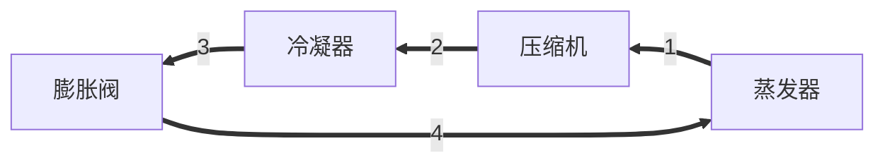

# 第一章 蒸汽压缩式制冷的热力学原理

## 第一节 理想制冷循环

### 一、逆卡诺循环

*在工程上以小数点后两位作为基准

制冷剂按**逆卡诺循环**的热力过程：

1. 绝热压缩（1-2）：T~0~升至T~k~，外界输入功w；
2. 等温冷凝（2-3）：等温T~k~向高温热源放出q~k~；
3. 绝热膨胀（3-4）：T~k~降至T~0~，膨胀机输出功W~e~；
4. 等温蒸发（4-1）：等温T~0~吸收低温热源中q~0~。

##### 制冷系数（COP）：

$$
\varepsilon=\frac{q_0}{w_c}=\frac{T_0}{T_k-T_0}
$$

在热泵设备中，通过**四通阀**改变制热和制冷

##### 热泵的供热系数：

$$
\mu=\frac{q_k}{w_c}=\frac{w_c+q_0}{w_c}=1+\varepsilon>1
$$

热泵循环就是一个制冷循环。但只有**在热源冷源温度相同时**，制热系数和制冷系数相同。

对于同一环境温度来说，热泵的工作温度**高于**制冷。高温型压缩机的寿命不如低温型压缩机，如：空气源热泵热水器。

##### 空气源热泵热水器注意事项：

* 尽量不要在主机的周围堆放物品；因为空气源热泵采暖是先吸收空气中的热量，再经过蒸发器汽化后，通过压缩机压缩成高压气体，再进入冷凝器液化，把吸收的热量传输给加热的水中，如此往复，不断吸收低温源的热而输出到所加热的水中，直接达到预定温度。如果主机周围堆有杂物，且距离较近，肯定会影响到换热效果。一般来说，主机周围至少留有80厘米的距离。
* 用户要及时清理化霜水；化霜后排水管如果处理不好，可能会导致化霜后的水流到地面上，天气寒冷时会很快结冰，不仅会给用户出行带来不便，还会对机组造成破坏。

*以电能驱动的热泵供热永远比直接用电能供热要节能，因为热泵供热系数永远大于1，电能直接供热的供热系数永远小于1，约为0.95-0.99之间。*

空调化霜：当感受温度达到0度时，换向阀的线圈的电源被切断，将空调改成对外制热运行，使外机蒸发器表面温度上升，达到化霜的效果，当蒸发器表面温度达到6度时，换向阀的线圈的电源又被接通，恢复对室内制热状态，在化霜期间，室内机的风扇停转。

1. 融霜所需时间总和不应超过运行周期时间的20%；
2. 冬季设计工况时机组运行性能系数（COP）<1.8的地区不宜采用空气源热泵**空调**机组；
3. 冬季设计工况时机组运行性能系数（COP）<2.0的地区不宜采用空气源热泵**热水**机组；
4. 在冬季寒冷潮湿的地区，

### 二、劳仑兹循环（变温热源的逆向循环）

##### 制冷系数： 

$$
\varepsilon_l=\frac{q_0}{\Sigma w}=\frac{q_0}{q_k-q_0}=\frac{T'_{0m}}{T'_{km}-T'_{0m}}
$$

理论制冷循环与逆卡诺循环的区别：

1. 用膨胀阀代替膨胀机；
2. 蒸汽的压缩在过热区进行，而不是湿蒸汽区；
3. 在冷凝器和蒸发器中，制冷剂按等压过程循环，且具有传热温差。

膨胀阀代替膨胀机后的节流损失：

1. 节流过程3-4不可逆，制冷剂通过膨胀阀损失的冷量：$\Delta q_{01}=h_4-h_{4'}=面积4'4bb'$
2. 损失了膨胀功W~e~绝热节流前后焓值不变，即h~3~=h~4~；（注意：非等焓过程）

节流损失：制冷剂干度&uarr;，液体含量&darr;，制冷能力&darr;。

（T~0~-T~k~）&uarr;或者制冷剂液态比热&uarr;，则节流损失增加，反之减少。

用膨胀阀代替膨胀机后，增加了w~e~，损失了&Delta;q~01~，使制冷系数和热力完善度下降。

#####  用干压缩代替湿压缩后的饱和损失

1. 危害:在制冷压缩机的实际运行中，若吸入湿蒸气，会引起液击，并占有气缸容积，吸气量减少，制冷量下降。
2. 实现干压缩的措施：*p6*
3. 过热损失影响因素：节流损失大的，过热损失小

#### 蒸汽压缩式制冷理论循环的热力计算

计算值一定要通过压焓图（lgP-h图）*p255*

###### *温熵图：小山图；压焓图：左手大拇指图*

制冷剂在蒸发器中的单位质量制冷量（蒸发器 *出口的焓* 减 *入口的焓* 是制冷量）：
$$
q_0=h_1-h_4[kJ/kg]
$$
压缩机的单位质量绝热压缩耗功量（*冷凝器入口的焓* 减 蒸发器出口的焓）：
$$
w=h_2-h_1[kJ/kg]
$$
制冷剂在冷凝器中的单位质量放热量（*压缩机出口的焓* 减 *冷凝器入口的焓*）：
$$
q_k=h_2-h_3[kJ/kg]
$$
节流前后焓值不变$h_3=h_4$，则$q_k=q_0+w$

***

制冷剂的单位容积制冷量（二氧化碳等气体制冷剂）：
$$
q_v=\frac{q_0}{v_1}[kJ/m^3]
$$
若总制冷量为$Q_0[kW]$，则制冷剂质量循环量：
$$
M_r=\frac{Q_0}{q_k}[kg/s]
$$
压缩机的吸气体积流量：
$$
V_r=M_r v_1=\frac{Q_0}{q_v}[m^3/s]
$$
冷凝器的热负荷：
$$
Q_k=M_rq_k[kW]
$$
压缩机的理论耗功量：
$$
N=M_rw[kW]
$$
理论制冷系数：
$$
\varepsilon_{th}=\frac{Q_0}{N}=\frac{q_0}{w}=\frac{h_1-h_4}{h_2-h_1}=\frac{制冷量[kW]}{耗功量[kW]}
$$
市面空调理论上：
$$
\frac{制冷量[kW]}{耗电量[kW·h]}\approx3.6
$$
制冷效率：理论制冷系数和考虑了传热温差的理想制冷系数之比。
$$
\eta=\frac{\varepsilon_{th}}{\varepsilon_c}
$$
热泵的理论供热系数：
$$
\mu_{th}=\frac{\psi_k}{P_{th}}=\frac{q_k}{w_e}=\frac{h_2-h_3}{h_2-h_1}
$$

## 第三节 蒸汽压缩式制冷循环的改善

#### 一、膨胀阀前液态制冷剂再冷却

为了**使膨胀阀前**（3）液态制冷剂得到再冷却，可以采用再冷却器或回热循环。

再冷却后所达到的温度成为**再冷温度**，冷凝温度与它的差值称为**再冷度** $\Delta t_{s,c}$。

制冷剂液体过冷和吸气过热是利用流出蒸发器的低温饱和蒸汽与流出冷凝器的饱和液体通过热交换器的传热过程而产生的。

吸气过热会增加$\Delta q_{04}和\Delta w$

若$\frac{\Delta q_{04}}{\Delta w}>\frac{q_0}w，则\varepsilon增大；反之\varepsilon减小。$

有害过热都会使$\varepsilon$减小

| 有利            | 不利                                 |
| --------------- | ------------------------------------ |
| R22、R12、R134a | R717（制冷系数下降多，排气温度太高） |

#### 二、回收膨胀功

$$
W_e=S_{0430}\\
W_{e回收}=h_4'-h_4=h_3-h_4=(h_3-h_0)-(h_4-h_0)
$$

单位质量制冷能力增加了 $\Delta q_0$，使其增大到 $q_{0e}$

#### 三、多级压缩制冷循环

多级压缩制冷循环常采用闪发蒸汽分离器和中间冷却器两种形式。
$$
中间冷却器\left\{\begin{align}
&一次节流、完全中间冷却：1.完全冷却\to2.过冷\to3.一次节流\\
&一次节流、不完全中间冷却（混合）
\end{align}\right.
$$
相关计算：

##### 双极蒸汽压缩制冷的中间压力

1. 制冷系数最大为原则
   $$
   t_m=0.4t_k+0.6t_0+3^\circ C
   $$
   
2. 按高低压级压缩机的压缩比相等为原则
   $$
   \frac{p_m}{p_0}=\frac{p_k}{p_m}\\
   \Longrightarrow p_m=\sqrt{p_0\cdot p_k}\\
   p_m\longrightarrow \varepsilon_{max}
   $$

3. 按选配好的高低压级压缩机的容积比确定中间压力，此时高低压级压缩机的理论输气量之比为定值，因此选择的中间压力要与此容积比相适应，通常采用试算法确定。

##### 关于制冷剂质量流量

1. 完全冷却
   $$
   M_{r1}=\frac{Q_0}{q_0}=\frac{Q_0}{h_1-h_8}\\
   M_{r1}=(h_2-h_3)+M_{r1}(h_5-h_7)=M_{r2}(h_3-h_6)\\
   能量平衡（进总焓=出总焓）\\
   M_{r2}=\frac{(h_2-h_3)+(h_5-h_7)}{h_3-h_6}M_{r1}\\
   M_r=M_{r1}+M_{r2}=\frac{h_2-h_7}{(h_3-h_6)(h_1-h_7)}Q_0(kg/s)
   $$

2. 不完全冷却
   $$
   M_{r1}=\frac{Q_0}{q_0}=\frac{Q_0}{h_1-h_8}\\
   h_3=h_3'+\frac{M_{r1}}{M_{r1}+M_{r2}}(h_2-h_3')\\
   M_r=M_{r1}+M_{r2}=\frac{h_3'-h_7}{(h_3'-h_6)(h_0-h_8)}Q_0
   $$
   

* 闪发蒸汽分离器也称为经济器（Economizer）。该循环称为二次节流、中间不完全冷却双极压缩制冷循环。

#### 四、复叠式制冷循环

两种类型：

1. 中温制冷剂和低温制冷剂两套独立制冷循环嵌套而成的双系统**复叠式制冷循环**（Refrigeration Cascade system）
2. 采用非共沸混合制冷剂的单系统**内复叠制冷循环**（Auto-Refrigeration Cascade system）

## 第五节 蒸汽压缩式制冷的实际循环

一、实际循环过程分析

1. $\Delta t$
2. $阻力：\left\{\begin{align}&沿程阻力\lambda\\&局部阻力\end{align}\right.$
3. 过程压降

二、实际循环的制冷性能

思考：

1. 热泵循环的供热系数 $\mu$ 与制冷循环的制冷系数 $\varepsilon$ 有何区别，二者之间有无关系？
2. 请运用所学知识，分析说明提高蒸气压缩式制冷装置性能系数（COP）的方法或途径。

理想： $\varepsilon$ 

理论： $\varepsilon_{th}$

## 基本要求:

1. 熟悉逆卡诺和具有温差的逆卡诺循环的特殊性及其理论和实践的价值。
2. 掌握变温热源逆向循环的特点及其对制冷工质的要求。
3. 熟悉影响理论制冷循环性能的各种因素。
4. **牢固掌握**理论制冷循环热力计算方法。

#### 翻转课堂内容（一）

* 目前，为了节省能源，充分利用冷凝热，出现了空气能热泵热水器（空气能热水器），其能效比较好，广泛应用于宾馆、家庭和集体宿舍等建筑，例如南林集中浴室就是采用这种热水器，请每组对空气源热泵热水器的概念、原理、机组选型、机组设置位置及应用注意事项进行认真讨论，并采用PPT讲解，课堂会集中检查讨论。

##### 空气源热泵热水器原理：

$t_水、t_k$ 在加热和使用热水过程中都在不停变化。

冬天室外机结冰需化霜

* 空气源热泵热水器由热泵——换热器——节流器——吸热器一热泵等装置构成了 一个循环系统。热媒（也可称冷媒）在热泵的作用下在系统内循环流动。它在热泵内完成气态的升压升温过程（温度高达100°C），它进入换热器后释放出高温热量加热水，同时自己被冷却并转化为流液态，当它运行到吸热器后，液态迅速吸热蒸发再次转化为气态，同时温度下降至零下20°C- 30°C ，这时吸热器周边的空气就会源源不断地将低温热量传递给热媒。热媒不断地循环就实现了空气中的低温热量转变为高温热量并加热冷水过程。

##### 常见品牌：

1. 中广欧特斯OUTES
2. 海尔Haier
3. 同益空气能TONGYI
4. 统帅Leader
5. 美的Midea
6. 纽恩泰ENERGY
7. PHNIX芬尼
8. A.O.史密斯
9. 格力GREE
10. 生能AMA

#### 翻转课堂讨论题

关于空气源热泵热水器机组与风冷蒸气压缩式制冷机组比较，正确的是：

* A.两者的压缩机设计参数基本相同
* B.两者的压缩机设计参数相差较大
* C.空气源热泵热水机组的压缩比大于风冷蒸气压缩式制冷机组
* D.空气源热泵热水器机组的压缩机排气温度高于风冷蒸汽压缩式制冷机组
