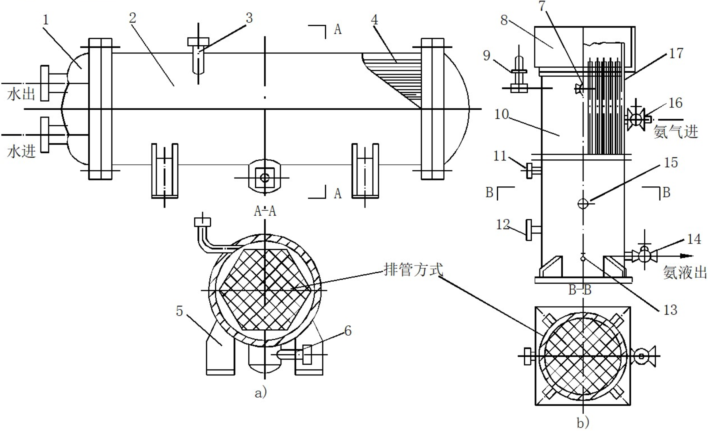
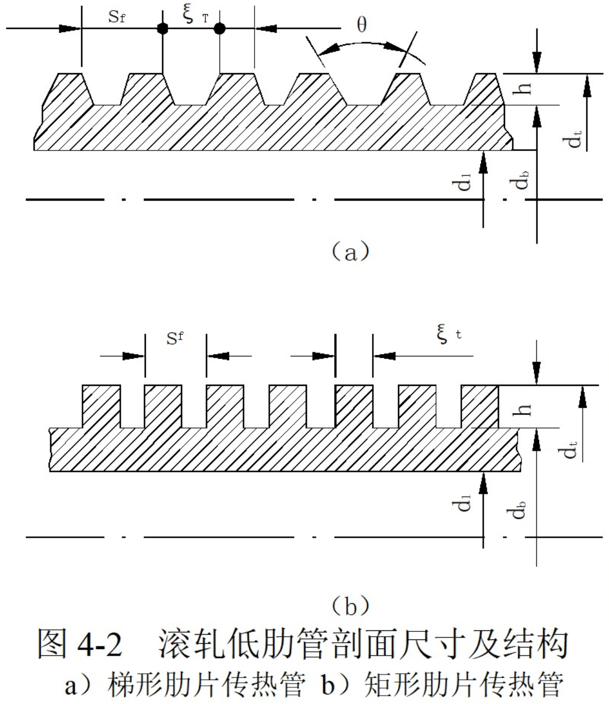
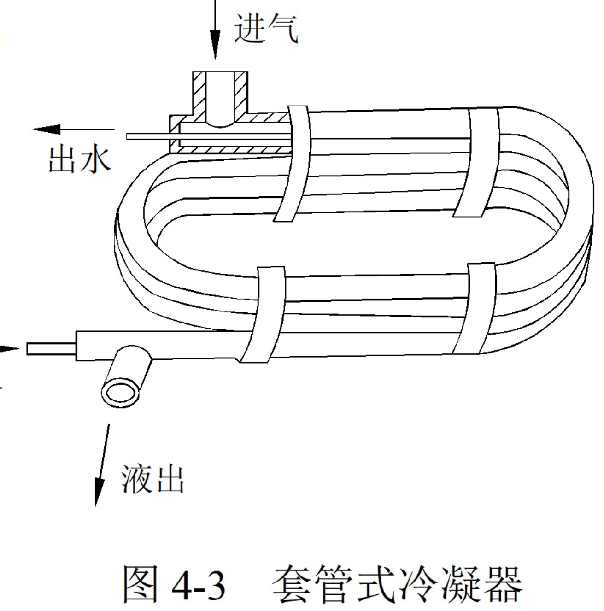
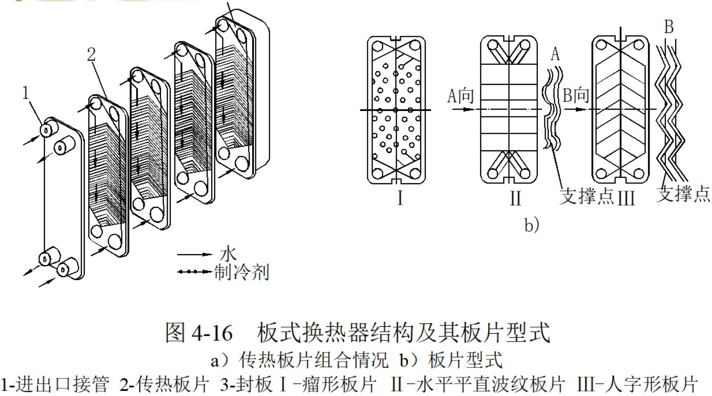
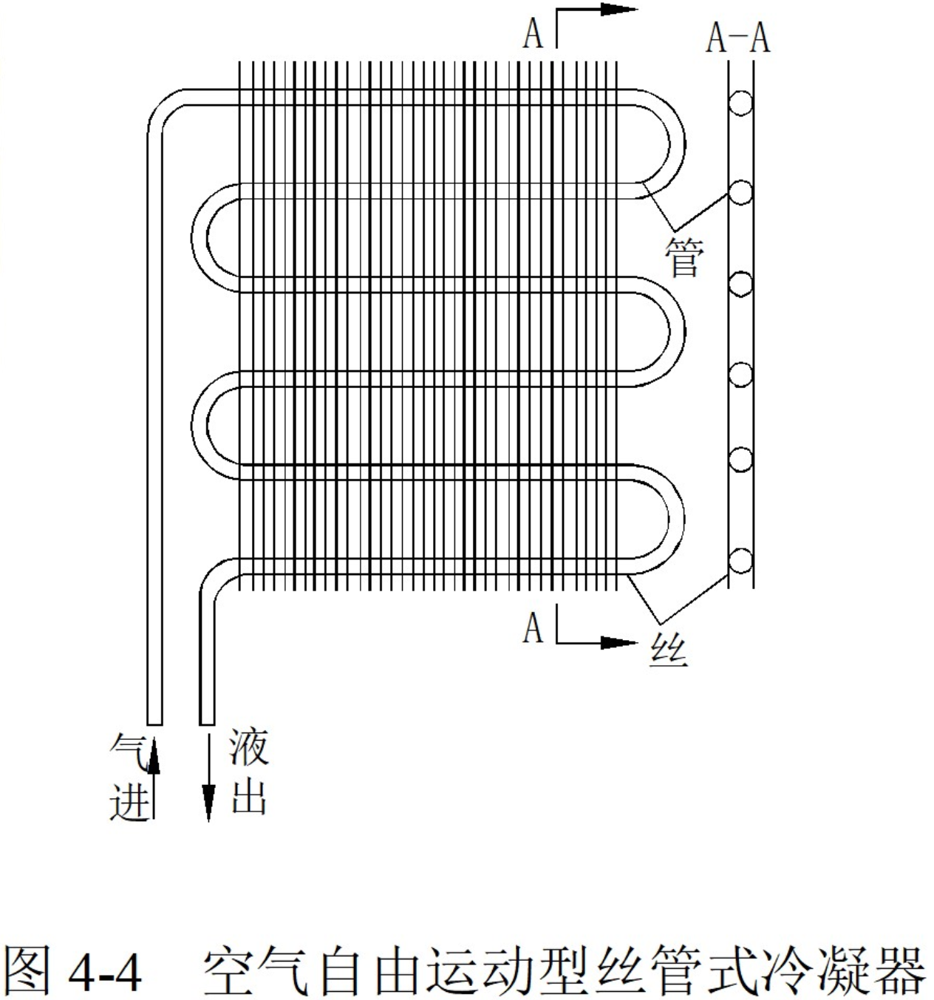
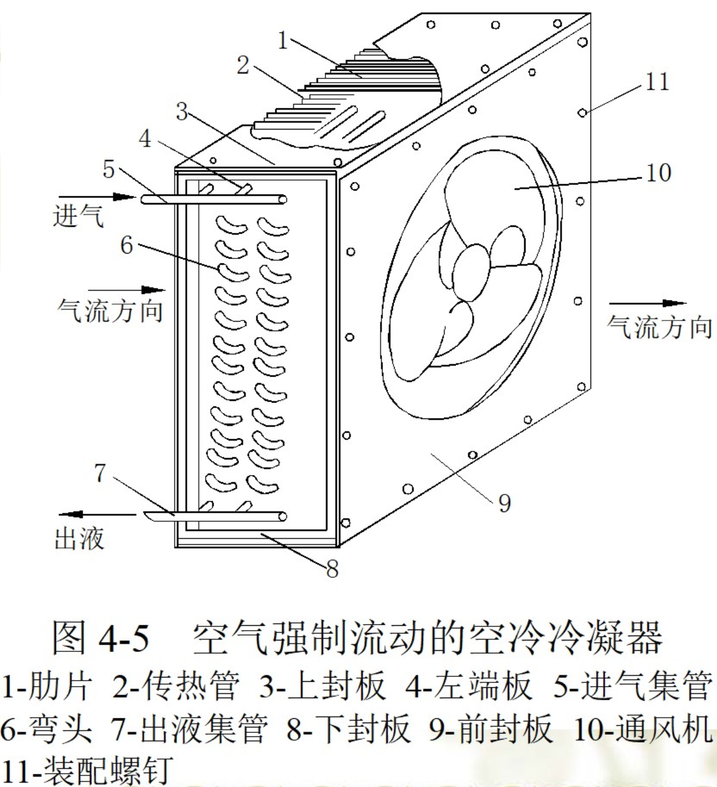
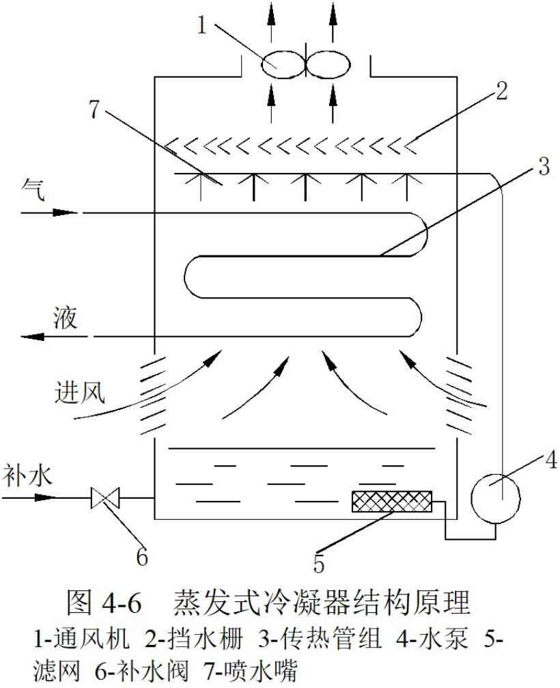
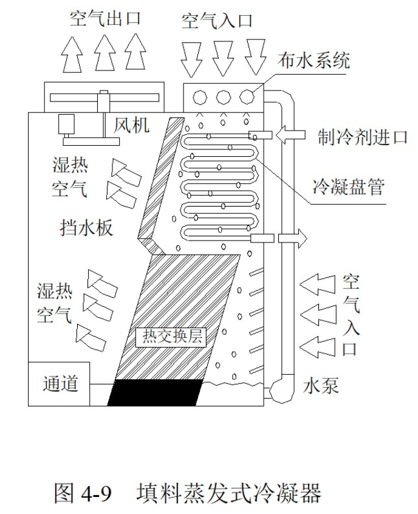
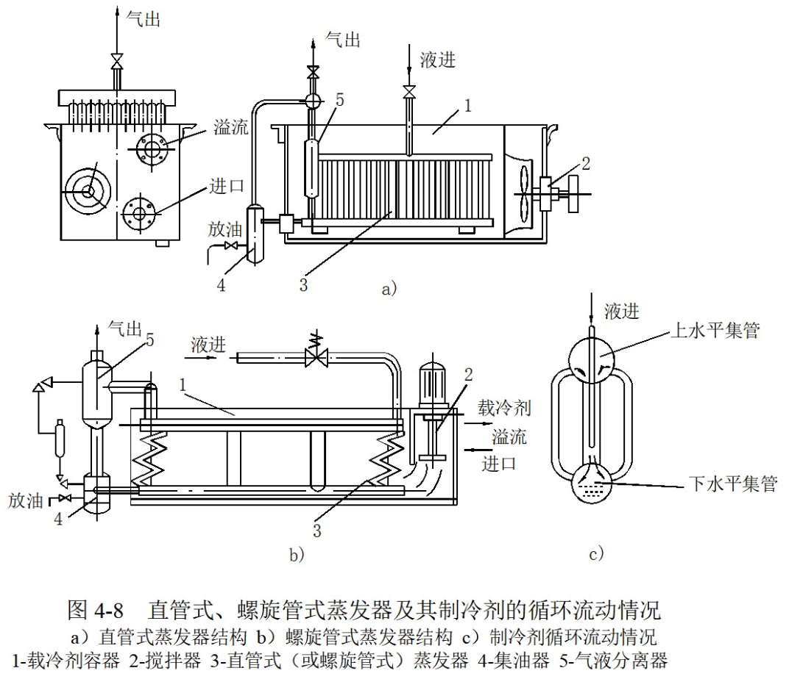

蒸气压缩式制冷循环是由压缩、放热、节流和吸热四个主要热力过程组成，每一个热力过程都是在对应的设备中完成，它们被称为制冷系统设备。决定着制冷系统能否形成。另外还有一些辅助设备，如各种分离器、贮液器、回热器、过冷器、安全阀等，它们在制冷系统中的作用是提高系统运行稳定性、经济性和安全性。

1. 制冷换热器的工作压力、温度范围比较窄。一般压力约在0.1～2.0MPa左右，温度在-60～50℃左右。
2. 介质间的传热温差比较小。一般在5～15℃之间
3. 制冷换热器应与压缩机匹配

制冷换热器以表面式居多，其结构型式名目繁多。不同结构型式换热器的传热能力及单位金属耗量，对制冷装置的制造成本和运行经济性带来直接影响。因此，提高换热器的经济性，强化传热过程，寻求新的结构型式，乃是当今制冷装置设计和制造中的重要研究课题。

制冷设备使用的材料随介质不同而异。氨对黑色金属无侵蚀作用，而对铜及其合金的侵蚀性强烈，所以氨制冷装置中设备都用钢材制成。而氟利昂对一般金属材料无侵蚀作用，可以使用铜或铜合金制造。对于以海水作为冷却介质的冷凝器仍然可采用铜管或铜镍合金管而氨冷凝器采用铜管时，必须采取加厚和增加镀锌保护等措施。以盐水作为载冷剂的氟利昂蒸发器，铜管上也应增加锌保护层，以延长使用寿命。

研制高效节能换热设备、发展新的热交换元器件和新型式的换热器，是当今制冷技术发展的重要内容。例如：蒸发器表面多孔管（即超流E管）、干式蒸发器螺旋槽管、空冷冷凝器的波纹形和条缝形翅片、水冷冷凝器表面锯齿形管（即超流C管）、高翅化系数低螺纹管、利于提高管内蒸气流速的扁椭圆管、外焊钻孔间断翅片的异型换热管、全铝冷凝器等等的开发。

以及工艺先进、结构紧凑、效率高的板式和板翅式换热器在制冷装置中的大量应用，全面展示了当代制冷科技进步的新成就，反映了现代制冷装置发展的新水平。

# 第一节 冷凝器的种类和工作原理

冷凝器是制冷装置的主要热交换设备之。它的任务是将压缩机排出的高压过热制冷剂蒸气，通过其向环境介质放出热量而被冷却、冷凝成为饱和液体，甚至过冷液体。

按照冷凝器使用冷却介质和冷却方式的不同，有水冷式、空气冷却式和蒸发式三种。

## 一、水冷式冷凝器

这种型式的冷凝器用水作为冷却介质，带走制冷剂冷凝时放出的热量。冷却水可以一次性使用，也可以循环使用。用循环水时，必须配有冷却塔或冷水池，保证水不断得到冷却。根据其结构不同主要有壳管式和套管式两种。

### （1）壳管式冷凝器：

制冷装置中使用的制冷剂不同，其结构特点也有所不同。一般立式壳管式冷凝器适用于大型氨制冷装置，而卧式壳管式冷凝器则普遍使用大中型氨或氟利昂制冷装置中。管板与传热管的固定方式一般采用胀接法,以便于修理和更换传热管。

采用铜管时传热系数可提高10%左右。铜管易于在管外加工肋片，以利于氟利昂侧的传热，一般在采用铜质肋片管以后，其氟利昂侧换热系数较相同规格光管大1.5~2倍。铜质滚轧低肋管剖面尺寸及结构如图4-2所示。

### （2）套管式冷凝器：

它是由不同直径的管子套在一起，并弯制成螺旋形或蛇形的一种水冷式冷凝器。如图4-3所示，制冷剂蒸气在套管间冷凝，冷凝液从下面引出，冷却水在直径较小的管道内自下而上流动，与制冷剂成逆流式，因此传热效果较好。

### （3）板式换热器

这种换热器早在一百多年前就已问世，直到近几年随着加工工艺水平的提高，出现了无垫片全焊接的板式换热器，才使得这种高效换热器在制冷装置中得以应用。板式换热器一般作为冷凝器、蒸发器或冷却器等，在制冷及空调用冷水机组中的应用相当普遍。

#### 使用注意：

1. 维修、清洗。
2. 不凝性气体
3. 设储液器
4. 水质

由于板式换热器具有体积小、重量轻、传热效率高、可靠性好、工艺过程简单、适合于批量生产，很受国内各制冷设备厂商的重视。目前已在国产模块化空调冷水机组和空气-水热泵机组等装置上批量使用。对促进我国制冷、空调事业的发展将起到重要的促进作用。

## 二、空气冷却式冷凝器

这种冷凝器以空气为冷却介质，制冷剂在管内冷凝，空气在管外流动，吸收管内制冷剂蒸气放出的热量。由于空气的换热系数较小，管外（空气侧）常常要设置肋片，以强化管外换热。分为空气自由运动和空气强制运动两种型式。

### （1）空气自由运动的空冷冷凝器：

该冷凝器利用空气在管外流动时吸收制冷剂排放的热量后，密度发生变化引起空气的自由流动而不断地带走制冷剂蒸气的凝结热。它不需要风机，没有噪声，多用于小型制冷装置。目前应用非常普遍的是丝管式结构的空气自由运动式冷凝器。如图4-4所示。

### （2）空气强制流动的空冷冷凝器：

如图4-5所示，它由一组或几组带有肋片的蛇管组成。制冷剂蒸气从上部集管进入蛇管，其管外肋片用以强化空气侧换热，补偿空气表面传热系数过低的缺陷。在结构方面，沿空气流动方向的管排数愈多，则后面排管的传热量愈小，使换热能力不能得到充分利用。为提高换热面积的利用率，管排数以取4~6排为好。

#### 空冷设备注意事项：

* 2-6排
* 进风面积：布置成V形或U形，空气从机组多面进风
* 风速：2-3m/s

# 三、蒸发式冷凝器

蒸发式冷凝器以水和空气作为冷却介质。它利用水蒸发时吸收热量使管内制冷剂蒸气凝结。水经水泵提升再由喷嘴喷淋到传热管的外表面，形成水膜吸热蒸发变成水蒸气，然后被进入冷凝器的空气带走。未被蒸发的水滴则落到下部的水池内。箱体上方设有 挡水栅。用于阻挡空气中的水滴散失。蒸发式冷凝器结构原理如图4-6所示。

#### 应注意以下问题:

1) 进口空气的湿球温度 $t_{s1}$ 与当地气象条件有关。
2) 风量配备与 $t_{s1}$ 有关。 $t_{s1}$ 越高则所要求的送风量就越大，送风耗能也越多。所以送风量的配备应从节能和性能要求两方面综合考虑。
3) 水量配备应以保证润湿全部换热表面为原则。随意增大配水量会造成水泵功耗上升，水的飞散损失增大，运行成本提高。

#### 空冷冷凝器布置注意事项：

* 通风良好（尤其注意进风面积）
* 比较干净
* 维修方便
* 噪声问题

## 一、制冷剂的冷凝换热

### 1、制冷剂在管壁与平板壁上的冷凝换热

$$
\alpha_{c}=c\left(\frac{\beta}{\Delta t \times l}\right)^{0.25} =c^{\prime}\left(\frac{\beta}{\psi \times l}\right)^{\frac{1}{3}} \\
\alpha_{v} =\varepsilon_{v} \alpha_{c} \\
\varepsilon_{v} =0.43 \operatorname{Re}^{\prime \prime} \operatorname{Pr}^{\prime \prime}
$$

### 2、水平管束上的冷凝

$$
\alpha_{z}=\varepsilon_{z} \alpha_{c}=Z^{-\frac{1}{6}} \alpha_{c}
$$

### 3、水平肋管表面的冷凝

$$
\alpha_{c \cdot f}=\alpha_{p} \frac{A_{p}}{A}+\alpha_{f} \frac{\eta_{f} A_{f}}{A}
$$

### 4、水平管内的冷凝

$$
\alpha_{c . n}=0.555\left(\frac{\beta}{\Delta t \cdot d_{i}}\right)^{0.25}=0.455\left(\frac{\beta}{\psi \cdot d_{i}}\right)^{1 / 3}
$$

#### 冷凝器换热考虑因素：

1. 不凝性气体：增加换热阻力，但对流速较大的，影响相对较少
2. 冷凝表面的粗糙度
3. 蒸汽含油：油膜、冷凝压力提高

## 二、冷却剂的换热

### 1、冷却水

1. 冷却水在管内的流动
   * 卧式壳管冷凝器，旺盛湍流
   * 冷却水在立管内的膜状流动
2. 冷却水在管外的对流换热

### 2、空气

### 3、水和空气

包括：管外表面水膜的对流换热和水膜与空气间的对流换热

# 第三节 冷凝器的设计计算

$$
\phi_{k}=K_{c} A \Delta t_{\mathrm{m}}
$$

## 一、冷凝器的热负荷 

$$
\phi_{k}=\phi_{o}+\varphi \phi_{o} \\
\phi_{k}=\phi_{o}\left(A+B t_{k}\right)
$$

## 二、传热平均温差与冷凝温度 $t_k$ 

$$
\Delta t_m=\frac{t_2-t_1}{\ln\frac{t_k-t_1}{t_k-t_2}}
$$

## 三、传热系数

# 第四节 蒸发器种类和工作原理

蒸发器按其冷却的介质不同分为冷却液体载冷剂的蒸发器和冷却空气的蒸发器。根据制冷剂供液方式的不同，有满液式、干式、循环式和喷淋式等。

## 一、 满液式蒸发器

按其结构分为卧式壳管式、水箱直管式、水箱螺旋管式等几种结构型式。它们的共同特点是在蒸发器内充满了液态制冷剂，运行中吸热蒸发产生的制冷剂蒸气不断地从液体中分离出来。由于制冷剂与传热面充分接触，具有较大的换热系数。但不足之处是制冷剂充注量大液柱静压会给蒸发温度造成不良影响。

##### 应注意以下问题：

1. 以水为载冷剂，其蒸发温度降低到0°C以下时，管内可能会结冰，严重时会
   导致传热管胀裂。
2. 低蒸发压力时，液体在壳体内的静液柱会使底部温度升高，传热温差减小。
3. 与润滑油互溶的制冷剂，使用满液式蒸发器存在着回油困难。
4. 制冷剂充注量较大。同时不适于机器在运动条件下工作，液面摇晃会导致压缩机冲缸事故。

#### 水箱式蒸发器

水箱式蒸发器可由平行直管或螺旋管组成（又称为立式蒸发器）。它们均沉浸在液体载冷剂中工作，由于搅拌器的作用，液体载冷剂在水箱内循环流动，以增强传热效果。制冷剂液体在管内蒸发吸热，使管外载冷剂降温。

## 二、非满液式蒸发器

### 1、干式壳管蒸发器

干式壳管蒸发器按照管组的排列方式不同可分为直管式和U形管式两种

干式蒸发器按其被冷却介质的不同分为冷却液体介质型和冷却空气介质型两类。

#### （1）冷却液体介质的干式蒸发器

图示壳管式干式蒸发器的直管式和U形管式的结构型式。它们的共同特点是壳内装有多块圆缺形折流板，目的在于提高管外载冷剂流速、增强换热效果。

干式壳管式蒸发器的特点是：

1. 能保证进入制冷系统的润滑油顺利返回压缩机
2. 所需要的制冷剂充注量较小，仅为同能力满液式蒸发器的1/3
3. 用于冷却水时，即使蒸发温度达到0°C，也不会发生冻结事故
4. 可采用热力膨胀阀供液，这比满液式的浮球阀供液更加可靠。

#### （2）冷却空气的干式蒸发器

这类蒸发器按空气的运动状态分有冷却自由运动空气的蒸发器和冷却强制流动空气的蒸发器两种型式。

##### 1、冷却自由运动空气的蒸发器：

由于被冷却空气呈自由运动状态，其传热系数较低。所以这种蒸发器被制成光管蛇形管管组，通常称做冷却排管。一般用于冷藏库和低温试验装置中。

冷却排管具有存液量少，其充液量约为排管内容积的40%左右，操作维护方便等优点。但存在管内制冷剂流动阻力大，蒸发后的蒸气不易排出。同时由于管外空气为自由运动，传热系数较低，一般在 $6.3～8.1W(m^2\cdot K)$ 范围。

##### 2、冷却强制流动空气的蒸发器（又称冷风机）：

由于光管式空气冷却器传热系数K很低，为加强空气侧的换热，往往需要在管外设置肋片以提高传热系数值。但是在一般情况下，设置肋管后因片距较小会引起较大的流动阻力，必须采取措施强制空气以一定的流速通过肋片管簇，以便于获得较好的换热效果。

这种蒸发器具有结构紧凑，传热效果好，可以改变空气的含湿量，应用范围广等优点。但从制造工艺要求分析，肋片与传热管的紧密接触式提高其传热效果的关键。

## 三、循环式蒸发器

这种蒸发器中， 制冷剂在其管内反复循环吸热蒸发直至完全气化，故称做循环式蒸发器。循环式蒸发器多应用于大型的液泵供液和重力供液冷库系统或低温环境试验装置。

循环式蒸发器的优点在于蒸发器管道内表面能始终完全润湿，表面传热系数很高。但体积较大，制冷剂充注量较多。

# 第五节 蒸发器的传热过程

## 一、制冷剂在蒸发器内的沸腾换热

### （一）水平管外大空间沸腾换热

如：满液式卧式壳管蒸发器

##### 影响因素:

1. 肋管外的沸腾换热大于光管
2. 管束外的沸腾换热大于单管
3. 沸腾换热与制冷剂物性有关
4. 制冷剂中含油量影响沸腾换热

### （二）管内沸腾换热

1. 垂直管内沸腾换热
2. 水平管内沸腾换热

## 二、载冷剂在蒸发器中的换热

### 1、液体载冷剂

$$
\alpha_{f}=C \operatorname{Re}_{f}^{0.6} \operatorname{Pr}_{f}^{0.33}\left(\frac{\mu_{f}}{\mu_{w}}\right)^{0.14}
$$

### 2、空气

结露时：
$$
\alpha_{a . e} =\eta_{f . b} \xi \alpha_{a} \\
$$
结霜时：
$$
\alpha_{a . e} =\eta_{f . b}\left[\frac{1}{\xi \alpha_{a}}+\frac{\delta_{s}}{\lambda_{s}}\right]^{-1}
$$
$\alpha_{a.e}$ ——肋片管外的对流换热系数

$\xi$ ——析湿系数，即总热交换量与显热交换量之比

$\delta_s、\lambda_s$ ——霜层的厚度和导热系数

* ##### 结霜、结露出现的条件和处理方法：

  1. 条件（原因）：室外的温度比较低，湿度比较大
  2. 方法：
     * 改成正循环（室外蒸发器变成冷凝器，室内冷凝器变成蒸发器）
     * 从压缩机的出口支一个小管子去室外，使室外机不至于结霜（常采用）
     * 直接在室外机组上绕电阻丝，靠电阻丝发热化霜

# 第六节 蒸发器的设计计算（整体计算法）

### 一、蒸发温度 $t_0$ 与平均传热温差 $\Delta t_m$ 

确定原则：传热和经济

内容：P111

影响因素：静液高度影响

# 第七节 其它换热设备

这类换热器用于提高制冷装置工作效率，或用于较低蒸发温度的制冷系统，这类换热器的两种传热介质都是制冷剂。这类换热器包括回热器、中间冷却器、冷凝蒸发器等。

### 一、再冷却器

### 二、回热器

### 三、中间冷却器

中间完全冷却/中间不完全冷却

它是两级压缩制冷装置的关键设备，用于同时冷却低压级压缩机的排气和高压制冷剂液体，使之获得较大的过冷度。中间冷却器内具有的压力称做中间压力该压力下制冷剂液体保持一定的液面高度。

低压压缩机排气经顶部的进气管直接通入氨液中，被冷却后与所蒸发的氨气由上侧面接管送到高压压缩机的吸气侧，用于冷却高压氨液的盘管置于中间冷却器底部的氨液中，其进出口一般经过下封头伸到壳外。进气管上部开有一个平衡孔，以防止中冷器内氨液在停机后压力升高时进入低压级压缩机排气管。

### 四、冷凝-蒸发器

它既是装置中低温级循环的冷凝器，又是高温级循环的蒸发器。常见的结构型式有绕管式、直管式（壳管式）和套管式三种。

1. 绕管式冷凝-蒸发器：其结构如图4-15所示，它是将一个四头螺旋型盘管绕在一个管芯上放置在一圆筒形壳体内。一般用于氟利昂复叠式（即R22/R23）系统，R22由盘管上方管口进入管内蒸发吸热，产生的蒸气由下方管口导出，R23在盘管外表面冷凝后由壳体底部排出。
2. 直管式冷凝-蒸发器：在结构上是将直管管簇设置在壳筒内，以取代盘管式中的螺旋盘管，其型式与壳管式冷凝器基本相同。
3. 套管式冷凝蒸发器：它结构简单，易于制造。但当为蛇形套管管组结构时，外形尺寸较大，所以它仅适用于
   小型复叠式制冷装置。

### 五、气体冷却器

微通道平行流气体冷却器，采用 $CO_2$ 超临界循环制冷系统