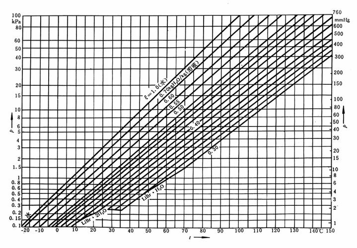
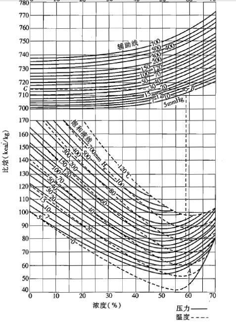

### 教学目的：要求掌握

* 两组分体系的比焓——质量分数图；
* <u>单效溴化锂吸收式制冷机的理想工作过程</u>、热力计算、传热计算，
* <u>影响吸收式制冷机性能的因素</u>，
* 双效溴化锂吸收式制冷机的工作流程，
* <u>提高溴化锂吸收式制冷机性能的途径</u>；

# 第一节 溴化锂吸收式制冷的工作原理

#### 对比

$\mathrm{LiBr}$ + 水 吸收式制冷——制冷剂：水；吸收剂：溴化锂

$\mathrm{NH_3}$ + 水 吸收式制冷——制冷剂：氨；吸收剂：水

蒸汽压缩式制冷： $\phi_k=\phi_0+P(W)$ 

吸收式制冷： $\phi_g+\phi_0+P=\phi_a+\phi_k=\phi_e$ 

其中，

$\phi_g$ ——发生器中热媒对溶液系统的加热量

$\phi_0$ ——蒸发器中被冷却介质对系统的加热量（即制冷量）

$P$ ——溶液泵功率

$\phi_a$ ——在吸收器中放热量

$\phi_k$ ——在冷凝器中放热量

$\phi_e$ ——系统对周围环境的放热量

## 一、吸收式制冷机原理

吸收式制冷机利用的是低温热源如 $0.03～0.8MPa$ 的低压蒸汽、高于 $75°C$ 的热水、燃气、废烟气、化学反应热、太阳能等。吸收式制冷机的制冷量可大可小，小到几十瓦的冰箱，大到百万瓦的大型制冷装置。

吸收式制冷机的工作原理是利用吸收剂对制冷剂的吸收性能和解吸性能来工作的。

吸收式制冷机利用溶液在一定条件下能析出低沸点组分的蒸气，在另一种条件下又能吸收低沸点组分这一特性完成制冷循环。目前吸收式制冷机多用二组分溶液，习惯上称低沸点组分为制冷剂，高沸点组分为吸收剂。

### 与压缩式制冷的区别与联系

#### 共同点：

高压制冷剂蒸气在冷凝器中冷凝后，经节流元件节流，温度和压力降低，低温、低压液体在蒸发器内汽化，实现制冷。

#### 不同点:

1) 提供的能量不同。
2) 吸取制冷剂蒸气的方式不同。
3) 将低压制冷剂蒸气变为高压制冷剂蒸气时采取的方式不同。

## 二、吸收式制冷的热力系数

### 1、 $\zeta$ h

吸收式制冷机通过热量制冷，其热力系数等于制冷量 $Q_0$ 与驱动热源输入热量 $Q_1$ 之比值：

$$
\zeta=\frac{Q_0}{Q_1}
$$

### 热力系数和热力完善度

* 热力系数是吸收式制冷机的效率
  
  $$
  \zeta=\frac{Q_e}{Q_g}
  $$

* 最大热力系数
  
  $$
  \zeta=\frac{Q_e}{Q_g}=\eta_c\cdot\varepsilon_c
  $$

$ζ$ 是衡量吸收式制冷机性能的一个重要指标，它反映了从驱动热源输出的热量与制冷机制冷量之间的关系。但它不能反映循环中存在的不可逆损失。评价吸收式制冷机不可逆损失的基准是热能驱动的可逆机的制冷性能系数$ζ_\max$ 。

# 第二节 吸收工质对

吸收式制冷机的工作介质除了制取冷量的制冷剂外，还有吸收，解吸制冷剂的吸收剂，二者组成工质对。其中低沸点的工质(或称组分)为制冷剂，高沸点的工质为吸收剂，如果还有第三种工质，那它是扩散剂。使用双组分工质的制冷机称为吸收式制冷机；使用三组分工质的则称为吸收 - 扩散式制冷机，一般用作冰箱制冷机。通常，把两种沸点相差很大的工质组成为工质对。

#### 对吸收剂，应有的特性如下：

1. 有强烈吸收制冷剂的能力；
2. 在相同压力下，它的沸腾温度应比制冷剂的沸腾温度高的多；
3. 不应有爆炸、燃烧的危险，并对人体无毒害；
4. 对金属材料的腐蚀性小；
5. 价格低，易取得。

可供考虑使用的制冷剂-吸收剂溶液很多，按溶液中含有的制冷剂种类区分分为水类、氨类、乙醇类和氟里昂类。

#### 吸收式制冷机工质对应具有如下特征：

1. 两个组分的沸点相差要大，当溶液沸腾时，被蒸发出来的只能是制冷剂；
2. 吸收剂必须具备强的吸收能力，既在相同压力下能强烈吸收温度比它低的制冷剂；
3. 制冷剂的蒸发潜热要大，而吸收剂的比热要小；
4. 成本低，容易得，对金属腐蚀小

## 溴化锂水溶液的性质及焓浓度图

### 一、水

水是人们在生活中接触最多的物质。它具有无毒、不燃烧、不爆炸、价格低、汽化潜热大(比R22大16倍)、比容大等特点。水在常压的蒸发温度较高，在100°C左右，因此溴化锂制冷机是在负压下工作，以使水能在5°C下蒸发。另外水在0°C时结冰，因此溴化锂制冷机只能制取0°C以上的冷量，这也大大限制了它的应用范围，使其主要用于空调工程中。

### 二、溴化锂

1. 溴化锂分别属碱和卤素元素，所以溴化锂 $\mathrm{(LiBr)}$ 的性质与食盐 $\mathrm{(NaCI)}$ 相似，属
   于盐类，有咸味，呈无色粒状晶体，熔点为 $549\degree C$ ；
2. 沸点高，在一个物理大气压下沸点为 $1265°C$ ，所以一般认为在常温和通常高温下是不挥发的；
3. 极易溶解于水；
4. 性能稳定，在大气中不易变质、不易分解；
5. 它是由 $92.01\%$ 的溴和 $7.99\%$ 的锂组成的，分子量为 $86.856$ ，密度为 $3.464kg/L\ 25°C$ 。

### 三、溴化锂水溶液

1. 无色液体，有咸味，无毒，加入铬酸锂后呈淡黄颜色

2. 溴化锂在水中的溶解度随温度的降低而降低

3. 溴化锂水溶液的水蒸汽分压很小（作用）

   溴化锂溶液面上的水蒸气分压力小于纯水的饱和蒸气压力，且浓度愈高或温度愈低时水蒸气的分压力愈低。溴化锂水溶液具有吸收温度比它低的水蒸气的能力如果压力相同，溶液的饱和温度一定大于水的饱和温度，由溶液中产生的水蒸气总是处于过热状态的。

4. 密度比水大，并随溶液的浓度和温度而变

5. 比热较小（作用）

6. 粘度大

7. 表面张力较大

8. 对碳钢和紫铜等金属材料有腐蚀性（方法）

9. 溴化锂水溶液的导热系数随溴化锂的质量分数的增大而降低，随温度的升高而增大

### 四、溴化锂水溶液的物性计算公式

为了编制计算机程序在计算机上进行计算、模拟、优化设计以及实验数据的处理，溴化锂水溶液的物性计算公式。

公式7.8-7.15

（自学）

### 五、溴化锂水溶液的焓浓度图

#### 溴化锂水溶液的 $p-t$ 图：

#### 溴化锂水溶液的比焓-浓度（ $h-\xi$ ）图：

# 第三节 溴化锂吸收式制冷的特点

## 一、主要优点

利用热能为动力，不但能源利用范围广，而且有两个重要特点：

* 能利用低势能热能（余热、废热、排热），使溴化锂吸收式制冷机大大节约能耗；
* 以热能为动力，溴化锂吸收式制冷机比利用电能为动力的压缩式制冷机可以
  明显节约电耗。

以一台3500kW ( 300万kcal/h ) 的制冷机组为例，压缩式制冷机耗电约900kW，而溴化锂吸收式制冷机仅耗电10多kW。在当前我国电力比较紧缺的条件下，使用这种机型更有现实意义。

### 溴化锂吸收式制冷机的分类（补充）

* 用途：冷水机组， 冷热水机组，热泵机组
* 驱动热源：蒸气型；直燃型；热水型；余热型；复合热源型
* 驱动热源的利用方法：单效；双效；多效；多级发生
* 低温热源：加冷水机组；第一类热源；第二类热源
* 溶液循环流程：串联；倒串联；并联；串并联
* 机组结构：单筒；双筒；三筒；多筒
* 机组布置：卧式；立式

#### 单效溴化锂吸收式制冷机流程：

### 循环倍率和放气范围

* **循环倍率** $f$ 物理意义：

  $$
  f=\frac FD=\frac{\xi_s}{\Delta\xi}
  $$

* 它表示在发生器中每产生 $1kg$ 水蒸气所需要的溴化锂稀溶液的循环量。
  
  $$
  \Deltaξ=ξ_s-ξ_w
  $$

* 放气范围：进出发生器的浓稀溶液差

## 二、单效溴化锂热力计算

溴化锂吸收式制冷机的计算应包括热力计算、传热计算、结构设计计算及强度校核计算等，此处仅对热力计算方法与步骤加以说明。

### 1、已知参数

1. 制冷量 $Q_0$ 

   它是根据生产工艺或空调要求，同时考虑到冷损、制造条件以及运转的经济性等因素而提出。

2. 冷媒水出口温度

   它是根据生产工艺或空调要求提出的。

3. 冷却水进口温度

   根据当地的自然条件（湿球温度）决定。

4. 加热热源温度

### 2、设计参数的选定

1. 吸收器出口冷却水温度和冷凝器的出口冷却水温度：

   通常让冷却水先经过吸收器，再进入冷凝器。冷却水的总温升一般取7～9°C， 视冷却水的进水温度而定。

2. 冷凝温度及冷凝压力：

   冷凝温度一般比冷却水出口温度高2～5°C。根据 $t_k$ ,查水蒸气表求得 $p_k$ 

3. 蒸发温度及蒸发压力：

   蒸发温度一般比冷媒水出水温度低。根据 $t_0$ 查水蒸气表求得 $P_0$ 。

4. 吸收器内稀溶液的最低温度：

   吸收器内稀溶液的出口温度一般比冷却水出口温度高3～5°C。

5. 吸收器压力：

   吸收器压力因蒸气流经挡水板时的阻力损失而低于蒸发力。压降的大小与挡水板的结构和气流速度有关，一般取10～70Pa。

6. 稀溶液浓度 $ξ_a$ 根据压力和温度，由溴化锂溶液的 $h- ξ$ 图确定。

7. 浓溶液浓度 $ξ_r$ 为了保证循环的经济性和安全可行性，希望循环的放气范围 $ξ_r～ξ_a$ 在0.03～0.06之间

8. 发生器内溶液的最高温度：

   可根据 $ξ_r$ 和 $p_g$ 的关系在溴化锂溶液的 $h-ζ$ 图中确定。

9. 溶液热交换器浓溶液出口温度：应比浓度所对应的结晶温度高10°C以上，因此冷端温差取15～25°C。

   如果忽略溶液与环境介质的热交换，稀溶液的出口温度可根据溶液交换的热平衡式确定，即先确定焓，然后根据焓和 $ξ_a$ 查 $h-ξ$ 图。

### 3、各单位设备热负荷计算

根据热平衡式确定

### 4、装置的热平衡式、热力系数及热力完善度

1. 若忽略泵消耗功率带给系统的热量以及系统与周围环境交换的热量，整个装置的热平衡式应为：
   $$
   Q_g+Q_0=Q_a+Q_k
   $$

2. 热力系数用 $ξ$ 表示，它反映消耗单位蒸气加热量所获得的制冷量，用于评价装置的经济性，按定义
   $$
   \xi=Q_0/Q_g
   $$
   注：单效溴化锂吸收式制冷机的 $ξ$ 一般为0.65～0. 75，双效溴化锂吸收式制冷机的 $ξ$ 通常在1.0以上。

3. 热力完善度是热力系数与同热源温度下最高热力系数的比值。

   假设热源温度为 $t_3$ ，环境温度为 $t_2$ ，冷源温度为 $t_1$ ，则最高热力系数为：
   $$
   \xi_\max=[ ( t_3-t_2)/t_3]/[ t_1/(t_2 -t_1)]
   $$
   热力完善度= $ξ/ξ_\max$ 

## 三、实际循环

### 1、发生不足：

原因：

流动阻力的存在，水蒸气经过挡水板时压力下降，因此在发生器中，发生压力应大于冷凝压力，在加热温度不变的情况下将引起溶液浓度的降低。由于溶液液柱的影响，底部的溶液在较高压力下发生，同时又由于溶液与加热管表面的接触面积和接触时间的有限性，使发生终了浓溶液的浓度低于理想情况下的浓度称为发生不足。

### 2、吸收不足：

原因：

在吸收器中，吸收器压力应小于蒸发压力，在冷却水温度不变的情况下，它将引起稀溶液浓度的增大。由于吸收剂与被吸收的蒸气相互接触的时间很短，接触面积有限，加上系统内空气等不凝性气体存在，均降低溶液的吸收效果，吸收终了的稀溶液浓度比理想情况下的高，称为吸收不足。

## 四、双筒单效溴化锂制冷机组流程图

#### 特点：

1. 双效溴化锂吸收式制冷机需要较高温度的热源来驱动，通常用0.25MPa～0.8MPa表压的蒸汽或其他150°C以上的燃气等热源
2. 双效溴化锂制冷机与单效机组相比，多了一个高压发生器、一个高温热源热交换器和一个凝水器。双效溴化锂制冷机组同单效溴化锂制冷机组一样，也是由热源回路、溶液回路、冷剂水回路、冷却水回路和冷煤水回路构成。所不同的是其热源回路由凝水器、高压发生器、低压发生器和热源组成，而溶液回路又多了一个溶液热交换器。

# 第五节 直燃溴化锂吸收式制冷机流程

### 一、直燃溴化锂冷吸收式热水机组

直燃式溴化锂吸收式冷热水机组以燃油和燃气为驱动能源，直接驱动溴化锂吸收式的冷热水机组，通常称为直燃溴化锂吸收制冷机。 这种机组具有燃烧效率高、对大气污染小、体积小、占地省等优点，既可以用于夏季供冷，又可以用于冬季供热，为用户提供了方便。

### 三、改善措施

1. 添加表面活剂
2. 添加缓蚀剂
3. 排除不凝性气体（抽真空）
4. 防结晶（添加防晶管）