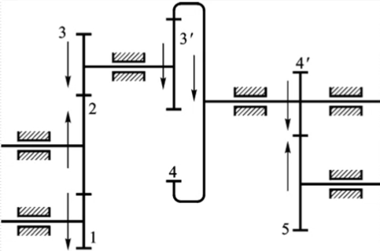

# §11-1 定轴轮系

## 一、轮系

* 定义：由一系列互相啮合的齿轮将主动轴和从动轴连接起来的传动装置。
* 分类：
  1. 定轴轮系：当轮系运转时，各个齿轮的几何轴线相对于机架都是固定不动的轮系
  2. 周转轮系：当轮系运转时，组成轮系的齿轮中至少有一个齿轮的几何轴线可绕另一个
     齿轮的几何轴线转动的轮系

## 二、定轴轮系的传动比

传动比：输入轴与输出轴转速（或角速度）之比，包含大小和方向。
$$
i_{1k}=\frac{\omega_1}{\omega_k}=\frac{n_1}{n_k}=?
$$

### 传动比的大小

$$
i_{12}=\frac{n_1}{n_2}=\frac{z_2}{z_1}\\
i_{23}=\frac{n_2}{n_3}=\frac{z_3}{z_2}\\
i_{3'4}=\frac{n_3'}{n_4}=\frac{z_4}{z_3'}\\
i_{4'5}=\frac{n_4'}{n_5}=\frac{z_5}{z_4'}
$$

齿轮3与3‘、4与4’各分别固定在同一根轴上，
$$
n_3=n_3',\ n_4=n_4'\\
\Downarrow\\
i_{12} \cdot i_{23} \cdot i_{3^{\prime} 4} \cdot i_{4^{\prime} 5}=\frac{z_{2}}{z_{1}} \cdot \frac{z_{3}}{z_{2}} \cdot \frac{z_{4}}{z_{3^{\prime}}} \cdot \frac{z_{5}}{z_{4^{\prime}}}=\frac{n_{1}}{n_{2}} \cdot \frac{n_{2}}{n_{3}} \cdot \frac{n_{3^{\prime}}}{n_{4}} \cdot \frac{n_{4^{\prime}}}{n_{5}}=\frac{n_{1}}{n_{5}}=i_{15}\\
\Downarrow\\
i_{1 k}=\frac{\omega_{1}}{\omega_{k}}=\frac{n_{1}}{n_{k}}=\frac{z_{2} \cdots z_{k}}{z_{1} \cdots z_{k-1}}=\frac{\text { 所有从动轮齿数连乘积 }}{\text { 所有主动轮齿数连乘积 }}\\
\Downarrow\\
i_{15}= \frac{n_1}{n_5}=i_{12}\cdot i_{23}\cdot i_{3‘4}\cdot i_{4’5}\cdot=\frac{(z_2)z_3z_4z_5}{z_1(z_2)z_3'z_4'}=\frac{z_3z_4z_5}{z_1z_3'z_4'}
$$
其轮系中仅改变齿轮的转向，而不影响传动比的大小的齿轮（ $z_2$ ）——**惰轮**。

### 传动比的方向

#### 1、平行轴轮系

齿轮几何轴线平行，输入轮和输出轮的转向相同或相反。在传动比数值前加上“ $+,-$ ”号来表示输入轮、输出轮的转向关系。

* 外啮合：两轮转向相反；
* 内啮合：两轮转向相同。

每经过一次外啮合就改变一次转向。
$$
i_{1 k}=\frac{\omega_{1}}{\omega_{k}}=(-1)^{m} \frac{\text { 从动轮齿数连乘积 }}{\text { 主动轮齿数连乘积 }}
$$
$m$ ：外啮合的次数

#### 2、非平行轴轮系——画箭头表示方向

* 情况1：定轴轮系中各轮几何轴线不都平行，但是输入、输出轮的轴线相互平行的情况。

  
  $$
  i_{15}=\frac{n_1}{n_5}=-\frac{z_3z_4z_5}{z_1z_3'z_4'}
  $$
  传动比方向判断：画箭头

  表示：在传动比大小前加正负号

* 情况2：输入、输出轮的轴线不平行的情况

  

## 三、定轴轮系的作用

### 1、实现大传动比传动

若仅用一对齿轮实现较大的传动比，必将使两轮的尺寸相差悬殊，外廓尺寸庞大，同时使小齿轮极易磨损，故一对齿轮的传动比一般不大于8。

### 2、实现较远距离的传动

# 11-3减速器

* 减速器：置于刚性的封闭箱体中的一对或几对相啮合的齿轮或蜗杆蜗轮组成。
* 减速器的功用：用来降低转速和增大转矩，以满足工作要求。在某些个别场合也用来增速，称为增速装置。应用广泛，主要参数已标准化。