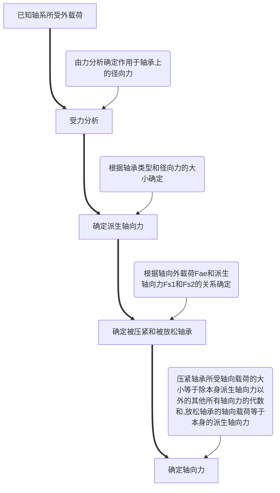

### 概述

* 作用：轴承是用来支承轴及轴上零件、保持轴的旋转精度和减少转轴与支承之间的摩擦和磨损。
* 分类：按载荷的方向分**向心轴承**和**推力轴承**；按相对运动表面的摩擦性质分为**滚动轴承**和**滑动轴承**。
* 应用场合：
  1. **滚动轴承**有着一系列优点，在一般机器中获得了广泛应用。
  2. **滑动轴承**在高速、高精度、重载、结构上要求剖分等场合下，体现出它的优异性能。在汽轮机、离心式压缩机、内燃机、大型电机中多采用滑动轴承。此外，在低速而带有冲击的机器中，如水泥搅拌机、滚筒清砂机、破碎机等也采用滑动轴承。

# §13-1 滑动轴承

滑动轴承通常由轴承体、轴瓦、轴承衬、润滑及密封装置等部分组成。

# §13-2 滚动轴承

滚动轴承是现代机器中应用广泛的一种部件，它是依靠主要元件间的滚动接触来支承旋转的轴。

滚动轴承通常成对出现，同一个轴上通常选择同一型号的轴承。

## 一、滚动轴承的组成

组成：内圈、外圈、滚动体、保持架。

* 内圈：通常装配在轴上，并与轴一起旋转；过盈配合；
* 外圈：通常安装在轴承座孔内或机械部件壳体中起支承作用；
* 滚动体：实现滚动摩擦的元件，在内圈与外圈的滚道之间滚动；
* 保持架：将滚动体等距隔开，引导滚动体在正确的轨道上运动。

## 二、滚动轴承的特点

* 优点：摩擦阻力小、启动灵活、效率高、润滑简便、易于互换且可以通过预紧提高轴承的刚度和旋转精度。
* 缺点：抗冲击能力较差，高速时有噪声，径向尺寸较大，工作寿命不及液体摩擦的滑动轴承。

## 三、滚动轴承的材料

* 内、外圈与滚动体——均采用硬度高、抗疲劳性强、耐磨性好的高碳铬轴承钢制造，如GCr15、GCr15SiMn等，热处理后硬度应达到60～65HRC。
* 保持架——多用低碳钢板冲压形成，也可用有色金属（如黄铜）、塑料等材料。
* 注：滚动轴承是标准件，由专业化工厂大量生产供应市场，类型和尺寸系列很多。设计时，需根据具体的工作条件，正确选择轴承的类型、尺寸和公差等级。

## 四、滚动轴承的主要类型

### 1、按载荷方向分

* 向心轴承：主要承受径向载荷
* 推力轴承：只承受轴向载荷
* 向心推力轴承：承受径向和轴向载荷

**公称接触角**：指轴承的半径方向与滚动体和滚道接触点的公法线之间的夹角。

公称接触角↑ → 轴承的轴向承载能力↑

注：公称接触角是滚动轴承的一个重要参数，轴承的受力分析和承载能力等都与接触角有关。

### 2、按滚动体形状分

* 球轴承：球与滚道为点接触，承载能力低，但摩擦系数小，极限转速高。
* 滚子轴承：滚子与滚道线接触，承载能力高，极限转速较低。
  * 圆柱滚子轴承
  * 圆锥滚子轴承
  * 球面滚子轴承
  * 滚针轴承

### 3、按工作时能否调心

* 调心轴承：滚道是球面型，能适应两滚道轴心间的角偏差及角运动
* 刚性轴承

### 4、按轴承的结构型式分类

在实际应用中，滚动轴承的结构形式有很多。作为标准的滚动轴承，在国家标准中分为13类，其中，最为常用的轴承大约分为有6类：

#### 1）深沟球轴承（类型代号：6)

* $\alpha=0°$ ，主要承受径向载荷，也可同时承受**小的双向轴向载荷**；
* 应用最广，价格最低。

#### 2）角接触球轴承（类型代号：7）

* 可以承受径向载荷和单方向轴向载荷，一般**成对**使用；
* 承受轴向载荷的能力与接触角 $\alpha$ 有关。 $\alpha$ 越大，承受轴向载荷的能力越强，有 $\alpha=15°、25°、40°$ 三种；
* 安装时可调整游隙。

#### 3）圆锥滚子轴承（类型代号：3）

* 可承受径向载荷和单向轴向载荷，成对使用，承载能力大于同尺寸的角接触球轴承；对于接触角为 $10°～18°$ 的圆锥滚子轴承（30000型），以承受径向载荷为主；对于大接触角 $(27°～30°)$ 的圆锥滚子轴承（30000B型），以承受轴向载荷为主；
* 内外圈可分离，安装时可调整游隙

#### 4）圆柱滚子轴承（类型代号：N）

* 只能承受径向载荷，且径向承载能力大；
* 外圈（或内圈）可以分离，不能承受轴向载荷；
* 有外圈无挡边、内圈无挡边、内圈有单挡边的多种形式。

#### 5）推力球（滚子）轴承（类型代号：5）

* 分离型轴承，只能承受轴向载荷；
* 内径稍小的称为“紧圈”、“轴圈”，内径稍大的成为“松圈”、“座圈”；
* 高速时离心力大，钢球与保持架磨损，发热严重，故**极限转速很低**。

#### 6）调心球（滚子）轴承（类型代号：1、2）

* 主要承受径向载荷，可承受少量的轴向载荷
* 可以调心，自动适应内外圈的倾斜，适应于刚性较差和多支点的支承；
* 不宜承受纯轴向载荷，因为会

## 五、滚动轴承的代号

用字母加数字来表示轴承结构、尺寸、公差级别、技术性能等特征的产品符号。

|  前置代号  |  基本代号   |        ★        |        ★        |       ★       |   后置代号   |                    |                    |                  |              |          |                |          |
| :--------: | :---------: | :-------------: | :-------------: | :-----------: | :----------: | :----------------: | :----------------: | :--------------: | :----------: | :------: | :------------: | :------: |
| 分部件代号 | 5、类型代号 | 4、宽度系列代号 | 3、直径系列代号 | 2&1、内径代号 | 内部结构代号 | 密封与防尘结构代号 | 保持架及其材料代号 | 特殊轴承材料代号 | 公差等级代号 | 游隙代号 | 多轴承配置代号 | 其他代号 |

**基本代号**：表示轴承基本类型、结构和尺寸，是轴承代号的基础；

**前置代号**和**后置代号**是轴承的结构形式、尺寸、公差、技术要求有改变时，在其基本代号左右添加的补充代号。

### 前置代号

——成套轴承分部件代号，用字母L、R、K等表示。

* L：可分离轴承的可分离内圈或外圈；
* R：不带可分离内圈或外圈的轴承；
* K：滚子和保持架组件。

注：常用轴承一般无前置代号。

### 基本代号

——表示轴承的基本类型、结构和尺寸。

* 内径代号——基本代号右起第1、2位数字，表示轴承内径尺寸。

  | 内径代号        |  00  |  01  |  02  |  03  |     04～99     |
  | :-------------- | :--: | :--: | :--: | :--: | :------------: |
  | 轴承内径尺寸/mm |  10  |  12  |  15  |  17  | 数字 $\times5$ |

* 尺寸系列代号——右起第3、4位数字。

  （第3位）直径系列代号：结构、内径相同的轴承在外径和宽度方面的变化系列。
  
  $$
  \begin{align}
  &向心轴承：7、8、9、0、1、2、3、4\\
  &外\quad径:\qquad小\longrightarrow大\\\\
  &如:6110(特轻)\quad6210(轻)\quad6310(中)\quad6410(重)
  \end{align}
  $$
  
  （第4位）宽度系列代号：结构、内、外径都相同的轴承，在宽度方面的变化系列。
  
  $$
  \begin{align}
  &向心轴承:8、0、1、2、3、4、5、6\\
  &宽\quad度:\qquad小\longrightarrow大
  \end{align}
  $$
  
  正常系列——0系列，代号0可不标出（除圆锥滚子、调心滚子轴承外）

* 类型代号——右起第5位数字。

  |   代号   |        0         |      1      |            2             |       3       |       4        |      5      |      6      |       7       |        8         |        9         |       N       |    NA    |
  | :------: | :--------------: | :---------: | :----------------------: | :-----------: | :------------: | :---------: | :---------: | :-----------: | :--------------: | :--------------: | :-----------: | :------: |
  | 轴承类型 | 双列角接触球轴承 | ★调心球轴承 | 调心（推力调心）滚子轴承 | ★圆锥滚子轴承 | 双列深沟球轴承 | ★推力球轴承 | ★深沟球轴承 | ★角接触球轴承 | 推力圆柱滚子轴承 | 推力圆锥滚子轴承 | ★圆柱滚子轴承 | 滚针轴承 |

### 后置代号

——用于表示**轴承的结构、公差及材料**等特殊要求，用字母或数字表示；置于基本代号的右边并与基本代号空半个汉字距离或用符号“ $-、/$ ”隔开。

有多组后置代号按照表中顺序填写，四组及四组后内容，用“ $/$ ”与前面代号隔开。

* 内部结构代号——表示同一类型轴承不同内部结构。

  角接触轴承：

  | 接触角       | 代号 | 实例   |
  | ------------ | ---- | ------ |
  | $\alpha=15°$ | C    | 7210C  |
  | $\alpha=25°$ | AC   | 7210AC |
  | $\alpha=40°$ | B    | 7210B  |

* 公差等级代号

  | 代号 | 公差等级 | 示例     |
  | ---- | -------- | -------- |
  | 省略 | 0级      | 6203     |
  | /P6  | 6级      | 6203/P6  |
  | /P6x | 6x级     | 6203/P6x |
  | /P5  | 5级      | 6203/P5  |
  | /P4  | 4级      | 6203/P4  |
  | /P2  | 2级      | 6203/P2  |

### 轴承代号示例

代号从右向左看

* 6303
  * 公差等级为0级
  * 轴承内径 $d=17mm$ 
  * 尺寸系列代号，宽度系列为0，直径系列为3（中）系列
  * 轴承类型代号，6为深沟球轴承
* 7312AC/P6
  * 公差等级为6级
  * 内部结构代号，AC表示接触角 $\alpha=25\degree$ 
  * 轴承内径 $d=12×5=60mm$ 
  * 宽度系列为0，直径系列为3（中）系列
  * 轴承类型代号，7为角接触球轴承
* 30213
  * 公差等级为0级
  * 轴承内径 $d=65mm$ 
  * 直径系列为2
  * 宽度系列为0系列（正常系列）
  * 圆锥滚子轴承
* N105/P5
  * 公差等级为5级
  * 轴承内径 $d=25mm$ 
  * 直径系列为1（正常宽度系列)
  * 圆柱滚子轴承

## 六、滚动轴承的选择

* 不同类型的轴承应用场合是不一样的。
* 要合理地选择轴承的类型，首先对各种类型轴承的性能特点有充分的了解，然后依据以下几个因素：
  1. 轴承的载荷
  2. 轴承的转速
  3. 轴承的调心性能
  4. 轴承的安装和拆卸
  5. 经济性

### 1、轴承的载荷

* 载荷的大小
  * 重载选滚子轴承；
  * 轻载选球轴承。
* 载荷的方向
  * 只有径向力时选向心轴承；
  * 只有轴向力时选推力轴承；
  * 同时有径向、轴向力时，选角接触轴承或向心、推力轴承组合。

### 2、轴承的转速

* 球轴承比滚子轴承能适应更高的转速；

* 轻系列的轴承比重系列的轴承能适应更高的转速；

* 各类推力轴承的极限转速很低，不宜用于高转速的情况。

  1.  $n$ 高，载荷小，旋转精度高——选用球轴承

      $n$ 低，载荷大，或有冲击载荷——选用滚子轴承

  2. 轴承有极限转速，应使 $n<n_\lim$ 

     6、7、N类承—— $n_\lim$ 较高

     5类轴承—— $n_\lim$ 较低

### 3、调心性能要求

轴承孔不同心，轴的刚性较差——调心轴承。

### 4、安装和拆卸

1. 安装拆卸较频繁选用分离型结构的轴承，如圆锥滚子轴承、圆柱滚子轴承、滚针轴承和推力轴承等；
2. 第3、7两类轴承应成对使用，对称安装。

### 5、经济性

* 球轴承的价格低于滚子轴承，应优先选用球轴承。
* 不同公差等级的轴承，价格相差悬殊，选用高精度轴承必须慎重。
  1. 优先考虑用普通公差等级的深沟球轴承；
  2. 旋转精度较高时——较高的公差等级和较小的游隙。

## 七、滚动轴承的失效形式及选择计算

### 1、滚动轴承的载荷与应力分析

以向心轴承为例，

* 在径向载荷 $F_r$ 作用下，**上半圈**滚动体不受力，**下半圈**各滚动体承受大小不同的载荷。
* 最下方的滚动体受载最大，两旁逐渐减少。
* 各滚动体从开始受力到受力终止所对应的区域——承载区。

轴承工作时，由于滚动体受变载荷，所以轴承内、外圈滚道与滚动体接触表面接触点受到的都是**脉动循环变化的接触应力**。

### 2、失效形式

* 疲劳点蚀——最主要的失效形式，滚动体表面、滚道表面都可能发生点蚀。防止点蚀破坏，是计算滚动轴承的主要目的。

* 塑性变形——**低速重载轴承**的主要失效形式，由于载荷过大或冲击载荷作用，接触应力过大，元件表面出现较大塑性变形。

* 其它失效形式：

  * 烧伤
  * 过度磨损
  * 卡死、元件破裂

  ——非正常失效（维护保养不当而造成）

### 3、计算准则

1. 对一般转速 $(n>10\ r/min)$ 的轴承，**疲劳点蚀**是其主要的失效形式，应分析轴承抗疲劳点蚀的承载能力，进行其**寿命计算**；
2. 对静止或极慢转速 $(n≤10\ r/min)$ 的轴承，轴承的承载能力取决于所允许的**塑性变形**，应进行**静强度计算**。

### 4、滚动轴承的寿命计算

* **滚动轴承的寿命：**单个轴承中**任一元件**的材料在出现点蚀破坏前，一个套圈相对另一个套圈的转数或一定转速下的工作小时数。

  对同一组同一型号的轴承，由于材料、热处理和加工工艺随机因素的影响，即使在相同条件下运转，寿命也**不相同**。

  采用数理统计的方法求出寿命分布规律，用<u>基本额定寿命</u>作为选择轴承的标准。

* **滚动轴承的基本额定寿命：**同一批相同的滚动轴承，在相同条件下运转，其中 $90\%$ 轴承不发生**疲劳点蚀**所能运转的总转数，用 $L_{10}$ 表示（单位为 $10^6r$ ），或者在一定转速 $n$ 下的小时 $L_{10h}$ 。

* **基本额定动载荷：**轴承寿命与所受载荷有关，载荷越大，寿命越短。
  
  $$
  P^\varepsilon L_{10}=const
  $$
  
  $\varepsilon$ ——寿命指数，球轴承 $\varepsilon=3$ ，滚子轴承 $\varepsilon=10/3$ ；

  定义：轴承的基本额定寿命恰好为 $10^6r$ 时，轴承所能承受的载荷值为**基本额定动载荷**，用 $C$ 表示，即 $C^\varepsilon10^6r=const$ 

  * 向心轴承——指纯径向载荷，记为： $C_r$ ；
  * 推力轴承——指纯轴向载荷，记为： $C_a$ ；
  * 角接触球轴承或圆锥滚子轴承——指使套圈间产生纯径向位移载荷的径向分量。

  注：

  $C$ 由试验得出，查设计手册；不同型号的轴承， $C$ 不同；

  $C\uarr$ ——轴承承载能力 $\uarr$ 。

#### 滚动轴承的寿命计算公式

当载荷 $P\neq C$ 时， $L_h=?$ 

载荷 $P$ 与基本额定寿命 $L_{10}$ 的关系：

$$
L_{10}=\left(\frac CP\right)^\varepsilon\quad[10^6r]
$$

用小时数表示：

$$
L_{10h}=\frac{10^6}{60n}\left(\frac CP\right)^\varepsilon\quad [h]
$$

##### 寿命计算可解决两类问题：

1. 当载荷 $P≠C$ 时， $L_h=?$ 

   若：
   
   $$
   L_h\geq预期计算寿命L_h'
   $$
   
   则，轴承寿命满足要求。

2. 已知载荷 $P$ ，要求预期计算寿命为 $L_h'$ ，应选 $C=?$ 的轴承？
   
   $$
   C=P\sqrt[\varepsilon]{\frac{60nL_h'}{10^6}}\quad[N]
   $$
   
   查手册，选择 $C≤C_{手册}$ 的轴承。

### 5、滚动轴承的当量动载荷

* 滚动轴承的基本额定动载荷 $C$ 是在规定的载荷条件下得到的，在实际应用中，轴承的载荷往往与实验条件不同。
* 在进行轴承寿命计算时，应把**实际载荷**换算成与试验条件相一致的**当量动载荷 $P$** 。
* 换算条件是：在当量动载荷作用下的轴承寿命与实际载荷作用下的轴承寿命相同。

##### 各类轴承的当量动载荷可按下式计算：

$$
P=f_p(XF_r+YF_a)
$$

式中：

$F_r、F_a$ ——轴承自身实际承受的径向载荷与轴向载荷

$X、Y$ ——轴承的径向动载荷系数与轴向动载荷系数

$f_p$ ——载荷系数

X、Y的求法：

* 对于仅承受径向载荷的轴承，X-1、Y-0；

* 对于仅承受轴向载荷的轴承，X-0、Y=1；

* 对于既承受径向载荷又承受轴向载荷的轴承，
  
  $$
  根据\frac{F_a}{C_0}\longrightarrow e\longrightarrow\begin{cases}
  当F_a/F_r\leq e,X=1,Y=0,不计F_a\\
  当F_a/F_r>e,X<1(查表),Y≠0,考虑F_a
  \end{cases}
  $$
  
  $C_0$ ——轴承的基本额定静载荷，查轴承手册；

  $e$ ——轴向载荷影响系数。

  载荷系数 $f_p$ ：

  | 载荷性质 | 无冲击或轻微冲击 | 中等冲击 | 强烈冲击 |
  | :------: | :--------------: | :------: | :------: |
  |  $f_p$   |     1.0～1.2     | 1.2～1.8 | 1.8～3.0 |

##### 轴承预期使用寿命推荐值 $L_h'$ ：

| 使用条件                                                     |     $h$      |
| ------------------------------------------------------------ | :----------: |
| 不经常使用的仪器和设备                                       |  300～3000   |
| 短期或间断使用的机械，中断使用不致引起严重后果，如手动机械、农业机械、装配吊车、自动送料装置 |  3000～8000  |
| 间断使用的机械，中断使用将引起严重后果，如发电站辅助设备、流水作业的传送装置、带式运输机、车间起重机 | 8000～12000  |
| 每天8h工作的机械，但经常不是满载荷使用，如电动机、一般齿轮传动装置、压碎机、起重机和一般机械 | 10000～25000 |
| 每天8h工作的机械，满载荷工作，如机床、木材加工机械、工程机械、印刷机械、分离机、离心机 | 20000～30000 |
| 24h连续运转的机械，如压缩机、泵、电机、纺织机械              | 40000～50000 |
| 24h连续运转的机械，中断使用将引起严重后果，如纤维机械、造纸机械、电站主要设备、给排水设备、矿用泵、矿用通风机 |  100000以上  |

### 6、角接触球轴承和圆锥滚子轴承的载荷计算（向心推力轴承）

#### 此类轴承的受载特点：

* 支反力作用点不在轴承宽度中心；
* 结构本身产生派生轴向力 $F_s$ ；
* 派生轴向力的方向由外圈的宽边指向窄边。即，总是与压力中心的偏离方向相一致。

#### 派生轴向力 $F_s$ 的计算公式表:

| 圆锥滚子轴承（30000型） | 角接触球轴承（70000C型） | 角接触球轴承（70000AC型） | 角接触球轴承（70000B型） |
| ----------------------- | ------------------------ | ------------------------- | ------------------------ |
| $F_s=F_r/(2Y)$          | $F_s=eF_r$               | $F_s=0.68F_r$             | $F_s=1.14F_r$            |

派生轴向力有使内外圈分离的趋势，为使派生轴向力平衡，通常此类轴承成对使用。

#### 轴承成对使用的装配形式：

* 面对面（正装）：外圈窄边相对，派生轴向力相对 $[\rarr\quad\larr]$ 
* 背对背（反装）：外圈宽边相对，派生轴向力相背 $\larr]\quad[\rarr$ 

##### 1）径向载荷 $F_r$ 的计算

$$
F_{re}\overset{按材料力学求支反力方法}{========>}F_{r1}、F_{r2}
$$

##### 2）轴向载荷 $F_a$ 的计算

$F_a$ 的计算既要考虑所有作用在轴上的轴向外载荷 $F_{ae}$ ，又要考虑由 $F_r$ 所产生的派生轴向力 $F_s$ 。

* 当 $F_{ae}+F_{s2}>F_{s1}$ 时，

  轴有左移趋势，轴承1被“压紧”，轴承2被“放松”。

  被压紧轴承1：
  $$
  F_{a1}=F_{s1}+F_{b}=F_{ae}+F_{s2}
  $$
  被放松轴承2：
  $$
  F_{a2}=F_{s2}
  $$

* 当 $F_{ae}+F_{s2}<F_{s1}$ 时，

  轴有右移趋势，轴承2被“压紧”，轴承1被“放松”。

  被压紧轴承2：
  $$
  F_{a2}=F_b+F_{s2}=F_{s1}-F_{ae}
  $$
  被放松轴承1：
  $$
  F_{a1}=F_{s1}
  $$

### 总结

角接触球轴承、圆锥滚子轴承所受轴向力的计算步骤：

