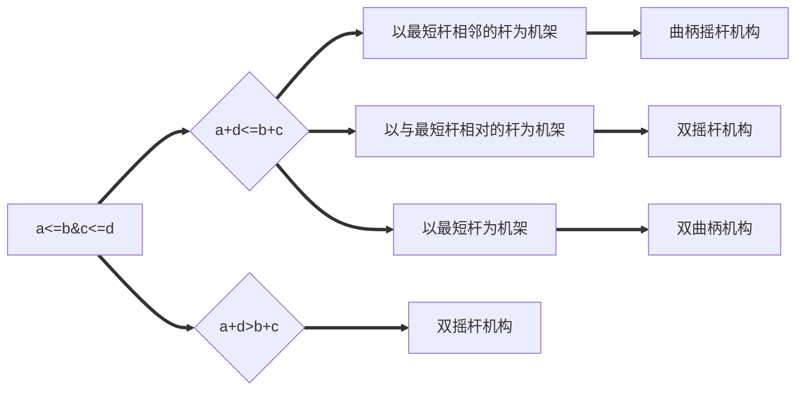

# §2-1 平面四杆机构的基本类型

### 一、铰链四杆机构

* 机架：固定不动
* 曲柄：绕其转动副轴线整周转动
* 摇杆：只能来回摆动
* 连杆：构件分别与另外两构件以转动副相连，工作时作平面复杂运动

### 二、铰链四杆机构的基本形式

1. 曲柄摇杆机构

   在铰链四杆机构中曲柄和摇杆同时存在的称为曲柄摇杆机构

2. 双曲柄机构

   在铰链四杆机构中，除机架和连杆以外，其余两构件均为曲柄者称为床曲柄机构。如：加速度筛

3. 双摇杆机构

   两个连架杆均为摇杆。如：汽车前轮转向机构

### 三、铰链四杆机构的演化

1. 改变相对杆长，转动副演化为移动副

   如：曲柄摇杆机构&Longrightarrow;偏置曲柄滑块机构

2. 改变转动副半径，演化为偏心轮机构，运动特性与演化前相同

   * 偏心距e：*几何中心与回转中心的距离，等于曲柄的长度*

3. 选用不同构件为机架

   * 曲柄滑块机构&Longrightarrow;曲柄摇块机构（连杆作机架）
   * 曲柄滑块机构&Longrightarrow;转动导杆机构（曲柄作机架）如：小型刨床
   * 曲柄滑块机构&Longrightarrow;摆动导杆机构 如：牛头刨床机构

# §2-2 曲柄存在的条件

> 1. 连杆架和机架中必有一杆为**最短构件**
> 2. 最长杆与最短杆长度之和小于或等于其它两构件长度之和（杆长条件）

# §2-3 曲柄摇杆机构的传动特性

#### 一、急回特性

**进程**：摇杆从第一个极位摆向第二个极位的运动过程

对应进程曲柄转过的角度：&alpha;~1~=180&deg;+&theta;（&theta;称为极为夹角：两次共线的锐角）

对应摇杆从C~1~D位置摆到C~2~D转过的角度：&phi;（称为最大摆角）

摇杆从C~1~D到C~2~D所用的时间：t~1~
$$
\alpha_1=\omega_1t_1=180^\circ+\theta\\
t_1=(180^\circ+\theta)/\omega_1
$$
**回程**：摇杆从第二个极位摆回第一个极位的运动过程

对应进程曲柄转过的角度：&alpha;~2~=180&deg;-&theta;

对应摇杆从C~2~D位置摆到C~1~D转过的角度：&phi;

摇杆从C~2~D到C~1~D所用的时间：t~2~
$$
\alpha_2=\omega_1t_2=180^\circ-\theta\\
t_2=(180^\circ-\theta)/\omega_1
$$
**连杆机构从动件具有急回特性的条件：**

1. 原动件等角速度整周转动
2. 输出件具有正反行程的往复运动
3. 极位夹角&theta;>0

**机构急回的作用**：节省空回时间，提高工作效率。（注意：急回具有方向性）

#### 二、压力角和传动角

* 压力角：从动件受力方向与受力点线速度方向之间所夹的锐角&alpha;

* 传动角：压力角的余角&gamma;
  $$
  F_n=Fsin\alpha\\
  F_t=Fcos\alpha\\
  \alpha \darr ,F_t \uarr
  $$

压力角愈小，机构的传力效果愈好。所以，衡量机构传力性能，可用压力角作为标志。

传动角愈大，机构的传力性能愈好，反之则不利于机构中力的传递。机构运转过程中，传动角是变化的，机构出现最小传动角的位置正好是传力效果最差的位置，也是检验传力性能的关键位置。

一般情况下，机构的传动角：&gamma;~min~&geqslant;40&deg;

对于高速和大功率的传动机械：&gamma;~min~&geqslant;50&deg;

##### 死点位置

摇杆为主动件，且连杆与曲柄两次共线时，有：γ=0
摇杆CD通过连杆加于曲柄转动的驱动力F正好通过曲柄的转动中心，此时机构不能运动，称此位置为：死点
