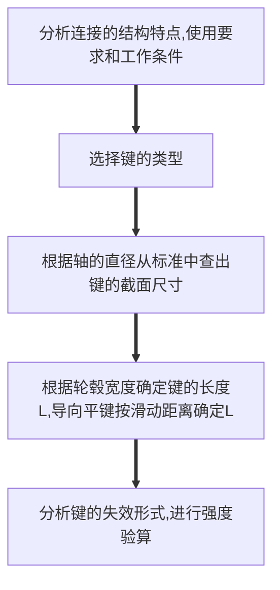

> 机械构件通常是由若干零部件按工作要求用各种不同的连接方式组合而成。

# §7-1 螺纹连接

> 利用带有螺纹的零件构成的一种可拆连接，其应用极为广泛。

### 一、螺纹及其主要参数

1. ##### 螺纹的形成

   * **螺旋线**——一动点在一圆柱体的表面上，一边绕轴线等速旋转，同时沿轴向作等速运动的轨迹。
   * **螺纹**——一平面图形沿着螺旋线运动，移动时保持该图形的平面通过圆柱体的轴线，就可以得到相应的螺纹。

2. ##### 螺纹的分类

   * 按牙型分

     * 矩形螺纹
     * 三角形螺纹
     * 梯形螺纹
     * 锯齿形螺纹

   * 按螺纹的旋向分

     * 右旋螺纹（常见）
     * 左旋螺纹

   * 按螺旋线的根数分

     * 单线螺纹
     * 多线螺纹

   * 按回转体的内外表面分

     * 外螺纹
     * 内螺纹

     统称**螺旋副**

   * 按螺旋的作用分

     * 连接螺纹
     * 传动螺纹

   * 按母体形状分

     * 圆柱螺纹
     * 圆锥螺纹

3. ##### 螺纹的基本参数

   1. 大径$d(D)$：与外螺纹牙顶或内螺纹牙底相重合的假想圆柱面直径，在标准中定为公称直径。

   2. 小径$d_1(D_1)$：与外螺纹牙底或内螺纹牙顶相重合的假想圆柱面直径。*常用于连接的强度计算。*

   3. 中径$d_2(D_2)$：假想圆柱面的直径，该圆柱母线上牙型沟槽和凸起宽度相等。*常用于连接的几何计算。*

   4. 牙型角$\alpha$：螺纹轴向平面内螺纹牙型两侧边的夹角。$\beta=\alpha/2$称为牙侧脚。

   5. 导程$S$：同一条螺旋线上的相邻两牙在中径线上对应两点间的轴向距离。

   6. 线数$n$：螺纹的螺旋线数目。连接用螺纹多要求有自锁性，多为单线螺纹。

   7. 螺距$P$：螺纹相邻两牙在中径上对应两点间的轴向距离。
      $$
      S=nP
      $$

   8. 升角$\Psi$：在中径圆柱上，螺旋线的切线与垂直于螺旋线轴线的平面所夹的夹角。
      $$
      tan\Psi=\frac{nP}{\pi d_2}
      $$

### 二、螺旋副中力的关系、效率和自锁

1. ##### 矩形螺纹

   展开中径$d_2$圆柱面上的螺旋线得一斜面。
   $$
   F_Q——轴向载荷\\
   F——水平推力\\
   F_N——法向反力\\
   F'=fF_N——摩擦力\\
   f——摩擦系数\\
   F_R——总反力\\
   tan\rho=F'/F_N=fF_N/F_N=f\\\Rightarrow \rho=tan^{-1}f——摩擦角
   $$
   
   ***
   
   当螺纹拧紧（滑块上升）时：
   
   $F_Q——阻力$
   
   $F——支持力$
   
   摩擦力 $F'$ 沿斜面向下。
   $$
   \angle F_RF_Q=\varphi+\rho
   $$
   列出力平衡方程：
   $$
   \overrightarrow{F_R}+\overrightarrow{F_Q}+\overrightarrow{F}=0
   $$
   
   
   作力多边形得：
   $$
   F=F_Qtan(\varphi+\rho)
   $$
   
   
   驱动力矩：
   $$
   T_1=F\frac{d_2}2=\frac{d_2}2F_Qtan(\varphi+\rho)
   $$
   
   ***
   
   当螺纹拧紧（滑块下滑）时：
   
   $F_Q——阻力$
   
   $F——支持力$
   
   摩擦力 $F'$ 沿斜面向上。
   $$
   \angle F_RF_Q=\varphi-\rho
   $$
   列出力平衡方程：
   $$
   \overrightarrow{F_R}+\overrightarrow{F_Q}+\overrightarrow{F}=0
   $$
   作力多边形得：
   $$
   F=F_Qtan(\varphi-\rho)
   $$
   驱动力矩：
   $$
   T_1=F\frac{d_2}2=\frac{d_2}2F_Qtan(\varphi-\rho)
   $$
   若 $\varphi>\rho$ ，则 $F>0$ ，不加拧松力矩，螺母自己会松脱
   若 $\varphi\leq\rho$ ，则 $F\leq0$ ，欲使螺母匀速下降（拧松螺母），则需外加驱动力 $T_1$
   即 $\varphi\leq\rho$ 时，不加支持力 $F$ ，螺母在 $F_Q$ 的作用下不会运动——这种现象称为**自锁**
   
2. ##### 非矩形螺纹 $\beta\neq0^\circ$

   $$
   F_N=\frac{F_Q}{cos\beta}
   $$

   

   非矩形螺纹的摩擦力为：
   $$
   F'=f\cdot F_N=\frac f{cos\beta}F_Q=F'\cdot F_Q
   $$
   摩擦系数 $f$ 的**非矩形螺纹**所产生的摩擦力与摩擦系数为 $f'$ 的**矩形螺纹**所产生的摩擦力相当

   称 $f'$为**当量摩擦系数**
   $$
   f'=\frac f{cos\beta}=tan\rho'
   $$
   称 $\rho$ 为当量摩擦角。

3. ##### 螺纹副的效率

   拧紧螺母时，螺母旋转一周，**输入功**为：
   $$
   A_1=F\pi d_2=F_Q\pi d_2tan(\varphi+\rho')
   $$
   升举中午所做的**有效功**为：
   $$
   A_2=F_QS=\pi d_2tan\varphi
   $$
   定义螺旋副的效率为**有效功与输入功**之比：
   $$
   \eta=\frac{A_2}{A_1}=\frac{tan\varphi}{tan(\varphi+\rho')}
   $$
   当 $\rho'$ 一定时，在 $\varphi=45^\circ-\rho'/2$ 处效率最高。

   一般取： $\varphi\leq20^\circ～25^\circ$ 。

   具有自锁性能的螺旋副，当拧紧螺母时，其效率总小于50%。

4. ##### 螺纹连接的预紧

   在实际使用中，绝大多数的螺纹连接都必须在装配时将螺母拧紧，称为紧连接。

   * 防止受载后被连接件之间出现间隙或横向滑移，增强连接的可靠性和紧密性。
   * 所需预紧力的大小与工作载荷有关。

   设预紧力为 $F_s$

   拧紧力矩：
   $$
   T_0=T_1+T_2=\frac{F_sd_2}{2}tan(\varphi+\rho)+f_zF_sr_m
   $$
   $T_1$ ——克服螺旋副相对转动的阻力矩。

   $T_2$ ——克服螺母支撑面上的摩擦阻力矩。

   $f_z$ ——螺母与支撑面间的摩擦系数，0.2。

   $r_m$ ——支撑面摩擦半径。

   $r_m=(D_0+d_0)/4$

   对于M10-M60的粗牙螺纹，代入各参数平均值

   简化公式： $T_0\approx0.2F_sd$

   工程上常用**测力矩扳手**或**定力矩扳手**来控制预紧力。

### 三、机械制造中的常用螺纹

* 三角型螺纹：牙型角60°，自锁性好，牙根强度高，用于连接
* 管螺纹：牙型角55°，连接紧密，内外螺纹旋合后无间隙，密封性较高，用于连接
* 梯形螺纹：牙型角30°，效率较高，牙根强度较大，工艺性好，用于传动
* 矩形螺纹：牙型角0°，效率较高，牙根强度小，工艺性差，用于传动
* 锯齿形螺纹：工作面的牙型斜角为3°，非工作面的牙型斜角为30°，用于单向传动

### 四、标准螺纹连接件和螺纹连接的主要类型

1. 标准螺纹连接件
   * 螺栓
   * 双头螺柱
   * 螺钉、紧定螺钉
   * 螺母
   * 垫圈
2. 螺纹连接的主要类型
   * 螺栓连接：用于可制通孔的场合
     * 普通螺栓连接：螺栓杆与被连接件孔壁之间**有间隙**。通孔加工精度低，成本低，应用最广。
     * 铰制孔用螺栓：能精确定位，能承受横向载荷，被连接件孔壁之间无间隙（基孔制过渡配合）。能精确定位，能承受横向载荷，被连接件需钻孔、铰孔，成本高。
   * 双头螺柱连接：用两头均有螺纹的螺柱和螺母把被连接件连接起来，被连接件之一为光孔（通孔）、另一各为螺纹孔（盲孔）。适用于被连接件之一厚度很大，而又不宜钻通孔，但又经常拆卸的地方。
   * 螺钉连接：被连接件之一为光孔、另一个为螺纹孔。只用螺钉，不用螺母，直接把螺钉拧进被连接件中。适用于载荷较轻，且不经常拆装的场合。
   * 紧定螺钉连接：利用拧入被连接件螺纹孔中的螺钉末端顶住另一零件的表面，以固定零件的相对位置，可传递不大的力或扭矩。
   * 其他类型连接：地脚螺栓连接（重型机械固定）、吊环螺钉连接（大型物体提吊、移动）

### 五、螺纹连接的防松装置

自锁作用只有在静载荷下才是可靠的，在振动和变载荷下，容易出现自动松脱。

防松的实质：限制螺旋副的相对转动，以防止连接的松动，因此需要采用防松装置。

1. 摩擦防松
   * 弹簧垫圈防松：弹簧点球被压平后，利用其反弹力使螺纹间保持压紧力和摩擦力。
   * 双螺母防松：两螺母对顶拧紧后，旋合螺纹间始终受到附加的压力和摩擦力作用。
2. 机械防松
   * 开口销防松：开口销从螺母的槽口和螺栓尾部的孔中穿过，起防松作用。
   * 止动垫圈防松：利用单耳止动垫圈的折边或圆螺母用止动垫圈的内外翅来实现防松。

### 六、螺栓连接的计算

螺纹尺寸设计步骤：

螺栓连接的主要失效形式：

* 普通螺栓连接（受拉螺栓）

  主要承受轴向力

  失效形式主要是**螺纹**部分的**塑性变形**和**螺杆**的**疲劳断裂**

* 铰制孔用螺栓连接（受剪螺栓）

  主要承受横向力

  失效形式可能是**螺栓杆被剪断**或螺栓杆和孔壁的**贴合面**被**压溃**

螺栓连接的受载形式：

* 松螺栓连接：安装时无预紧力，只有工作载荷
* 紧螺栓连接：安装时有预紧力，还有工作载荷

计算内容：

* 普通螺栓（受拉螺栓）连接的强度计算
  1. 松螺栓连接
  2. 紧螺栓连接： $\left\{\begin{align}受横向载荷\\受轴向载荷\end{align}\right.$
* 铰制孔用螺栓（受剪螺栓）连接的强度计算

#### 1、松螺栓连接

* 受载荷形式——轴向拉伸（工作拉力F）

* 失效形式——螺栓拉断

* 设计准则——保证螺栓拉伸强度

* 强度条件： $\sigma\leq[\sigma]$

* 设计计算方法：

  * 校核式：
    $$
    \sigma=\frac FA=\frac{4F}{\pi d_1^2}\leq[\sigma]
    $$

  * 设计式：
    $$
    d_1\geq\sqrt{\frac{4F}{\pi[\sigma]}}
    $$

#### 2、紧螺栓连接

受预紧力 $F_0$ 和阻力矩 $T_1$ 的双重作用。

拉应力：
$$
\sigma=\frac{F_0}{\pi d_1^2/4}
$$
切应力：
$$
\tau=\frac{T_1}{W_1}=\frac{T_1}{\pi d_1^3/16}\approx0.5\sigma
$$
根据第四强度理论，当量应力为：
$$
\sigma'=\sqrt{\sigma^2+3\tau^2}=\sqrt{\sigma^2+3(0.5\sigma)^2}=1.3\sigma
$$
强度条件：
$$
\frac{1.3F_0}{\pi d_1^2/4}\leq[\sigma]
$$

##### 受横向载荷的紧螺栓连接

* 受载形式：横向载荷 $F$ 、预紧力 $F_s$

* 横向载荷 $F$ 靠结合面的摩擦力来承受，为了使零件不出现相对滑动及连接可靠，应满足：
  $$
  fF_szm\geq1.2F
  $$
  $f$ ——结合面的摩擦系数

  $z$ ——螺栓数目

  $m$ ——结合面数目

  $1.2$ ——防滑系数

* 预紧力：
  $$
  F_s\geq\frac{1.2F}{fzm}
  $$

* 在预紧力 $F_s$ 下的失效形式为：螺栓拉断（拉、扭综合作用）

* 设计准则——保证的螺栓拉伸强度

* 强度条件： $\sigma'\leq[\sigma]$

* 设计计算方法：

  * 校核式：
    $$
    \sigma'=\frac{1.3F_s}{\pi d_1^2/4}\leq[\sigma]
    $$
    
  * 设计式：
    $$
    d_1\geq\sqrt{\frac{5.2F_s}{\pi[\sigma]}}
    $$

避免横向载荷较大时螺栓尺寸较大所采取的改进措施：

* 采用减载销、套筒、键承担横向工作载荷

##### 受轴向载荷的紧螺栓连接

* 受载荷形式——预紧力 $F_s$ 、工作载荷 $F$
* 此时，螺栓所受的总拉力： $F_0\neq F_s+F$
* 须根据静力平衡方程和变形协调条件求解

受力与变形关系：

|            |                     螺栓                     |                    被连接件                    |
| :--------: | :------------------------------------------: | :--------------------------------------------: |
|   未预紧   |                未受力、无变形                |                 未受力、无变形                 |
| 预紧 $F_s$ |        拉力 $F_s$ ，伸长 $\lambda_1$         |         压力 $F_s$ ，压缩 $\lambda_b$          |
|  受载 $F$  | 拉力 $F_0$，伸长 $\lambda_1+\Delta\lambda_1$ | 压力 $F_s'$ ，压缩 $\lambda_b-\Delta\lambda_b$ |

残余预紧力 $F_s'$ ：对于重要的和要求紧密性的连接，取 $F_s'=(1.5～1.8F)$，对于不太重要的连接，取 $F_s'=(0.2～0.6)F$ 。

若轴向载荷偏心：

* 螺栓受到的总拉力 $F_0=F+F_s'$
* 附加弯矩 $F_0e$

防偏载措施：

* 凹坑（鱼眼坑）
* 凸台
* 斜垫片

##### 铰制孔用螺栓（受剪螺栓）连接的强度计算

* 受力特点——受载前后不需要预紧，仅受横向载荷 $F$，靠螺栓杆与螺栓孔壁间的互相挤压传递

* 失效形式——侧面压溃及螺栓被剪断

* 设计准则——保证挤压、剪切强度

* 强度条件： $\sigma_p\leq[\sigma_p]、\tau\leq[\tau]$

* 设计计算方法：

  挤压强度： $\sigma_p=\frac F{d_0L_{min}}\leq[\sigma_p]$

  剪切强度： $\tau=\frac{4F}{\pi d_0^2}\leq[\tau]$

### 七、螺栓的材料和许用应力

* 螺栓材料：低碳钢、中碳钢、合金钢

* 螺栓的计算方法：

  试算法：
  $$
  假定螺栓的直径d_1\longrightarrow查许用应力\longrightarrow计算小径d_1\longrightarrow和假定直径d_1比较
  $$
  许用应力 $[\sigma]$ 的确定：

  假定 $d=20mm$ ，螺栓材料采用 $Q255$ 钢，屈服强度 $\sigma_s=255MPa$ 。<u>查许用应力表</u>，$[\sigma]=0.4\sigma_s=102MPa$，故 $d_1=22.79mm$ ，查表： $d=24mm$ 时， $d_1=22.917mm$ ，与假设值不接近，应重新用 $d=20mm$ 计算。

# §7-2 键连接

目的：用来连接轴与轴上的转动零件

实现零件的周向固定以传递转矩（静连接），轴向固定或轴向移动的导向。

键连接分类：

* 松连接
  * 平键
    * 普通平键——（静连接）
    * 导向平键——（动连接）
  * 半圆键——（静连接）
* 紧连接——楔键——（静连接，单向轴向固定）
* 花键连接

## 一、键连接的分类及其结构形式

##### 松连接——普通平键

键的上表面与轮毂的键槽底间留有间隙，键的上下表面为非工作面，工作前没有预紧力，工作时靠键与键槽两侧面的互相挤压传递力矩，**两个侧面是工作面**。

特点：结构简单、拆卸方便、对中性好、应用最为广泛。只能传递转矩，不能承受轴向力。

普通平键结构：

* 圆头（A型）固定良好，轴槽应力集中大。
* 平头（B型）轴的应力集中小。
* 单圆头（C型）用于轴端。

##### 松连接——导向平键

结构特点：长度较长，需用螺钉固定。

为便于装拆，制有起键螺孔。

##### 松连接——半圆键

优点：自动适应轮毂中键槽的斜度定心好，装配方便。特别适用于锥形轴端的连接。

缺点：对轴的削弱较大，只适用于轻载连接。

##### 紧连接——楔键

结构：键侧与键槽有间隙，上下面楔紧。

工作原理：上下面为工作面，靠摩擦力传递转矩。转动时键的一侧压紧轴和轮毂键槽，传递单向的轴向力。

类型：平头楔键、钩头楔键、圆头楔键。

特点：结构简单；楔紧产生偏心，对中性差，不适用于高速及对中要求高的场合。

## 二、键的选择及其强度校核

**键的材料：**抗拉强度 $\sigma_B\geq500～600MPa$ 的碳素钢。

**键的设计步骤：**

强度验算：

* 工作面被压溃——挤压强度
  $$
  \sigma_p=\frac{\frac T{d/2}}{\frac h2l_s}=\frac{4T}{dhl_s}\leq[\sigma_p]
  $$
  $[\sigma_p]$ ——按键、轴与轮毂中力学性能较差的材料选择——<u>查表</u>

* 键被剪断——剪切强度
  $$
  \tau=\frac{\frac T{d/2}}{bl_s}=\frac{2T}{bl_sd}\leq[\tau]
  $$
  $[\tau]$ ——按键的材料选择

## 三、花键连接

结构特点：沿周向均布多个键齿，齿侧为工作面

优点：受载均匀、承载能力高、对轴的削弱小、定心好、导向型好

缺点：制造困难，需用专门机床

类型：

* 矩形花键

  特点：制造方便。常用于中、轻载情况

* 渐开型花键

  特点：工艺性好、定心精度高、承载能力大。宜用于载荷大，尺寸也较大的连接。

校核：一般只做挤压强度的校核计算。