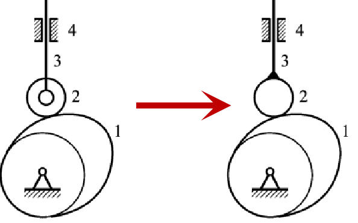
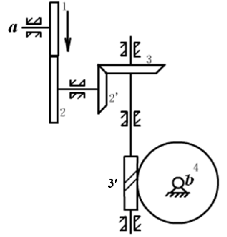
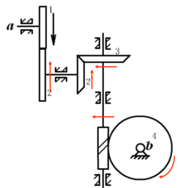
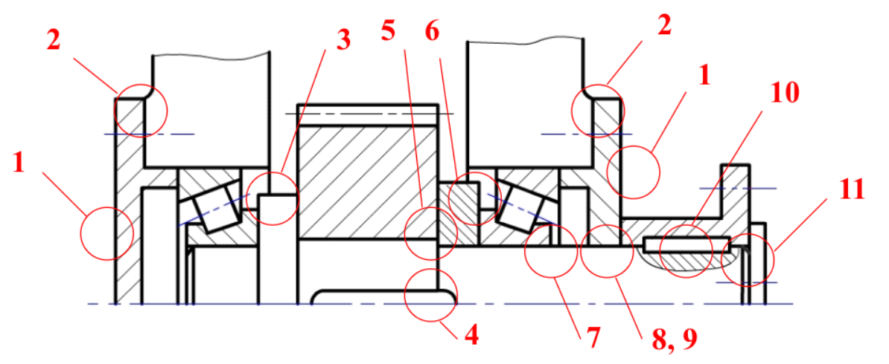
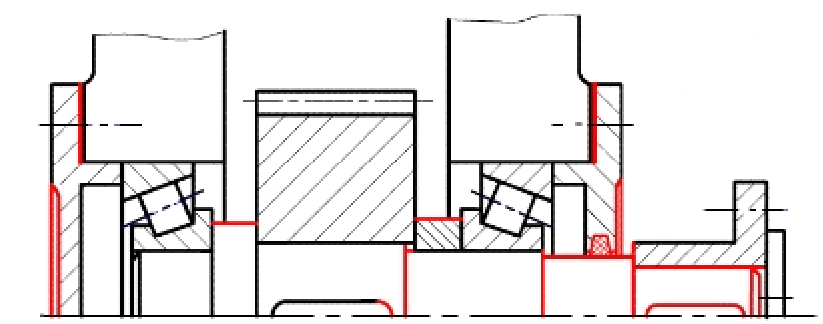
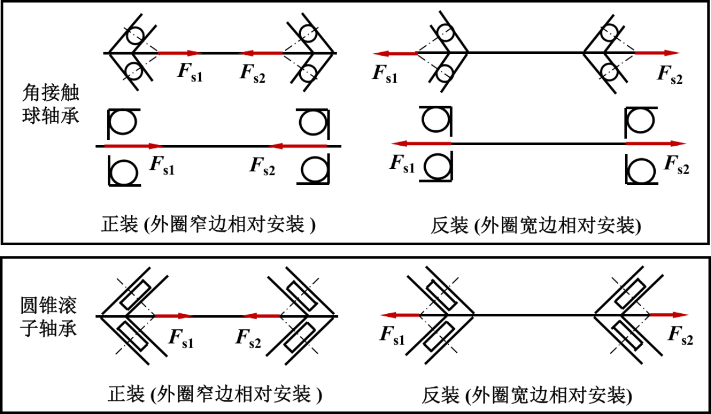
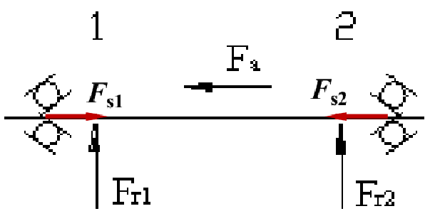
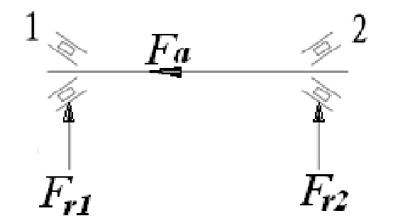
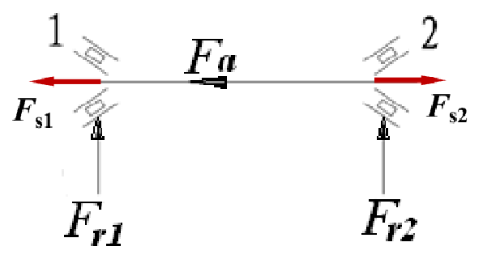

# 期中考试题型

### 选择题

课上强调的知识点

### 简答题

课后作业里的题目

### 计算题

1. 自由度的计算
2. 螺栓的强度计算
3. 齿轮的计算

### 受力分析题

多对齿轮的啮合（一般是两对）

# 期终考试题型

1. 选择题
2. 填空题（和选择题差不多）
3. 简答题
4. 计算题
5. 受力分析题

# 期终考试大纲

## 绪论

几个概念：机器、机构、构件、零件的概念及其特征，构件与零件的区别。

## 第一章 平面机构的自由度和速度分析

1. 平面运动副的定义，高副与低副有何区别？

2. 平面机构自由度的计算：
   
$$
F =3n-2P_L-P_H
$$

   式中各符号的含义，计算自由度时应注意复合铰链、局部自由度和虚约束。

3. 机构具有确定运动的条件：

$$
机构的原动件数=F\ 且\ F>0
$$

### 计算

平面机构自由度的计算：
$$
F =3n-2P_L-P_H
$$

#### 问题1：复合铵链

定义——两个以上构件在同一处以转动副相连接，则构成复合饺链。

处理办法—— $m$ 个构件（包括固定构件）在同一处构成转动副，实际转动副数目为 $(m-1)$ 个。

#### 问题2：局部自由度

定义——不影响其它构件运动的白由度称为局部自由度。

处理办法——把滚子固化在支承滚子的构件上。

#### 问题3：虚约束

定义——对机构运动不起独立限制作用的约束称为虚约束。

处理办法——将构成虚约束的构件连同其所附带的运动副去掉不计。

##### 几种典型的复合铰链：

##### 局部自由度：

##### 几种常见的虚约束情况：

#### 「例」：

$$
\begin{align}
\because\ &n=8\\
&P_L=11\\
&P_H=1\\
\therefore\ &3n-2P_L-P_H=24-22-1=1\\
&机构的原动件数＝F，机构具有确定运动
\end{align}
$$

## 第二章 平面连杆机构

1. 平面四杆机构的基本类型：

   铰链四杆机构

   * 曲柄摇杆机构（雷达天线机构）
   * 双曲柄机构（惯性筛机构）
   * 双摇杆机构（鹤式起重机）

2. 曲柄摇杆机构及其演化而来的平面四杆机构的**特性**：急回特性（行程速比系数 $k$ ）和死点位置。

## 第三章 凸轮机构

1. 凸轮机构的分类：

$$
\begin{cases}
按凸轮形状分
\begin{cases}
盘形凸轮\\
移动凸轮\\
圆柱凸轮(空间凸轮机构)
\end{cases}\\
按从动件的型式分
\begin{cases}
尖顶从动件\\
滚子从动件\\
平底从动件\\
\end{cases}
\end{cases}
$$

   每种凸轮机构的优缺点。

2. 从动件的常用运动规律：

   等速运动、等加速等减速运动、摆线运动，每种运动规律的位移、速度、加速度线图及其有何特征（刚性冲击和柔性冲击）？

$$
\begin{align}
&等速运动&刚性冲击\\
&等加速等减速运动&柔性冲击\\
&摆线运动&无冲击
\end{align}
$$

3. 按给定从动件运动规律绘制凸轮轮廓：利用反转法的原理，用图解的方法绘制凸轮轮廓。（作图步骤）

## 第四章 间歇运动机构

1. 几种常用的间歇运动机构：槽轮机构、棘轮机构、不完全齿轮机构和凸轮间歇运动机构的组成、工作原理及其运动特点。
2. 槽轮机构的主要参数：槽数、圆销数及槽轮的运动系数。

## 第五章 机械的调速和平衡

1. 机械调速的目的和方法？

   调速的目的：减小机器主轴运转的速度波动。

   * 周期性速度波动的调节：加装一转动惯量很大的**飞轮**，为了减小飞轮的转动惯量，宜将飞轮安装在机器中**转速较高的轴**上。
   * 非周期性速度波动的调节：驱动功持续大于或小于阻力功，不能利用飞轮调速，必须用**专用机构——调速器**。

2. 机器主轴速度波动的大小由何参数表示？

   机械运转**速度不均匀系数**。

3. 机械平衡的目的和方法：
   
   平衡的**目的**：为了减小和消除各构件的惯性力所引起的运动副中动压力和振动而采取改变构件质量分布的措施。
   
   平衡的方法：对转动构件可以采用重新分布其质量，使其所有惯性力组成一平衡力系。

$$
\begin{align}
&静平衡:\Sigma F=0\\
&动平衡:\Sigma F=0\quad\Sigma M=0
\end{align}   
$$

**注意**：满足动平衡一定满足静平衡，反之则不一定。

## 第六章 机械零件设计和计算概论

1. 机械零件的主要要求

   要有足够的强度和刚度，有一定的耐磨性、无强烈的振动以及具有耐热性。

2. 机械零件工作能力准则

   最主要的是强度、刚度、耐磨性、温度以及振动稳定性准则。强度条件表达式为： $\sigma\leq[\sigma]$ 。

3. 许用应力

$$
\begin{array}{c|c}
\hline 静应力&变应力\\
\hline 塑性材料[\sigma]=\frac{\sigma_s}S&对称循环(疲劳)应力[\sigma_{-1}]=\frac{\varepsilon_\sigma\beta\sigma_{-1}}{k_\sigma S}\\
\hline 脆性材料[\sigma]=\frac{\sigma_B}S&脉动循环(疲劳)应力[\sigma_{0}]=\frac{\varepsilon_\sigma\beta\sigma_{0}}{k_\sigma S}\\
\hline
\end{array}
$$

|         机械零件         |                           失效形式                           |                     设计准则                     |
| :----------------------: | :----------------------------------------------------------: | :----------------------------------------------: |
|   受拉螺栓（普通螺栓）   |                    螺栓杆螺纹部分发生断裂                    |           保证螺栓的静力或疲劳拉伸强度           |
| 受剪螺栓（铰制孔用螺栓） |          螺栓杆和孔壁的贴合面出现压溃或螺栓杆被剪断          |        保证连接的挤压强度和螺栓的剪切强度        |
|  静连接（普通平键连接）  |                         工作面被压溃                         |               保证工作面的挤压强度               |
| 动连接（导向平键、滑键） |                        工作面过度磨损                        |                 保证工作面的压力                 |
|          带传动          |                        打滑、疲劳破坏                        |      保证带不打滑的情况下具有一定的疲劳强度      |
|          链传动          | 链的疲劳破坏、滚子套筒冲击疲劳破坏、链条铰链胶合、链条铰链磨损、静力拉断 |         保证链传递的功率不超过其额定功率         |
|    闭式硬齿面齿轮传动    |                           轮齿折断                           |       按弯曲疲劳强度设计、接触疲劳强度校核       |
|    闭式软齿面齿轮传动    |                           齿面点蚀                           |       按接触疲劳强度设计、弯曲疲劳强度校核       |
|       开式齿轮传动       |                           齿面磨损                           |      按弯曲疲劳强度设计、将模数加大10%-15%       |
|       闭式蜗杆传动       |                      齿面胶合、齿面点蚀                      | 按接触疲劳强度设计、弯曲疲劳强度校核、热平衡计算 |
|       开式蜗杆传动       |                      齿面磨损、轮齿折断                      |                按弯曲疲劳强度计算                |
|         滑动轴承         |                          磨损、胶合                          |         边界膜不破裂 $(p≤[p], pv ≤[pv])$         |
|         滚动轴承         |                      疲劳点蚀、塑性变形                      |               寿命计算、静强度计算               |

## 第七章 连接

1. 普通螺栓连接、双头螺柱连接及螺钉连接的特点及应用场合。
2. 螺纹自锁的条件。
3. 螺纹连接防松的原因及防松装置类型及举例。
4. 螺栓连接的强度计算：松螺栓连接、紧螺栓连接（受横向载荷、受轴向载荷；普通螺栓、铵制孔用螺栓）的计算。（**重点**）
5. 键连接：不同连接类型键的工作面；键尺寸的选择依据；键连接的强度（主要失效形式——工作面压溃，键被剪断）。

### 计算

#### 螺栓受力计算：

* 受横向载荷的螺栓联接（紧螺栓连接）

  

  * 校核式：
    
$$
\sigma'=\frac{1.3F_s}{\pi d_1^2/4}\leq[\sigma]
$$

  * 设计式：
    
$$
d_1\geq\sqrt{\frac{4\times1.3F_s}{\pi[\sigma]}}
$$

* 问题：预紧力 $F_s$ 应满足的条件？与横向载荷 $F$ 有何关系？
  
$$
fF_szm\geq1.2F\Longrightarrow F_s\geq\frac{1.2F}{fzm}
$$

  其中： $m$ 为接触面数， $z$ 为螺栓个数。

* **「例」**：用两个M16的受拉普通螺栓将构件1联接在固定件2上，已知：螺栓材料为45钢，其许用应力为 $[\sigma]=120MPa$ ，螺栓小径 $d_1=13.835mm$ ，两构件接合面间的摩擦系数 $f=0.15$ ，求构件1上所能承受的最大拉力 $F$ 。

  

  解：

$$
\begin{align}
&根据强度准则\ \frac{1.3F_s}{\pi d_1^2/4}\leq[\sigma]\\
\therefore\ &F_s\leq\frac{\frac\pi4d_1^2[\sigma]}{1.3}=\frac{\frac\pi4\times13.835^2\times120}{1.3}=13.87kN\\
\because\ &为使被连接零件不出现相对滑动及连接可靠,应满足:\\
&fF_smz\geq1.2F\\
\therefore\ &F\leq\frac{fF_smz}{1.2}=\frac{0.15\times13.87\times2\times2}{1.2}=6.9kN
\end{align}
$$

## 第八章 带传动和链传动

1. 带传动的工作原理：摩擦力

2. 受力分析：紧边拉力、松边拉力不等

   带所能传递的最大圆周力与初拉力、摩擦系数和包角有关：
   
$$
F_\max=2F_0\frac{1-\frac{1}{e^{f\alpha}}}{1+\frac{1}{e^{f\alpha}}}
$$

3. 应力分析：最大应力出现在紧边进入小带轮处。

4. 带的运动分析：什么是带的弹性滑动现象？引起的后果是什么？与打滑有何不同？能否避免，如何避免？小带轮与大带轮哪个更容易发生打滑现象？

   |          | 弹性滑动                                                     | 打滑                                                         |
   | -------- | ------------------------------------------------------------ | ------------------------------------------------------------ |
   | 发生原因 | 由于带的紧边和松边拉力不等，使带的两边弹性变形不等所引起带与带轮面的**微量相对滑动** | 当带传动所需传递的有效拉力超过带与带轮面间摩擦力的极限时（过载），带与带轮面在整个接触弧段发生**显著的相对滑动** |
   | 现象     | 局部带在局部轮面上发生弹性滑动                               | 整个带在整个轮面上发生滑动                                   |
   | 后果     | 使从动轮线速度低于主动轮，效率下降；引起带磨损；温度上升     | 使带失去稳定性，严重时无法继续工作，引起带严重磨损           |
   | 防止措施 | 带靠摩擦传动，弹性滑动是不可避免的。但是选用弹性模量大的材料可降低这种滑动（变形 $=F/(AE)$ ） | 为保证传动正常，应避免。要避免需保证 $F≤F_\max$ ，即要求摩擦系数、包角和初拉力应有足够的值 |

5. 带传动的主要失效形式及设计准则。

6. 带传动中中心距、传动比、带的速度和带轮直径对带传动的影响。

7. 带传动张紧的原因，常用的张紧装置，张紧轮的位置。

8. 滚子链的组成、链节数的选取。

9. 链传动的主要失效形式。

10. 链轮齿数、链节距及链轮中心距对链传动影响。

11. 链传动的合理布置。

## 第九章 齿轮传动

1. 齿轮传动的类型：

   * 平行轴——圆柱齿轮传动
   * 相交轴——圆锥齿轮传动
   * 交错轴——蜗杆传动

2. 渐开线齿廓的形成及其特性（如离基圆中心越远渐开线上点的压力角越大），中心距具有可分性的含义；

3. 渐开线标准齿轮基本尺寸的计算：
   
$$
z, m, \alpha, h_a^*, c^*,d_a, d_f, d, p, s, e, a
$$

4. 一对渐开线齿轮：

   啮合过程；正确啮合条件；连续传动条件（重合度的意义）。

5. 齿轮的加工方法（仿形法、范成法的原理）及范成法加工齿轮时产生根切现象的原因、根切引起的后果、避免根切的方法。

6. 齿轮的常用材料。软、硬齿面的区别，软齿面齿轮大小、齿轮硬度、轮齿宽度的关系及原因。

7. 齿轮的主要失效形式：轮齿折断、齿面磨粒磨损、齿面点蚀、齿面胶合、（塑性变形）。

8. 闭式硬齿面齿轮、闭式软齿面齿轮传动和开式齿轮传动的主要失效形式、设计准则分别是什么；

9. 圆柱齿轮传动的设计计算：

   注意——两啮合齿轮的接触强度相同，但弯曲强度不同；

10. 直齿齿轮的接触和弯曲疲劳强度公式的应用

    如，为提高轮齿的弯曲疲劳强度，哪些措施有效；判断齿轮强度是否满足要求；计算齿轮传动所能传递的最大转矩、最大功率等。

11. 直（斜）齿圆柱齿轮、锥齿轮作用力的分析：各力的大小及方向判断；

12. 斜齿轮正确啮合的条件；螺旋角大小对斜齿轮啮合的影响；

13. 斜齿圆柱、锥齿轮的主要参数、当量齿轮与当量齿数的含义及其与实际齿轮齿数的关系；

14. 斜齿圆柱、锥齿轮的标准参数：斜齿轮以法面参数为标准参数；锥齿轮以大端参数为标准参数。

### 计算

#### 齿轮尺寸的计算：

外啮合标准直齿圆柱齿轮尺寸参数： 
$$
\begin{array}{l}
d=m z \\
d_{\mathrm{a}}=d+2 h_{\mathrm{a}}=\left(z+2 h_{\mathrm{a}}^{*}\right) m \\
d_{\mathrm{f}}=d-2 h_{\mathrm{f}}=\left(z-2 h_{\mathrm{a}}^{*}-2 c^{*}\right) m \\
d_{\mathrm{b}}=d \cos \alpha \\
h_{\mathrm{a}}=h_{\mathrm{a}}^{*} m \\
h_{\mathrm{f}}=\left(h_{\mathrm{a}}^{*}+c^{*}\right) m \\
h=h_{\mathrm{a}}+h_{\mathrm{f}}=\left(2 h_{\mathrm{a}}^{*}+c^{*}\right) m \\
p=\pi m \\
s=e=0.5 p
\end{array}
$$

* **「例」**：已知一对外啮合标准直齿圆柱齿轮传动的标准中心距 $a＝150mm$ ，传动比 $i_{12}=4$ ，小齿轮齿数 $z_1=20$ 。试确定这对齿轮的模数 $m$ 和大齿轮的齿数 $z_2$ 、分度圆直径 $d_1$ 、 $d_2$ 、齿顶圆直径 $d_{a1}$ 、 $d_{a2}$ 、齿根圆直径 $d_{f1}$ 、 $d_{f2}$ 。

  解：

$$
\begin{align}
z_{2}&=i_{12} z_{1}=4 \times 20=80 \\
m&=\frac{2 a}{z_{1}+z_{2}}=\frac{2 \times 150}{20+80}=3 \mathrm{~mm} \\
d_{1}&=m z_{1}=3 \times 20=60 \mathrm{~mm} \\
d_{2}&=m z_{2}=3 \times 80=240 \mathrm{~mm} \\
d_{\mathrm{a} 1}&=d_{1}+2 m h_{\mathrm{a}}^{*}=60+2 \times 3=66 \mathrm{~mm} \\
d_{\mathrm{a} 2}&=d_{2}+2 m h_{\mathrm{a}}^{*}=240+2 \times 3=246 \mathrm{~mm} \\
d_{\mathrm{f} 1}&=d_{1}-2 m\left(h_{\mathrm{a}}^{*}+c^{*}\right)=60-7.5=52.5 \mathrm{~mm} \\
d_{\mathrm{f} 2}&=d_{2}-2 m\left(h_{\mathrm{a}}^{*}+c^{*}\right)=240-7.5=232.5 \mathrm{~mm}
\end{align}
$$

#### 齿轮强度的计算：

对一般工况下的齿轮传动，其设计准则是：

* 保证足够的齿根弯曲疲劳强度，以免发生齿根折断。
* 保证足够的齿面接触疲劳强度，以免发生齿面点蚀。

|    齿轮工作条件    |   主要失效形式   | 设计准则                                                     |
| :----------------: | :--------------: | :----------------------------------------------------------- |
| 软齿面闭式齿轮传动 |     齿面点蚀     | 按齿面接触疲劳强度 设计校核齿根弯曲疲劳强度 |
|硬齿面闭式齿轮传动                   |轮齿折断|按齿根弯曲疲劳强度设计 校核齿面接触疲劳强度|
| 开式齿轮传动 |     磨粒磨损 轮齿折断     | 只按齿根弯曲疲劳强度设计 考虑磨损对齿厚的影响，将求得的模数 $m$ 增大 $10\%～15\%$ 。 |

##### 一、接触疲劳强度计算

$$
\begin{align}
校核公式:&~\sigma_{\mathrm{H}}=\frac{335}{a} \sqrt{\frac{(i+1)^{3} K T_{1}}{i b}} \leq\left[\sigma_{\mathrm{H}}\right]\\
设计公式:&~a \geq 48(i+1) \sqrt[3]{\frac{K T_{1}}{i \psi_{\mathrm{a}}\left[\sigma_{\mathrm{H}}\right]^{2}}}
\end{align}
$$

##### 二、弯曲疲劳强度的计算

$$
\begin{align}
校核公式:&~ \sigma_{\mathrm{F}}=\frac{2 K T_{1} Y_{\mathrm{F}}}{b d_{1} m}=\frac{2 K T_{1} Y_{\mathrm{F}}}{b z_{1} m^{2}} \leq\left[\sigma_{\mathrm{F}}\right]\\
设计公式:&~ m \geq \sqrt[3]{\frac{4 K T_{1} Y_{\mathrm{F}}}{\psi_{\mathrm{a}} z_{1}^{2}(i+1)\left[\sigma_{\mathrm{F}}\right]}}
\end{align}
$$

1.  $b=\min\{b_1, b_2\}~;~\psi_a=\frac ba$ 
2. 无论计算哪个齿轮，公式中的 $T_1、z_1、d_1$ 不变；
3. 接触疲劳强度设计计算时取 $[σ_H]=\min\{[σ_H]_1, [σ_H]_2\}$ 。
4. 弯曲疲劳强度设计计算时取 $\frac{Y_{\mathrm{F}}}{\left[\sigma_{\mathrm{F}}\right]}=\max \left\{\frac{Y_{\mathrm{F} 1}}{\left[\sigma_{\mathrm{F}}\right]_{1}}, \frac{Y_{\mathrm{F} 2}}{\left[\sigma_{\mathrm{F}}\right]_{2}}\right\}$ 

* **「例1」**：一对直齿圆柱齿轮传动，已知 $m=3mm$ ， $b_1=95mm$ ， $b_2=90mm$ ， $z_1=32$ ， $z_2=118$ ， $Y_{F1}=2.57$ ， $Y_{F2}=2.18$ ， $K=1$ ， $T_1=20000N\cdot mm$ ， $[σ_{F1}]=185N/mm^2$ ， $[σ_{F2}]=138N/mm^2$ ，试判断两齿轮是否满足强度要求（答案应有数字代入过程，否则不给分）。

  注： $\sigma_{\mathrm{F}}=\frac{2 K T_{1} Y_{\mathrm{F}}}{b z_{1} m^{2}}$

  解：
  

$$
\begin{aligned}
&\sigma_{\mathrm{F} 1}=\frac{2 K T_{1} Y_{\mathrm{F} 1}}{b_{2} z_{1} m^{2}}=\frac{2 \times 1 \times 20000 \times 2.57}{90 \times 32 \times 3^{2}}=3.966 \mathrm{MPa} \leq\left[\sigma_{\mathrm{F} 1}\right] \\
&\sigma_{\mathrm{F} 2}=\frac{2 K T_{1} Y_{\mathrm{F} 2}}{b_{2} z_{1} m^{2}}=\frac{2 \times 1 \times 20000 \times 2.18}{90 \times 32 \times 3^{2}}=3.364 \mathrm{MPa} \leq\left[\sigma_{\mathrm{F} 2}\right]\\
&故，两齿轮均满足强度要求。
\end{aligned}
$$

* **「例2」**：一对闭式软齿面直齿圆柱齿轮，已知： $z_1=20$ ， $z_2=60$ ， $m=3mm$ ， $b_1=65mm$ ， $b_2=60mm$ ，小齿轮转速 $n_1=950r/min$ 。主、从动齿轮的 $[σ_H]_1=700MPa$ ， $[σ_H]_2=650MPa$ ； $[σ_F]_1=190MPa$ 、 $[σ_F]_2=148MPa$ ， $Y_{F1}=2.79$ ， $Y_{F2}=2.28$ ；载荷系数 $K=1.6$ 。求该齿轮传动所能传递的功率。

  注： $\sigma_{\mathrm{H}}=\frac{335}{a} \sqrt{\frac{K T_{1}(i+1)^{3}}{b i}} \leq\left[\sigma_{\mathrm{H}}\right], \quad \sigma_{\mathrm{F}}=\frac{2 K T_{1} Y_{\mathrm{F}}}{b m^{2} z_{1}} \leq\left[\sigma_{\mathrm{F}}\right]$ 

  解：

  *因为是闭式的软齿面齿轮，所以该对齿轮的接触疲劳强度差，故按接触疲劳强度进行计算该对齿轮传递的最大功率* 

$$
\begin{align}
&i=\frac{n_1}{n_2}=\frac{z_2}{z_1}=\frac{60}{20}=3\\
&a=\frac{m(z_1+z_2)}2=\frac{3\times(20+60)}2=120mm\\
\because\ &\sigma_H=\frac{335}a\sqrt\frac{KT_1(i+1)^3}{bi}\leq[\sigma_{H2}]\\
\therefore\ &T_1\leq\left(\frac{[\sigma_{H2}]a}{335}\right)^2\frac{bi}{K(i+1)^3}=\left(\frac{650\times120}{335}\right)^2\frac{60\times3}{1.6\times(3+1)^2}=95295.44N\cdot m\\
\therefore\ &P=\frac{T_1n_1}{9.55\times10^6}=\frac{95295.44\times950}{9.55\times10^6}=9.48kW
\end{align}
$$

* **「例3」**：有一对闭式标准直齿圆柱齿轮，材料为45号钢，硬齿面，齿数 $z_1=20$ ， $z_2=80$ ， $m =3mm$ ，小齿轮宽度 $b_1=60mm$ ，大齿轮宽度为 $b_2=55mm$ ，载荷系数 $K=1.4$ ， $Y_{F1}=2.8$ ， $Y_{F2}=2.22$ ，许用应力 $[σ_H]_1=[σ_H]_2=1270MPa$ ， $[σ_F]_1=[σ_F]_2=300MPa$ ， $n_1=240r/min$ ，求该对齿轮所能传递的最大功率 $P$ 。

  注： $a \geq 48(i+1) \cdot \sqrt[3]{\frac{K T_{1}}{i \psi_{\mathrm{a}}\left[\sigma_{\mathrm{H}}\right]^{2}}} \mathrm{~mm}, \quad m \geq \sqrt[3]{\frac{4 K T_{1} Y_{F}}{\psi_{\mathrm{a}}(i+1) z_{1}^{2}\left[\sigma_{\mathrm{F}}\right]}} \mathrm{~mm}$ 

  解：

  *因为是闭式的硬齿面齿轮，所以该对齿轮的弯曲疲劳强度差，故按弯曲疲劳强度进行计算该对齿轮传递的最大功率。* 

$$
\begin{align}
&i=\frac{z_2}{z_1}=\frac{80}{20}=4\\
&a=\frac{m(z_1+z_2)}2=\frac{3\times(20+80)}2=150mm\\
&\psi_a=\frac ba=\frac{55}{150}=\frac{11}{30}\\
\because\ &m\geq\sqrt[3]\frac{4KT_1Y_F}{\psi_a(i+1)z_1^2[\sigma_F]}\\
\therefore\ &T_1\leq\frac{m^3\psi_a(i+1)z_1^2[\sigma_F]_1}{4KY_{F1}}=\frac{3^{3} \times \frac{11}{30} \times(4+1) \times 20^{2} \times 300}{4 \times 1.4 \times 2.8}=378826.53 \mathrm{~N} \cdot \mathrm{mm} \\
\therefore\ &P \leq \frac{T_{1} n_{1}}{9.55 \times 10^{6}}=\frac{378826.53 \times 240}{9.55 \times 10^{6}}=9.52 \mathrm{~kW}
\end{align}
$$

#### 齿轮受力分析：

| 齿轮组形式 | 转向关系                                   | 旋向关系 | 径向力 $F_r$     | 周向力 $F_t$                       | 轴向力 $F_a$                                            |
| ---------- | ------------------------------------------ | -------- | ---------------- | ---------------------------------- | ------------------------------------------------------- |
| 平面斜齿轮 | 相反                                       | 相反     | 分别指向各自轮心 | 与主动轮转向相同、与从动轮转向相反 | $F_{a1}$ 根据左右手定则判断， $F_{a2}$ 与 $F_{a1}$ 相反 |
| 斜齿锥齿轮 | 相反                                       | 无       | 分别指向各自轮心 | 与主动轮转向相同、与从动轮转向相反 | 始终从啮合点由小端指向大端                              |
| 蜗轮蜗杆   | 蜗轮转向依据蜗杆旋向和转向依左右手定则判断 | 相同     | 分别指向各自轮心 | 与主动轮转向相同、与从动轮转向相反 | $F_{a1}$ 根据左右手定则判断， $F_{a2}$ 与 $F_{t1}$ 相反 |

**「例」**：图示为蜗杆、齿轮传动装置，已知主动斜齿轮1的转向 $n_1$ 和蜗杆5的旋向。今欲使轴Ⅱ上传动件轴向力相抵消，试确定：

1. 斜齿轮1、2轮齿的旋向；
2. 蜗轮6的转向及其旋向；
3. 用图表示轴Ⅱ上传动件的受力情况（用各分力表示）。

## 第十章 蜗杆传动

1. 蜗杆传动传递空间两交错轴间的运动和动力，蜗杆传动的优缺点；
2. 蜗杆传动几何参数：为减小滚刀的规格数量规定蜗杆的分度圆直径为标准值；
3. 蜗杆传动正确啮合的条件（模数、压力角、导程角）、传动比、相对滑动速度、功率损耗组成、材料；
4. 蜗杆传动的受力分析；设计准则;
5. 热平衡计算（原因与措施）。

## 第十一章 轮系

1. 轮系的分类：
   * 定轴轮系
   * 行星轮系
2. 传动比的计算（大小计算及方向判断）；
3. 惰轮（过桥齿轮）的概念；
4. 轮系的功用：可获得大的传动比；可连接相距较远的两轴；可获得多种传动比的传动；可改变从动轴的转向。

### 计算

#### 轮系传动比计算：

**大小**： $i_{1k}=\frac{n_1}{n_k}=\frac{从动齿轮齿数连乘积}{主动齿轮齿数连乘积}$ 

**转向**：1、画箭头法（适合任何定轴轮系）；2、 $(-1)^m$ 法（只适合所有齿轮轴线都平行的情况）

**结果表示**： $i_{1k}=\frac{n_1}{n_k}=\pm\frac{所有从动齿轮齿数连乘积}{所有主动齿轮齿数连乘积}$ （输入、输出轴平行）；图中画箭头表示（其它情况）

**「例」**：图示轮系，已知 $z_1=18$ 、 $z_2=20$ 、 $z_2'=25$ 、 $z_3=25$ 、 $z_3'=2$ （右旋）， $i_{ab}=25$ 。（1）求 $z_4=?$ （2）在图上标出各轮转向。

解：（1）
$$
\begin{align}
i_{\mathrm{ab}}=\frac{z_{2} z_{3} z_{4}}{z_{1} z_{2^{\prime}} z_{3^{\prime}}}=\frac{20 \times 25 \times z_{4}}{18 \times 25 \times 2}=25 \\
\Rightarrow z_{4}=\frac{25 \times 18 \times 25 \times 2}{20 \times 25}=45
\end{align}
$$
（2）

## 第十二章 轴

1. 轴的分类：

   * 心轴
   * 转轴
   * 传动轴

   如何判断轴的类型

2. 轴的材料、结构（轴头、轴颈、轴身）；轴上零件的轴向、周向定位方法；轴系改错；

3. 轴的强度计算：

   * 按扭转强度计算；
   * 按弯扭合成强度计算。

   （当量弯矩计算中折合系数 $\alpha$ 的含义及取值）

$$
d=C\sqrt[3]{\frac Pn}\qquad d\geq\sqrt[3]{\frac{M'}{0.1[\sigma_{-1b}]}}
$$

#### 轴系改错

##### 一、轴本身的常见结构错误：

（1）轴段的长度必须小于轮毂的长度；

（2）必须考虑轴上零件的轴向、周向固定问题；

（3）轴外伸处应考虑密封问题。

##### 二、轴承安装的常见错误：

（1）角接触轴承和圆锥滚子轴承

* 一定要成对使用；
* 方向必须正确，必须正装或反装；
* 外圈定位（固定）边一定是宽边。

（2）轴承内外圈的定位必须注意内外圈的直径尺寸问题

* 内圈的外径一定要大于固定结构的直径；
* 外圈的内径一定要小于固定结构的直径。

（3）轴上如有轴向力时，必须使用能承受轴向力的轴承。

（4）轴承必须考虑密封问题；

##### 三、键槽的常见错误：

（1）同一轴上所有键槽应在一个对称线上；

（2）键槽的长度必须小于轴段的长度；

##### 四、轴承端盖的常见错误

（1）对于角接触和圆锥滚子轴承，轴承端盖一定要顶在轴承的大端；

（2）轴承端盖为透盖时，必须和轴有间隙，同时必须考虑密封问题。

##### 五、螺纹的常见错误

（1）轴上螺纹应有螺纹退刀槽;

（2）紧定螺钉应该拧入轴上被联接零件，端部应顶在轴上;

**「例」**：试指出图中结构不合理的地方，并予以改正。

1. 轴承端盖端面加工面过大；
2. 应加调整垫片，箱体加工面与非加工面应分开；
3. 轴肩过高，不便于轴承拆卸；
4. 键过长，并且与半联轴器处的键不在同一方位；
5. 轴头配合长度等于齿轮轮毂宽度，齿轮定位不可靠；
6. 套筒厚度太大，不便于轴承拆卸；
7. 装配段不宜过长，设置非定位轴肩；
8. 轴承盖与轴应有间隙，并设有密封件；
9. 联轴器顶住端盖，产生摩擦磨损，应设计一定位轴肩；
10. 键槽应与齿轮处键槽设置在同一方位上，且键顶部与轮毂键槽之间应有间隙，键应局部剖开；
11. 轴的长度与联轴器宽相同，联轴器定位不可靠。

正确结构：

## 第十三章 轴承

1. 滚动轴承的组成、分类、特点及适用场合；
2. 滚动轴承代号的识别；
3. 滚动轴承的主要失效形式：疲劳点蚀、塑性变形；
4. 滚动轴承的寿命、当量动载荷与当量静载荷；
5. 向心推力轴承轴向载荷的计算；
6. 双支点单向固定和单支点双向固定的应用场合；
7. 滚动轴承的配合：内圈与轴为基孔制、外圈与孔为基轴制。

#### 轴承代号实例

* 6303
  * 公差等级为0级，0组游隙
  * 轴承内径 $d=17 mm$ 
  * 尺寸系列代号，宽度系列为0，直径系列为3(中)系列 
  * 轴承类型代号，6为深沟球轴承
* 7312AC/P6
  * 公差等级为6级
  * 内部结构代号，AC表示接触角 $\alpha=25\degree$ 
  * 轴承内径 $d=12×5=60mm$ 
  * 宽度系列为0，直径系列为3(中)系列
  * 轴承类型代号，7为角接触球轴承
* 30213
  * 公差等级为0级
  * 轴承内径 $d=65mm$ 
  * 直径系列为2
  * 宽度系列为0系列(正常系列)
  * 圆锥滚子轴承
* N105/P5
  * 公差等级为5级
  * 轴承内径 $d=25mm$ 
  * 直径系列为1(正常宽度系列)
  * 圆柱滚子轴承

#### 向心推力轴承轴向力及寿命计算

向心推力轴承安装的简化画法及其附加轴向力的方向：

#### 角接触球轴承、圆锥滚子轴承所受轴向力的计算

$$
\begin{array}{c}
已知轴系所受外载荷\\
\Downarrow\\
受力分析\\
\Downarrow\\
确定派生轴向力\\
\Downarrow\\
确定被压紧和被放松轴承\\
\Downarrow\\
确定轴向力
\end{array}
$$

$F_a$ 的计算既要考虑所有作用在轴上的轴向外载荷 $F_{ae}$ ，又要考虑由 $F_r$ 所产生的派生轴向力 $F_s$ 。

* 当 $F_{ae}+F_{s2}>F_{s1}$ 时，

  轴有左移趋势，轴承1被“压紧”，轴承2被“放松”。

  被压紧轴承1： $F_{a1}=F_{s1}+F_{b}=F_{ae}+F_{s2}$ 
  
  被放松轴承2： $F_{a2}=F_{s2}$ 

* 当 $F_{ae}+F_{s2}<F_{s1}$ 时，

  轴有右移趋势，轴承2被“压紧”，轴承1被“放松”。

  被压紧轴承2： $F_{a2}=F_b+F_{s2}=F_{s1}-F_{ae}$ 
  
  被放松轴承1： $F_{a1}=F_{s1}$ 

##### 注意：

* 轴承的派生轴向力——方向与轴承大口方向一致。
* 被放松轴承——全部轴向力合力的方向与它的大口开口方向相同。
* 被压紧轴承——全部轴向力合力的方向与它的大口开口方向相反。

#### 滚动轴承寿命计算

$$
\begin{align}
由力分析确定轴&承所承受的F_r与F_a\\
&\Downarrow\\
计算当量动载荷\quad &P=f_P(XF_r+YF_a)\\
&\Downarrow\\
计算轴承的寿命\quad L_{h10}=&\frac{10^6}{60n}\left(\frac CP\right)^\varepsilon=\frac{16667}n\left(\frac CP\right)^\varepsilon\\
&\Downarrow\\
当L_{h10}\geq L_{h10'}&时，则满足使用要求\\ 
&\Downarrow\\
计算轴承应满足的基本额定&动载荷\quad C=P\sqrt[\varepsilon]{\frac{60nL_h'}{10^6}}\quad [N]\\
&\Downarrow\\
由手册查取合适&的轴承\quad C_{手册}\geq C
\end{align}
$$

**「例1」**：图示由一对同型号和尺寸的角接触球轴承正安装支承的轴上，受有轴向力 $F_a=1200N$ ，轴承的径向载荷 $F_{r1}=1000N$ ， $F_{r2}=1500N$ ，内部轴向力 $F_{s1}=180N$ ， $F_{s2}=150N$ ， $e=0.68$ ， $f_p=1$ ，当 $Fa/Fr>e$ 时， $X=0.41$ 、 $Y=0.87$ ；当 $F_a/F_r≤e$ 时， $X=1$ ， $Y=0$ 。求：轴承当量动载荷 $P_1$ 和 $P_2$。

解：

$$
\begin{align}
&F_{\mathrm{a}}+F_{\mathrm{s} 2}=1200+150=1350 \mathrm{~N}>F_{\mathrm{s} 1}\\
&轴有左移趋势, 轴承1压紧, 轴承2放松\\
&F_{\mathrm{a} 1}=F_{\mathrm{a}}+F_{\mathrm{s} 2}=1350 \mathrm{~N} \\
&F_{\mathrm{a} 2}=F_{\mathrm{s} 2}=150 \mathrm{~N} \\
&\frac{F_{\mathrm{a} 1}}{F_{\mathrm{r} 1}}=\frac{1350}{1000}=1.35>e \\
&X_{1}=0.41, \quad Y_{1}=0.87 \\
&\frac{F_{\mathrm{a} 2}}{F_{\mathrm{r} 2}}=\frac{150}{1500}=0.1<e \\
&X_{2}=1, \quad Y_{2}=0 \\
&P_{1}=f_{\mathrm{p}}\left(X_{1} F_{\mathrm{r} 1}+Y_{1} F_{\mathrm{a} 1}\right)=0.41 \times 1000+0.87 \times 1350=1584.5 \mathrm{~N} \\
&P_{2}=f_{\mathrm{p}}\left(X_{2} F_{\mathrm{r} 2}+Y_{2} F_{\mathrm{a} 2}\right)=1 \times 1500+0 \times 150=1500 \mathrm{~N}
\end{align}
$$
**「例2」**：一轴上安装一对30208轴承，其安装方向如图所示，轴承受到的径向载荷分别为 $F_{r1}=2kN$ ， $F_{r2}=4kN$ ，派生轴向力 $F_s=F_r/(2Y)$ ， $Y =1.6$ ，求下列情况的各个轴承所受的轴向载荷 $F_{a1}$ 、 $F_{a2}$ 。

（1）轴向载荷 $F_a=1.2 kN$ ；

（2）轴向载荷 $F_a=0$ 。

解：

$$
\begin{align}
&F_{s1}=F_{r1}/(2Y)=2/(2\times1.6)=0.625kN\\
&F_{s2}=F_{r2}/(2Y)=4/(2\times1.6)=1.25kN
\end{align}
$$
（1）轴向载荷 $F_a=1.2kN$ 时，轴承2受紧，轴承1放松：
$$
\begin{align}
&F_{a1}=F_{s1}=0.625kN\\
&F_{a2}=F_{s1}+F_a=0.625+1.2=1.825kN
\end{align}
$$
（2）轴向载荷 $F_a=0 kN$ 时，轴承1受紧，轴承2放松：
$$
\begin{align}
&F_{a1}=F_{s2}=1.25kN\\
&F_{a2}=F_{s2}=1.25kN
\end{align}
$$

## 第十四章 联轴器与离合器

1. 联轴器与离合器两者的功能和区别；
2. 联轴器与离合器的选用、类型、应用场合。

# 问答题复习

1. 闭式软齿面齿轮传动在满足弯曲强度条件下，为什么宜将齿数选得多一些？开式齿轮传动又如何？

   因为齿数增多则齿轮工作平稳，在中心距一定时，齿数增多则模数减小，还能减小加工工时和提高加工精度。对于开式齿轮传动，为了保证轮齿有足够的弯曲强度，须适当减少齿数，对于标准齿轮一般不少于17。

2. 一对渐开线标准斜齿轮的正确啮合条件是什么？

   （1）这两个齿轮的模数和压力角分别相等

   （2）两个齿轮的螺旋角大小相等、方向相反

3. 选择斜齿圆柱齿轮的螺旋角β时应考虑哪些因素？

   螺旋角β大，重合度大，承载能力就大。但螺旋角β太大，产生很大的轴向力，增大轴承尺寸并降低效率；螺旋角β太小，则显示不出斜齿圆柱齿轮的优点。故一般采用螺旋角β=8°～20°。

4. 试述机器运转过程中产生周期性速度波动及非周期性速度波动的原因以及它们各自的调节方法。

   （1）由于等效力矩的周期性变化，使得机械的运转速度也发生周期性的波动，这种周期性的速度波动可通过在机械中安装具有较大转动惯量的飞轮进行调节。

   （2）在稳定运转过程中，由于某些原因使得驱动力所作的功突然大于阻抗力所作的功，或者阻抗力所作的功突然大于驱动力所作的功，两者在一个运转周期内作的功不再相等，破坏了稳定运转的平衡条件，这种非周期性的速度波动调速器进行调节。

5. 螺纹联接为什么要防松，防松方法有几种？各举两例。

   螺纹联接在冲击、振动和变载作用下，预紧力可能在某一瞬间消失，联接仍有可能松脱；温度变化较大而联接件与被联接件的温变差异较大时，联接也可能松脱。因此在设计时，就应考虑防松。防松方法一般有三类：

   * 第一类：摩擦力防松，例如弹筑垫圈，双螺母等。
   * 第二类：机械防松，例如槽形螺母和开口销、止动垫圈等。
   * 第三类：其它方法防松（破坏防松），例如冲击法、粘合法。

6. 机构具有确定运动的条件是什么？

   （1）机构的自由度大于零

   （2）机构的原动件的数目等于机构的自由度。

7. 闭式齿轮传动与开式齿轮传动的失效形式和设计准则有何不同？

   闭式齿轮传动：主要失效形式为齿面点蚀、轮齿折断和胶合。目前一般只进行接触疲劳强度和弯曲疲劳强度计算。开式齿轮传动：主要失效形式为轮齿折断和齿面磨损，磨损尚无完善的计算方法，故目前只进行弯曲疲劳强度计算，用适当增大模数的办法考虑磨损的影响。

8. 对于齿面硬度HBS≤350的一对齿轮传动，选取齿面硬度时，哪个齿轮的齿面硬度应高些？为什么？

   小齿轮的齿面硬度高。

   因为当小齿轮与大齿轮的齿面具有较大的硬度差，且转速又较高时，较硬的小齿轮齿面对较软的大齿轮齿面会起到明显的冷作硬化效应，从而大大提高大齿轮齿面的疲劳极限；而且小齿轮的转速比大齿轮的转速高，啮合的次数多，为了使大小齿轮达到等强度，故使小齿轮的齿面硬度比大齿轮的齿面硬度高30~50HBS。

9. 蜗杆传动热平衡不合格有什么改进措施？

   加散热片；蜗杆轴上加风扇；油池内加冷却水管

10. 带传动中，在什么情况下需采用张紧轮？张紧轮布置在什么位置较为合理？

    当中心距不能调节时，可采用张紧轮将带张紧。张紧轮一般应放在松边内侧，使带只受单向弯曲。同时张紧轮还应尽量靠近大轮，以免过分影响带在小轮上的包角。

11. 带传动中弹性滑动和打滑是怎样产生的？它们分别对带传动有何影响？

    （1）弹性滑动是由于紧边和松边的拉力不同，因而弹性变形也不等，从而造成带与带轮之间的微量滑动，称为弹性滑动，它是带传动正常工作的固有特性。打滑是由于随着有效拉力增大，弹性滑动的区段也将扩大，当弹性滑动的区段扩大到整个接触弧，带的有效拉力达到最大值，如果工作载荷进一步增大，带与带轮间将发生显著的相对滑动，这称为打滑。打滑是带传动的失效形式之一。

    （2）弹性滑动造成带传动的传动比不为常数，它是不可避免的。打滑使带的磨损加剧，从动轮的转速急剧降低，甚至使传动失效，它是应当避免的。

12. 带传动为什么必须要张紧？常用的张紧装置有哪些？

    因为带传动是靠带与带轮之间的摩擦力来传递运动和动力的，如果不张紧，摩擦力小，传递的功率小，甚至出现打滑失效，加之由于带都不是完全的弹性体，工作一段时间以后，带由于发生塑性变形而松弛，为了保证带传动正常工作，必须要把带张紧；

    常见的张紧装置有：（1）定期张紧装置：滑道式张紧装置、摆架式张紧装置。（2）自动张紧装置。（3）采用张紧轮的装置。

13. 请说明下列滚动轴承代号的意义

    （1）6208 （GB/T 272 -93）

    （2）30310（GB/T 272 -93）

    * （1）内径为40mm，轻（2）系列，普通级公差的深沟球轴承
    * （2）内径为50mm，中（3）系列，普通级公差的圆锥滚子轴承

14. 说明下列滚动轴承的意义

    6208 (GB272/T-93)；7305C/P2 (GB272/T-93)

    * 6208表示内径为40mm，深沟球轴承，尺寸系列为02，0级公差
    * 7305C/P2表示内径为25mm，角接触球轴承，尺寸系列为03，5级公差，接触角为150

15. 联轴器和离合器的区别是什么？各适用于什么场合？

    联轴器和离合器都是用来联接两轴，使其一起转动并传递扭矩。它们的区别是：用联轴器联接的两根轴，只有在机器停车后，经过拆卸才能把它们分离。主要用于两轴不需要经常分离的场合。离合器联接两根轴在机器工作时就能方便地使它们分离或接合。

16. 试述直齿圆柱齿轮传动失效形式有哪些？并说明闭式硬齿面齿轮传动的设计准则是什么？
    * 失效形式有：轮齿的折断、齿面的点蚀、齿面的磨损、齿面的胶合、塑性变形
    * 闭式硬齿面齿轮传动的设计准则是：按弯曲疲劳强度计算、接触疲劳强度校核

# 计算题复习

1. 一个起重机的卷筒， $W=60kN,z=8,f=0.12,[\sigma]=240MPa$ ，求螺栓最小直径及预紧力。

   
   $$
   \begin{align}
   \because &\ \sigma=\frac{1.3F_s}{\frac14\pi d_1^2}\leq[\sigma]\\
   &mzf\cdot f_s>1.2F\\
   &60\times\frac{400}2=F\cdot\frac{500}2\\
   \therefore &\ F=48kN\\
   \therefore
   &\ \begin{cases}
   d=20.34mm\\
   f_s=60kN
   \end{cases}
   \end{align}
   $$

2. 一对闭式软齿面，  
   $$
   m=5mm,b_1=70mm,b_2=65mm,z_1=22,z_2=88,\\
   Y_{F1}=2.72,Y_{F2}=2.22,K=1.3,n_2=200r/\min,\\ [\sigma_{H1}]=534MPa,[\sigma_{H2}]=436MPa,\\ [\sigma_{F1}]=184MPa,[\sigma_{F2}]=156MPa\\
   \sigma_H=\frac{335}{a}\sqrt{\frac{KT_1}b\cdot\frac{(i+1)^3}i}
   $$
   带式运输机，求最大功率 $P$ 及齿面弯曲应力。

   解：
   $$
   \begin{align}
   &P_1=\frac{T_1n_1}{9.55\times10^6}\quad kW\\
   &i=\frac{n_1}{n_2}=\frac{z_2}{z_1}=4\\
   \because\ & \sigma_H=\frac{335}{a}\sqrt{\frac{KT_1}b\cdot\frac{(i+1)^3}i}\leq[\sigma_{H2}]\\
   &a=\frac{m(z_1+z_2)}2\\
   &b\ 取\ b_2\\
   \therefore\ & 
   	\begin{cases}
   	T_1=204959.82N\cdot mm\\
   	n_1=4n_2=800r/min\\
   	P=\frac{204959.82\times800}{9.55\times10^6}=17.17kW
   	\end{cases}\\
   \because\ &\frac{Y_{F1}}{[\sigma_{F_1}]}>\frac{Y_{F2}}{[\sigma_{F2}]}\\
   \therefore\ &\sigma_{F1}=\frac{2KT_1Y_{F1}}{b_2z_1m^2}=40.54MPa\\
   &\sigma_{F2}=\frac{2KT_1Y_{F2}}{b_2z_1m^2}=33.09MPa
   \end{align}
   $$