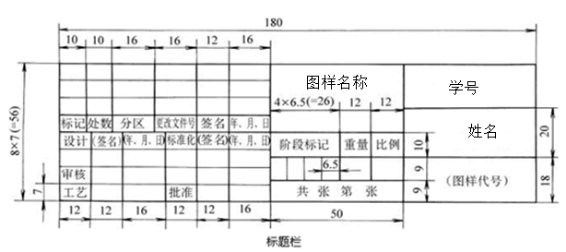

## 一、 选择电动机（P、n）

确定 $P_d$  、 $n_d$ （参看P14例2-1）

**注意1：**对于单级减速器，电动机至运输带的传动总效率
$$
\eta_a=\eta_带\cdot\eta_齿\cdot\eta_{轴承}^3\cdot\eta_{联轴器}\cdot\eta_{卷筒工作机}
$$
（**效率值**参考P7表1或P14例1）

**注意2：**带传动传动比 $i_带$ 合理范围为2～4；齿轮传动比 $i_齿$ 合理范围为3～6。

**注意3：**电动机转速常见的有：750r/min、1000r/min和1500r/min。

查手册，根据计算功率 $P_d$ 和同步（满载）转速 $n_d$ 确定电机型号。
$$
\begin{align}
\because~&工作机所需工作功率~P_w=\frac{Fv}{1000}\quad kW\\
\therefore~&电动机工作功率~P_d=\frac{P_w}{\eta_a}=\frac{Fv}{1000\eta_a}\quad kW\\
\because~&由电动机至运输带的传动总效率~\eta_a=\eta_带\cdot\eta_齿\cdot\eta_{轴承}^3\cdot\eta_{联轴器}\cdot\eta_{卷筒工作机}\\
&取~\eta_带=0.96,\eta_齿=0.97,\eta_{轴承}=0.98,\eta_{联轴器}=0.99,\eta_{卷筒}=0.96\\
\therefore~&\eta_a=0.96\cdot0.97\cdot0.98^3\cdot0.99\cdot0.96=0.83\\
\therefore~&P_d=\frac{3000\times1.1}{1000\times0.83}=3.98kW\\
\because~&n=\frac{60\times1000v}{\pi D}=\frac{60\times1000\times1.1}{\pi\times380}=55.29r/min\\
&i_a'=6～24\\
\therefore~&n_d'=i_a'\cdot n=(6～24)\times55.29=332～1327\\
&选定电动机型号为Y132M1-6\\
&额定功率4kW,满载转速960r/min
\end{align}
$$

## 二、 分配传动比

（参看P18例2-2）

**注意1：**以电动机实际**满载转速**计算实际总传动比，再分配带传动与减速器。

**注意2：**带传动传动比尽量小于3。
$$
\begin{align}
\because~&总传动比~i_a=\frac{n_m}{n}=\frac{960}{55.29}=17.36\\
\therefore~&分配传动装置传动比\\
&i_a=带传动传动比~i_0\cdot减速器传动比~i\\
&为使V带传动外廓尺寸不致过大，取i_0=2.9\\
\therefore~&i=\frac{i_a}{i_0}=\frac{17.36}{2.9}=5.99\\
\end{align}
$$

## 三、 计算减速器各轴动力参数： $P$ 、 $T$ 、 $n$ 

（参看P21例2-3）

**注意1：**以额定功率计算的设计结果余量较大，以工作机所需功率计算的设计结果更精确。
$$
\begin{align}
1.~&各轴转速\\
&Ⅰ轴\quad n_Ⅰ=960r/min\\
&Ⅱ轴\quad n_Ⅱ=\frac{n_Ⅰ}{i_0}=\frac{960}{2.9}=331.03r/min\\
&Ⅲ轴\quad n_Ⅲ=\frac{n_Ⅱ}{i}=\frac{331.03}{5.99}=55.26r/min\\
&卷筒轴\quad n_Ⅳ=n_Ⅲ=55.26r/min\\
2.~&各轴输入功率\\
&Ⅰ轴\quad P_Ⅰ=P_d=3.98kW\\
&Ⅱ轴\quad P_Ⅱ=P_Ⅰ\times\eta_带=3.98\times0.96=3.82kW\\
&Ⅲ轴\quad P_Ⅲ=P_Ⅱ\times\eta_齿=3.82\times0.97=3.71kW\\
&卷筒轴\quad P_Ⅳ=P_Ⅲ\times\eta_{轴承}\times\eta_{联轴器}=3.71\times0.98\times0.99=3.60kW\\
3.~&各轴输入转矩\\
&Ⅰ轴\quad T_Ⅰ=T_d=9550\frac{P_d}{n_m}=9550\times\frac{3.98}{960}=39.59N\cdot m\\
&Ⅱ轴\quad T_Ⅱ=T_Ⅰ\cdot i_0\cdot\eta_带=39.59\times2.9\times0.96=110.22N\cdot m\\
&Ⅲ轴\quad T_Ⅲ=T_Ⅱ\cdot i\cdot\eta_齿\cdot\eta_{轴承}=110.22\times5.99\times0.97\times0.98=627.60N\cdot m\\
&卷筒轴\quad T_Ⅳ=T_Ⅲ\cdot\eta_{轴承}\cdot\eta_{联轴器}=627.60\times0.98\times0.99=608.90N\cdot m
\end{align}
$$

## 四、 计算各传动零件

带传动、齿轮传动按《机械设计基础》课程中相关例题步骤设计。

### 带传动设计计算

$$
\begin{align}
1.~&计算功率P_c\\
&由表8-4查得K_A=1.1,故\\
&P_c=K_AP=1.1\times4=4.4kW\\
2.~&选取V带型号\\
&根据P_c=4.4kW和小带轮带速n_1=960r/min,由图8-10选取B型带\\
3.~&小轮基准直径d_{d1}和大轮基准直径d_{d2}\\
&希望结构紧凑，由表8-5取d_{d1}=140mm,\varepsilon=0.01,则大轮的直径\\
&d_{d2}=\frac{n_Ⅰ}{n_Ⅱ}d_{d1}(1-\varepsilon)=\frac{960}{331.03}\times140\times(1-0.01)=401.95mm\\
&由表8-5取d_{d2}=400mm,此时从动轮实际转速\\
&n_2=\frac{960\times140\times0.99}{400}=332.64r/min\\
&转速误差\frac{332.64-331.03}{331.03}=0.5\%<5\%,合适\\
4.~&验算带速\\
&v=\frac{vn_1d_{d1}}{60\times1000}=\frac{\pi\times960\times140}{60\times1000}=7.04m/s<25m/s,合适\\
5.~&初定中心距a_0\\
&\because\quad a_\max=2(d_{d1}+d_{d_2})=2\times(140+400)=1080mm\\
&\quad~\quad a_\min=\frac12(d_{d1}+d_{d2})+3h=\frac12\times(140+400)+3\times11=303mm\\
&\therefore\quad取a_0=330mm\\
6.~&初算带的基准长度 L_0\\
&L_0=2a_0+\frac\pi2(d_{d1}+d_{d2})+\frac{(d_{d2}-d_{d1})^2}{4a_0}=1559.44mm\\
&由表8-1,选取带的基准长度L_d=1560mm\\
7.~&实际中心距a\approx a_0+\frac{L_d-L_0}2=330+\frac{0.56}2=330.28\\
8.~&小带轮包角\alpha_1=180\degree-\frac{d_{d2}-d_{d1}}a\times57.53\degree=134.89\degree>120\degree,能满足要求\\
9.~&单根V带所能传递的功率\\
&根据n_1=960r/min和d_{d1}=140查表8-2求得P_0=2.10kW\\
10.~&单根V带传递功率的增量\Delta P_0\\
&已知B型V带，小带轮转速n_1=1440r/min,传动比i_0=2.9\\
&查表8-3得:\Delta P_0=0.30kW\\
11.~&计算V带的根数\\
&z\geq\frac{P_c}{(P_0+\Delta P_0)K_\alpha K_L}\\
&由表8-6查得K_\alpha=0.88;由表8-7查得K_L=0.92,故\\
&z=\frac{4.4}{(2.1+0.3)\times0.88\times0.92}=2.26\\
&取z=3根。所采用的V带为B-1560\times3
\end{align}
$$

### 齿轮传动设计计算

$$
\begin{align}
&T_1=T_Ⅱ=110220N\cdot mm\\
&a=48(i+1)\sqrt[3]{\frac{KT_1}{i\psi_a[\sigma_H]^2}}=201.86\approx202mm\\
&m=\frac{2a}{z_1+z_2}=\frac{201.86\times2}{24+144}=2.4,取标准模数m=2.5\\
&取z_1=24mm\\
&小齿轮分度圆直径d_1=mz_1=2.5\times24=60mm\\
&大齿轮分度圆半径r_2=0.5\cdot i\cdot d_1=0.5\times6\times60=180mm\\
&油深取40mm\\
&机座高=r_2+油深=220mm\\
&卷筒实际线速度与条件误差=1-\frac{2\pi\frac D2n}{60\cdot v}=1-\frac{2\pi\times190\times55.26}{60\times1100}=0.05\%
\end{align}
$$

## 五、 确定P26表3各项参数

参考P23图15，仔细阅读P23-29。**该项非常重要！** 
$$
\begin{align}
机座壁厚~&\delta=0.025a+1=0.025\times202+1=6.05,取\delta=8mm\\
机盖壁厚~&\delta_1=0.02a+1=5.04,取\delta_1=8mm\\
机座凸缘厚度~&b=1.5\delta=1.5\times8=12mm\\
机盖凸缘厚度~&b_1=1.5\delta_1=12mm\\
机座地凸缘厚度~&b_2=2.5\delta=2.5\times8=20mm\\
地脚螺钉直径~&d_f=0.036a+12=19.272,取标准值M20螺钉,d_f=20mm\\
地脚螺钉数目~&n=4\\
轴承旁联接螺栓直径~&d_1=0.75d_f=15mm,取标准值M16\\
机盖与机座联接螺栓直径~&d_2=(0.5～0.6)d_f=(10～12)mm,取标准值M10\\
联接螺栓d_2的间距~&l=180mm\\
轴承端盖螺钉直径~&d_3=(0.4～0.5)d_f=(8～10)mm,取标准值M8\\
窥视孔盖螺钉直径~&d_4=(0.3～0.4)d_f=(6～8)mm,取标准值M8\\
定位销直径~&d=(0.7～0.8)d_2=(7～8)mm,取标准值M8\\
d_f至外机壁距离~&c_{f1}=26mm\\
d_1至外机壁距离~&c_{11}=22mm\\
d_2至外机壁距离~&c_{21}=16mm\\
d_f至凸缘边缘距离~&c_{f2}=24mm\\
d_1至凸缘边缘距离~&c_{12}=20mm\\
d_2至凸缘边缘距离~&c_{22}=14mm\\
轴承旁凸台半径~&R_1=20/14mm\\
凸台高度~&h=50mm\\
外机壁至轴承座端面距离~&l_1=c_1+c_2+(8～12)=(50～54)mm,取l_1=52mm\\
大齿轮顶圆与内机壁距离~&\Delta_1>1.2\delta=9.6mm，取整\Delta_1=10mm\\
齿轮端面与内机壁距离~&\Delta_2>\delta=8mm,取整\Delta_2=10mm\\
机盖肋厚~&m_1\approx0.85\delta_1=6.8,取整m_1=7mm\\
机座肋厚~&m\approx0.85\delta=6.8,取整m=7mm\\
轴承端盖外径~&D_2=120mm/170mm\\
轴承端盖凸缘厚度~&t=\\
轴承旁联接螺栓距离~&s=D_2=
\end{align}
$$

## 六、装配图三个阶段（1:2缩小）

**准备：**

（1）逐项核对P39“装配图绘制前的准备”，按P40流程图，从P41页图29开始画；看懂每条线含义，确定参数，先画齿轮，再根据齿轮定机壁，定轴承位置；作图期间需仔细阅读P40-51。

（2）完成轴的结构设计、轴承选型、联轴器选型等，低速轴弯扭强度校核及其轴承寿命校核； 

（3）第一阶段完成图：P52页图61；

（4）完成齿轮内部结构设计、端盖内部结构设计、密封、润滑设计等；第二阶段完成图：P59页图74；作图期间，仔细阅读P55-58

（5）完成减速器机盖、底座外形设计，附件设计（窥视孔盖、放油螺塞、油标、通气器、启盖螺钉、定位销、吊耳吊钩等）；第三阶段完成图：P76页图121，并完成左视图。

（6）零件标号、尺寸、技术特性、技术要求、标题栏、明细栏、草图加深。按P80-87进行。

加深放在最后一步，防止图纸污损。

标尺寸（线段+箭头）：外形尺寸（长、宽、高）

配合尺寸（轴承内孔与轴、齿轮内孔与轴）

特性齿轮（齿轮中心距）

安装尺寸（地脚螺栓孔径及其中心距）

**标件号**：从主视图开始顺时针标注，**纵、横对齐**，参见下图所示。

**标题栏和明细栏**：（按标准尺寸绘制：总宽为180，行高为7）

## 七、 整理、誊写设计说明书

内容和格式见：P99-102

腹板式锻造齿轮

$$
\begin{align}
d_1&=1.6d=1.6\times70=112mm\\
\delta_0&=2.5m=2.5\times2.5=6.25mm,取8mm\\
D_1&=d_f-\delta_0=337.75mm\\
D_0&=0.55(D_1+d_1)=247.36mm\\
d_0&=0.25(D_1-d_1)=56.44mm\\
r&\approx0.6+0.14m=0.95mm\\
C&=1.5m+0.1b=7.95,取8mm
\end{align}
$$
凸缘式轴承盖（高速轴）
$$
\begin{align}
轴承外径D&=80mm\\
螺钉直径d_3&=8mm\\
螺钉数n&=4\\
d_0&=d_3+1=9mm\\
D_0&=D+2.5d_3=80+2.5\times8=100mm\\
D_2&=D_0+2.5d_3=100+2.5\times8=120mm\\
e&=1.2d_3=1.2\times8=9.6mm\\
D_4&=D-10=70mm\\
D_5&=D_0-3d_3=100-3\times8=76mm
\end{align}
$$
凸缘式轴承盖（低速轴）
$$
\begin{align}
D&=120mm\\
d_3&=10mm\\
n&=6\\
d_0&=d_3+1=11mm\\
D_0&=D+2.5d_3=120+2.5\times10=145mm\\
D_2&=D_0+2.5d_3=145+2.5\times10=170mm\\
e&=1.2d_3=1.2\times10=12mm\\
D_4&=D-10=110mm\\
D_5&=D_0-3d_3=145-3\times10=115mm
\end{align}
$$
吊耳
$$
\begin{align}
c_3&=(4～5)\delta_1=30～40mm,取30mm\\
c_4&=(1.3～1.5)c_3=39～45mm,取40mm\\
b&=2\delta_1=16mm\\
R&=c_4=40mm\\
r_1&=0.225c_3=7mm\\
r&=0.275c_3=8mm
\end{align}
$$
