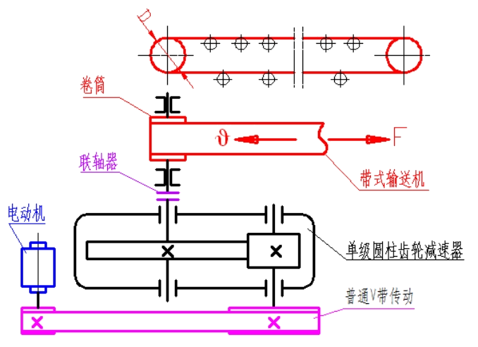
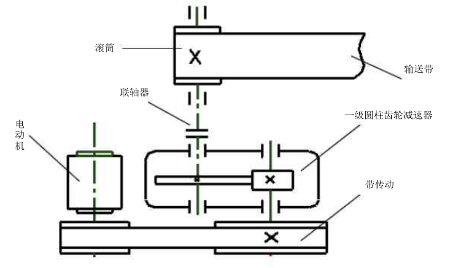

# 机械设计课程设计计算说明书

题目：一级圆柱齿轮减速器

班级：20504032

学号：200455203

姓名：陈尊来

指导教师：李娟

2022年12月19日

# 目录

1. 设计任务书
2. 传动方案的确定
3. 电动机的选择
4. 传动比的计算及分配
5. 传动装置运动，动力参数计算
6. 带传动的设计计算
7. 直齿圆柱齿轮传动的设计计算
8. 轴的设计计算——高速轴的设计与计算
9. 轴的设计计算——低速轴的设计与计算
10. 减速器箱体的结构尺寸
11. 润滑油的选择与计算
12. 附件设计
15. 参考资料

# 一、设计任务书

题目：设计一用于**带式运输机上**的**单级圆柱齿轮减速器**。运输机连续工作，单向运转，载荷变化不大，空载启动。减速器小批生产，使用期限10年，两班制工作。运输带容许速度误差为5%。

运输带拉力 $F(\mathrm{kN}):3\mathrm{kN}$ 

卷筒直径 $D(\mathrm{mm}):380\mathrm{mm}$ 

运输带速度 $V(\mathrm{m/s}):1.1\mathrm{m/s}$ 

# 二、传动方案的确定

根据机器特征，由于不要求传动比恒定，为减少投资成本，故采用如下方案。

单级圆柱齿轮减速器的传动方案简图如图所示。

1-电动机	2-带传动	3-减速器	4-联轴器	5-输送带	6-卷筒

# 三、电动机的选择

### 1、电动机类型的选择

选择**Y系列三相笼型异步电动机**，其结构简单、工作可靠、价格低廉、维护方便，适用于不易燃、不易爆、无腐蚀性气体和无特殊要求的机械上，如本设计中的带式运输机。

### 2、电动机功率的选择

#### （1）传动装置的总功率

$$
\begin{align}
&\eta_a=\eta_带\cdot\eta_齿\cdot\eta_{轴承}^3\cdot\eta_{联轴器}\cdot\eta_{卷筒工作机}\\
&取~\eta_带=0.96,\eta_齿=0.97,\eta_{轴承}=0.98,\eta_{联轴器}=0.99,\eta_{卷筒}=0.96\\
\therefore~&\eta_a=0.96\cdot0.97\cdot0.98^3\cdot0.99\cdot0.96=0.83
\end{align}
$$

#### （2）电动机的工作功率

$$
\begin{align}
\because~&工作机所需工作功率~P_w=\frac{Fv}{1000}\quad kW\\
\therefore~&电动机工作功率~P_d=\frac{P_w}{\eta_a}=\frac{Fv}{1000\eta_a}=\frac{3000\times1.1}{1000\times0.83}=3.98kW\\
\end{align}
$$

### 3、电动机的工作转速

带传动传动比 $i_带$ 合理范围为 $2～4$ ；齿轮传动比 $i_齿$ 合理范围为 $3～6$ 。
$$
\begin{align}
\because~&n_{卷筒}=\frac{60\times1000v}{\pi D}=\frac{60\times1000\times1.1}{\pi\times380}=55.29r/min\\
&i_a'=6～24\\
\therefore~&n_d'=i_a'\cdot n=(6～24)\times55.29=332～1327\\
&符合这一范围的同步转速有750、1000r/min
\end{align}
$$
综合考虑电动机和传动装置尺寸、重量、价格和带传动、减速器的传动比，选择 $n=1000r/min$ 。

### 4、确定电动机型号

根据以上选用的电动机类型，所需的额定功率及同步转速，查设计手册P173表12-1选定电动机型号为**Y132M1-6**。

其主要性能：额定功率 $4\mathrm{kW}$ ，满载转速 $960r/min$ ，额定转矩 $2.0$ 。质量 $73kg$ 。

# 四、传动比的计算及分配

### 1、总传动比

以电动机实际**满载转速**计算实际总传动比，再分配带传动与减速器。
$$
i_a=\frac{n_m}{n}=\frac{960}{55.29}=17.36\\
$$

### 2、分配各级传动比

$$
\begin{align}
\because~&带传动传动比尽量小于3\\
&i_a=带传动传动比~i_0\cdot减速器传动比~i\\
&为使V带传动外廓尺寸不致过大，取i_0=2.9\\
\therefore~&i=\frac{i_a}{i_0}=\frac{17.36}{2.9}=5.99\\
\end{align}
$$

# 五、传动装置运动，动力参数计算

### 1、计算各轴转速

$$
\begin{align}
&Ⅰ轴\quad n_Ⅰ=960r/min\\
&Ⅱ轴\quad n_Ⅱ=\frac{n_Ⅰ}{i_0}=\frac{960}{2.9}=331.03r/min\\
&Ⅲ轴\quad n_Ⅲ=\frac{n_Ⅱ}{i}=\frac{331.03}{5.99}=55.26r/min\\
&卷筒轴\quad n_Ⅳ=n_Ⅲ=55.26r/min
\end{align}
$$

### 2、计算各轴输入功率  

$$
\begin{align}
&Ⅰ轴\quad P_Ⅰ=P_d=3.98kW\\
&Ⅱ轴\quad P_Ⅱ=P_Ⅰ\times\eta_带=3.98\times0.96=3.82kW\\
&Ⅲ轴\quad P_Ⅲ=P_Ⅱ\times\eta_齿=3.82\times0.97=3.71kW\\
&卷筒轴\quad P_Ⅳ=P_Ⅲ\times\eta_{轴承}\times\eta_{联轴器}=3.71\times0.98\times0.99=3.60kW
\end{align}
$$

### 3、计算各轴扭矩

$$
\begin{align}

&Ⅰ轴\quad T_Ⅰ=T_d=9550\frac{P_d}{n_m}=9550\times\frac{3.98}{960}=39.59N\cdot m\\
&Ⅱ轴\quad T_Ⅱ=T_Ⅰ\cdot i_0\cdot\eta_带=39.59\times2.9\times0.96=110.22N\cdot m\\
&Ⅲ轴\quad T_Ⅲ=T_Ⅱ\cdot i\cdot\eta_齿\cdot\eta_{轴承}=110.22\times5.99\times0.97\times0.98=627.60N\cdot m\\
&卷筒轴\quad T_Ⅳ=T_Ⅲ\cdot\eta_{轴承}\cdot\eta_{联轴器}=627.60\times0.98\times0.99=608.90N\cdot m
\end{align}
$$

# 六、带传动的设计计算

### 1、计算功率 $P_c$ 

$$
\begin{align}
&由表8-4查得K_A=1.1,故\\
&P_c=K_AP=1.1\times4=4.4kW\\
\end{align}
$$

### 2、选取 $V$ 带型号

$$
根据P_c=4.4kW和小带轮带速n_1=960r/min,由图8-10选取B型带
$$

### 3、小轮基准直径 $d_{d1}$ 和大轮基准直径 $d_{d2}$ 

$$
\begin{align}
&希望结构紧凑，由表8-5取d_{d1}=140mm,\varepsilon=0.01,则大轮的直径\\
&d_{d2}=\frac{n_Ⅰ}{n_Ⅱ}d_{d1}(1-\varepsilon)=\frac{960}{331.03}\times140\times(1-0.01)=401.95mm\\
&由表8-5取d_{d2}=400mm,此时从动轮实际转速\\
&n_2=\frac{960\times140\times0.99}{400}=332.64r/min\\
&转速误差\frac{332.64-331.03}{331.03}=0.5\%<5\%,合适\\
\end{align}
$$

### 4、验算带速

$$
v=\frac{vn_1d_{d1}}{60\times1000}=\frac{\pi\times960\times140}{60\times1000}=7.04m/s<25m/s,合适
$$

### 5、初定中心距 $a_0$ 

$$
\begin{align}
&\because\quad a_\max=2(d_{d1}+d_{d_2})=2\times(140+400)=1080mm\\
&\quad~\quad a_\min=\frac12(d_{d1}+d_{d2})+3h=\frac12\times(140+400)+3\times11=303mm\\
&\therefore\quad取a_0=330mm\\
\end{align}
$$

### 6、初算带的基准长度 $L_0$ 

$$
\begin{align}
&L_0=2a_0+\frac\pi2(d_{d1}+d_{d2})+\frac{(d_{d2}-d_{d1})^2}{4a_0}=1559.44mm\\
&由表8-1,选取带的基准长度L_d=1560mm
\end{align}
$$

### 7、实际中心距 $a$ 

$$
a\approx a_0+\frac{L_d-L_0}2=330+\frac{0.56}2=330.28
$$

### 8、小带轮包角 $\alpha_1$ 

$$
\alpha_1=180\degree-\frac{d_{d2}-d_{d1}}a\times57.53\degree=134.89\degree>120\degree,能满足要求
$$

### 9、单根 $V$ 带所能传递的功率

$$
根据n_1=960r/min和d_{d1}=140查表8-2求得P_0=2.10kW
$$

### 10、单根V带传递功率的增量 $\Delta P_0$ 

$$
\begin{align}
&已知B型V带，小带轮转速n_1=1440r/min,传动比i_0=2.9\\
&查表8-3得:\Delta P_0=0.30kW
\end{align}
$$

### 11、计算 $V$ 带的根数

$$
\begin{align}
&z\geq\frac{P_c}{(P_0+\Delta P_0)K_\alpha K_L}\\
&由表8-6查得K_\alpha=0.88;由表8-7查得K_L=0.92,故\\
&z=\frac{4.4}{(2.1+0.3)\times0.88\times0.92}=2.26\\
&取z=3根。所采用的V带为B-1560\times3
\end{align}
$$

### 12、作用在带轮轴上的力

$$
\begin{align}
&由式(8-17)求单根V带的张紧力\\
&F_0=\frac{500P_c}{zv}(\frac{2.5}{K_\alpha}-1)+qv^2N\\
&查表8-9得q=0.17kg/m,故\\
&F_0=\frac{500\times4.4}{3\times7.04}\times(\frac{2.5}{0.88}-1)+0.17\times7.04^2=200.19N\\
&所以作用在轴上的力为\\
&F_\Sigma=2zF_0\sin\frac{\alpha_1}2=2\times3\times200.19\times\sin\frac{134.89\degree}{2}=1109.27N
\end{align}
$$

# 七、直齿圆柱齿轮传动的设计计算

### 1、确定作用在小齿轮上的转矩 $T_1$ 

$$
T_1=T_Ⅱ=110220N\cdot mm
$$

### 2、选择齿轮材料、确定许用接触应力 $[\sigma_H]$ 

根据工作要求，采用齿面硬度 $≤350\mathrm{HBW}$。

小齿轮选用45钢，调质，硬度为 $260\mathrm{HBW}$ ；

大齿轮选用45钢，调质，硬度为 $220\mathrm{HBW}$ 。

由表9-5的公式，可确定许用接触应力 $[\sigma_H]$ ：

小齿轮 $[\sigma_H]_1=380\mathrm{MPa}+0.7\mathrm{HBW}=(380+0.7×260)\mathrm{MPa}=562\mathrm{MPa}$ 

大齿轮 $[\sigma_H]_2=380\mathrm{MPa}+0.7\mathrm{HBW}=(380+0.7×220)\mathrm{MPa}=534\mathrm{MPa}$ 

### 3、选择齿宽系数 $\psi_a$ 

取 $\psi_a=0.4$ 。

### 4、确定载荷系数 $K$ 

因齿轮相对轴承对称布置，且载荷较平稳，故取 $K=1.35$ 。

### 5、计算中心距 $a$ 

$$
\begin{align}
a&=48(i+1)\sqrt[3]{\frac{KT_1}{i\psi_a[\sigma_H]^2}}\\
&=48\times(6+1)\times\sqrt[3]{\frac{1.35\times110220}{6\times0.4\times534^2}}\\
&=202mm\\
\end{align}
$$

### 6、选择齿数并确定模数

取 $z_1=24$ ，则 $z_2=iz_1=6\times24=144$ 
$$
m=\frac{2a}{z_1+z_2}=\frac{2\times202}{24+144}=2.4mm
$$
取标准模数（表9-1）， $m=2.5mm$ 

### 7、齿轮几何尺寸计算

##### 小齿轮分度圆直径及齿顶圆直径

$$
\begin{array}{c}
d_1=mz_1=2.5\times24=60mm\\
d_{a1}=d_1+2m=60+2\times2.5=65mm
\end{array}
$$

##### 大齿轮分度圆直径及齿顶圆直径

$$
\begin{array}{c}
d_2=mz_2=2.5\times144=360mm\\
d_{a2}=d_2+2m=360+2\times2.5=365mm
\end{array}
$$

##### 中心矩

$$
a=\frac{d_1+d_2}2=\frac{60+360}2=210mm
$$

##### 大齿轮宽度

$$
b_2=\psi_a\cdot\alpha=0.4\times210=84mm
$$

##### 小齿轮宽度

因为小齿轮齿面硬度高，为补偿装配误差，避免工作时在大齿轮齿面上造成压痕，一般 $b_1$ 应比 $b_2$ 宽些，取
$$
b_1=b_2+5=89mm
$$

### 8、确定齿轮的精度等级

##### 齿轮圆周速度

$$
v=\frac{\pi d_1n_1}{60000}=\frac{\pi\times60\times331.03}{60000}=1.04m/s
$$

根据工作要求和圆周速度，由表9-3选用9级精度。

### 9、确定许用弯曲应力

根据表9-7查得

$$
\begin{align}
[\sigma_F]_1=140+0.2\mathrm{HBW}=140+0.2\times260=192\mathrm{MPa}\\
[\sigma_F]_2=140+0.2\mathrm{HBW}=140+0.2\times220=184\mathrm{MPa}
\end{align}
$$

### 10、查齿形系数 $Y_F$ ，比较 $Y_F/[\sigma_F]$ 

小齿轮 $z_1=24$ ，由表9-6查得 $Y_{F1}=2.67$ ；

大齿轮 $z_1=144$ ，由表9-6用插入法得 $Y_{F2}=2.18$ 。

$$
\begin{align}
\frac{Y_{F1}}{[\sigma_F]_1}=\frac{2.67}{192}=0.014\\
\frac{Y_{F2}}{[\sigma_F]_2}=\frac{2.18}{184}=0.012
\end{align}
$$

因 $\frac{Y_{F1}}{[\sigma_F]_1}>\frac{Y_{F2}}{[\sigma_F]_2}$ ，所以应验算小齿轮。

### 11、验算弯曲应力

计算时应以齿宽 $b_2$ 代入，则

$$
\sigma_{F_1}=\frac{2KT_1Y_{F1}}{bz_1m}=\frac{2\times1.35\times110220\times2.67}{84\times24\times2.5^2}=63.06\mathrm{MPa}<192\mathrm{MPa},安全
$$

# 八、轴的设计计算——高速轴的设计与计算

### 1、已知条件

高速轴传递的功率 $P_Ⅱ=3.82kW$ ，转速 $n_Ⅱ=331.03r/min$ ，小齿轮分度圆直径 $d_1=60mm$ ，齿轮宽度 $b_1=89mm$ ，转矩 $T_Ⅱ=110.22N\cdot m$ 

### 2、选择轴的材料

因传递功率不大，并对重量及结构尺寸无特殊要求，故由表12-1选用常用的材料45钢，调制处理。 $\sigma_{\mathrm{b}}=640\mathrm{MPa}$ ， $\sigma_{\mathrm{s}}=355\mathrm{MPa}$ ， $\sigma_{-1}=275 \mathrm{MPa}$ ， $\tau_{-1}=155 \mathrm{MPa}$ ， $\left[\sigma_{+1 b}\right]=215 \mathrm{MPa} $ ， $\left[\sigma_{0 b}\right]=100 \mathrm{MPa} $ ， $\left[\sigma_{-1 b}\right]=60 \mathrm{MPa}$ 。由表12-2查得 $C=118～107$ 。

### 3、估算齿轮轴径

$$
d=C\sqrt[3]\frac Pn=(107～118)\times\sqrt[3]\frac{3.82}{331.03}mm\approx24.1～26.4mm
$$

考虑到轴端装联轴器需要开键槽，轴径应增大 $3\%～5\%$ ，则取 $d_\min=28mm$ 。

### 4、轴的结构设计

#### 1）轴承部件的结构设计

轴的初步结构设计及构想如图所示。为方便轴承部件的装拆，减速器的机体采用剖分式结构。该减速器发热小，轴不长，故轴承采用两端固定方式。然后可按轴上零件的安装顺序，从 $d_\min$ 处开始设计。

#### 2）轴段①的设计

轴段①上安装带轮，此段设计应与带轮设计同步进行。由最小直径可初定轴段①的轴径
$$
d_1=30mm
$$
带轮轮毂的宽度为 $(1.5～2.0)d_1=45～60mm$ ，取 $60mm$ 。则轴段①的长度略小于轮毂长，取
$$
L_1=58mm
$$

#### 3）轴段②的设计

考虑带轮的轴向固定及密封圈的尺寸，带轮用轴肩定位，定位轴肩高度 $h=0.07d+(2～3)mm$​ ，则轴段②的轴径
$$
d_2=30+2\times(30\times0.07+2)=38.2mm
$$
可选择毡圈油封。由毡圈油封用槽表选区毡圈为
$$
d_2=35mm
$$
后续根据箱体结构设计得到
$$
l_2=(L-S+B)+K+l=50mm
$$

#### 4）轴段③的设计

轴段③上安装轴承，考虑圆柱直齿齿轮只受径向力和圆周力，所以选用球轴承即可，取
$$
d_3=d_2+2\times2.5=35+5=40mm
$$
选用深沟球轴承 $6208$ ，查手册深沟球轴承 表得轴承内径 $d=40mm$ ，外径 $D=80mm$ ，厚度 $B=18mm$ 。轴长
$$
l_3=B+S+a+\frac{b_1-b_2}2+2.5=30mm
$$

#### 5）轴段④的设计

轴段④上有小齿轮
$$
d_4=d_3+2\times2.5=45mm
$$
 小齿轮宽度为 $b_1=89mm$ ，由于是齿轮轴，轴段长设计比齿轮宽略长一点
$$
l_4=b1+4=93mm
$$

#### 6）轴段⑤的设计

由于安装同尺寸轴承，与轴段③相同， 
$$
d_5=40mm,\quad l_5=30mm
$$

# 九、轴的设计计算——低速轴的设计与计算

### 1、已知条件

低速轴传递的功率 $P_Ⅲ=3.71kW$ ，转速 $n_Ⅲ=55.26r/min$ ，大齿轮分度圆直径 $d_2=360mm$ ，齿轮宽度 $b_2=84mm$ ，转矩 $T_Ⅲ=627.60N\cdot m$ 

### 2、选择轴的材料

与高速轴采用同种材料

### 3、估算齿轮轴径

$$
d=C\sqrt[3]\frac Pn=(107～118)\times\sqrt[3]\frac{3.71}{55.26}mm\approx43.5～48.0mm
$$

考虑到轴端装联轴器需要开键槽，轴径应增大 $3\%～5\%$ ，则取 $d_\min=50mm$ 。

### 4、轴的结构设计

#### 1）轴承部件的结构设计

轴的初步结构设计及构想如图所示。为方便轴承部件的装拆，减速器的机体采用剖分式结构。该减速器发热小，轴不长，故轴承采用两端固定方式。然后可按轴上零件的安装顺序，从 $d_\min$ 处开始设计。

#### 2）轴段①的设计

轴段①上安装卷筒，卷筒直径 $D=380mm$ ，由最小直径可初定轴段①的轴径
$$
d_1=50mm
$$
卷筒的宽度为 $(1.5～2.0)d_1=75～100mm$ ，取 $80mm$ 。则轴段①的长度略小于卷筒长，取
$$
L_1=82mm
$$

#### 3）轴段②的设计

考虑带轮的轴向固定及密封圈的尺寸，带轮用轴肩定位，定位轴肩高度 $h=0.07d+(2～3)mm$ ，则轴段②的轴径
$$
d_2=50+2\times(50\times0.07+2)=61mm
$$
可选择毡圈油封。由毡圈油封用槽表选区毡圈为
$$
d_2=60mm
$$
 后续根据箱体结构设计得到
$$
l_2=(L-S+B)+K+l=56mm
$$

#### 4）轴段③的设计

轴段③上安装轴承，考虑圆柱直齿齿轮只受径向力和圆周力，所以选用球轴承即可，取
$$
d_3=d_2+2\times2.5=60+5=65mm
$$
选用深沟球轴承 $6213$ ，查手册深沟球轴承 表得轴承内径 $d=65mm$ ，外径 $D=120mm$ ，厚度 $B=23mm$ 。轴长
$$
l_3=B+S+a+\frac{b_1-b_2}2+2.5=48mm
$$

#### 5）轴段④的设计

轴段④上安装大齿轮，取
$$
d_4=d_3+2\times2.5=70mm
$$
大齿轮宽度为 $b_2=84mm$ ，
$$
l_4=b_2-1=83mm
$$

#### 6）轴段⑤的设计 

轴段⑤的轴肩要压过腹板式齿轮
$$
d_5=84mm
$$

#### 7）轴段⑥的设计
