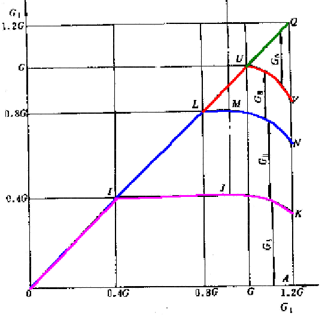
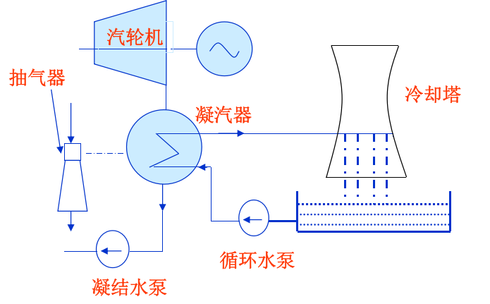

## 0.1 电力在国民经济中的地位

* 一次能源

  煤炭、石油、天然气、水能、风能等由自然界提供的能源 

* 电能

  是一种二次能源，由一次能源转换而成 

* 电力工业

  * 是国民经济的一项基础产业，也是国民经济发展的先行产业 
  * 国民经济每增长1％，电力工业要相应增长1.3%～1.5%，以提供足够的动力
  * 成为反映国家**经济发达程度**的重要标志

## 0.2 汽轮机装置在电厂中的地位

#### 火电厂三大主要设备

* 锅炉：将燃料的化学能转变为蒸汽的热能
* 汽轮机：将蒸汽的热能转变为机械能
* 发电机：将转轴的机械能转变为电能

汽轮机+发电机→汽轮发电机组→全球总发电量的约80%

**汽轮机**：以蒸汽为工质的将热能转化为机械能的旋转式原动机。

* 单机功率大
* 效率高
* 运转平稳
* 单位功率制造成本低
* 使用寿命长
* 由汽轮机<u>本体</u>和<u>辅助设备</u>两部分组成
  * 汽轮机本体：由静止部分、转动部分、主汽门、调节汽门等组成；
  * 汽轮机辅助设备：主要包括凝汽设备、回热加热设备、调节保安装置、供油系统等。

#### 汽轮机本体主要结构

* 静子：主要包括汽缸、喷嘴、隔板、汽封、轴承等
* 转子：主要包括主轴、叶轮、动叶、联轴器等

## 0.3 汽轮机发展概述

#### 世界上第一台汽轮机的诞生

**1883年**， Laval （瑞典）研制
单级、冲动式、轴流式、**3.7kW**、26000r/min

70年代后，容量进入**百万千瓦等级** 

#### 我国三大动力设备厂

* 哈汽、上汽、东汽
* 工业汽轮机：杭州
* 燃气轮机：南京

#### 发展趋势

* 增大单机功率：提高机组运行效率和热经济性，降低单位功率投资成本
* 提高蒸汽参数：提高热效率和单机功率
* 采用一次中间再热：提高机组内效率、热效率和运行可靠性
* 采用燃气-蒸汽联合循环发电装置：大幅提高热效率、负荷适应性，有效解决污染问题
* 增设运行监测系统和智能化故障诊断系统：提高机组运行、维护和检修水平，增强运行可靠性

#### 汽轮机型号的表示方法

汽轮机类型 额定功率(MW) —— 蒸汽参数——变型设计次序

例：N300-16.7/538/538（名词解释）

* 300MW凝汽式汽轮机
* 主蒸汽压力为16.7MPa
* 温度为538ºC
* 再热蒸汽温度538ºC

## 0.5 燃气轮机简介

* 燃气轮机的年龄：70多年——最年轻的动力机械
* 燃气轮机的应用
  * 飞机、轮船、火车头、火电站
  * 燃气轮机→喷气发动机→航空业
  * 全世界约1/5的发电来自于燃气轮机
* 燃气轮机的起源
  * 1930~1937 英国人Whittle 获得燃气轮机专利
  * 1936德国人 von Ohain 和 Max Hahn 获燃气轮机专利

$$
1.汽轮机级的工作原理
	\begin{cases}
	1.汽轮机级的工作过程
		\begin{cases}
		1.级的工作过程简介\\
		2.级中的热力过程线\\
		3.级的流动模型和基本方程式\\
		4.蒸汽在喷嘴中的流动
			\begin{cases}
			1.喷嘴出口流速的计算
				\begin{cases}
				理想过程中喷嘴出口流速的计算\\
				实际过程中喷嘴出口流速、速度系数
				\end{cases}\\
			2.流动临界、临界压比\\
			3.通过喷嘴的流量计算
				\begin{cases}
				理想流量、实际流量\\
				临界流量、彭台门系数
				\end{cases}\\
			4.蒸汽在喷嘴斜切部分中的膨胀
			\end{cases}\\
		5.蒸汽在动叶中的流动
			\begin{cases}
			1.动叶进出口速度三角形
				\begin{cases}
				动叶进口流速、轮周速度\\
				速度三角形\\
				几何解析法公式\\
				动叶中膨胀与动叶出口流速
				\end{cases}\\
			2.蒸汽动叶中的膨胀与级的分类
				\begin{cases}
				反动度\\
				级的分类
				\end{cases}\\
			3.蒸汽对动叶的轮周功率
				\begin{cases}
				动量转换与动叶上的汽流力:切向力/轴向力\\
				轮周功率P_u\\
				轮周功率与轮周功关系
				\end{cases}\\
			\end{cases}
		\end{cases}\\
	2.级的轮周效率与最佳速度比
		\begin{cases}
		1.级的轮周效率
			\begin{cases}
			能量转换目标\\
			参数
				\begin{cases}
				1.余速利用系数\\
				2.级理想能量E_0\\
				3.轮周效率
					\begin{cases}
					喷嘴、动叶损失\\
					余速损失(轮周速度)
					\end{cases}
				\end{cases}
			\end{cases}\\
		2.级的最佳速度比
			\begin{cases}
			1.两个概念:最佳速比\&假想速比\\
			2.不同类型级的最佳速度比\\
			3.轮周效率与最佳速度比
			\end{cases}
		\end{cases}\\
	3.叶栅几何参数设计
		\begin{cases}
		1.几个主要参数的选择:出口气流角、部分进汽度、盖度\\
		2.喷嘴主要尺寸的确定：面积、叶高、角度\\
		3.动叶尺寸设计\\
		4.反动度的实现
			\begin{cases}
			动、静叶出口面积比\\
			冲动级的反动度
			\end{cases}
		\end{cases}\\
	4.汽轮机级内损失和级效率
		\begin{cases}
		级内损失
			\begin{cases}
			概述总损失
				\begin{cases}
				平面叶栅损失\\
				非平面叶栅损失
				\end{cases}\\
			详述非平面叶栅损失
				\begin{cases}
				叶高损失\quad叶根、叶顶端部边界\\
				扇形损失\quad叶根、叶顶不同径\\
				叶轮摩擦损失\quad叶轮高速旋转摩擦耗功\\
				部分进汽损失\quad喷嘴不均匀进汽产生损失\\
				撞击损失\quad进口汽流角偏离几何进口角\\
				漏气损失\quad静叶、动叶端部间隙蒸汽泄漏\\
				湿汽损失\quad湿蒸汽区水滴产生的损失
				\end{cases}
			\end{cases}\\
		级的指标
			\begin{cases}
			级热力过程线\\
			级相对内效率\\
			级内效率
			\end{cases}\\
		级的最佳速比\quad较轮周效率最高的最佳速比要小
		\end{cases}\\
	5.扭长叶片
		\begin{cases}
		一元流动模型存在的不足
			\begin{cases}
			轮周速度沿叶高不一致\\
			节距沿叶高不一致\\
			汽流参数沿叶高变化\longrightarrow离心、损失
			\end{cases}\\
		叶栅通道的实际流动和简化流动模型
			\begin{cases}
			实际流动：在子午面和绕转子轴线Z回转面内的合成运动\\
			目前扭长叶片设计采用：径向平衡模型法
			\end{cases}
		\end{cases}
	\end{cases}
$$

# 1.1 汽轮机级的工作过程

## 1.1.1 汽轮机级的工作过程

“级”是汽轮机中最基本的工作单元。在结构上它是由静叶（喷嘴）和对应的动叶所组成；一列固定的喷嘴和与它配合的动叶片构成了汽轮机的基本作功单元，称为汽轮机的“级”

* 汽轮机内的能量转换

  一定压力和温度的蒸汽流经固定不动的喷嘴，并在其中膨胀，蒸汽的压力、温度不断降低，速度不断增加，使蒸汽的热能转化为动能 。

### （一）冲动作用原理

* **冲动力**的定义：根据力学知识，当一运动物体碰到另一个静止的物体或者运动速度低于它的物体时，就会受到阻碍而改变其速度的大小或方向，同时给阻碍它的物体的一个作用力
* **特点**：蒸汽仅把从喷嘴中获得的动能转变为机械功，蒸汽在动叶通道中不膨胀，动叶通道不收缩

#### 从作用力方面分析原理

* 喷嘴出口处：蒸汽以相对速度 $w_1$ 进入动叶通道，由于受到动叶的阻碍，汽流方向不断改变，最后以相对速度 $w_2$ 流出动叶通道，
* 在流道中蒸汽对动叶产生一个轮周方向的冲动力 $F_1$ ，该力对动叶作功使动叶转动

### （二）反动作用原理

* 反动力定义：蒸汽在动叶汽道内膨胀时对动叶的作用力。根据动量守恒定律，当气体从容器中加速流出时，要对容器产生—个与流动方向相反的力。
* 基本特点：蒸汽在动叶流道中不仅要改变方向，而且还要膨胀加速，从结构上看动叶通道是逐渐收缩的。

#### 从作用力方面分析原理

蒸汽流经级时先在喷嘴中膨胀压力降低，速度增加，产生冲动力 $F_1$ 

蒸汽在动叶中继续膨胀，压力降低，所产生的焓降转化为动能，造成动叶出口的相对速度 $w_2$ 大于进口相对速度 $w_1$ ，使汽流产生了作用于动叶上的与汽流方向相反的反动力 $F_r$ 。

在蒸汽的冲动力和反动力合力作用下推动动叶旋转作功。

### （三）反动度和级类型

基本概念

* 级滞止理想焓降： $0$ 点是级前的蒸汽状态点，$0^*$ 点是汽流被等熵滞止到初速等于零的状态， $p_1$ 、 $p_2$ 分别为喷嘴出口压力和动叶出口压力，蒸汽在级内从滞止状态 $0^*$ 等熵膨胀到 $p_2$ 时的焓降称为级的滞止理想焓降
* 级理想焓降：蒸汽在级内从 $0$ 点等熵膨胀到 $p_2$ 时的焓降 $\Delta h_t$ 称为级的理想焓降。

#### 级的反动度

* 蒸汽在动叶中膨胀程度的大小，它等于蒸汽在动叶通道中的理想焓降与喷嘴的滞止理想焓降和动叶通道中理想焓降之和的比值，常用级的反动度 $\Omega_m$ 表示，其表达式为：

  $$
  \Omega_{m}=\frac{\Delta h_{b}}{\Delta h_{n}^{*}+\Delta h_{b}} \approx \frac{\Delta h_{b}}{\Delta h_{n}^{*}+\Delta h_{b}^{\prime}}=\frac{\Delta h_{b}}{\Delta h_{t}^{*}}
  $$

  $\Delta h_t^*$ ——级的滞止理想比焓降

  $\Delta h_n^*$ ——蒸汽在喷管中的滞止理想比焓降

  $\Delta h_b$ ——为蒸汽在动叶中的理想比焓降

  $O$ 点是级前的蒸汽状态点

  $O^*$ 为蒸汽等熵滞止到初速等于零的状态点

  $p_1、p_2$ 分别为喷管出口压力和动叶出口压力

  蒸汽从滞止状态 $O^*$ 点在级内等熵膨胀到 $p_2$ 时的比焓降为**级的滞止理想比焓降** $\Delta h_t^*$ 

* 汽轮机的级可分为冲动级和反动级两大类

#### 冲动级和反动级

冲动级又分：纯冲动级、带反动度的冲动级速度级 

1) 纯冲动级：反动度为零的级称为纯冲动级

  * 工作特点：是蒸汽只在喷嘴中膨胀，在动叶通道中不膨胀
  * 结构特点：动叶叶型近似对称弯曲，作功能力大，但效率比带反动度的冲动级低。

2) 带反动度的冲动级

  * 现代冲动式汽轮机中广泛采用具有一定反动度的冲动级，简称为冲动级
  * 工作特点：蒸汽的膨胀主要喷嘴中进行，在动叶通道中仅有小部分膨胀，产生的反动力较小，主要利用冲动力作功
  * 结构特点：作功能力比反动级的大，效率又比纯冲动级高。

3) 复速级

  * 速度级：为使充分利用余速，在两列动叶之间装设—列导向叶片，排汽经过导向叶片后改变方向，进入第二列动叶继续作功。这种级称为速度级。
  * 复速级：同一叶轮上装有两列动叶片的**双列速度级**，又称为复速级。
  * 工作特点：蒸汽主要在喷嘴中膨胀加速：动叶通道和导向叶片通道中基本不膨胀，焓降大、效率较低。用于单级汽轮机和中、小型多级汽轮机的第一级。

4) 反动级

  * 定义：蒸汽在级中的理想焓降平均分配在喷嘴和动叶通道中 $(\Delta h_n^*=\Delta h_b=\frac12\Delta h_t^*)$ 的级称为反动级，即反动度 $\Omega_m\approx0.5$ 的级。
  * 工作特点：蒸汽在喷嘴和动叶通道中的膨胀程度相等，作功的力冲动力和反动力各占一半。
  * 结构特点：动叶叶型与喷嘴叶型完全相同。**反动级的效率高于冲动级，但整级的理想焓降较小**。

#### 调节级

* **喷嘴调节**：多数汽轮机采用改变第一级喷嘴面积的方法调节进汽量，称之为喷嘴调节。
* **调节级**：中、小容量汽轮机的调节级喷嘴调节汽轮机的第一级称为调节级，一般采用复速级。大容量汽轮机多采用单列冲动级。
* 根据蒸汽动能转换为转子机械能过程的不同：**速度级**和压力级。

## 1.1.2 级的热力过程线

* 热力过程线

  蒸汽在动、静叶栅中膨胀过程在 $h-s$ 图上的表示

* **<u>滞止参数</u>**

  气流等熵滞止到初速为零的滞止状态点 $O^*$ 时的蒸汽热力参数

* **<u>余速损失</u>**

  动叶排汽余速动能 $(\frac12c_2^2)$ 

  $$
  W_{u}=\left(h_{0}+\frac{1}{2} c_{0}^{2}\right)-\left(h_{2}+\frac{1}{2} c_{2}^{2}\right)
  $$

## 1.1.3 级的流动模型和基本方程式

蒸汽在汽轮机中的流动：

实际状态：**黏性、非连续、非定常、三元流动（低压缸）**

简化：**一元定常绝热流动（相对高度较低的叶栅）**

* **一元流动**：叶栅气道中的蒸汽参数只沿流动方向改变，而垂直截面上不变
* **定常流动**：叶栅气道中任一点的参数不随时间变化
* **绝热流动**：蒸汽快速通过叶栅通道时，与外界不发生热交换

**基本方程**：连续方程、动量方程、能量方程、状态方程

#### 1、连续方程

质量守恒定律（对于稳定流动，单位时间内流过通道的各截面的蒸汽流量是相等的）

$$
Gv=Ac
$$

$G$ ——蒸汽质量流量

$A$ ——气道内任一横截面积

$C$ ——垂直于截面的蒸汽流速

$v$ ——比密度

#### 2、动量方程

* 联系作用于流体上的力与流体速度变化

* 如流动是无损失的等熵流动，其运动方程可表示为：

  $$
  -vdp=cdc
  $$

$v$ ——比密度

$p$ ——作用在截面A上的压力

$c$ ——微元段的流动速度

#### 3、能量方程

——能量守恒定律（对于稳定流动，输入系统的能量等于输出系统的能量）

$$
q+h_0+\frac{c_0^2}{2}=h_1+\frac{c_1^2}{2}+W
$$

$h_0、h_1$ ——蒸汽进入和流出系统的比焓值， $J/kg$

$c_0、c_1$ ——蒸汽进入和流出系统时的速度， $m/s$

$q$ ——1kg蒸汽通过系统时，从外界吸收的热量， $J/kg$

$W$ ——1kg蒸汽通过系统时，对外界所作的机械功， $J/kg$

#### 4、状态方程

——近似使用理想气体状态方程

$$
pv=RT
$$

$p$——气体绝对压力

$v$——比密度

$R$——通用气体常数

$T$——热力学温度

***

——蒸汽等熵膨胀过程

$$
pv^\kappa=const
$$

$\kappa$——等熵系数

对于过热蒸汽： $\kappa=1.3$

对于饱和蒸汽： $\kappa=1.135$

## 1.1.4 蒸汽在喷嘴中的流动

### 1.1.4.1 喷嘴出口流速的计算

#### 理想过程的喷嘴出口流速

* 能量平衡 $h_0+\frac{1}{2}c_0^2=h_0^0=h_{1t}+\frac{1}{2}c_{1t}^2$ 

* 喷嘴出口理想流速 $c_{1t}=\sqrt{c_0^2+2(h_0-h_{1t})}=\sqrt{2(h_0^0-h_{1t})}=\sqrt{2h_n^0}$ 

  $c_0$ ——初速； $p_0$ ——初压； $h_0$ ——初比焓；

#### 理想流速计算方法

* 由 $(p_0^0,t_0^0,p_1)$ 查水蒸汽特性参数，由此求得出口理想速度

* 由 $\Delta h=\frac{\kappa}{\kappa-1}(p_0^0v_0^0-p_1v_1)$ 代入焓的表达式，得以<u>初参数</u> $(p_0^0,v_0^0)$ 及<u>**压比**</u> $\varepsilon_n=(p_{1t}/p_0^0)$ 为函数的出口理想流速：

  $$
  c_{1t}=\sqrt{\frac{2\kappa}{\kappa-1}p_0^0v_0^0\left[1-\left(\frac{p_{1t}}{p_0^0}\right)^{\frac{\kappa-1}{\kappa}}\right]}=\sqrt{\frac{2\kappa}{\kappa-1}p_0^0v_0^0(1-\varepsilon_n^{\frac{\kappa-1}{\kappa}})}
  $$

#### 实际过程的喷嘴出口流速

* 有损失的熵增。工程中用<u>**速度系数**</u> $\varphi$ 修正实际流速与等熵理想流速的偏差。
* 喷嘴速度系数 $\varphi=\frac{c_1}{c_{1t}}$ 
* 喷嘴损失 $\delta h_{n}=\frac{1}{2} c_{1 t}^{2}-\frac{1}{2} c_{1}^{2}=\left(1-\varphi^{2}\right) \Delta h_{n}^{0}$ 
* 喷嘴能量损失系数 $\xi_{n}=\delta h_{n} / \Delta h_{n}^{0}=1-\varphi^{2}$ 

#### 速度系数的影响因素

* 喷嘴高度：随高度增加而增加，当 $ln>100mm$ 后基本不变
* 表面粗糙度：表面越光洁，摩擦损失就越小
* 型线：决定着流通内压力场、速度场分布
* 常用数值：一般为0.92～0.98，常取0.97

### 1.1.4.2 流动临界和临界压比

#### 流动临界

* 压力波在蒸汽中以音速传播，当渐缩喷嘴出口汽流速度达到当地音速时，背压的扰动无法向前传播，故最大出口流速仅为当地**音速**。

* 音速计算公式：

  $$
  a=\sqrt{\kappa pv} =\sqrt{\kappa RT}\\
  c_{cr}=\sqrt{\kappa p_{cr}v_{cr}}=\sqrt{\frac{2\kappa}{\kappa+1}p_0^0v_0^0}
  $$

#### 临界压比

* 将喉部截面达到音速时为临界状态。对应流道的进、出口压力比称为**临界压比**(Critical pressure ratio)。绝热等熵临界压比为 $\varepsilon_{cr}=[2/(\kappa+1)]^\frac{\kappa}{\kappa-1}$ 
* 过热蒸汽 $\varepsilon_{cr}=0.546$ 
* 饱和蒸汽 $\varepsilon_{cr}=0.577$ 
* 临界速度<u>仅与进出口参数有关</u> 

### 1.1.4.3  通过喷嘴的流量计算

* 流量计算方法——理想流量加实际修正

#### （1）理想流量计算

对出口面积为 $A_n$ 的喷嘴，其理想质量流量为

$$
G_{n t}=\frac{A_{n} c_{1 t}}{v_{1 t}}=A_{n} \sqrt{\frac{2\kappa}{\kappa-1} \frac{p_{0}^{0}}{v_{0}^{0}}\left[\left(\varepsilon_{n}\right)^{2 / \kappa}-\left(\varepsilon_{n}\right)^{\frac{\kappa+1}{\kappa}}\right]}
$$

#### （2）流量系数与实际流量

* 流量系数公式

  $$
  \mu_n=\frac{G_n}{G_{nt}}=\frac{c_1v_{1t}}{c_{1t}v_1}=\varphi\cdot\frac{v_{1t}}{v_1}
  $$

* 流量系数与速度系数

  * 理论上 $\mu_n=\varphi\cdot v_{1t}/{v_1}$ ，因 $v_{1t}/{v_1}\leq1$ ，故 $\mu_n\leq\varphi_n$ 。
  * 实际中，分别由动能损失与流动试验求取，前者是流场速度分布的均方平均，后者是流场速度分布的算术平均，通常实测流量系数大于速度系数。**为简化计算，速度系数和流量系数可取同值**。

* 湿蒸汽的流量系数大于1

  * 湿蒸汽在降压膨胀过程中部分蒸汽释放汽化潜热凝结为水、湿度增大，但因流速很快、传热速度相对滞后，汽化潜热来不及传给蒸汽，使蒸汽产生过冷，比容减小，从而导致实际流量大于理想流量的局面。
  * 在湿蒸汽区，流量系数通常以1.02进行计算

#### （3）临界流量

* 当喉部达到临界时，蒸汽参数也不再改变，汽流速度不再增加，其流量达到最大，故也称为“最大流量”。

  $$
  G_{n t \max }=A_{n} \sqrt{\kappa\left(\frac{2}{\kappa+1}\right)^{\frac{\kappa+1}{\kappa-1}} p_{0}^{0} / v_{0}^{0}}=
  \begin{cases}
  0.6673A_n\sqrt{p_{0}^{0} / v_{0}^{0}}\quad过热\\
  0.6356A_n\sqrt{p_{0}^{0} / v_{0}^{0}}\quad饱和
  \end{cases}
  $$

* <u>最大流量仅与初参数有关</u>。实际最大流量为理想最大流量乘流量系数，即

  $$
  G_{n\max}=\mu_nG_{nt\max}
  $$

* 在实际使用中，无论是过热蒸汽还是饱和蒸汽都可采用下式计算：

$$
G_{cr}=0.648A_n\sqrt{p_0^0\rho_0^0}=0.648A_n\frac{p_0^0}{\sqrt{RT_0^0}}
$$

#### （4）流量比系数

又称<u>**彭台门系数**</u>，通过流道的流量与其最大流量的比，用 $β$ 表示。

$$
\beta=\frac{G}{G_{\max }}=\frac{A_{n} \sqrt{\frac{2\kappa}{\kappa-1} \frac{p_{0}^{0}}{v_{0}^{0}}\left(\varepsilon^{2 /\kappa}-\varepsilon^{(\kappa+1) / \kappa}\right)}}{A_{n} \sqrt{\kappa\left(\frac{2}{\kappa+1}\right)^{\frac{\kappa+1}{\kappa-1}} \frac{p_{0}^{0}}{v_{0}^{0}}}}=\sqrt{\frac{\frac{2}{\kappa-1}\left(\varepsilon^{2 / \kappa}-\varepsilon^{(\kappa+1) /\kappa}\right)}{\left(\frac{2}{\kappa+1}\right)^{\frac{\kappa+1}{\kappa-1}}}}
$$

#### 流量计算方法

* 先由初参数求得最大流量 $G_{t\max}$ ，然后由前后压比计算彭台门系数 $β$ ，最后 $G=\beta G_{t\max}$ 
* 重要提醒：因存在着临界和最大流量，计算流量时必须先计算压比，并判定是否临界！

#### 喷嘴类型

1. **渐缩喷嘴**：当喷嘴内汽流为**亚声速**流动时(马赫数Ma<1)，汽道的横截面积随着汽流的加速而逐渐减小。
2. **渐扩喷嘴**：当喷嘴内汽流为**超声速**流动时(马赫数Ma>1)，汽道的横截面积随着汽流的加速而逐渐增大。
3. 临界截面或喉部截面：当喷嘴内汽流速度等于当地声速时(Ma=1)，喷嘴的横截面积达到最小值。
4. 缩放喷嘴：汽流在喷嘴中由亚声速增速至超声速，则汽道横截面积沿汽流方向的变化应由渐缩变为渐扩，呈缩放形。

<u>*马赫数：流场中某点的速度同该点的当地声速之比*</u>

### 1.1.4.4 蒸汽在斜切喷管中的膨胀条件

为了使蒸汽进入动叶流道时更好地将动能转化为机械功，在喷嘴出口背弧处均有一段斜切部分。

#### 斜切部分膨胀

当背压低于临界压力时，A点的压力扰动以音速向BC边传播，其前锋到达D点，形成压力为背压的等压线AD。蒸汽在AB与AD间压差作用下在ABD所构的渐扩流道中偏转继续膨胀增速，使之达到超音速。

#### 汽流偏转角

斜切部分膨胀使蒸汽比容增大，<u>汽流只有改变流动方向才可增大通流面积维持正常流动</u>。

#### 极限膨胀

当特性线的前锋与AC重合时，斜切部分的压力分布再也不受喷嘴后压力进一步降低的影响，即斜切部分的膨胀能力全部用完。对应压力称为**极限膨胀压力**，对应的压比称为**极限膨胀压比**。

## 1.1.5 蒸汽在动叶中的流动

### 1.1.5.1 动叶进出口速度三角形

#### 动叶进口流速

* 动叶随转子高速旋转，故汽流在动叶中是具有牵连运动的相对流动。
* **<u>轮周速度</u>**：动叶平均直径 $d_m$ 处的圆周速度 $u=\frac{d_mn\pi}{60}$ 
* 动叶入口速度公式 $\vec{c_1}=\vec u+\vec{w_1}$ *蒸汽进入动叶的相对速度*
* 动叶出口速度公式 $\vec{c_2}=\vec u+\vec{w_2}$ *蒸汽离开动叶的相对速度*

#### 几何解析法公式

$$
\omega_{1}=\sqrt{c_{1}^{2}+u^{2}-2 u c_{1} \cos \alpha_{1}} \\
\beta_{1}=\arcsin \frac{c_{1} \sin \alpha_{1}}{\omega_{1}}=\arctan \frac{c_{1} \sin \alpha_{1}}{c_{1} \cos \alpha_{1}-u} \\
c_{2}=\sqrt{\omega_{2}^{2}+u^{2}-2 u \omega_{2} \cos \beta_{2}^{*}} \\
\alpha_{2}^{*}=\arcsin \frac{\omega_{2} \sin \beta_{2}^{*}}{c_{2}}=\arctan \frac{\omega_{2} \sin \beta_{2}^{*}}{\omega_{2} \cos \beta_{2}^{*}-u}
$$

#### 动叶中膨胀与动叶出口流速

* 理想过程为等熵过程，相对坐标系中有能量平衡：

  $$
  h_{1}+\frac{1}{2} w_{1}^{2}=h_{1}^{0}=h_{2 t}+\frac{1}{2} w_{2 t}^{2}
  $$

  动叶进口滞止焓：相对于动叶通道速度为零的热力参数

* 动叶出口理想流速

  $$
  w_{2 t}=\sqrt{w_{1}^{2}+2\left(h_{1}-h_{2 t}\right)}=\sqrt{2\left(h_{1}^{0}-h_{2 t}\right)}=\sqrt{2 \Delta h_{b}^{0}}
  $$

  $h_{b}^{0}$ ——蒸汽在动叶中的滞止理想比焓降

* 实际过程　

  * 有损失的熵增，定义动叶速度系数： $\psi=\frac{w_{2}}{w_{2 t}}$ 

  * 动叶中的能量损失可以表示为： 

    $$
    \Delta h_{b \xi}=\frac{1}{2}\left(w_{2 t}^{2}-w_{2}^{2}\right)=\left(1-\psi^{2}\right) \Delta h_{b}^{0}
    $$

动叶速度系数与动叶片高度、反动度、叶型、动叶片的表面粗糙度有关，主要与**动叶片高度和反动度**相关，呈正相关关系，常取0.85-0.95。

### 1.1.5.2蒸汽动叶中的膨胀与级的分类

#### 蒸汽在动叶中的膨胀

* 蒸汽在动叶中是否膨胀，<u>决定于动叶通道的型线</u>，这也就决定着汽流对动叶片是否产生反动功（“反动式”）。

#### 反动度

定义：动叶中的理想焓降与级的等熵绝热焓降之比，即：

$$
\Omega_{m}=\frac{\Delta h_{b}}{\Delta h_{t}^{0}} \approx \frac{\Delta h_{b}}{\Delta h_{n}^{0}+\Delta h_{b}}
$$

描述蒸汽在动叶中膨胀的相对大小。在计算中，反动度建立起喷嘴与动叶理想间焓降的关系。

#### 级的分类

* 纯冲动 $\Omega_m=0$ ：动叶中不膨胀
* 反动级 $\Omega_m=0.5$ ：喷嘴、动叶中焓降相等　
* 冲动级 $\Omega_m=0.05～0.3$ ：动叶中膨胀小于喷嘴

纯冲动级——动、静叶型线差异大，汽流进、出转角大

纯反动级——动、静叶型线相似，汽流进、出转角小

### 1.1.5.3蒸汽对动叶的轮周功率

#### 动量转换与动叶上的汽流力

* 原理：汽流在动叶中动量改变，等于作用在动叶上的冲量，产生机械功输出。

* 汽流力：动叶上的汽流力分为产生旋转机械功的**切向力**(又称轮周力)和不产生机械功的**轴向力**。

  

* 设 $\delta t$ 内流过动叶的蒸汽量为 $\delta m$ ，由速度三角形得切向和轴向的动量变化：

  $$
  \begin{align}
  绝对坐标系:&切向-\delta m\left(c_{2} \cos \alpha_{2}^{*}+c_{1} \cos \alpha_{1}\right) \\
  &轴向-\delta m\left(c_{1} \sin \alpha_{1}-c_{2} \sin \alpha_{2}^{*}\right) \\
  相对坐标系:&切向-\delta m\left(w_{2} \cos \beta_{2}^{*}+w_{1} \cos \beta_{1}\right) \\
  &轴向-\delta m\left(w_{1} \sin \beta_{1}-w_{2} \sin \beta_{2}^{*}\right)
  \end{align}
  $$

* 动量变化 $=F_u\Delta t$ 

  $F_u$ ——蒸汽对动叶片的作用力， $-F_u$ 等于动叶片作用于蒸汽的反作用力

  $$
  切向力\quad F_{u}^{s}=\frac{\delta m}{\delta t}\left(w_{2} \cos \beta_{2}^{*}+w_{1} \cos \beta_{1}\right)=\frac{\delta m}{\delta t}\left(c_{2} \cos \alpha_{2}^{*}+c_{1} \cos \alpha_{1}\right) \\
  轴向力\quad F_{z}^{s}=\frac{\delta m}{\delta t}\left(w_{1} \sin \beta_{1}-w_{2} \sin \beta_{2}^{*}\right)=\frac{\delta m}{\delta t}\left(c_{1} \sin \alpha_{1}-c_{2} \sin \alpha_{2}^{*}\right)
  $$

  $\frac{\delta m}{\delta t}$ ——单位时间内蒸汽流量

#### 动叶上的总轴向力　

* 汽流轴向力与压差力的总和 $F_z=F_z^s+A_z(p_1-p_2)$ 

  $A_z$ 为动叶有效作用面积

#### 轮周功率 $P_u$ 

蒸汽单位时间推动叶轮旋转所作的机械功 ，即轮周力与速度的乘积：

$$
P_{u}=u F_{u}=u G\left(w_{1} \cos \beta_{1}+w_{2} \cos \beta_{2}^{*}\right)=u G\left(c_{1} \cos \alpha_{1}+c_{2} \cos \alpha_{2}^{*}\right)
$$

#### 轮周功率与轮周功关系 $P_{u_1}=P_u/G$ 

* $P_{u1}$ 决定于膨胀， $P_u$ 决定于流量

* 利用余弦定理， $P_{u1}=\frac12[(c_1^2-c_2^2)+(w_2^2-w_1^2)]$ 

* 余速损失： $\delta h_{c2}=\frac{c_2^2}2$ 

* 轮周的有效比焓降

  $$
  \begin{array}{c}
  &\Delta h_{u}=&\mu_{0}\frac{c_{0}^{2}}{2}+&\Delta h_{t}-&\delta h_{n \xi}-&\delta h_{b \xi}-&\delta h_{c 2}\\
  &&\darr&\darr&\darr&\darr&\darr\\
  &&本级利用上&整个级的&喷嘴损失&动叶栅中&余速损失\\
  &&一级余速动&比焓降&&能量损失\\
  &&能的程度
  \end{array}
  $$

### 蒸汽在动叶栅中的流动和能量转换过程

* 动叶进口流速

  轮周速度：动叶平均直径$d_m$出的圆周速度$u=\frac{d_m n\pi}{60}$

* 动叶入口速度

# 1.2 级的轮周效率与最佳速度比

## 1.2.1 级的轮周效率

### 能量转换目标  

* 本级可用能量最大地转变为轮周功输出。

* 因本级排汽的余速动能有可能部分或全部被下级利用：

  <u>本级可用能量  =  级理想滞止焓降 - 余速动能被下级所利用的部分</u>

### 1、余速利用系数 $\mu_1$ 

* 定义：本级余速动能被下级所利用的份额。
* 调节级和排汽级为0.0；抽汽级为0.0～0.5；中间级为1.0。

### 2、级理想能量 $E_0$ 

* 级理想滞止焓降减去被下级所利用的余速动能，即：

  $$
  E_0=\Delta h_t^0-\mu_1\delta h_{c2}\\
  \Darr\\
  \mu_0\frac{c_0^2}2+\Delta h_t
  $$

### 3、轮周效率 $\eta_u$ 

轮周功与该级理想能量的比
$$
\eta_{u}=\frac{P_{u 1}}{E_{0}}=\frac{\Delta h_{t}^{0}-\delta h_{n}-\delta h_{b}-\delta h_{c_{2}}}{E_{0}}\\
\eta_{u}=1-\left[\zeta_{n}+\zeta_{b}+\left(1-\mu_{1}\right) \zeta_{c_{2}}\right]
$$

* 喷嘴损失系数： $\zeta_{n}=\frac{\delta h_{n}}{E_{0}}$ 
* 动叶损失系数： $\zeta_{b}=\frac{\delta h_{b}}{E_{0}}$ 
* 余速损失系数： $\zeta_{c_{2}}=\frac{\delta h_{c_{2}}}{E_{0}}$ 

对于纯冲动级而言， $\beta_2^*=\beta_1$ 

对于反动级而言， $\beta_2^*=\alpha_1\quad\beta_1=\alpha_2^*\quad c_1=w_2\quad w_1=c_2$ 

动叶出口绝对速度 $c_2$ 轴向排汽时，余速损失最小，轮周效率最大。

## 1.2.2 级的最佳速度比

### 一、两个概念

#### 1）最佳速比 $(x_1)_{op}$  

* 速比：轮周速度与喷嘴出口汽流速度之比，即 $x_1=\frac u{c_1}$ 

* 最佳速比：使轮周效率达到最大时所对应的速比

* 假想速度：假想级理想焓降全部在喷嘴中，膨胀的喷嘴出口速度，即

  $$
  c_{a}=\sqrt{2 \Delta h_{t}^{0}} \\
  c_{1}=c_{a} \varphi \sqrt{1-\Omega_{m}}=\sqrt{2 \Delta h_{n}^{0}}\varphi
  $$

#### 2）假想速比

轮周速度与级假想速度之比，即

$$
x_{a}=\frac{u}{c_{a}} \qquad x_{a}=x_{1} \varphi \sqrt{1-\Omega_{m}}
$$

### 二、不同类型级的最佳速度比

#### 1）冲动级的最佳速度比

$$
\begin{align}
&\mu_{0}=\mu_{1}=\Omega_{m}=0 \\
&E_{0}=\mu_{0} \frac{c_{0}^{2}}{2}+\Delta h_{t}-\mu_{1} \frac{c_{2}^{2}}{2}=\Delta h_{t}^{0}-\mu_{1} \frac{c_{2}^{2}}{2}=\Delta h_{t}^{0}=\Delta h_{n}^{0}=\frac{c_{1 t}^{2}}{2} \\
&P_{u 1}=u\left(w_{1} \cos \beta_{1}+w_{2} \cos \beta_{2}^{*}\right) \\
&\eta_{u}=2 \varphi^{2} x_{1}\left(\cos \alpha_{1}-x_{1}\right)\left(1+\psi \frac{\cos \beta_{2}^{*}}{\cos \beta_{1}}\right) \\
&\varphi=c o n s t, \psi=\text { const }, \alpha_{1}=\text { const }, \beta_{1}=\text { const }, \beta_{2}^{*}=c o n s t \\
&\frac{\partial \eta_{u}}{\partial x_{1}}=0 \Rightarrow(x_1)_{op}=\frac{\cos\alpha_1}2
\end{align}
$$

##### 假想速比：

$$
x_{a}=x_{1} \varphi \sqrt{1-\Omega_{m}} \Rightarrow\left(x_{a}\right)_{o p}=\frac{\varphi \cos \alpha_{1}}{2}
$$

#### 2）反动级的最佳速度比

$$
\Omega_{m}=0.5, \text { 叶型相同 } \Rightarrow \alpha_{1}=\beta_{2}^{*}, \beta_{1}=\alpha_{2}^{*}, \varphi=\psi \Rightarrow c_{1}=w_{2}, c_{2}=w_{1} \\
\eta_{u}=\frac{c_{1}^{2}-c_{2}^{2}+w_{2}^{2}-w_{1}^{2}}{c_{1 t}^{2}-c_{2}^{2}+w_{2 t}^{2}-w_{1}^{2}}=\frac{1}{1+\frac{\frac{1}{\varphi^{2}}-1}{x_{1}\left(2 \cos \alpha_{1}-x_{1}\right)}} \\
$$

##### 则由 $\frac{\partial \eta_{u}}{\partial x_{1}}=0$ 可得：

$$
\left(x_{1}\right)_{o p}=\cos \alpha_{1} \\
x_{a}=\varphi \sqrt{1-\Omega_{m}} x_{1}=\frac{\varphi}{\sqrt{2}} \cos \alpha_{1}
$$

#### 3）速度级（复速级）的最佳速度比

在复速级中，在第一列动叶栅流出的汽流，经过导向叶栅转向后，流入第二列动叶栅中做功。由于汽流经过两列动叶栅将其动能转变为机械能，使第二列动叶出口绝对速度 $c_2$ 大为减小，从而减小了级的余速损失。

* 为便于分析，对速度级做如下假设：

  1. 蒸汽只在喷嘴中膨胀 $\Omega_{b}=\Omega_{g b}=\Omega_{b}^{\prime}=0$ 
  2. 在级中没有能量损失 $\varphi=\psi=\varphi_{g b}=\psi^{\prime}=1$ 
  3. 各个进出口角度相等 $\beta_{1}=\beta_{2}^{*}, \alpha_{2}^{*}=\alpha_{1}^{\prime}, \beta_{1}^{\prime}=\beta_{2}^{\prime *}$ 

* 复速级的轮周功率：

  $$
  \begin{array}{l}
  P_{u l}&=P_{u l}^{\mathrm{I}}+P_{u l}^{\mathrm{II}} \\
  &=u\left[\left(c_{1} \cos \alpha_{1}+c_{2} \cos \alpha_{2}^{*}\right)+\left(c_{1}^{\prime} \cos \alpha_{1}^{\prime}+c_{2}^{\prime} \cos \alpha_{2}^{* \prime}\right)\right] \\
  &=4 u\left(c_{1} \cos \alpha_{1}-2 u\right)
  \end{array}
  $$

* 经过同样的分析可以得到：

  $$
  \eta_{u}=\frac{P_{u l}}{E_{0}}=\frac{8 u\left(c_{1} \cos \alpha_{1}-2 u\right)}{c_{1 t}^{2}} \\
  =8 \varphi^{2} x_{1}\left(\cos \alpha_{1}-2 x_{1}\right)
  $$

* 最佳假想速度比为

  $$
  \left(x_{1}\right)_{o p}=\frac{1}{4} \cos \alpha_{1} \qquad\left(x_{a}\right)_{o p}=\frac{\varphi \cos \alpha_{1}}{4}
  $$

* 复速级的热力过程线

  * 蒸汽流经：喷嘴、第Ⅰ列动叶、导叶、第Ⅱ列动叶
  * 热力过程线及相关公式：p27

### 三、轮周效率与最佳速度比

##### 1）余速不用时反动度与最佳速比及汽流角关系

$$
\begin{array}{|c|c|c|c|c|}
\hline \Omega_m & (x_a)_{op} & (\eta_u)_{op} & \beta_1 & \alpha_2 \\
\hline 0 & 0.494 & 0.8881 & 23.91 & 107.14 \\
\hline 0.1 & 0.52 & 0.8875 & 26.72 & 105.17 \\
\hline 0.2 & 0.548 & 0.8855 & 30.96 & 102.43 \\
\hline 0.3 & 0.584 & 0.8815 & 38.81 & 101.17 \\
\hline 0.4 & 0.613 & 0.8749 & 52 & 95.5 \\
\hline 0.5 & 0.64 & 0.8646 & 77.77 & 88.89 \\
\hline 0.6 & 0.686 & 0.8494 & 123.97 & 85.76 \\
\hline
\end{array}
$$

$$
\varphi=0.97, \Psi=0.95, \alpha_{1}=12^{\circ}, \beta_{2}=20^{\circ}, \mu=0.0
$$

* 最佳速比随反动度增大而增大，冲动级的最佳速比小于反动级；
* 最佳速比时，动叶中汽流转角随反动度增大而减小；
* 在相同轮周速度下，纯冲动级的理想焓降约为反动级的1.68倍。

##### 2）余速利用时反动度与最佳速比及汽流角关系

$$
\begin{array}{|c|c|c|c|c|}
\hline \Omega_{m} & (x_a)_{op} & (\eta_u)_{op} & \beta_{1} & {\alpha_2} \\
\hline 0 & 0.607 & 0.919 & 30.5 & 153 \\
\hline 0.1 & 0.637 & 0.9207 & 36 & 147.5 \\
\hline 0.2 & 0.657 & 0.9212 & 43.3 & 139 \\
\hline 0.3 & 0.666 & 0.9205 & 52.85 & 126.62 \\
\hline 0.4 & 0.666 & 0.9185 & 66.18 & 110.88 \\
\hline 0.5 & 0.659 & 0.915 & 85.63 & 93.9 \\
\hline 0.6 & 0.645 & 0.9099 & 109.5 & 77.64 \\
\hline
\end{array}
$$

$$
\varphi=0.97, \Psi=0.95, \alpha_{1}=12^{\circ}, \beta_{2}=20^{\circ}, \mu=0.0
$$

* 余速利用，提高了轮周效率，且曲线平坦(图1-23)；
* 最佳速比增大，增幅随反动度增大而减小；
* 低反动度时，最佳速比对应的动叶排汽角过大，余速不利于被后级使用。

# 1.3 叶栅几何参数设计

叶栅分类: （1）动叶栅、静叶栅；（2）环形叶栅、直列叶栅

叶栅通道型式：渐缩、缩放

 $ε_n=p_1/p_0^*≥ ε_{cr}$ ——渐缩

 $ε_{1d}<ε_n <ε_{cr}$ ——渐缩，可利用其斜切部分满足汽流膨胀的要求

 $ε_n ≤ ε_{1d}$ ——缩放

叶栅几何参数：平均直径 $d_m$ 、叶片高度 $l$ 、叶栅节距 $t$ 、叶型宽度 $B$ 等

### （1）几个主要参数的选择

* 叶栅出口汽流角 $\alpha_1$ 和 $\beta_2^*$ 的选择——根据叶栅型线

  $$
  \begin{align}
  &\alpha_{1}: 11\degree-14\degree  (复速级:  13\degree-18\degree  )\\
  &\beta_{2}^{*}: \beta_{1}-\left(3\degree～5\degree\right)
  \end{align}
  $$

* 部分进汽度 $e$ ：工作喷嘴所占的圆周长度与全圆周长度之比，即

  $$
  e=\frac{z_{n} t_{n}}{\pi d_{n}}
  $$

  $t_n$ ——叶栅节距

  压力级采用全周进汽： $e=1$ 

  调节级采用部分进汽： $e<1$ 

* 为了使蒸汽从喷嘴叶栅流出时不致与动叶栅顶部和根部发生碰撞，从而顺利地流进动叶栅，动叶栅的进口高度 $l_b’$ 须稍大于喷嘴叶栅的出口高度 $l_n$ ,两者之差称之为

  **盖度 ∆**：动叶与喷嘴的高度差，包括叶顶盖度和叶根盖度。（图1-33）

  $$
  \Delta=l_b'-l_n=\Delta_t+\Delta_r
  $$

### （2）喷嘴主要尺寸的确定

* $\varepsilon_n>\varepsilon_{cr}$ （喷管中为**亚声速**流动时）

  斜切部分无膨胀，汽流方向垂直于最小截面。

  $$
  \left.\begin{align}
  A_{n}=\frac{G_{n} v_{1 t}}{\mu_{n} c_{1 t}}=z_{n} t_{n} l_{n} \sin \alpha_{1} \\
  e=\frac{z_{n} t_{n}}{\pi d_{n}}
  \end{align}\right\} l_{n}=\frac{G_{n} v_{1 t}}{\mu_{n} c_{1 t} e \pi d_{n} \sin \alpha_{1}}=\frac{A_{n}}{e \pi d_{n} \sin \alpha_{1}}
  $$

  $Z_n$ ——喷管个数； $t_n$ ——喷管节距； $l_n$ ——喷管高度

* $\varepsilon_n<\varepsilon_{cr}$ （喷管中为**超声速**流动时）

  喷管喉部为临界流动状态，超声速发生在斜切部分，汽流在斜切部分发生偏转，应计算偏转角。

  $$
  A n=\frac{G_{n}}{0.648 \sqrt{p_{0}^{*} \rho_{0}^{*}}} \\
  A_{n}=\frac{G_{n}}{\mu_{n} \rho_{1 t} c_{1 t}}=z_{n} t_{n} l_{n} \sin \left(\alpha_{1}+\delta_{1}\right)=e \pi d_{m} l_{n} \sin \left(\alpha_{1}+\delta_{1}\right)
  $$

* ##### 缩放喷嘴

  $$
  a_{n}=\frac{A_{n}}{z_{n} l_{n}} \qquad \operatorname{tg} \frac{\gamma}{2}=\frac{a_{n}-\left(a_{n}\right)_{c r}}{2 L}
  $$

  为了防止汽流从汽道壁面脱离而引起涡流损失，要求扩张角 $y$ 不要过大 $(6-12\degree)$ 

* 最小喷嘴高度：叶高过小，叶顶和叶根的边界层和漏汽影响很大，效率很低，通常要求喷嘴高度不小于11～15mm 。

* 增大叶高的措施：减小喷嘴出口角、降低喷嘴出口速度和采用部分进汽。

### （3）动叶尺寸设计　

* 渐缩、多半为亚临界流动

  $$
  A_{b}=e \pi d_{b} l_{b} \sin \beta_{2}^{*} \qquad l_{b}=\frac{G_{b} v_{2 t}}{\mu_{b} w_{2 t} e \pi d_{b} \sin \beta_{2}^{*}}=\frac{A_{b}}{e \pi d_{b} \sin \beta_{2}^{*}}
  $$

### （4）反动度的实现

* 原理：膨胀的大小决定于流道的形状，面积缩小、膨胀增大。<u>动、静叶出口面积比 $A_b/A_n$ 是实现反动度的主要因素。</u>

* 冲动级：喷嘴、动叶出口参数相近，因 $w_2<c_1$ 故

  $$
  A_{b} / A_{n}>1, \quad A_{b} / A_{n} \approx 1.4
  $$

* 面积比 $f$ 与反动度

  $$
  f=\frac{\left[1+\Omega_{m}\left(\varepsilon_{2}^{\frac{1-\kappa}\kappa}-1\right)\right]^{\frac{1}{\kappa-1}}}{\frac{\psi}{\varphi} \sqrt{\varphi^{2}+\frac{x_{a}^{2}}{1-\Omega_{m}}}-\frac{2 \varphi x_{a} \cos \alpha_{1}}{\sqrt{1-\Omega_{m}}}+\frac{\Omega_{m}}{1-\Omega_{m}}} \\
  x_{a}=u / c_{a}, \varepsilon_{2}=p_{2} / p_{0}^{0}
  $$

#### 1、冲动级的反动度确定

* 反动度沿叶高的变化：动、静叶间隙中<u>汽流切向运动产生的离心力</u>，使叶顶处的静压力高于叶根处，反动度沿叶高增大。近似地

  $$
  \Omega=\frac{\Omega_{m} d_{b}-l_{b}+2 h}{d_{b}-l_{b}+2 h}
  $$

  $d_b$ 为动叶平均直径； $h$ 为自叶根的高度。

#### 2、冲动级叶根处反动度　

* 数值：0.03～0.05；叶根处处于微漏汽状态，防止隔板漏汽干扰动叶进口的主流场
* **太高**：漏汽损失大；**负值**：吸汽损失。

***冲动级的平均反动度随叶高增大而增大*** 

## 动、静叶栅几何参数小结

* 平均直径 $d_m$ ，叶片高度 $l$ ，叶栅节距 $t$ ，叶栅宽度 $B$ 
* 叶栅通道进口宽度 $a$ ，出口宽度 $a_1$ 和 $a_2$ ，
* 叶型弦长 $b$ 和出口边厚度 $\Delta$ ，出口汽流 $\alpha_1,\beta_2$ 
* 一般地，$\alpha_1$ 在 $11°～17°$ ； $\beta_2^*$ 在 $20°～30°$ ；
* 通常， $\beta_1$ 比 $\beta_2^*$ 略大 $2°～4°$ ；
* 非设计工况下， $\beta_1$ 和 $\alpha_2$ 将随工况而变。
* 动静叶面积比 $f=A_b/A_n$ 
  * 直叶片：1.85～1.65
  * 扭叶片：1.7～1.4
  * 复速级： $f_n:f_b : f_{gb} : f_{b}’ =1 : (1.6～1.45):  (2.6～2.35) : (4～3.2)$ 

# 1.4 汽轮机级内损失和级效率

## 1.4.1  汽轮机级内损失

* 级内损失概述
  * 总损失＝平面叶栅损失＋非平面叶栅损失
* 平面叶栅损失：叶型损失（喷嘴、动叶）、余速损失
* 非平面叶栅损失
  * <u>叶高</u>损失   叶根、叶顶端部边界
  * <u>扇形</u>损失   叶根、叶顶不同径
  * 叶轮<u>摩擦</u>损失   叶轮高速旋转摩擦耗功
  * 部分进汽损失   喷嘴不均匀进汽产生损失
  * 撞击损失    进口汽流角偏离几何进口角
  * 漏汽损失　静叶（或隔板）、动叶端部间隙蒸汽泄漏
  * 湿汽损失　湿蒸汽区水滴产生的损失

### 1、叶高损失

端面摩擦损失和二次流损失

* **端面损失**：相关因素：端面粗糙度与叶片高度
* **二次流**：蒸汽在叶片通道内弯曲流动产生的离心力，形成内弧指向背弧压力场，内弧压力高于两端部，在此压差驱动下形成内弧中部向两端部流动。

### 2、扇形损失

沿叶高轮周速度不一致产生偏离最佳速比

**影响因素及大小**：径高比，很小

### 3、叶轮摩擦损失　

1. 蒸汽<u>速度差</u>，蒸汽分子间、蒸汽与金属壁面的摩擦
2. 叶轮高速旋转带动蒸汽流动，在其两侧腔室形成<u>涡流</u>产生损失

**影响因素及大小**：叶轮面积和转速的三次方，很小

### 4、部分进汽损失

鼓风与斥汽损失

* **鼓风损失**——喷嘴非工作弧段，动叶鼓风产生的能耗
* **斥汽损失**——进入喷嘴工作弧段，排斥动叶内停滞蒸汽的能耗

### 5、漏汽损失

动、静间隙的前、后压差造成蒸汽泄漏

* **泄漏点**：隔板与转子、静叶与动叶根部、动叶顶部
* **损失及大小**：作功介质减少和扰乱流场，约占总损失的30%
* **措施**：减小间隙，研发新型汽封，如可调汽封、刷型汽封、叶片型柔性接触式等

### 6、湿汽损失

湿蒸汽中的水滴运动产生的损失

* **湿汽级**
  * <u>火电机组</u>排汽湿度随主蒸汽压力升高而增大，末级或末二级为湿汽级 ；
  * <u>核电机组</u>为湿蒸汽汽轮机，高压和低压末数级为湿汽级。　
* **湿汽损失**
  * 剥离水膜和加速水滴；水滴撞击叶片产生制动；水滴破碎扰乱流场。<u>正比于湿度</u>。

## 1.4.2 级内功率与相对内效率

### 级热力过程线

### 级相对内效率

$$
\eta_{i}=\frac{\Delta h_{i}}{E_{0}}=\frac{\Delta h_{i}}{\Delta h_{t}^{0}-\mu_{1} \Delta h_{c_{2}}}
$$

级的相对内效率是衡量级内能量转换完善程度的最终指标，表示1kg蒸汽所具有的理想能量在转轴上转变为有效功的能量。

与所选用的叶型、速比、反动度、叶栅高度密切相关。也与蒸汽性质和级的结构相关。

### 级内功率

$$
P_i=\frac{G\Delta h_i}{3600}
$$

由级的有效比焓降和蒸汽流量决定

### 最佳速比

获取最大相对内效率的速度比

* 级内损失中有正比于 $x_a^2$ 和 $x_a^3$ 的项，增大速比将使级损失增大，故<u>级效率为最高的速比必然较轮周效率最高的最佳速比要小</u>。这样使级的焓降增大，减少机组的级数。
* 通常，复速级 $x_a=0.22～0.24$ 
* 冲动级 $x_a=0.46～0.52$ 
* 反动级 $x_a=0.65～0.70$ 

# 1.5 扭长叶片

## 1.5.1 一元流动模型存在的不足

#### <u>轮周速度</u>沿叶高不一致  

* 使叶顶和叶根处偏离最佳速比。在 $c_1$ 一定时，<u>动叶进口角偏离设计进口角</u>，造成撞击损失；动叶出口角沿叶高变化造成流场扭曲，恶化下级的进汽状态。

#### <u>节距</u>沿叶高不一致 

* 偏离最佳值使轮周效率下降。

#### <u>汽流参数</u>沿叶高变化  

* 汽流的切向运动产生的离心力，在动、静叶间隙中形成**径向流动**，干扰主汽流造成损失。
* 离心力的产生静压力使**反动度**沿叶高增大。

## 1.5.2 叶栅通道的实际流动和简化流动模型

* **实际流动**

  在子午面和绕转子轴线 $Z$ 回转面内的合成运动。

  * 子午面：通过转子轴线 $Z$ 的平面；
  * 回转面：通过轴线 $Z$ 的旋转面。

* 目前扭长叶片设计采用：**径向平衡模型法**。

  * 简单径向平衡流动模型：二元；
  * 完全径向平衡流动模型：三元。

研究内容概述

### 研究对象与重点

* 汽轮机通流部分

  基于<u>最佳速比与反动度</u>设计原则，分析<u>通流部分</u>结构与热力变化特征和主要损失分布

* 进、排汽部分

  <u>进、排汽损失</u>机理和减小方法，汽轮机各种效率

* 转子的轴向推力

  汽轮机转子的轴向推力及影响因素，轴向推力平衡方法

* 轴端漏汽及轴封系统

  汽封漏汽计算原理与方法，防止空气内漏、蒸汽外泄的轴封系统设计思想与方法

$$
2.多级汽轮机
	\begin{cases}
	1.多级汽轮机的特点与损失
		\begin{cases}
		1.特点
			\begin{cases}
			循环效率高\\
			相对内效率高\\
			结构合理\\
			单位功率的投资减小
			\end{cases}\\
		2.结构与工作特征
			\begin{cases}
			L叶高:逐级增大\\
			\Omega反动度:逐级增大\\
			\Delta h焓降:逐级增大\\
			critical:低压级更容易达到临界或超临界\\
			\eta_{ri}:性能趋势
			\end{cases}\\
		3.重热现象和重热系数\\
		4.进排汽损失
			\begin{cases}
			系统特征
				\begin{cases}
				过程\\
				损失:进汽、排汽
				\end{cases}\\
			进汽损失:定义与表示\\
			排汽损失
				\begin{cases}
				结构与流动\\
				计算公式
				\end{cases}
			\end{cases}
		\end{cases}\\
	2.机组性能评价指标
		\begin{cases}
		绝对电效率
			\begin{cases}
			绝对内效率
				\begin{cases}
				相对内效率\\
				循环热效率
				\end{cases}
			\end{cases}\\
		耗率
			\begin{cases}
			汽耗率\\
			热耗率\\
			煤耗率
			\end{cases}
		\end{cases}\\
	3.多级汽轮机的轴向力及其平衡
		\begin{cases}
		1.冲动式汽机轴向力的计算
			\begin{cases}
			1.动叶上的轴向力\\
			2.叶轮两侧的压差力\\
			3.转子凸肩上的压差力
			\end{cases}\\
		2.反动式汽轮机的轴向推力\\
		3.轴向推力的平衡
			\begin{cases}
			冲动式:对置布置、推力轴承\\
			反动式:增设平衡活塞
			\end{cases}
		\end{cases}\\
	4.轴封及轴封系统
		\begin{cases}
		1.汽封类型和作用简介
			\begin{cases}
			汽封的类型与作用\\
			轴封的定义与作用
			\end{cases}\\
		2.轴封工作原理和漏气量计算
			\begin{cases}
			工作原理\\
			漏气量计算
				\begin{cases}
				亚临界工况计算\\
				临界工况计算\\
				轴封孔口流量系数\\
				修正系数
				\end{cases}
			\end{cases}\\
		3.轴封系统
			\begin{cases}
			1.轴封系统定义\\
			2.轴封系统作用\\
			3.系统分类与结构
				\begin{cases}
				自密封式轴封系统\\
				外供汽式轴封系统
				\end{cases}
			\end{cases}
		\end{cases}
	\end{cases}
$$

# 2.1 多级汽轮机的特点与损失

## 2.1.1 多级汽轮机的特点

为了保证汽轮机具有较高的效率和较大的单机功率，需要将汽轮机设计成多级汽轮机，使很大的蒸汽比焓降由多级汽轮机的各级分别利用，这样，各级均可在最佳速比附近工作，且在最佳速比附近工作时圆周速度和级的直径都较小，从而使叶轮和叶片在其离心力小于材料强度所允许的离心力情况下工作。

#### 循环效率高　

蒸汽参数提高、焓降增大、实现抽汽回热和中间再热。

#### 相对内效率高　

* 合理分配<u>各级**焓降**</u>，在最佳速比附近工作；
* 同时 <u>$c_1$ 小、 $u$ 也小，即直径小，叶高或部分进汽度相应大</u>，这些都使效率增大。
* 余速和前级产生的损失（重热现象）得到利用。

#### 结构合理　

级平均焓降减小，通过分流合理选取平均直径，控制叶片高度和平均转子轴向推力。

#### 其他

* 单位功率的投资减小
* 增加了一些附加损失，如隔板漏气损失。
* 增加了机组的长度和质量。
* 由于新蒸汽和再热蒸汽温度的提高，多级汽轮机中高中压缸前面若干级的工作温度较高，从而对零部件的金属材料要求提高。
* 级数增加，零部件增多，使多级汽轮机的结构更为复杂，全机制造成本相应提高。(从单位功率的制造成本来看，多级汽轮机远低于单级汽轮机)

## 2.1.2 多级汽轮机的结构与工作特征

* **$L$ 叶高：逐级增大，且增大率随压力降低而增大**

  蒸汽膨胀，压力和温度降低，使比容及容积流量增大，导致沿蒸汽膨胀流程的通流面积增大，叶高和平均直径增大。

* **$Ω$ 反动度：逐级增大**

  叶高增大(除抽汽引起级流量减小外)，在叶根取一定反动度下，平均直径处的反动度随叶高增大，故反动度呈逐级增大态势。

* **$\Delta h$ 焓降：逐级增大**

  * 最佳速比决定于级焓降分配。
  * 随蒸汽膨胀，容积流量增大→叶片高度和平均直径增大，伴随着焓降逐级增大。

* **$Critical$ ：低压级更容易达到临界或超临界**

  * 随蒸汽膨胀，<u>音速下降</u>，与此同时级焓降增大，<u>汽流速度上升</u>，更容易使汽流速度达到音速。

* **$η_{ri}$ ：性能趋势**

  * 叶高增大，<u>二次流损失呈下降</u>趋势，但<u>叶型损失相对增大</u>。
  * 比容增大，<u>漏汽损失</u>呈逐级下降；<u>叶轮摩擦损失</u>呈下降趋势；
  * 对中间再热机组
    * **高压缸**漏汽及二次流损失较大，加上调节级部分进汽，效率最低；
    * **中压缸**的工况较好，故效率最高。

|        | 蒸汽参数 | 汽缸       | 汽缸受力   | 容积流量 | 叶片型式     | 平均直径 | 级焓降 | 反动度 | 主要损失     | 效率 | 功率    |
| ------ | -------- | ---------- | ---------- | -------- | ------------ | -------- | ------ | ------ | ------------ | ---- | ------- |
| 高压缸 | 高温高压 | 多层缸较厚 | 压力热应力 | 小       | 较短直叶微弯 | 小       | 小     | 较小   | 叶高漏气部分 | 较低 | 不足1/3 |
| 中压缸 | 高温中压 | 多层较薄   | 压力热应力 | 中       | 扭叶较长     | 中       | 中     | 中等   | 漏气         | 较高 | 大于1/3 |
| 低压缸 | 低温低压 | 多层薄     | 压力热应力 | 大       | 扭叶长       | 大       | 大     | 较大   | 湿汽         | 稍低 | 近1/3   |

## 2.1.3 重热现象和重热系数

### 重热机理　

等压线沿熵增方向逐渐扩张，使等压线间的理想焓降随熵增而增大。各级理想焓降之和大于整机理想焓降。

### 重热系数　

各级理想焓降之和大于整机理想焓降的增量与整机理想焓降的比，即
$$
\begin{align}
\alpha=\frac{\sum \Delta h_{t}-\Delta H_{t}}{\Delta H_{t}} \\
\Delta H_{t}=\Delta h_{t, 1}^{\prime}+\Delta h_{t, 2}^{\prime}+\Delta h_{t, 3}^{\prime}+\Delta h_{t, 4}^{\prime} \\
\sum \Delta h_{t}=\Delta h_{t, 1}+\Delta h_{t, 2}+\Delta h_{t, 3}+\Delta h_{t, 4}
\end{align}
$$

#### 注意！

重热以损失为代价，减小损失、避免重热，提高效率。

### 重热系数影响因素：

1. 多级汽轮机各级的效率。级效率越低，则损失越大，后面级利用的部分越多，则重热系数越大。
2. 多级汽轮机的级数。级数越多，上一级的损失被后面级利用的可能性越大，利用的部分越多，则重热系数越大。
3. 各级的初参数。当初温越高，初压越低时，初态的比熵值较大，使膨胀过程接近等压线扩张较大的部分，重热系数越大。

## 2.1.4  进排汽损失

### 系统特征

* 过程：新蒸汽经<u>电动主汽门、自动主汽门和调节汽门</u>进入汽轮机 → 在高压缸膨胀作功 → 由<u>高压缸</u>排汽回锅炉<u>再热器</u>加热 → 经中压主汽门和中压调节<u>汽门</u> → 到<u>中、低压缸</u>继续膨胀作功 → 再由低压排汽口 → 排向<u>凝汽器</u>
* 损失：蒸汽在汽轮机**本体之外流道中的流动**必然产生损失，将使机组的效率下降。
  * 这些损失归结为**进汽损失和排汽损失**两部分。
  * 主要特征是汽流的**沿程摩擦、转向和涡流损失**三方面。

### 1、进汽损失  

* **假设**：进汽机构通道上流动过程简化为**绝热等焓过程**。
* **定义**：由进汽机构流动损失所产生的整机理想焓降减小的部分。
* **表示**：为计算方便，通常**用压损占新汽压力的百分数来表示**，损失的大小取决于汽流速度和主汽门及调门的空气特性。
  * 对高压进汽部分，压损 $\Delta p=(0.03～0.05)p_0$ 
  * 对于再热管道及再热器，压损 $\Delta p=(0.12～0.15)p_{r0}$ 

### 2、排汽损失

* **排汽结构**：通常做成蜗壳扩散式，并内装导流环，尽可能使排汽的余速动能转变为压力能，补偿流动产生的损失。

* **管内流动**：主要表现为流动压降损失、动能损失转变为热能和降速扩压。

* **能量平衡**：利用汽轮机未级动叶出口静压与凝汽器喉部静压差。
  $$
  p_{1}+\frac{1}{2} \rho_{1} c_{1}^{2}=p_{2}+\frac{1}{2} \rho_{2} c_{2}^{2}+\Delta_{0}
  $$

* **排汽总损失**： 进入凝汽器的蒸汽动能和排汽通道的流动压力损失。即：
  $$
  \Delta=\frac{1}{2} \rho_{2} c_{2}^{2}+\Delta_{0} \qquad \Delta p_{c}=\lambda\left(\frac{c_{e x}}{100}\right)^{2} p_{c}
  $$
  其中： $λ$ 为排汽管阻力系数。

* **经验公式**：
  $$
  \Delta p_{c}=(0.02 ～ 0.06) p_{c}
  $$

# 2.2 机组性能评价指标

* **评价指标分类**（分绝对效率和相对效率两种）
  * 以单位质量蒸汽在热力循环中所吸收热量为基础的效率是绝对效率。
  * 以整机理想焓降为基础的效率是相对效率。
    * 相对效率又分整机相对内效率和缸相对内效率。
* **绝对内效率**  有效焓降与循环吸热量之比， $\eta_{a, l}=\frac{\Delta H_{i}}{h_{0}-h_{c}^{\prime}}$ 
* **相对内效率**  有效焓降与理想焓降之比， $\eta_{i}=\frac{\Delta H_{i}}{\Delta H_{t}}$ 
* **循环热效率**  理想焓降与循环吸热量之比， $\eta_{t}=\frac{\Delta H_{t}}{h_{0}-h_{c}^{\prime}}$ 
* 显然， $\eta_{a,i}=\eta_t\eta_i$ ，提高绝对内效率的途径是增大循环热效率和相对内效率。
* **机械效率**    汽轮机轴端输出功率与内功率之比 $\eta_{m}=\frac{P_{e}}{P_{i}}$ 
* **发电机效率**    发电机功率输出与汽轮机轴端功率之比 $\eta_{g}=P_{e l} / P_{e}$ 
  * 发电机损失主要是机械损失(机械摩擦和风扇功耗)和电气损失(励磁功耗、铁损、铜损)。
* 汽轮发电机组**相对电效率** ： $\eta_{e l}=\eta_{i} \eta_{m} \eta_{g}$  
* 汽轮发电机组**绝对电效率** ： $\eta_{a, e l}=\eta_{i} \eta_{i} \eta_{m} \eta_{g}=\eta_{a, i} \eta_{m} \eta_{g}$ 
* **汽耗率** ： $d(k g / k W \cdot h)=1000 D_{0} / P_{e l}=3600 /\left(\Delta H_{t} \eta_{e l}\right)$ 
  * 机组发出 $1kW·h$ 电量所消耗的蒸汽量
  * 汽耗率并不能完整地表示机组经济性的优劣。回热抽汽机组的汽耗率大于非回热抽汽机组，但前者的循环效率高于后者。
* **热耗率** ： $q=d\left(h_{0}-h_{c}^{\prime}\right)=3600\left(h_{0}-h_{c}^{\prime}\right) /\left(\Delta H_{t} \eta_{e l}\right)=3600 / \eta_{a, e l} $ 
  * 机组发出 $1kW·h$ 电量所消耗的热量
  * 对中间再热机组， $q=d\left[\left(h_{0}-h_{c}^{\prime}\right)+\frac{D_{r}}{D_{0}}\left(h_{r}-h_{r}^{\prime}\right)\right]$ 
* **煤耗率** ： $b=\frac{3600}{\eta_{a, e l}}$
  * 机组发出 $1kW·h$ 电量所消耗的标煤量(标准煤 $g/kW·h$ ）。
  * $1kg$ 标准煤发热量为 $7000\mathrm{kCal}$ 。
  * 指标分为：发电煤耗、供电煤耗。

# 2.3 多级汽轮机的轴向力及其平衡

> 转子的轴向推力：在轴流式汽轮机中，通常是高压蒸汽由一端进入，低压蒸汽由另外一端流出，从整体看，**蒸汽对汽轮机转子施加了一个由高压端指向低压端的轴向力**，使汽轮机转子存在一个向低压端移动的趋势。

### 一、冲动式汽机轴向力的计算

$$
F_{z}=F_{z}^{I}+F_{z}^{I I}+F_{z}^{I I I}
$$

转子上的轴向推力包括作用在动叶上的轴向推力 $F_z^I$ 、作用在叶轮面上的轴向推力 $F_z^{II}$ 和作用在轴的凸肩上的轴向推力 $F_z^{III}$ 。

#### 1、动叶上的轴向力

动叶前后的静压差和汽流在动叶中轴向分速度的改变

* 即：

  $$
  F_{z}^{I}=F_{z}^{s}+A_{z}\left(p_{1}-p_{2}\right)
  $$

* 冲动级：轴向分速度不大—— $F_z^s$ 很小，忽略。

##### 压力反动度   

* 动叶前后压差与级压差的比值， $\Omega_{p}=\frac{p_{1}-p_{2}}{p_{0}-p_{2}}$ 

* 在 $h-s$ 图上，同一压差的焓降随压力降低而增大，故压力反动度小于焓降反动度，用焓降反动度替代压力反动度计算轴向偏于安全
  $$
  F_{z}^{I}=\pi d_{m} l_{b} \Omega_{p}\left(p_{0}-p_{2}\right) \approx \pi d_{m} l_{b} \Omega_{m}\left(p_{0}-p_{2}\right)
  $$

#### 2、叶轮上的轴向力

$$
F_z^{II}=\frac\pi4[(d_m-l_b)^2-d_1^2]p_d-\frac\pi4[(d_m-l_b)^2-d_2^2]p_2
$$

##### 叶轮反动度

$$
\Omega_d=\frac{p_d-p_2}{p_0-p_2}
$$

##### 轴向推力（叶轮两侧的轮毂直径相同时）

$$
F_{z}^{I}=\frac{\pi}{4}\left[\left(d_{m}-l_{b}\right)^{2}-d^{2}\right] \Omega_{d}\left(p_{0}-p_{2}\right)
$$

* 叶轮上的轴向力决定于叶轮两侧的压差。而压差的大小决定于<u>隔板漏汽 $G_{11}$ 、平衡孔漏汽 $G_{12}$ 和叶根漏汽 $G_{13}$ 的平衡</u>，以及<u>动叶根部汽流产生的抽汽效应和叶轮旋转产生的泵浦效应</u>。三者的流量决定于隔板与叶轮空间的压力 $p_d$ 。
  * 抽汽效应：喷嘴中流出的高速汽流在叶根处对隔板与叶轮间腔室内的蒸汽产生抽吸作用，其效应相当于增大腔室中的压力。
  * 泵浦(pumping)效应：高速旋转的叶轮带动周围蒸汽旋转运动，离心力使部分蒸汽产生指向叶根的径向运动，增大了叶根两侧的压差。

#### 3、转子凸肩上的轴向力

轴封套和隔板轴封内轴上的凸肩等处，一般数值很小。
$$
F_z^{III}=\frac\pi4(d_2^2-d_1^2)p_x
$$
$d_1、d_2$ ——对应计算面上的内径和外径

$p_x$ ——对应计算面上的静压力

### 二、反动式汽轮机的轴向推力

* 作用在叶片上的轴向推力
* 作用在轮鼓锥形面上的轴向推力
* 作用在转子阶梯上的轴向推力

### 三、轴向推力的平衡

* 设置平衡活塞：在转子通流部分的对侧，加大高压外轴封的直径，加大了直径的鼓形部分称为平衡活塞。在活塞的两端作用着不同的蒸汽压力，以产生相反方向的轴向推力。【**轴封漏汽面积也会增加，机组效率降低**】
* 叶轮开平衡孔：叶轮前后的压差自然减小。【**压差大的高中压级叶轮**】
* 反流布置：若汽轮机是多缸的，可适当布置汽缸，使不同汽缸中的汽流作相反方向流动，这样不同方向的汽流所引起的轴向推力方向相反，可相互抵消一部分。
* 推力轴承：轴向推力经上述方法平衡后，剩余部分由推力轴承承担。

**冲动式**：因叶轮两侧的压差较小，通常采用高、中压缸<u>对置</u>，低压缸双分流布置基本上平衡轴向推力，其余部分由<u>推力轴承</u>来承担。

**反动式**：高、中压缸转子采用<u>鼓式结构</u>，减小叶轮的轴向推力，除采用高、中压<u>对置布置</u>外，还在高、中压缸转子上增设<u>平衡活塞</u>，减小转子上的净轴向推力。

1. 汽轮机运行时，各级动叶片上都有压差，加之转鼓不是等根径而是沿汽流方向逐段增大，致使蒸汽在转子上产生一个与汽流方向同向的**推力 $F_1$** ；
2. 同时 $p_1$ 腔室的一部分蒸汽经过**平衡活塞**汽封漏至“平衡腔室” $p_2，p_2$ 的压力低于 $p_1$ ，加之平衡活塞转鼓直径又大于第1列动叶转鼓直径，因此在转子上产生一个与 $F_1$ 方向相反的推力 $F_2$ ；
3. 在它们的共同作用下，转子上的轴向推力 $F＝F_1－F_2＋F_3$ ， <u>$F_3$ 为联轴器的附加轴向推力</u>，推力轴承的负荷按 $F$ 校核。

### 补充知识

平衡活塞如何平衡轴向推力？高压和中压平衡活塞分别在哪个位置？ 

* 反动式汽轮机轴向推力较大，国产引进型机组为了平衡高中压转子的轴向推力，高压级组和中压级组采取反向布置，并设置了3个平衡活塞。
* <u>所谓平衡活塞就是将轴封的直径加大，在转子上形成较大凸肩，当蒸汽通过凸肩的齿形间隙，由其一端流向另一端时，因节流作用而产生压降。</u>由于凸肩两侧所承受的汽压不同，于是产生与转子通流部分固有推力<u>方向相反的轴向附加力</u>，并与轴向推力相平衡。
* 在高压进汽区域内，转子上加工有高、中压两级平衡活塞，用来平衡高压通流部分的轴向推力，高压缸排汽侧设有低压平衡活塞，用以平衡中压通流部分上的轴向推力。

# 2.4 轴封及轴封系统

## 2.4.1 汽封类型和作用简介

### （1）汽封

* 高速旋转机械——转子部分之间，**必须有一定的轴向和径向间隙**，以免机组在工作时动静部件间发生摩擦
* 既然有间隙存在，间隙前后又存在压差，就可能**漏汽**
* 为了减少蒸汽泄漏和防止空气漏入，需要有**汽封装置**

#### 分类（按安装位置）：

* 隔板汽封：隔板内孔与主轴间隙处的汽封，用于减少隔板前后的漏汽
* 轴端汽封：主轴穿出汽缸处的汽封，用于减少蒸汽自缸内向缸外泄漏或防止空气漏入汽缸
* 叶根及叶顶汽封：动叶栅与隔板及汽缸之间间隙处的汽封，用于减少动叶根部和顶部的径向和轴向漏汽。
* 平衡活塞汽封和门杆汽封。

#### 结构型式：

曲径式、碳精式、水封式。

高压段：高低齿曲径轴封，低压段：平齿光轴轴封

### （2）轴封

在汽缸两端转子穿出处，转子与汽缸间的汽封。

#### 设置原因

* 转子穿过汽缸两端处，**高压轴端蒸汽漏出汽缸**，造成：①工质损失，②恶化运行环境，③加热轴颈或冲进轴承使润滑油质劣化；
* **低压轴端空气漏入汽缸**，破坏凝汽器正常工作。

## 2.4.2 轴封工作原理和计算

### 工作原理  

* 蒸汽在汽封中的流动当作**绝热等焓过程**。
  1. 流经汽封片时：节流加速
  2. 在腔室中：产生涡流，将汽流动能转变为热能
* **汽流速度是逐级增大**：对相同结构的汽封，随压力降低，蒸汽比容增大
* **超临界流动**：只可能在最后一个汽封片处出现，因膨胀后焓值变小、音速降低

### 漏汽量计算  

* 漏汽量计算分亚临界和超临界两种工况
* 当蒸汽流过第一个孔口时，压力由 $p_0$ 降到 $p_1$ ，比焓值由 $h_a=h_0$ 降到 $h_b$ 。当蒸汽进入环状汽室 $E$ 时，通流面积突然变大，流速降低，汽流转向，产生涡流，蒸汽流速几乎降至 $0$ ，但压力 $p_1$ 不变，蒸汽原来具有的动能变成热能，热量重新加到蒸汽中去。轴封内蒸汽的散热量和汽流的总热量相比很小，可忽略，故蒸汽比焓值由 $h_b$ 恢复至 $h_c=h_0$ 。
* 当轴封最后一片孔口的压差足够大时，汽流速度可达到与当地音速相等的临界速度，此时该轴封的漏汽量达到最大值。
* 对轴封而言，临界速度只能发生在最后一片轴封孔口处。

#### 1、亚临界工况：最后一片孔口处流速未达临界速度。

亚临界工况的漏汽量采用不可压缩流动方程，汽流通过某一片孔口的流速为：
$$
c_{x}=\sqrt{\frac{2 \Delta p}{\rho_{x}}} \\
\Delta G_{l}=\mu_{l} A_{l} \rho_{x} c_{x}=\mu_{l} A_{l} \sqrt{2 \Delta p \rho_{x}} \approx \mu_{l} A_{l} \sqrt{2 \Delta p \rho_{x-1}} \Rightarrow\left(\frac{\Delta G_{l}}{\mu_{l} A_{l}}\right)^{2}=2 \rho_{x-1} \Delta p
$$
由于等焓线上压力与密度之比值为常数，从而求得腔室压力与前后压差的关系：
$$
\frac{p_{x-1}}{\rho_{x-1}}=\frac{p_{0}}{\rho_{0}}=\text { const } \Longrightarrow\left(\frac{\Delta G_{l}}{\mu_{l} A_{l}}\right)^{2}=2 p_{x-1} \Delta p \frac{\rho_{0}}{p_{0}}\\
\Longrightarrow p_{x-1} \Delta p=\left(\frac{\Delta G_{l}}{\mu_{l} A_{l}}\right)^{2} \frac{p_{0}}{2 \rho_{0}}=\text { const } \\
$$
孔口前压力 $p_{x-1}$ 越低，压差 $\Delta p$ 越大，孔口中的比焓降 $\Delta h$ 越大。

$Z$ 片轴封相加：
$$
\sum_{1}^{z} p_{x-1} \Delta p=\frac{z p_{0}}{2 \rho_{0}}\left(\frac{\Delta G_{l}}{\mu_{l} A_{l}}\right)^{2}=\text { const }
$$
改写为积分式：
$$
\int_{p_{z}}^{p_{0}} p_{x-1} d p=\left.\frac{\left(p_{x-1}\right)^{2}}{2}\right|_{p_{z}} ^{p_{0}}=\frac{p_{0}^{2}-p_{z}^{2}}{2}=\frac{z p_{0}}{2 \rho_{0}}\left(\frac{\Delta G_{l}}{\mu_{l} A_{l}}\right)^{2}
$$
亚临界时通过汽封的蒸汽量：
$$
\Delta G_{l}=\mu_{l} A_{l} \sqrt{\frac{\rho_{0}\left(p_{0}^{2}-p_{z}^{2}\right)}{z p_{0}}}
$$

#### 2、临界工况

临界工况时，**将最后一个孔口当作喷嘴**。由临界流量计算公式得通过最后一个孔口的漏汽量为：
$$
\Delta G_{l, c r}=\mu_{l} A_{l} \sqrt{k\left(\frac{2}{k+1}\right)^{\frac{k+1}{k-1}}} \sqrt{p_{z-1} \rho_{z-1}} \\
\text { 由 } \frac{p_{x-1}}{\rho_{x-1}}=\frac{p_{0}}{\rho_{0}} \Longrightarrow \Delta G_{l, c r}=\mu_{l} A_{l} \sqrt{k\left(\frac{2}{k+1}\right)^{\frac{k-1}{k-1}}} \sqrt{\frac{\rho_{0} p_{z-1}^{2}}{p_{0}}}
$$
因**最后一片轴封孔口前均为亚临界**，由前面**亚临界漏汽量计算公式**求得末道轴封孔口前压力。
$$
\Delta G_{l}=\mu_{l} A_{l} \sqrt{\frac{\rho_{0}\left(p_{0}^{2}-p_{z-1}^{2}\right)}{(z-1) p_{0}}} \qquad \Delta G_{l}=\Delta G_{l, c r} \\
p_{z-1}=\sqrt{\frac{1}{1+k\left(\frac{2}{k+1}\right)^\frac{k+1}{k-1}(z-1)}} p_{0}=\sqrt{\frac{1}{1+0.445(z-1)}} p_{0} \quad k=1.3
$$
判定是否临界的准则： 
$$
p_{z} \leq 0.546 p_{z-1}=\frac{0.82}{\sqrt{z+1.25}} p_{0} \\
\frac{p_{z}}{p_{0}} \leq \frac{0.82}{\sqrt{z+1.25}}
$$
因而，最后一片中流速达临界时的漏汽量计算：
$$
\Delta G_{l, c}=\mu_{l} A_{l} \sqrt{\frac{p_{0} \rho_{0}}{z+1.25}}
$$

#### 3、轴封孔口流量系数

蒸汽通过轴封孔口的流速是用渐缩喷嘴的流速公式计算的，其与实际有一定的差异，由实验求取流量系数   ，其与轴封齿的形状及几何参数有关，下图可查得

$Δ$ ：齿宽； $δ$ ：间隙宽度。

#### 4、光轴轴封漏汽量修正系数

与曲径轴封的区别是蒸汽进入下一孔口前还有一定的初速，故漏汽量增大，其计算只需在曲径轴封的计算结果上乘一修正系数 $k_l$ ，可由光轴轴封尺寸 $\delta/s$ 和轴封片数 $z$ 查得。

#### 5、基本计算公式分析与统一（自学）

##### 公式缺陷：

1. 临界点计算结果不一致；
2. 计算时必须先判别在轴封段的最末一片中是否达到临界速度。

##### 计算曲径轴封的漏汽量单一表达式

轴封漏汽量比：无因次量，表示汽封的漏汽量与假定该段汽封只有一个齿隙时的临界漏汽量之比。
$$
\beta_{l}=\Delta G_{l} / \Delta G_{l . c}^{\prime}
$$
漏汽量单一表达式
$$
\Delta G_{l}=0.667 \mu_{l} \beta_{l} A_{l} \sqrt{p_{0} \rho_{0}}
$$

## 2.4.3 轴封系统

### （1）轴封系统定义

* 汽轮机的每个轴端汽封都是由**几段组成**的，相邻<u>两段之间设有环形腔室</u>，并有管道与之相连。
* 通常把**轴封和与之相连的管道、阀门及附属设备组成的系统**称之为轴封系统。

### （2）轴封系统作用  

* 1）防止蒸汽**外泄**，污染轴承润滑油和环境；
* 2）防止高温蒸汽**流过轴端**，使其温度过高，引起轴承超温。
* 3）防止**空气漏入**汽缸。运行中空气会影响真空，停机后漏入空气会加速冷却汽缸和转子，容易造成大轴弯曲。
* 4）**回收轴封及门杆漏汽，减少工质和能量损失**。

### （3）分类与系统结构

#### 1）自密封式轴封系统  

* 轴封主要由三段二室组成。
  * **高负荷**运行时，低压轴封的供汽来自于高压轴封的漏汽， <u>高压漏汽经喷水减温后进入低压轴封</u>；
  * **低负荷**时，轴封汽由外部提供。
* 优点：系统简单；
* 缺点：不能充分冷却高、中压缸高温轴端。

#### 2）外供汽式轴封系统 

* 高、中缸高温端轴封由**多段（大于3）多室**组成，<u>部分漏汽被引至低压加热器</u>。低压轴封的供汽来自于辅助蒸汽系统。
* 优点：低温辅助蒸汽对高、中压段高温轴端起到冷却作用
* 缺点：系统复杂。

##### 轴封分成多段多室的原因

* ①与大气环境接近的腔室的压力由抽汽器或风机维持**略低于大气压力**；
* ②紧邻的腔室压力由压力调节器维持**略高于大气压力**，从而保证蒸汽不外泄、空气不内漏。
* ③高压缸因压力较高，轴封的段数较多，其中**高压段的漏汽被引作回热抽汽**。

$$
3.汽轮机的变工况
	\begin{cases}
	1.渐缩喷嘴的变工况
		\begin{cases}
		1.变工况流量公式\\
		2.彭台门数的计算\\
		3.流量特性分析\\
		4.流量锥与流量网
		\end{cases}\\
	2.级与级组的变工况特性
		\begin{cases}
		1.级的压力——流量特性
			\begin{cases}
			1.级的临界工况
				\begin{cases}
				喷嘴临界\\
				动叶临界
				\end{cases}\\
			2.级的亚临界工况
				\begin{cases}
				假想流量\\
				真实流量\\
				简化模型
				\end{cases}\\
			3.混合工况
			\end{cases}\\
		2.级组的压力——流量特性
			\begin{cases}
			1.级组的临界概念\\
			2.stodola试验
				\begin{cases}
				主要结论\\
				数学描述
				\end{cases}\\
			3.Flugel公式
				\begin{cases}
				使用条件\\
				推广运用
				\end{cases}
			\end{cases}
		\end{cases}\\
	3.变工况下相关参数的变化
		\begin{cases}
		1.比焓降:正比于压降
			\begin{cases}
			1.凝汽式汽轮机
				\begin{cases}
				调节级:复杂(一阀全开\&二阀未开时:焓降最大)\\
				中间各级:焓降基本不变、内功率与流量成正比\\
				末级:压比反比于流量、焓降随同压降改变
				\end{cases}\\
			2.当机组负荷降低时
				\begin{cases}
				调节级的焓降增大\\
				中间级基本不变\\
				末级或末数级:压比变大、焓降减小
				\end{cases}\\
			3.背压式汽轮机\quad流量与压力为双曲线关系,流量\darr焓降\darr
			\end{cases}\\
		2.反动度
			\begin{cases}
			1.变化机理
				\begin{cases}
				影响因素
					\begin{cases}
					级的焓降变化\\
					反动度的本底值
					\end{cases}\\
				焓降减小时
					\begin{cases}
					需增大反动度\\
					本底值较大的级:反动度变化较小
					\end{cases}
				\end{cases}\\
			2.当机组降负荷时
				\begin{cases}
				调节级:焓降增大，则反动度下降\\
				中间级:焓降基本不变，则反动度亦基本不变\\
				末级或末数级:焓降减小，则反动度增大，但不明显
				\end{cases}\\
			3.两种特殊情况
				\begin{cases}
				反动式汽轮机\\
				动叶超临界时
				\end{cases}
			\end{cases}\\
		3.轴向推力
			\begin{cases}
			1.影响因素
				\begin{cases}
				蒸汽流量、级前后压差\\
				反动度、压力反动度
				\end{cases}\\
			2.针对喷嘴配气凝汽式汽轮机
				\begin{cases}
				其他级(取决于流量)\\
				调节级(一阀点时最大)
				\end{cases}
			\end{cases}\\
		4.级效率\quad主要决定于焓降的变化
		\end{cases}\\
	4.汽轮机的调节方式和调节级的变工况
		\begin{cases}
		节流配汽:原理和特点\\
		喷嘴配汽\\
		滑压配汽\\
		三种配汽的运行特性对比
		\end{cases}\\
	5.凝汽式汽轮机的热力特性和运行工况图\\
	6.初终参数变化对汽轮机的影响\\
	7.变工况下的热力计算(略)
	\end{cases}
$$

# 本章提要

* 任务：研究结构参数不变、偏离设计(off-design)工况时——级或级组流量与温度、压力的相对变化，以及由此产生的反动度、内功率、效率和轴向推力等的改变，分析和估算对机组安全、经济产生的影响。
* 研究方法：在选定参考工况(如额定设计工况或最大工况)下，以喷嘴非设计工况的运行特性和小参数变化简化分析为基础，将汽轮机通流部分划分为调节级、中间级组和末级组三部分，分析、估算流量与热力参数相对于参考工况的相对变化。
* 核心内容：级或级组的压力流量特性。

# 3.1 渐缩喷嘴的变工况

## （1）变工况流量计算

* 喷嘴流量计算公式：当喷管初压 $p_0^0$ 不变而背压 $p_1$ 变化时

  * 当 $p_1>p_{cr}$ 时，

    $$
    G=\mu_{n} A_{n} \sqrt{p_{0}^{0} \rho_{0}^{0}} \sqrt{\frac{2 k}{k-1}\left(\varepsilon_{n}^{\frac{2}{k}}-\varepsilon_{n}^{\frac{k+1}{k}}\right)}=An\beta G_{cr}
    $$

  * 当 $p_1\leq p_{cr}$ 时，

    $$
    G_{c r}=0.648 A_{n} \sqrt{p_{0}^{0} \rho_{0}^{0}}
    $$

  

* 变工况时计算公式：当喷管初压 $p_0^0$ 和背压 $p_1$ 同时变化时

  $$
  \frac{G_{1}}{G}=\frac{\beta_{1}}{\beta} \frac{G_{c r 1}}{G_{c r}}
  $$

* 当设计工况和变工况均为临界工况时

  $$
  \beta_1=\beta=1
  $$

## （2）彭台门数的计算

#### 彭台门数精确计算公式:

$$
\beta=\frac{G}{G_{c r}}=\sqrt{\frac{2}{k-1}\left(\frac{k+1}{2}\right)^{\frac{k+1}{k-1}}\left(\varepsilon_{n}^{\frac{2}{k}}-\varepsilon_{n}^{\frac{k+1}{k}}\right)}
$$

#### 彭台门数近似椭圆计算公式:

$$
\left(\frac{G}{G_{c r}}\right)^2+\left(\frac{\varepsilon_{n}-\varepsilon_{n c}}{1-\varepsilon_{n c}}\right)^2=1\\
\beta=\frac{G}{G_{c}}=\sqrt{1-\left(\frac{\varepsilon_{n}-\varepsilon_{c r}}{1-\varepsilon_{c r}}\right)^{2}}=\sqrt{1-\left(\frac{p_{1}-p_{c}}{p_{0}^{0}-p_{c}}\right)^{2}}
$$

## （3）流量特性分析

#### 初参数不变时的流量特性 

工况改变时：

$$
G_{1} / G=\beta_{1} / \beta
$$

#### 不同初参数时的临界流量关系

$$
\frac{G_{c r 1}}{G_{c r}}=\frac{p_{01}^{0}}{p_{0}^{0}} \sqrt{\frac{T_{0}^{0}}{T_{01}^{0}}}\\\frac{G_{c r 1}}{G_{c r}}=\frac{p_{01}}{p_{0}} \sqrt{\frac{T_{0}}{T_{01}}}\\\frac{G_{c r 1}}{G_{c r}}=\frac{p_{01}^{0}}{p_{0}^{0}}
$$

#### 初、终参数同时改变时的运行特性(不论是否达到临界)

$$
\frac{G_{1}}{G}=\frac{\beta_{1}}{\beta} \frac{G_{c r 1}}{G_{c r}}=\frac{\beta_{1} p_{01}^{0}}{\beta p_{0}^{0}} \sqrt{\frac{T_{0}^{0}}{T_{01}^{0}}}
$$

## （4）流量锥与流量网

* 在实际计算中，大都采用图解法计算流量，即：使用流量锥或是流量网图
* 假设最大初压为 $p_{0m}^*$ ，相应的最大临界流量为 $G_{0m}$
* 相对初压 $\varepsilon_0=p_0^*/p_{0m}^*$ 、相对背压 $\varepsilon_1 =p_1/p_{0m}^*$

通过喷管的流量与 $G_{0m}$ 之比：

#### 系数关系

$$
\begin{align}
&\varepsilon_{0}=\frac{p_{0}^{*}}{p_{0 m}^{*}} ——相对初压\\
&\varepsilon_{1}=\frac{p_{1}}{p_{0 m}^{*}} ——相对背压\\
&\beta_{m}=\frac{G}{G_{0 m}}=\frac{G}{G} \frac{G_{c r}}{G_{0 m}}=\beta \varepsilon_{0} \\
&\varepsilon_{n} \geq \varepsilon_{c r} \rightarrow \beta=\sqrt{1-\left(\frac{\varepsilon_{1}-\varepsilon_{c r} \varepsilon_{0}}{\varepsilon_{0}-\varepsilon_{c r} \varepsilon_{0}}\right)^{2}}=\frac{\beta_{m}}{\varepsilon_{0}}
\end{align}
$$

利用流量网图可以方便地根据三个比值 $\varepsilon_0、\varepsilon_1、\beta_m$ 中的任意两个求出第三个比值。

# 3.2 级与级组的变工况特性

## 3.2.1 级压力—流量特性

### （1）级的临界工况    

* 定义：喷嘴**或**动叶在临界工况下；

* 结论：通过级的流量仅与进口初参数有关。

* 级的临界压比 $\varepsilon_{s c}=p_{c} / p_{0}$。注意：$\varepsilon_{s c} \neq 0.546$

  1）喷嘴临界

  $$
  \frac{G_{c r 1}}{G_{c r}}=\frac{p_{01}^{0}}{p_{0}^{0}} \sqrt{\frac{T_{0}^{0}}{T_{01}^{0}}}
  $$

  2）动叶临界

  $$
  \frac{G_{c r 1}}{G_{c r}}=\frac{p_{11}^{0}}{p_{1}^{0}} \sqrt{\frac{T_{1}^{0}}{T_{11}^{0}}} \approx \frac{p_{11}}{p_{1}} \sqrt{\frac{T_{1}}{T_{11}}}\\
  \Longrightarrow\beta=\frac{G}{G_{c}}=\sqrt{1-\left(\frac{\varepsilon_{n}-\varepsilon_{c r}}{1-\varepsilon_{c r}}\right)^{2}}=\sqrt{1-\left(\frac{p_{1}-p_{c}}{p_{0}^{0}-p_{c}}\right)^{2}}
  $$

##### 证明：动叶临界时流量仅与级的进口参数有关。

由经过喷嘴和动叶流量平衡：

$$
\frac{G_{1}}{G}=\frac{\beta_{1}}{\beta} \frac{p_{01}^{0}}{p_{0}^{0}} \sqrt{\frac{T_{0}^{0}}{T_{01}^{0}}}=\frac{p_{11}}{p_{1}} \sqrt{\frac{T_{1}}{T_{11}}}
$$

略去温度影响，得：

$$
\sqrt{\frac{\left(1-\varepsilon_{c r}\right)^{2}-\left(\varepsilon_{11}-\varepsilon_{c r}\right)^{2}}{\left(1-\varepsilon_{c r}\right)^{2}-\left(\varepsilon_{1}-\varepsilon_{c r}\right)^{2}}}=\frac{\varepsilon_{11}}{\varepsilon_{1}}
$$

方程解为 $\varepsilon_{11}=\varepsilon_{1}$ ；这样，有：

$$
\frac{G_{c r 1}}{G_{c r}}=\frac{p_{01}^{0}}{p_{0}^{0}} \sqrt{\frac{T_{01}^{0}}{T_{01}^{0}}} \approx \frac{p_{01}}{p_{0}} \sqrt{\frac{T_{0}}{T_{01}}}
$$

### （2）级的亚临界工况   

* 变化前后喷嘴、动叶均为亚临界

  1）假想流量    整级膨胀发生在喷嘴中 $G_{a}=\mu_{n} A_{n} \rho_{2 t} \sqrt{2 \Delta h_{t}}$

  $$
  G_{a}=\beta G_{c r}=0.648 A_{n} \sqrt{\frac{p_{0}}{v_{0}}} \sqrt{1-\left(\frac{p_{2}-p_{c r}}{p_{0}-p_{c r}}\right)^{2}}
  $$

  2）真实流量

  $$
  G=\mu_{n} A_{n} c_{1 t} \rho_{1 t}=\left[\mu_{n} A_{n} \rho_{2 t} \sqrt{2 \Delta h_{t}^{0}}\right] \frac{\rho_{1 t}}{\rho_{2 t}} \sqrt{1-\Omega_{m}}=G_{a} \frac{v_{2 t}^{\prime}}{v_{1 t}} \sqrt{1-\Omega_{m}}
  $$

  3）非设计工况流量计算

  $$
  \frac{G_{1}}{G_{0}}=\frac{G_{a 1} \sqrt{1-\Omega_{m 1}}}{G_{a 0} \sqrt{1-\Omega_{m 0}}} \frac{v_{2 t 1}^{\prime}}{v_{2 t 0}^{\prime}} \frac{v_{1 t 0}}{v_{1 t 1}}\\
  =\sqrt{\frac{\left(p_{01}^{2}-p_{21}^{2}\right)-\left(p_{01}-p_{21}\right)^{2} \varepsilon_{s c} /\left(1-\varepsilon_{s c}\right)}{\left(p_{0}^{2}-p_{2}^{2}\right)-\left(p_{0}-p_{2}\right)^{2} \varepsilon_{s c} /\left(1-\varepsilon_{s c}\right)}} \sqrt{1-\frac{\Delta \Omega_{m}}{1-\Omega_{m}}} \sqrt{\frac{T_{0}}{T_{01}}} \frac{v_{2 t 1}^{\prime}}{v_{2 t 0}^{\prime}} \frac{v_{1 t 0}}{v_{1 t 1}}\\
  $$

* 简化模型    

  * 比容变化较小、反动度基本不变，

  * 并略去小量，当 $\left(p_{01}^{2}-p_{21}^{2}\right)>>\left(p_{01}-p_{21}\right)^{2}$ 时：

    $$
    \frac{G_{1}}{G_{0}}=\sqrt{\frac{p_{01}^{2}-p_{21}^{2}}{p_{0}^{2}-p_{2}^{2}}} \sqrt{\frac{T_{0}}{T_{01}}}
    $$

### （3）亚临界与临界的混合工况

*  对工况变化前后临界状态发生变化，以临界工况为分界点，作分步计算。

## 3.2.2 级组的压力—流量特性

### （1）级组临界概念

* 1）级组结构与工况划分原则
  * 由**流量相等**前后依次**串联排列**的若干级组成
* 2）级组临界工况    
  * 级组内只要有一列叶栅(喷嘴或动叶)达到临界时，则该级组为临界工况
* 3）级组亚临界工况    
  * 级组内的汽流速度均小于当地音速。

### （2）stodola试验的主要结论与数学描述   

* 上世纪20年代初，stodola在一台转速为4000rpm、8级反动式汽轮机进行试验，研究非设计工况下流量、功率与初压、背压的对应关系（级组临界压比：0.06）

* <u>主要结论1——高真空（低背压）条件下</u>

  * 通流面积不变时，机组的流量近似正比于初压； $（G\ \ p_0）$
  * 电功率近似正比于初压； $（Pe \ \ p_0）$
  * 中间级的级前压力比例于初压； $（p_j \ \ p_0）$

* <u>主要结论2——高背压条件下</u>

  * 背压变、初压不变时：流量与背压呈*椭圆关系*；
  * 背压不变时：则流量与初压按*双曲线关系*变化。

* stodola试验的数学描述

  * 低背压时，级组的流量正比于初压，即

    $$
    \frac{G_{1}}{G_{0}}=\frac{p_{01}}{p_{0}}
    $$

  * 考虑温度变化的影响，则

    $$
    \frac{G_{1}}{G_{0}}=\frac{p_{01}}{p_{0}} \sqrt{\frac{T_{0}}{T_{01}}}
    $$

#### 1）级组临界工况

级组中只要有1个叶栅达到临界；低压级容易达到临界。

* 临界工况    

  * 临界级

    $$
    \frac{G_{c 1}}{G_{c}}=\frac{p_{x 1}}{p_{x}}
    $$

  * 前一级为亚临界

    $$
    \frac{G_{c 1}}{G_{c}}=\sqrt{\frac{p_{x-1,1}^{2}-p_{x 1}^{2}}{p_{x-1}^{2}-p_{x}^{2}}} \Longrightarrow \frac{G_{c 1}}{G_{c}}=\frac{p_{x-1,1}}{p_{x-1}}=\frac{p_{x 1}}{p_{x}}
    $$

  * 依次类推，级组临界工况时的压力-流量特性：

    $$
    \frac{G_{c 1}}{G_{c}}=\frac{p_{01}}{p_{0}} \sqrt{\frac{T_{0}}{T_{01}}}
    $$

#### 2）级组的亚临界工况   

$$
\frac{G 1}{G}=\sqrt{\frac{\left(p_{01}-p_{\operatorname{cr} 1}\right)^{2}-\left(p_{\mathrm{z} 1}-p_{\operatorname{crg} 1}\right)^{2}}{\left(p_{0}-p_{\mathrm{crg} 1}\right)^{2}-\left(p_{\mathrm{z}}-p_{\operatorname{crg} 1}\right)^{2}}}
$$

当级组中级数无限大， $\varepsilon_{crg}$ 趋于零，且同一级组内，级数不变，通流面积不变，则 $\varepsilon_{crg}=\varepsilon_{crg1}=1$ 故有：

$$
\frac{G 1}{G}=\sqrt{\frac{p_{01}^{2}-p_{\mathrm{z} 1}{ }^{2}}{p_{0}^{2}-p_{\mathrm{z}}{ }^{2}}}\Longleftarrow Flugel弗留格尔公式
（级组前温度保持不变条件下）
$$

当变工况前后级组未达到临界状态时，级组的流量与级组前后压力平方差的平方根成正比。

$$
\frac{G 1}{G}=\sqrt{\frac{p_{01}^{2}-p_{\mathrm{z} 1}^{2}}{p_{0}^{2}-p_{\mathrm{z}}^{2}}}\sqrt{\frac{T_0}{T_{01}}}\Longleftarrow 考虑温度修正
$$

### （3）Flugel 公式 $\frac{G 1}{G}=\sqrt{\frac{p_{01}^{2}-p_{\mathrm{z} 1}^{2}}{p_{0}^{2}-p_{\mathrm{z}}^{2}}}\sqrt{\frac{T_0}{T_{01}}}$

上世纪30年代初，Flugel在无穷级、亚临界、各级效率相同且不变、反动度为常数等假设下，理论上对上式作了证明，故称此上式为Flugel公式。

由上式知，<u>初压不变时，流量与背压为椭圆关系；背压不变时，流量与初压为双曲关系。</u>

$$
K=\frac{1}{p_{0}^{2}-p_{z}^{2}} \frac{T_{0}}{T_{01}}\\
\left(\frac{G_{1}}{G}\right)^{2}+\left(\frac{p_{z 1}^{2}}{K}\right)^{2}=\left(\frac{p_{01}^{2}}{K}\right)\\
\left(\frac{p_{01}^{2}}{K}\right)-\left(\frac{G_{1}}{G}\right)^{2}=\left(\frac{p_{z 1}^{2}}{K}\right)^{2}
$$

* Flugel公式的使用条件：

  * 亚临界
  * 通流面积不变
  * 级组中各级流量相等
  * 蒸汽充满流道
  * 级组处于**临界工况时，背压可略去不计**，即流量比例于初压。
  * 当**背压很小时，略去背压的影响**，由流量锥来分析。

* Flugel公式的推广应用

  1. 有抽汽回热级组  大量试验表明：Stodola实验的结论对抽汽回热、中间再热机组同样成立。即在所研究级组中含有抽汽级时，只要是非调整抽汽，抽汽量通常比例于主流流量，此时流量公式仍能使用。

     * 调整抽汽：是指抽汽的压力可以用抽汽的调节门进行调整；
     * 非调整抽汽：是指抽汽的压力不能人为的改变，是随汽轮机的负荷而变化的！

     设 $G_{e x}=k G_{1}, G_{2}=(1-k) G_{1}$

     对这2个级组建立Flugel计算式

     求解得

     $$
     \frac{p_{A 1}^{2}-p_{C 1}^{2}}{p_{A}^{2}-p_{C}^{2}}=\frac{p_{B 1}^{2}-p_{C 1}^{2}}{p_{B}^{2}-p_{C}^{2}}
     $$

     即有： 

     $$
     \frac{G_{1}}{G}=\sqrt{\frac{p_{A 1}^{2}-p_{C 1}^{2}}{p_{A}^{2}-p_{C}^{2}}}
     $$

     

  2. 通流部分面积按比例变化  

     * 在通流部分面积按比例变化时，**将流量公式折算为单位面积流量进行计算**。

     * 机组长期运行后通流部分产生均匀性结垢，通流面积减小，导致第一级前的蒸汽压力升高。如果蒸汽流量不变，结垢前后第一级前的蒸汽压力分别为 $p_0、p_{01}$ ，试求通流部分面积的变化率？

       * 设结垢前、后通流面积分别为 $A、A_1$ ，则工况改变前后的单位面积流量与初压的关系为：

         $$
         \frac{G_{1} / A_{1}}{G_{0} / A_{0}}=\frac{p_{01}}{p_{0}} \sqrt{\frac{T_{0}}{T_{01}}}
         $$

         由此求得：

         $$
         \frac{A_{1}}{A}=\frac{p_{0}}{p_{01}} \sqrt{\frac{T_{01}}{T_{0}}}
         $$

***

* 例题1：某凝汽式汽轮机，额定蒸汽流量为 $132.6t/h$ ，调节级汽室压力为 $1.67MPa$ 。当机组流量降为 $90t/h$ 时，试问此时调节级汽室的压力为多少？又，压力级结垢通流面积减少 $5\%$ 后，蒸汽量 $90t/h$ 下调节级汽室压力是多少？

  分析思路：

  * （1）将通流部分分为调节级和其后的压力级；
  * （2）凝汽式意味着背压远低于初压。

  解：

  (1)对压力级，不计背压和温度变化的影响。有

  $$
  \frac{G_{1}}{G}=\frac{p_{01}}{p_{0}}, \frac{90}{132.6}=\frac{p_{01}}{1.67}, \quad p_{01}=1.133 \mathrm{Mpa}
  $$

  (2)结垢后通流面积减少5％，则

  $$
  \frac{G_{1} / A_{1}}{G / A}=\frac{p_{01}}{p_{0}}, \frac{90}{132.6} \times \frac{1}{0.95}=\frac{p_{01}}{1.67}, \quad p_{01}=1.193 \mathrm{Mpa}
  $$

  * 级数增、减时流量和压力关系：实际应用中，因某种需要拆除某个级，此时要求分析拆除后对一些级的强度的影响。对这类综合应用问题：分析的原则是合理划分级组，从结构没有改变的级组开始计算。

***

* 例题2：某凝汽式汽轮机共有10级，第6级因故障被迫拆除。试问拆除后若流量仍为设计值，则调节级汽室的压力变化多少？哪个级所受影响最大？

  |   级次   |   调节   |    2     |    3     |    4     |    5     |    6     |    7     |    8    |    9    |   10   |
  | :------: | :------: | :------: | :------: | :------: | :------: | :------: | :------: | :-----: | :-----: | :----: |
  | 级后压力 | 1.176MPa | 0.862MPa | 0.612MPa | 0.426MPa | 0.282MPa | 0.179MPa | 0.104MPa | 62.2MPa | 32.3MPa | 4.9MPa |

  分析：将结构不变的级分为一组。

  解：

  本例分为3个级组，第I级组是调节级到第5级，第II级为第6级，第III级组为第7～10级。

  (1)拆除第6级后，因流量没变，故第III级组前的压力不会变化。第I级组后压力由原0.282MPa变为0.179MPa，由级组压力、流量特性关系求调节级后压力变化

  $$
  \frac{P_{01}^2-p_6^2}{p_0^2-p_5^2}=\frac{p_{01}^2-0.179^2}{1.176^2-0.282^2}=1,\quad p_{01}=1.1556MPa
  $$

  (2)显然，在拆除第6级后，对调节级汽室的影响较小，受影响最大者为第5级，因为

  $$
  \frac{p_{41}^{2}-p_{6}^{2}}{p_{4}^{2}-p_{5}^{2}}=\frac{p_{41}^{2}-0.179^{2}}{0.426^{2}-0.282^{2}}=1,\quad p_{41}=0.36459 M P a
  $$

  即第5级的压差由
  （4级后）0.426——（5级后）0.282＝0.144MPa
  上升到：0.36459——（6级后） 0.179＝0.18553MPa，约增大28.9%。

  ***

### 主蒸汽流量的虚拟测量  

主蒸汽流量用孔板或喷管测量，产生节流损失，对600MW机组，估计一年损失$ 500,000

基于汽轮机级组压力、流量关系，实现主蒸汽流量的虚拟测量

$$
\frac{G_{1}}{G_{0}}=\sqrt{\frac{p_{01}^{2}-p_{z 1}^{2}}{p_{0}^{2}-p_{z}^{2}}} \sqrt{\frac{T_{0}}{T_{01}}}
\Longrightarrow
G_{1}=K \sqrt{\frac{p_{01}^{2}-p_{z 1}^{2}}{T_{01}}}
$$

### 应用实例

* 某台一次再热超高压凝汽式汽轮机的功率突然下降40%，此时机组无明显振动，机组参数变化如下表所示，负号表示降低。功率降低后，一些参数又基本稳定不变，各监视段压力近似成比例降低

| 负荷 | 给水流量 | 调节级后压力 | 中间再热后压力 | 高压缸效率 | 低压缸效率 |
| :--: | :------: | :----------: | :------------: | :--------: | :--------: |
| -40% |   -36%   |     -42%     |      -44%      |   -1.8%    |   -0.4%    |

* 分析原因：调节级后压力和中间再热后压力降低，表明蒸汽流量变小，这由给水流量也相应变小而证实。由于各监视段压力与流量仅此成正比，故可以认为各非调节级段的工作是正常的，流量的突降是调节级或调节级之前的通流部分故障所致。
* 由于通流部分故障并未引起机组振动情况的改变，因而可以认为流量突降不是转动部分的机械损坏所致，调节级喷嘴、动叶损坏使流量增大，调节级叶片段落可能使非调节级第一级喷嘴堵塞而使调节级后压力升高。但上述情况均与事实相反，因此不大可能是调节级的损坏。
* 调节汽门阀杆断裂将使汽门一直处于关闭或者近于关闭的位置。为了判断故障，移动油动机，握起阀杆，在第一调节汽门应该开大的范围内，发现流量并不增大，表明这一阀门动作失灵
* 停机检查：结果是第一调节汽门阀杆断裂。

# 3.3 变工况下相关参数的变化

## 3.3.1 变工况下比焓降的变化

* 非设计工况下级的焓降变化分析
  * 级的理想比焓降为级前温度和级前后压力比的函数。

$$
\Delta h_{t}=\frac{k}{k-1} p_{0} v_{0}\left[1-\left(\frac{p_{2}}{p_{0}}\right)^{\frac{k-1}{k}}\right]=\frac{k}{k-1} R T_{0}\left[1-\left(\frac{p_{2}}{p_{0}}\right)^{\frac{k-1}{k}}\right]
$$

* 变化规律分析 $（Pel-D-Ɛ-∆h）$
  * 分析时灵活划分级组，充分利用非设计工况下级组流量比例于初压的特殊关系。
  * 在临界或低背压情况下，级组流量相对变化等于初压的相对改变。

### （1）凝汽式汽轮机

* 对级组<u>所有满足流量比例于初压的级，由于级的压比没变，故焓降亦基本不变。</u>
* 调节级：复杂（一阀全开&二阀未开时：焓降最大）
* 中间各级：焓降基本不变、内功率与流量成正比
* 末级：流量降低时——压比增大、比焓降减小
* 背压决定于凝汽器工况和排气管压损，不与流量成正比

### （2）背压式汽轮机的流量、压力、焓降关系

$$
\left(\frac{p_{21}}{p_{01}}\right)^{2}=1-\frac{p_{0}^{2}-p_{2}^{2}}{\left(p_{0}^{2}-p_{z}^{2}\right)+\left(\frac{G}{G_{1}}\right)^{2} p_{z 1}^{2}}
$$

* 当流量 $G1$ 减小时， $G/G1$ 增大， $p_{21}/p_{01}$ 增大，级内比焓降减少，反之增加。
* <u>级组前压力较级组后压力越大，焓降变小则越少</u>，反之亦然。即前几级的焓降降低较缓，后几级则降低较大。
* 结论：在机组负荷降低时，调节级的焓降增大，中间级基本不变，末级或末数级焓降减小。（图3-6）

## 3.3.2 变工况下反动度的变化

### 变化机理

* 非设计工况下反动度的变化取决于**级的焓降变化和反动度的本底值**。在级焓降变化时，动叶汽流相对进口角发生变化，从而破坏了喷嘴、动叶的流量平衡，导致级反动度的变化，使之建立与新工况对应的新的流量平衡。分析以流量平衡为基础。

* 工况变化前后的流量关系：

  $$
  \frac{G_{1}}{G}=\frac{A_{n} c_{11}}{v_{11}} / \frac{A_{n} c_{1}}{v_{1}}=\frac{A_{b} w_{21}}{v_{21}} / \frac{A_{b} w_{2}}{v_{2}}
  $$

* 在小变化假设下，认为喷嘴、动叶出口处比容同比例变化，即：

  $$
  \frac{v_{1}}{v_{11}} \frac{v_{21}}{v_{2}} \approx 1\\
  由此得\frac{c_{11}}{c_{1}}=\frac{w_{21}}{w_{2}}
  $$

  

* 在级焓降减小时， $c_{11}<c_1$ ，则 $\beta_{11}>\beta_1$ ，由速度Δ得，

  $$
  \frac{w_{11} \cos \left(\beta_{11}-\beta_{1}\right)}{w_{1}}<\frac{c_{11}}{c_{1}}
  $$

* 动叶汽流相对速度是动叶焓降与进口相对速度有效分量的共同贡献，

  $$
  w_{21}=\sqrt{2 \Delta h_{b 1}+\left[w_{11} \cos \left(\beta_{11}-\beta_{1}\right)\right]^{2}}<\sqrt{2 \Delta h_{b 1}+\left(w_{1} c_{11} / c_{1}\right)^{2}}
  =\sqrt{\frac{\Omega_{1}}{1-\Omega_{1}} c_{11}^{2}+w_{1}^{2} \frac{c_{11}^{2}}{c_{1}^{2}}}
  =\frac{c_{11}}{c_{1}} \sqrt{\frac{\Omega_{1}}{1-\Omega_{1}} c_{1}^{2}+w_{1}^{2}}
  $$

如果反动度不变，就有 $w_{21}<\frac{c_{11}}{c_{1}} \sqrt{\frac{\Omega}{1-\Omega} c_{1}^{2}+w_{1}^{2}}=\frac{c_{11}}{c_{1}} w_{2}$ ，与流量平衡关系 $\frac{c_{11}}{c_{1}}=\frac{w_{21}}{w_{2}}$ 矛盾，即焓降变化时反动度必然改变。

* 因 $\Omega/(1-\Omega)$ 为单调增函数，**在级焓降减小时只有增大反动度**，方可使上述关系与流量平衡关系一致。反之亦然。机理上：流入动叶速度小了之后，形成流动阻塞，从而使动叶入口处压力升高，参数调整。
* 由于 $\Omega/(1-\Omega)$ 的增量随 $\Omega$ 的增大而增大，这样，级焓降变化幅度相同时，反动度本底值(基础值)较小的级反动度变化较大才能满足流量平衡关系，而反动度本底值较大的级反动度变化较小即可满足流量平衡关系。即：在非设计工况下，反动度较小的级反动度变化较明显，反动度较大的级反动度变化较小。

### 机组负荷下降时不同级的反动度变化

* 由前非设计工况下（降负荷）焓降分析已知—— 
  * 调节级：焓降增大，则反动度下降；
  * 中间级：焓降基本不变，则反动度亦基本不变；
  * 末级或末数级：焓降减小，则反动度增大，但因反动度的本底值较大， 反动度的变化不很明显。

### 两种特殊情况

* （1）对于反动式汽轮机，动叶的进口角接近于90º，此时无论级的焓降增加还是减小，均会使反动度增大，但改变量很小，通常可以认为不变。
* （2）动叶超临界时，因背压下降而使级焓降增大，则反动度总是增大。

## 3.3.3 变工况下轴向推力的变化

### 影响因素分析

* 转子上的轴向推力是由动叶上的汽流力、压差力和叶轮及转子凸肩两侧的压差力组成。汽流力正比于流量，压差力决定于级前、后的压力和压力反动度，故轴向推力是蒸汽流量、反动度、压力反动度、级前后压差的函数，即 $F_{z}=F_{z}\left(G, \Omega, \Omega_{p}, p_{0}-p_{2}\right)$ 。
* 可以利用Flugel公式分析级非设计工况下这些参数的变化。<u>流量减小，轴向推力减小；反动度和压差增大，轴向推力则上升。</u>

### （1）喷嘴配汽凝汽式汽轮机——其他级

* 在机组负荷下降时，中间级的反动度基本不变，末级或末数级因反动度本底值较大而变化不显著；
* 可以认为动叶前后压差变化不大；
* 这些级的轴向力的变化<u>主要决定于流量的变化</u>，即：随机组负荷减小而减小。

### （2）喷嘴配汽凝汽式汽轮机——调节级

*  $Pel↓$ ，调节级 $Ω↓$ 、流量 $G↓$ ，轴向力 $F_z$ 总趋势是下降的。
*  在机组下降幅度较大时，调节级的焓降增大(压降)引起的轴向力增大<u>接近甚至强于</u>流量减小产生的轴向力减小。
*  变化规律：调节级的 $F_z$ 在 $Pel↓$ 时
   1. 先是 $G$ 减小占主导地位， $F_z$ 随负荷下降而减小；
   2. 其后汽流速度增大引起的轴向力增大逐步逼近于流量减小产生的轴向力减弱，轴向力随负荷下降而下降的趋势减缓；
   3. 调节级轴向力最大点出现在第一调节阀全开而第二阀未开时，比焓降达到最大值。（图3-22点a）。

## 3.3.4 变工况下效率的变化 

* 非设计工况下级效率的变化主要决定于焓降的变化
  * 调节级和末级组焓降在机组负荷下降时发生变化，则级效率下降；
  * 中间级因焓降基本不变，级效率也不变。

机组负荷下降时各级焓降、反动度、轴向力、效率的变化：

|   级   |   焓降   |  反动度  |   轴向力   |   效率   |
| :----: | :------: | :------: | :--------: | :------: |
| 调节级 |   增大   |   减小   |    复杂    |   减小   |
| 中间级 | 基本不变 | 基本不变 | 随流量减小 | 基本不变 |
| 末级组 |   减小   | 略有增大 | 随流量减小 |   减小   |

# 3.4 汽轮机的调节方式和调节级的变工况

>汽轮机需要与电网负荷相适应，当外界负荷改变或者根据电网调度的要求，汽轮机通过调节结构，改变机组出力，使之与电网负荷相适应。

* 汽轮机配汽：改变汽轮机的改变进汽量 $D_0$ 和焓降 $\Delta h$ 来改变功率输出。
* 主要方式：节流配汽、喷嘴配汽、滑压配汽和补汽（旁通）配汽

## 3.4.1 节流配汽

* 原理：利用<u>调节汽阀</u>节流降压改变进汽量和焓降

* 特点

  * 优点：<u>通流部分</u>结构不变和效率及热状态基本不变，机构简单

  * 缺点：节流损失大，效率低;节流产生的节流损失使通流部分的理想焓降减小，因而使汽轮机的<u>相对内效率</u>下降。

  * 规律：节流效率大小（与结构无关，与蒸汽的初终参数和进汽量大小相关）：同 $p_c$ 下， $Pel↓$ ， $\eta_{th}↓$ ；同 $Pel$ ， $p_c$ 越高， $\eta_{th}$ 越 $↓$ 。

    高真空的<u>凝汽式汽轮机</u>采用节流调节时，即使负荷在很大范围内变化，节流效率也下降不多。<u>背压式汽轮机</u>则因其背压太大，而不宜采用节流调节。

    
    $$
    \eta_{i}=\frac{\left(\Delta h_{i}^{T}\right)^{\prime}}{\Delta{h}_{t}^{T}}=\frac{\left(\Delta h_{t}^{T}\right)^{\prime}}{\Delta h_{t}^{T}} \frac{\left(\Delta h_{i}^{T}\right)^{\prime}}{\left(\Delta h_{t}^{T}\right)^{\prime}}=\eta_{th} \eta_{i}^{\prime}\\
    $$

    $\eta_{i}$ ——节流后汽轮机的相对内效率

    $\eta_{t h}$ ——调节阀的节流效率

    $\eta_{i}^{\prime}$ ——汽轮机通流部分的相对内效率

## 3.4.2 喷嘴配汽

* 原理：多个调节汽门**顺序开启**，改变进汽量，仅有一个调节汽门节流提高效率

* 特点：

  * 设有部分进汽调节级，多个调门、部分节流
  * 理想焓降基本不变，效率高，调节级后温度变化大

  

### 3.4.2.1 喷嘴配汽过程分析

* 阀点时的热力过程分析

  * 阀点：调节汽门顺序开启过程中，调门全开、没有节流损失对应的点。I阀点，II阀点……
  * 方法：通流部分分为调节级和非调级组两部分，且假设调节级的反动度为零。

* 提醒：<u>调节级后压力是分析、计算的关键点 !!!</u>

  $$
  \frac{G_{11}}{G_{10}}=\frac{p_{11}}{p_{1}} \sqrt{\frac{T_{10}}{T_{11}}}
  $$

#### 补充知识

* 调节级为什么做成纯冲动级？
  * ①因为调节级均采用部分进汽，工作时动叶通道不是连续地通过工作蒸汽。当旋转着的动叶通过无喷嘴的弧段时，就成为动叶前后的漏汽通道，而**反动级动叶前后压差比较大，严重的漏汽损失将会造成级效率的极大降低**。
  * ②另外冲动级做功能力大且级前后压差小，**满足了调节级便于负荷响应的要求**。所以喷嘴调节的汽轮机调节级采用冲动式。
* 调节级作用与特点
  * 作为汽轮机的第一级,在运行时,可通过改变其通流面积来控制其进汽量，从而达到调节汽轮机负荷的目的。
  * 在调节级，主蒸汽的压力和温度都有很大的降低，**减少了转子上其他级叶片用重要金属的数量和减少缸体及叶片尺寸面积**。

***

* 例：某设有4个调节级喷嘴组的凝汽式汽轮机，主蒸汽 $p_0=16.67\mathrm{MPa},\quad t_0=550\degree C$ ，喷嘴组的喷嘴数依次为4、4、6、8。设计工况下4个调门全开，额定流量 $G=300t/h$ ，此时调节级后压力为 $10.0\mathrm{MPa}$ 。试求I、II、III阀点对应的流量。设调节级的反动度为零。

  解析：<u>各阀点通过调节级的流量一定是最大流量与流量比系数的乘积。</u>

  解：

  (1)由压比 $\varepsilon=\frac{10}{16.67}=0.59988$ 计算：

  $$
  \beta=0.99293
  $$

  (2)最大流量：

  $$
  G_{\text {max }}=G_{0} / \beta=302.14 \mathrm{t} / \mathrm{h}
  $$

  (3)III阀点时最大流量：

  $$
  G_{\text {max }}^{I I I}=302.14 \times \frac{14}{22}=192.27 \mathrm{t} / \mathrm{h} \\
  $$

  (4)II阀点时最大流量：

  $$
  G_{\text {max }}^{I I}=302.14 \times \frac{8}{22}=109.87 t / \mathrm{h} \\
  $$

  (5)I阀点时最大流量

  $$
  G_{\max }^{I}=302.14 \times \frac{4}{22}=54.93 \mathrm{t} / \mathrm{h}
  $$

***

* 非阀点时的热力过程分析  
  * 存在部分节流。解决调门中的蒸汽流量分配和部分开启调门后的压力计算
* 计算方法  
  * 以阀点流量计算为先导，求出各调门的流量分配用喷嘴或单级压力、流量关系计算部分开启调门后的压力

***

* 例：上例中，求蒸汽流量为 $180t/h$ 时的调门流量分配和部分开启调门后的压力。

  解：

  (1) $180t/h$ 时调节级后压力

  $$
  p_{11}=10\times\frac{180}{300}=6\mathrm{MPa}
  $$

  (2)流量分配：调节级临界，I、II阀全开，III阀部分开启，

  $$
  \begin{array}{l}
  G_{\max }^{I I}=302.14 \times \frac{14}{22}=192.27 t / h \\
  G_{\max }^{I I}=302.14 \times \frac{8}{22}=109.87 \mathrm{t} / \mathrm{h} \\
  G_{\max }^{I}=302.14 \times \frac{4}{22}=54.93 \mathrm{t} / \mathrm{h}
  \end{array}
  $$

  (3)调门后压力：III喷嘴组当作单独1个级。

  额定工况时流量为 $81.82t/h(=300\times6/22)$

  当前工况流量：

  $$
  G^{I I I}=180-109.87=70.13 \mathrm{t} / \mathrm{h}
  $$

  级后压力已知，由 $\frac{G_{1}}{G_{0}}=\sqrt{\frac{p_{01}^{2}-p_{11}^{2}}{p_{0}^{2}-p_{1}^{2}}}$ ：

  $$
  \frac{70.13}{81.82}=\sqrt{\frac{p_{01}^{2}-6^{2}}{16.67^{2}-10^{2}}} \Longrightarrow p_{01}=\mathrm{1 2 . 9 M P a}
  $$

### 3.4.2.2 调节级变工况分析

* 变工况分析
  * 调节级各喷嘴组的<u>流量</u>、调节级后状态点和调节级各<u>喷嘴组前的进汽状态点</u>。
  * 通常假设：
    * ①调节级的反动度为零，
    * ②级后压力比例于流量，
    * ③各调节汽门顺序开启时没有重迭度。
* 喷嘴配汽的特点
  * 通过多个调节汽门的顺序开启，减小部分负荷时调节汽门的节流损失；
  * <u>调节级结构变化，但调节级后结构不变。</u>

#### （1）调节级后的状态点

* 模型与假设：<u>调节级作为孤立级，非调各级为1个级组。</u>略去调节级后温度变化的影响，且认为背压远低于调节级后压力。
* 流量与压力关系：<u>调节级后压力与流量呈线性关系</u>。
* 焓值确定：<u>质量流量加权平均</u>（按总能量不变原则）。调节级后状态点的焓值决定于<u>对应各喷嘴组动叶出口焓</u>。
* 调节级效率：同样地，调节级的效率也为<u>喷嘴组质量流量加权平均</u>。
* 因为在机组部分负荷下，仅有<u>1个调节汽门部分开启产生节流损失</u>；
* 此外，部分负荷下调节级的<u>熵增小</u>于节流调节，故循环效率影响较小。

因此，喷嘴调节部分负荷下的效率要**高于**节流调节

#### （2）调节级压力、流量关系

* 指调节级后及喷嘴组前的压力与调节级流量的对应关系。
* 在略去调节级后温度变化影响时，调节级后压力与流量成线性正比关系，图中0－8线。

当喷嘴组前的压力高于对应流量下的$p_c'$时，该喷嘴组处于临界流动，反之为亚临界流动。

* 第I调门顺序开启时

  * 将第I喷嘴组与非调各级构成一个级组，在此过程中该级组中通流面积保持不变，可直接利用Flugel公式。
  * 因背压很低，则机组流量直接比例于第I喷嘴组前的压力。也即在第I调门顺序开启过程中，第I喷嘴组前的压力高于 $p_c’$ ，处于临界工况。

* 第II调门顺序开启时

  * 因调节级后已有一定压力，在刚开启时第II调门的节流作用使第II喷嘴组前的压力低于 $p_c’$ ，第II喷嘴组处于亚临界工况，通过该喷嘴组的流量与喷嘴组前的压力成**椭圆曲线关系**。

* 随着第II调门开度的进一步增大

  * 节流作用减弱，第II喷嘴组前的压力逼近并超过 $p_c’$ ，第II喷嘴组由亚临界工况转为临界工况，通过第II喷嘴组的流量与该喷嘴组前的压力由椭圆关系转为**线性关系**。

* 第III调门的顺序开启过程与第II调门类似

  * 所不同的是因调节级后压力升高，第III喷嘴组由亚临界工况与临界工况的转折点推后。

* 第IV调门主要用于加强负荷、低初参数及高背压工况

  * 第IV调门顺序开启时，因调节级后压力已经很高，故第IV喷嘴组在调门顺序开启中基本上处于亚临界工况。

* 顺序开启过程中流量－压力关系：

  * 通过先开调门喷嘴组的流量将随调节级后压力上升而发生变化。

  * 当喷嘴组的压力高于pc’时，该喷嘴组为临界工况，通过的蒸汽量不随调节级压力升高而变化；

  * 而当调节级后压力进一步升高时， $p_c’$ 增大，在 $p_c’$ 高于全开调门喷嘴组前的压力时，该喷嘴组由临界工况转为亚临界工况，通过的流量将随调节级后压力升高而减小。

    

#### （3）喷嘴调节运行特性分析要点

* 着重分析、估算：机组不同负荷或流量下——调节级各喷嘴组的流量分配及各喷嘴组前的压力。
* 紧紧抓住三个关键点
  * 调节级后压力比例于流量
  * 全开调门对应喷嘴组前的压力等于初参数
  * 假设反动度为零
* 计算要点
  * 以<u>调节级后压力计算为切入点</u>，
  * 以判定各喷嘴组临界与亚临界工况以及全开调门喷嘴组最大流量为<u>中介</u>；
  * 以单级或单喷嘴非设计工况压力、流量特性计算为基本算法，求得全开及部分开启调门的<u>流量分配和部分开启喷嘴组前的压力</u>。

***

* 例：某初参数为 $p_0=16.67\mathrm{MPa},\quad t_0=550\degree C$ 的凝汽式汽轮机，设有4个调节级喷嘴组，各喷嘴组的喷嘴数依次为8、6、4、4。设计工况下4个调节汽门完全开启，额定流量为 $G=300t/h$ ，此时调节级后压力为 $10.0\mathrm{MPa}$ 。假定调门开启无重迭度、调节级反动度为零，且全开调门的级相对内效率为 $0.7$ ，调门部分开启的级相对内效率为 $0.65$ ，调门全开时对应喷嘴组前的压力为 $15.88\mathrm{MPa}$ 。
  试求机组流量为 $225t/h$ 时：
  （1）各调门的流量分配，
  （2）部分开启调门前的压力，
  （3）调节级出口状态点。

  解：
  ①计算非设计工况调节级后压力 $p_{11}$

  $$
  \frac{G_{1}}{G}=\frac{p_{11}}{p_{1}}, \quad p_{11}=\frac{225}{300} \times 10.0=7.5 \mathrm{MPa}
  $$

  ②判定设计与非设计工况全开调门喷嘴组的工作状态设计与非设计工况下调节级的压比分别为：

  $$
  \varepsilon=\frac{10.0}{1588}=0.63, \quad \varepsilon_{1}=\frac{7.5}{15.88}=0.472
  $$

  显然，<u>设计工况下全开调门的喷嘴组处于亚临界，而非设计工况下全开调门喷嘴组处于临界工况。</u>

  由设计工况的压比 $0.63$ ，求得对应的流量比系数：

  $$
  \beta=0.982
  $$

  由设计工况的实际流量求得对应初参数的临界流量：

  $$
  G_{cr}=\frac{300}{0.982}=305.5t/h
  $$

  对应单个喷嘴的最大(临界)流量为：

  $$
  \frac{305.5}{22}=13.8864t/h
  $$

  ③计算非设计工况的流量分配（ $225t/h$ ）

  因各调节汽门顺序无重迭开启，且非设计工况下全开调门喷嘴组处于临界工况，则：

  第I调门喷嘴组的临界流量 $111.091t/h\Rightarrow$ 第I调门全开

  第II调门喷嘴组的临界流量 $83.318t/h\Rightarrow$ 第II调门全开

  第II调门喷嘴组的临界流量 $55.5456t/h\Rightarrow$ 第III调门部分开启

  即在 $225t/h$ 工况下第III调门的流量分别是 $30.591$ 。

  ④计算第III喷嘴组前的压力

  $$
  \because\frac{G_{III 1}}{G_{I I I}}=\sqrt{\frac{p_{III 1}^{2}-p_{11}^{2}}{p_{III}^{2}-p_{1}^{2}}}\\
  \therefore p_{III 1}=\sqrt{\left(\frac{30.591}{54.545}\right)^{2}\left(15.88^{2}-10^{2}\right)+7.5^{2}}=10.204 M P a
  $$

  ⑤计算调节级出口状态点

  分别由全开及部分开启调门喷嘴组前、后的压力和初温，求得对应的理想焓降 $232kJ/kg$ 和 $105kJ/kg$ 

  由相对内效率 $(0.7，0.65)$ 分别求得：实际焓降 $162.4kJ/kg$ 和 $68.25kJ/kg$ 。在 $h-s$ 图上求得实际状态点分别为 $3271.6$ 和 $3365.8kJ/kg$ ；

  按质量流量加权平均求得非设计工况下调节级出口状态点的焓为 $3284.4 kJ/kg$ 。

### 3.4.2.3 喷嘴配汽实际状况

* （1）调节级后<u>温度变化</u>的影响    
  * 部分负荷时调节级膨胀加大，调节级后温度降低、蒸汽比容减小 $\Rightarrow\Rightarrow$ 故在相同调节级压力下流量增大，亦即相同流量下调节级后压力下降。
* （2）主汽门<u>节流压损</u>随机组流量增大而增大  
  * 机组流量增大后，主汽门的节流压降增大，使各调节汽门前的压力在机组负荷增大时下降。 
* （3）调节汽门开启有一定<u>重迭度</u>    
  * 通过调门的蒸汽流量与调门开度之间呈非线性关系，特别在调门接近全开时，为保证汽轮机控制系统有良好的调节品质，力求使调门升程与流量成线性关系，为弥补先调门接近全开时的非线性，<u>后续调门提前开启</u>。这样，调门开启有一定重迭度。
* （4）调节级有一定<u>反动度</u>
  * 在机组<u>负荷下降</u>时，全开调门喷嘴组的<u>理想焓降增大</u>，<u>反动度下降</u>；反之则增大。
    随机组负荷下降，调节级反动度减小，使喷嘴后压力更接近于调节级动叶后压力。

### 3.4.2.4 喷嘴配汽特征

* 喷嘴配汽的主要特征
  * 【优点】部分负荷下仅有一个调门起着节流降压作用，尽管存在部分进汽损失，但<u>效率仍高于节流配汽</u>。
  * 【缺点】部分负荷下调节级后压力降低，<u>全开调门对应喷嘴组的焓降增大</u>，使调节级后<u>温度下降较大</u>，转子、叶轮等部件上有可能产生<u>较大的热应力</u>，不利于机组的运行安全，**必须限制机组负荷的变化速率。**

## 3.4.3 滑压配汽

### （1）工作机理

* 参数
  * 调节汽门全开或保持某个开度不变
  * 在机组负荷改变时，主蒸汽温度维持不变
  * <u>主蒸汽压力</u>跟随外界负荷变化要求而改变。
* 模型
  * 滑压运行时，<u>汽轮机的通流面积保持不变</u>
  * 故在非设计工况运行特性分析时，<u>可将汽轮机整个通流部分作为一个级组。</u>

#### 滑压运行与定压运行的比较

* 滑压运行：（也称变压运行）指单元机组中，汽轮机调节汽门全开或开度不变，负荷改变时，调节锅炉燃料量、给水量和空气量，改变锅炉出口蒸汽压力与流量，而蒸汽温度保持不变，来实现汽轮机的负荷变化。

* 定压运行：前面讲到的配汽方式（节流调节、喷嘴调节，保持主气阀前蒸汽参数不变，改变调节阀开度）统称为定压运行。

  

### （2）工作特点

1. 对相对内效率的影响
   * 部分负荷下进汽压力下降，并且排汽湿度降低
   * 高压缸：部分负荷时容积流量加大，级相对内效率较喷嘴配汽有所提高
   * 低压级：湿度降低，湿汽损失减小，低压级的相对内效率有所提高。
2. 对循环效率的影响
   * 进汽参数降低，机组的有效焓降减小，循环热效率下降
3. 优缺点
   * 优点是进汽的热状态较稳定
   * 缺点是机组快速响应外界负荷要求（一次调频）的能力较差
4. 补偿作用
   * 若采用变速给水泵：机组负荷、主蒸汽压力下降时
   * 给水压力降低、给水泵转速减小
   * 使给水泵的驱动功率下降。可弥补部分负荷时循环效率减小产生的损失。

### （3）滑压配汽的主要方式

1. 纯滑压调节：适应性差

2. 节流滑压调节：适应性强、有节流损失

3. 复合滑压调节：一般采用“定-滑-定”方式

   高负荷区(80%~95%)，定压运行（初压高，热循环效率高）

   中间负荷(80～50%)，滑压运行（节流损失小）

   

## 3.4.4 三种配气方式的运行特性

* 汽轮机配汽特性比较的讨论重点
  * 热经济性
  * 安全性
  * 响应能力（外界负荷变化要求）

### （一）经济性

1. 喷嘴配汽
   * 部分负荷下：调节级温度变化较大，影响非调各级相对内效率
   * 由于至多有一个调门产生节流，尽管调节级效率随机组负荷下降而减小，但整机的理想焓降不变，绝对内效率较高
2. 滑压配汽
   * 汽轮机叶栅通道的进口温度高于节流配汽
   * 滑压配汽的叶栅通道理想焓降大
3. 节流配汽的经济性最差

### （二）安全性（温度、汽流力）

1. 温度变化
   * 喷嘴配汽在机组部分负荷下调节级后温度变化较大
   * 节流、滑压配汽的进汽温度基本不变
   * 低负荷时：节流、滑压配汽方式低压级的温度较小，有利于机组安全
2. 汽流力变化
   * 喷嘴配汽在机组低负荷时，喷嘴的烩降很大：动叶所受汽流加大
   * 顺序开启：则在第调门全开、第即将开启时，调节级的焓降最大，亦即动叶所受的汽流力达到最大

### （三）负荷响应能力

1. 喷嘴、节流配气
   * 由改变调门开度来改变汽轮机的进汽量和焓降
   * 调节汽门的动作速度很快：能快速响应外界扰动
2. 滑压配气
   * 由锅炉改变燃料量和给水量达到控制主蒸汽压力
   * 滞后的时间很长，机组不能快速响应外界

### 小结    

* 节流配汽尽管负荷适应性和响应能力较强，但经济性较差，故一般不采用。
* 滑压配汽的负荷适应性较好，经济在采用变速给水泵后，接近于喷嘴配汽，有与喷嘴配汽竞争的实力。             

不同配汽方式的运行特性比较：

| 配汽方式 | 经济性 | 安全性 | 响应能力 |
| :------: | :----: | :----: | :------: |
| 喷嘴配汽 |   好   |   差   |    好    |
| 节流配汽 |   差   |  较好  |    好    |
| 滑压配汽 |  较好  |   好   |    差    |

# 3.5 凝汽式汽轮机的热力特性和运行工况图

$$
热力性能指标
\begin{cases}
相对内效率\\
绝对内效率\\
热耗率q(或者HR)\\
汽耗量D:电功率为P_{el}时所消耗的蒸汽量\\
汽耗率d:单位功率所消耗的蒸汽量\\
空载汽耗量D_{nl}：
\begin{cases}
汽轮机空载运行所需的进气量\\
空载汽耗量占机组额定进气量的份额称为空载汽耗率\\
小型机组7～10\%，大型机组3～5\%。
\end{cases}\\
汽耗微增率d_1:
\begin{cases}由于汽轮机在不同负荷下效率不尽相同，\\
在某个负荷点处的汽耗称为汽耗微增率。\\
d_1=dD/dP_{el}
\end{cases}\\
\end{cases}
$$

### 运行工况图    

* 描述汽轮发电机组的**电功率与汽耗量**之间关系的曲线。
* 不同的配汽方式，在机组不同负荷时，汽轮机通流部分的效率不尽相同。因此，运行工况图应与配汽方式相关。

### 节流配汽工况图 

* 空载时效率为零，汽耗率最大。随机组负荷增大，节流损失减小，效率上升，汽耗率下降，汽耗量近似比例于功率。

  

### 喷嘴配汽的工况图  

* 与节流配汽相似，随机组负荷增大，效率提高，汽耗率下降。

* 差别在于喷嘴配汽当调门全开时节流损失最小，故汽耗率、汽耗量及效率均为曲折线。

  
  $$
  D=D_{n l}+d_{1} P_{e l} \\
  D=D_{n l}+d_{1}\left(P_{e l}\right)_{e}+d_{1}^{\prime}[P_{e l}-(P_{e l})_{e}]
  $$

#### 不同配汽方式的运行特性

* 图3-21比较了节流调节、喷嘴调节方式下的汽耗状况。

# 3.6 初终参数变化对汽轮机的影响

变工况影响因素： $G、p_0、t_0、p_c$

## （1）主蒸汽压力 $p_0$ 变化的影响

$$
P_{i}=\frac{G \Delta H_{t} \eta_{r i}}{3600}\\
\frac{\Delta P_{i}}{P_{i}}=\left(1+\frac{k-1}{k} \frac{\left(p_{z} / p_{0}\right)^{\frac{k-1}{k}}}{1-\left(p_{z} / p_{0}\right)^{\frac{k-1}{k}}}\right) \frac{\Delta p_{0}}{p_{0}}
$$

#### 经济性：

* 调节汽门开度不变：压力升高，进汽量增大，理想焓降增加，功率增加，经济性越好。
* 维持功率不变：节流损失和朗肯循环效率的影响相互抵消，压力变化，经济性基本不变。

#### 安全性：

* 调门全开时，初压 $p_0$ 上升，所有级均过负荷运行，末级最危险。（压力过高，承压部件和调节级叶片危险。）
* 初压 $p_0$ 下降时，若要保持功率 $P_i$ 不变，则进气量 $G$ 增加，非调节级前压力增大！（压力过低，若要保持功率，则流量增大，末级叶片危险。）

## （2）主蒸汽温度 $t_0$ 变化的影响

#### 经济性：

从流量、理想比焓降分析：
$$
D_1=D\sqrt{T_0/T_{01}}\\
\Delta H_{t1}=\Delta H_t\frac{T_{01}}{T_0}
$$

*  $t_0$ 变化不大时，一定 $p_c$ 下，功率增量与温度增量近似成正比
*  $t_0$ 变化对相对内效率、循环效率均有影响（湿度改变）

#### 安全性：

* $t_0$ 升高，金属寿命受影响，超过整定值时，要停机！

* $t_0$ 降低，为保证负荷，则需要增加流量，会使湿度、轴向推力都增大，影响机组的安全。

* 延伸：配备中间再热汽轮机，中间再热温度的变化：

  $t_{rh}$ 的升高——高缸负荷减少，中低缸过负荷；

  $t_{rh}$ 的降低——高缸过负荷，中低缸级的反动度增大，轴向推力增大（级的焓降降低，反动度增大）

## （3）排汽压力(背压) $p_c$ 变化的影响

#### 经济性：

虽然 $p_c$ 变化和功率变化呈直线关系，但是由于 $p_c$ 涉及到凝汽器系统的换热，要综合考虑，得到最佳真空。

#### 安全性：

背压升高，轴向推力增大，排汽温度升高，低缸排汽缸变形，末级还有可能振动，危险！

# 3.7 变工况下的热力计算

* 计算前提：给定通流面积 $A$ 和蒸汽流量 $G$ 
* 详细核算方法：顺序法或者逆序法
  * 一般采用逆序法。
* 计算步骤
  * 确定级后状态点 $\to$ 确定动叶出口状态点以及流动参数 $\to$ 确定动叶进口状态点 $\to$ 确定喷嘴出口状态及对应的流动参数 $\to$ 确定喷嘴进口状态 $\to$ 校核
  * 涉及到一些迭代计算
* 变工况下的逐级计算方法
  * 平移过程线，校核初参数；
  * 最末几级和调节级变化较大，中间级可采用平移法。

# 3.8 变转速汽轮机

#### 小汽机驱动给水泵特点

* 降低末级叶片叶高和末级的余速损失；
* 独立于电网，可保证小汽机转速稳定；
* 可利用小型启动锅炉、厂内汽源，启动灵活；
* 系统复杂、启动时间长。

#### 小汽机的变工况运行

* 特点：变参数、变转速、变功率
* 与汽轮机工况、给水泵、凝汽设备特性有关。

#### 给水泵参数与主蒸汽流量的关系

$$
P_p=0.2778Q_bp/\eta_p\\
p=p_0+\Delta p_0+\Delta p-p_g+\Delta Z\gamma
$$

* <u>滑压运行比定压运行消耗功率小的多</u>
* 滑压运行转速 $n$ 下降，见图3-31

#### 小汽机参数与主蒸汽流量的关系

* 相关参数：理想比焓降、转速、功率
* $p_{0x}$ 和 $G$ 相关，于是 $\Delta H_t$ 也和 $G$ 同向变化
* 小汽机功率 $P_i$ 随负荷降低的速度不变（ $\Delta H_t$ 变化先慢后快， $n$ 的变化先快后慢）
* 泵效率降低先慢后快，泵扬程相反；因此小汽机调节阀先关小，再开大。（见图3-33）

# 4.1 凝汽设备及系统

## 4.1.1 凝汽系统的作用、原理与组成

### 作用

* 冷端放热、回收工质

  朗肯循环中：冷端放热、凝结排汽

* 建立、维持真空

  汽轮机尾部建立并维持真空，增大机组理想焓降

* 热力除氧、改善凝水品质

  热力物理分解除去凝水及补水中的氧气，防止加热器及锅炉的氧腐蚀

### 原理

* 在汽、水共存体系中，压力决定于汽、水热力平衡温度，即该温度对应的汽、水饱和压力。
* 凝汽器为开口系统，进入的蒸汽量与排出的凝水量保持平衡，汽、水空间的分界面稳定，为准封闭系统，**其压力同样决定于汽、水热力平衡温度**。

### 组成

凝汽器、循环水泵与循环水系统、凝结水泵、抽气器等组成。

* 凝汽器：将蒸汽凝结成水的大 换热，有表面式和混合式两种。
  * 冷却介质：水和空气
  * 型式：水冷管、壳表面式（水在管侧，单流程或多流程，汽在壳侧）、空冷管膜式

* 循环水系统：水源、循环水泵、管道等，循环水泵泵送冷却水，输送蒸汽释放的汽化潜热。
  * 开式循环：江河湖海为水源，冷却水单次使用
  * 闭式循环：<u>冷却塔</u>为冷源，冷却水循环多次使用
* 凝结水泵：抽送凝结水至低压加热器，维持凝汽器热井水位
* 抽气器：抽排凝结释放和漏入的不凝结气体，保证凝结传热面良好的凝结换热条件。
  * 型式：抽气器（射汽式、射水式）、真空泵（水环式、列勃兰式）

## 4.1.2 凝汽器压力及其影响因素

### （一）凝汽器内压力

* 总压与分压：不凝结气体和蒸汽组成的多组分气体

* 道尔顿定律：总压力为组成气体分压力之和

  $$
  p_c=p_s+p_a
  $$

* 当排气干度为 $x$ ，流量为 $D_s$ 时，在相同介质温度下

  $$
  p_{s}=\frac{p_{c}}{1+0.622 \frac{1}{x} \frac{D_{a}}{D_{s}}}
  $$

* 凝汽器内不凝结气体份额很小，故蒸汽分压力占主导地位，凝汽器的压力决定于**蒸汽温度**！！！

#### 1、传热过程与凝汽器压力的确定

#### 2、热量输运与冷却水温升

蒸汽的放热被冷却水吸收

* 热量输运：

  $$
  \begin{align}
  Q&=1000D_c(h_c-h_c')\\
  &=1000D_w(h_{w2}-h_{w1})\\
  &=1000D_wc_p(t_{w2}-t_{w1})
  \end{align}\Longrightarrow\Delta t=\frac{h_c-h_c'}{c_pD_w/D_c}
  $$

  $D_c、D_w$ ——汽轮机的排汽量及冷却水量， $kg/h$

  $h_c、h_c'$ ——凝汽器进口蒸汽焓及凝结水焓， $kJ/kg$

  $h_{w1}、h_{w2}$ ——冷却水进、出口的焓， $kJ/kg$

  $c_p$ ——水的定压比热，可取 $4.1868$ 

* 循环倍率：冷却循环水的流量与蒸汽量的比

  增大 $m$ ，减小温升，降低凝汽器压力，但增大泵耗。开式循环60左右，闭式循环50左右

  $$
  m=\frac{D_w}{D_c}
  $$

#### 3、传热方程

* 传热过程：管外凝结放热、管壁导热、管内污垢导热和冷却水的对流传热；采用集总参数模型。

* 传热方程：对数平均集总参数模型

  $$
  Q=D_c(h_c-h_c')=A_cK\Delta t_m
  $$

* 对数平均温度

  $$
  \Delta t_{m}=\frac{\left(t_{s}-t_{w 1}\right)-\left(t_{s}-t_{w 2}\right)}{\ln \left[\left(t_{s}-t_{w 1}\right) /\left(t_{s}-t_{w 2}\right)\right]}=\frac{\Delta t}{\ln (\Delta t+\delta t) / \delta t} \\
  \delta t=\frac{\Delta t}{\exp \left(A_{c} K / c_{p} D_{w}\right)-1}
  $$

#### 4、传热系数

1. HEI公式

   $$
   K=K_1\phi_W\phi_m\phi_c
   $$

   $K_1$ ——未修正传热系数，与流速的平方根及管径有关

   $\phi_W$ ——冷却水温度修正系数

   $\phi_m$ ——冷却管材料修正系数

   $\phi_c$ ——清洁系数

   * HEI表面式凝汽器标准中，给出了这些修正系数的图、表

2. 别尔曼（前苏联）公式

   $$
   K=14650\phi\phi_w\phi_t\phi_z\phi_d
   $$

   $\phi$ ——清洁系数

   $\phi_w$ ——流速与管径修正系数

   $\phi_t$ ——冷却水温修正系数

   $\phi_z$ ——冷却管材料修正系数

   $\phi_d$ ——负荷修正系数

### （二）影响凝汽器压力的因素

* 冷却水进口温度 $t_{w1}w$
  * 决定于环境条件和冷却设备特性
* 冷却水量 $D_w$
  * 冷却水量大，温升小，凝汽器压力低，但循环水泵功耗大
* 传热性能 $K$
  * 汽侧：管束排列，不凝结气体，传热表面，结垢
  * 管壁：冷却管材料，铜管、不锈钢、钛管
  * 水侧结垢：盐类、污泥和腐蚀物等物理垢，藻类、贝壳等生物垢。防垢，清洗（凝汽器胶球系统）
  * 对流传热：冷却水流速、水温。强化传热！
* 水源：江、河、湖、海、深海水
* 冷却塔：空气干度、风、冷却负荷

## 4.1.3 凝汽器的运行特性

### （一）凝汽器运行性能指标

$$
t_s=t_{w1}+\Delta t+\delta t
$$

* 压力：凝汽器传热管上部的绝对凝汽压力
* 冷却水温升：凝汽器循环冷却水进、出口温差
* 端差：凝汽器压力对应的蒸汽饱和温度与冷却水出口温度的差
* 过冷度：凝汽器压力对应的蒸汽饱和温度与热井中凝结水的温差
* 汽阻：凝汽器喉部与抽气口间的压差
* 水阻：循环冷却水在凝汽器内循环水通道所受的阻力
* 凝结水含氧量：凝结水中含氧量

#### 1）过冷度危害

<u>增大低压加热器吸热量和凝水含氧量</u>

##### 影响凝结水过冷度的因素：

* 空气量较多
* 管束布置不合理
* 凝结水位过高

**过冷度是否变化**作为初步分析真空下降原因：

$$
\begin{cases}
真空下降，伴随过冷度增大\to汽侧原因
\begin{cases}
1.冷却水管束排列不合理\\
2.抽气器失常或漏入空气增多\\
3.凝结水位过高，淹没冷却水管
\end{cases}\\
真空下降，但无过冷度增大\to水侧原因
\begin{cases}
1.循环水量减小\\
2.冷却管结垢\\
3.凝汽器水阻大
\end{cases}
\end{cases}
$$

#### 2）汽阻

* 原因：
  * 蒸汽进入冷却管束第一排的局部阻力；
  * 蒸汽流经管束的沿程阻力。
* 影响：汽阻增大、抽气能力下降，引起凝结水<u>过冷度增大、凝水的含氧量提高</u>。
* 措施：相应地<u>增大抽气设备的出力</u>，保持凝汽器的正常真空，并使凝水的过冷度及含氧量控制在合理的范围内。

#### 3）水阻

* 原因：主要是冷却水通道及冷却管壁的<u>结垢</u>
* 影响：
  * 水泵压头一定时：水阻增大将使凝汽器冷却管中的水速减小，导致传热系数减小、冷却水的温升提高，凝汽器的**真空下降**。
  * 水泵压头可变时：水阻增大，循环水泵的功耗就要加大，**厂用电增多**。

### （二）凝汽器的运行特性

* 运行特性：凝汽器压力与机组负荷、冷却水量、冷却水进口温度的对应关系

### （三）运行特性分析——最佳真空、极限真空

* 最佳（或经济）真空：当循环水泵的功耗增大量与机组有效出力增加量之差最大时，对应的真空即为最佳（或经济）真空
* 极限真空：循环水进口温度所对应的蒸汽饱和压力为极限真空
* 最大有效真空：末级动叶达到极限膨胀时所对应的真空为最大有效真空

### （四）凝汽器的运行监测

* 循环水进口温度
* 循环水出口温度
* 凝汽器喉部压力（凝汽器蒸汽入口处）对应的饱和温度
* 热井中凝水温度

<u>循环水温升、传热端温差和凝结水过冷度。</u>

## 4.1.4 多压凝汽器

### （1）原理：

有两个以上排汽口的大容量机组的凝汽器可以制成多压凝汽器。下图为双压凝汽器的示意图。冷却水由左侧进入，右侧排出。凝汽器汽侧用密封的分割板隔成两部分，进水侧的冷却水温较低，汽侧压力 $p_{c1}$ 也低；出水侧冷却水温较高，汽侧压力 $p_{c2}$ 也较高，这就构成了双压凝汽器。依此类推，可以制成三压式、四压式等。

下图为单压和双压凝汽器蒸汽和冷却水温沿流程的分布。虚线为单压凝汽器；实线为双压凝汽器。

### （2）特点：

#### 优点

* 降低平均凝汽温度，亦即降低平均凝汽器真空。
* 利用高压凝汽器的高温凝结水加热低压凝汽器的低温凝结水，减少低压加热器吸热量。

#### 缺点    

* 系统复杂，增大水阻。

## 4.1.5 抽气设备

### 抽气设备的作用    

* 抽取凝汽器汽侧空间的不凝结气体，以保持汽侧<u>良好的传热状态和凝汽器真空</u>。
* 抽气器工作正常与否对凝汽器压力影响很大。

### 抽气设备类型    

* 汽轮机的抽气设备有主抽气器、启动抽气器和水室抽气器。
* 主要采用<u>射流式抽气器和机械真空泵</u>两种型式。

#### 1）射流式抽气器

* 射汽抽气器——以蒸汽为动力

  

  具有一定压力和温度的蒸汽在喷嘴中降压增速，出口达到超音速，**在混合室中吸附凝汽器中的不凝结气体**，并发生动量交换，然后在扩压管中降速增压排出。

  抽气器的绝热压缩效率反比于压比，故射汽器抽气**器通常采用<u>多级</u>**。

* 射水抽气器——以压力水为动力

  

  高压水在喷嘴中降压增速，**形成高速射流，卷吸混合室的气体并带出混合室**，混合室内形成高度真空。射流与空气混合物流出混合室，进入扩压管流出。

  抽气器垂直布置，可以利用水柱自重流动，减小水泵耗功。

#### 2）机械真空泵式

* 水环式
  * 水环真空泵   
  * 置于水室中的偏心叶轮，旋转时产生与水室同心的水环，利用叶片与水环间空间容积随转子旋转一周由小变大和由大变小的变化，完成吸气、压缩。
  * 水环真空泵的效率约为高效射水抽气器的2倍。故新建机组主要采用水环真空泵。
* 水叶片式

# 4.2 发电厂空冷系统

## 4.2.1 发电厂空冷系统类型

### （1）直接空冷系统

* 工作过程：排汽直接用空气来冷凝，表面式换热。
* 优点：设备少、系统简单、投资、占地少；
* 缺点：粗大的排汽管道密封困难，真空难以维持、启动时建立真空花费时间长。

### （2）混合式间接空冷系统

* 工作过程：中性冷却水和排汽混合，受热后，大部分去空冷塔散热器，冷却后送至喷射式凝汽器循环使用。
* 优点：以微正压的低压水运行，易掌握。
* 缺点：设备多、系统复杂、控制系统复杂、散热器防冻性能差等。

### （3）表面式凝汽器的间接空冷系统

* 工作过程：与常规湿冷类似，不同之处为利用空冷塔取代湿冷塔，不锈钢管代替铜管凝汽器、采用除盐水、密闭式循环水系统。
* 优点：节约厂用电、设备少，控制简单；
* 缺点：空冷塔占地大、基建投资多，表面式换热效率低。

## 4.2.2 设计背压与主要设计参数

#### 设计气温

* 采用大气**干球温度**，设计计算参照“典型年的小时气温统计表”，取加权平均值。

#### 初始温差

ITD：进入空冷散热器的热介质与大气干球温度之差。

间接空冷： $\mathrm{ITD}=t_{w2}-t_{al}\qquad t_{w2}=t_c-\delta t$ 

直接空冷： $\mathrm{ITD}=t_c-t_{al}$ 

* <u>ITD大小取决于凝汽器排汽温度</u>
  * ITD高，需要散热元件少，投资少，但汽机效率低；反之亦然。

#### 设计背压

* <u>与干球温度、ITD相关</u>；
* 要求背压能<u>有一个较大的范围</u>，以满足安全性和经济性。

## 4.2.3 空冷汽轮机的变工况运行特点

#### （1）背压变化范围大

* 间接（5～30kPa）
* 直接（10～50kPa）

#### （2）末级叶片容积流量变化大

* 背压低时， $G_v$ 大，造成余速损失大、叶片弯曲应力大，有可能造成气流阻塞；措施：降低经济性维持功率
* 背压高时， $G_v$ 小，容易出现脱流、倒流现象，后果：冲蚀、叶片的颤振、叶片根部倒流冲刷，安全性下降。
* 安全运行工况限制曲线：安全区、过渡区、限时区、危险区（图7-22）。

#### （3）末级叶片有盐分沉淀

* 威尔逊区：2%~4%湿度区，盐分沉积叶片上。
* 后果：腐蚀凹坑。

#### （4）低压缸排汽温度变化大

*  $p_c$ 不同工况变化大， $t_c$ 也大，造成低缸热膨胀差异，影响安全性。

## 4.2.4 空冷汽轮机的结构要求

* 末级叶片要求
  * 叶片长度比湿冷机组短一些、采用松拉金、型线设计满足背压变化大的特点。
* 低压缸喷水装置
  * 当背压过高时，排汽温度叶高，为保护末级叶片，投入喷水冷却系统。
* 轴承的支撑方式要求
  * 高功率大型空冷机组，考虑采取落地轴承方式，防止机组的振动和颤振。

# 本章小结

* 凝汽器的组成和结构
* $p_c$ 确定及其变工况特性
* 汽阻、水阻、过冷度
* 抽气器的类型及原理
* 空冷凝汽器系统

# 5.1 静止部分结构

## 汽轮机的本体结构——静止部分

* 汽缸、隔板、法兰、法兰螺栓、轴承、汽封等

#### 汽缸

* 作用：隔绝汽轮机通流部分和大气，支承汽轮机其他静止部件
* 受力：本体重量、蒸汽流动反作用力、热应力。
* 高中压缸：大机组采用双层结构；采用合缸布置优点在于应力小，轴向推力易平衡，缺点在于形状复杂、布置复杂、安装检修也复杂。
* 低压缸：尺寸大，主要问题在于如何保证其刚度、解决好热膨胀问题。
* 其他：进汽部分、中低压连通管、支承和滑销系统。
* 汽缸结构需满足以下几方面：
  * 保证足够的强度和刚度，足够好的蒸汽严密性
  * 保证各部分受热时能自由膨胀，并能始终保持中心不变
  * 通流部分具有较好的流动性能
  * 汽缸形状要简单、对称，壁厚变化要均匀
  * 节约贵重钢材消耗量
  * 工艺性好，便于加工制造、安装、检修，也便于运输。

#### 隔板、隔板套  /  静叶环、静叶持环

* 隔板：固定汽轮机各级的静叶片和阻止级间漏汽，将汽轮机通流部分分隔为若干级
* 隔板套：用于固定隔板
* 静叶环/静叶持环：反动式汽轮机中无叶轮和隔板，动叶片直接安装在转子外缘，静叶固定在汽缸内壁或静叶持环上。静叶环支承在静叶持环中，静叶持环固定在汽缸上。

# 5.2 汽轮机转动部分结构

## （1）汽轮机的本体结构——转动部分

* 动叶片、叶轮（反动式汽轮机为转鼓）、主轴、联轴器等

#### 转子

* 轮式——具有安装动叶片的叶轮，冲动式汽机；
* 鼓式——没有叶轮，直接安装在转鼓上，**反动式**汽机。

#### 叶轮

* 作用：转叶片，并传递汽流力在叶珊上产生的扭矩。
* 构成：轮缘、轮面和轮毂。

#### 动叶片

* 作用：将蒸汽的热能转换为转子转动的机械能。
* 要求：有良好的流动性能以保证较高的能量转换效率；有足够的强度和完善的振动性能。

## （2）动叶片的结构

* 由叶型、叶根、叶顶三部分组成 

### 1）叶型

* 叶型是动叶片的基本部分，相邻叶片的叶型部分构成汽流通道。

### 2）叶根部分

* 定义：叶根是将动叶片固定在叶轮或轮毂上的连接部分
* 要求：它的结构应保证在任何运行条件下都能牢固地固定，同时力求结构简单、装配方便。
* 分类：常用的叶根型式有T型、叉型和枞树型。
  * **T型叶根**
    * 优点：结构简单，加工方便。缺点：叶根会对轮缘两侧产生弯矩，使轮缘有张开的趋势。
    * 装配方法：周向埋入法。
    * 应用：中短叶片
  * **叉型叶根**
    * 优点：叉尾数目可根据叶片离心力大小选择，因而强度高，适应性好。同时加工简单，更换叶片方便。缺点：装配工作量大，且需要较大的轴向空间，限制了它在整段转子和焊接转子上的应用。
    * 装配方法：从径向插入轮缘上的叉槽中，并用铆钉固定。
    * 应用：多用于大型汽轮机的<u>调节级和末几级</u>。
  * **枞 $(\mathrm{c\bar{o}ng})$ 树型叶根**
    * 优点：这种叶根的承载截面接近按等强度分布，叶根的齿数可按叶片上载荷来选择，因此承载能力大，强度适应性好，拆装方便。
    * 缺点：加工复杂，精度要求高。
    * 装配方法：叶根沿轴向装入轮缘上的枞树型槽中。  
    * 应用：主要用于载荷大的叶片，如末级叶片等。

### 3）叶顶

* 在叶顶处将叶片连接成组的**围带**和在叶型部分将叶片连接成组的**拉金**。

#### 拉金（拉筋）

* 作用：增加叶片的刚性，改善其振动性能。
* 型式：焊接拉金、松装拉金（阻尼拉金）、Z型拉金等。

#### 围带

* 作用：
  * 减小叶片工作的弯<u>应力</u>；
  * 增加叶片<u>刚性</u>，调整叶片的自振频率，以避开共振，提高叶片振动安全性；
  * 使叶片顶部封闭，避免蒸汽从汽道顶部逸出，有的围带还装设汽封，减少了级间<u>漏汽</u>损失。
* 结构型式
  * 整体围带、铆接或焊接围带、弹性拱形围带。

# 5.3 叶片振动

* 对象：汽轮机的零件强度与应力
* 原因：引起叶片振动的激振力
* 分类：叶片振动的基本振型
* 特性：叶片的自振频率
* 准则：叶片动强度的安全准则和叶片调频

## 5.3.1 汽轮机的零件强度

1. 强度：分析计算的要素 & 分类
2. 应力：汽轮机零件的主要应力类型 & 基本计算方法
3. 动叶片的静强度分析
4. 围带、拉筋对叶片弯曲应力的影响

### 一、强度

#### 1）强度定义与强度分析计算的要素 

* 工程材料的强度：抵抗外力产生的某种应力或应变的能力。
* 汽轮机零件的强度：<u>在外力作用下，零件内部所产生的某几种应力或应变与组成零件材料所能抵抗这几种应力或应变的能力</u>。
* 外力、应力或应变、材料的许用极限：成为强度分析、计算的**三要素**。

#### 2）强度分析的分类

* 静强度：外力和应力（或应变）的大小及方向<u>不随时间而变</u>，即静态或准静态力应力。
  * 如：动叶上的离心应力和汽流弯曲应力，转子和汽缸的热应力等。
* 动强度：外力和应力或应变的大小及方向<u>随时间而变</u>，特别是惯性质量对部件运动的影响。
  * 如：动叶和转子的振动等。

### 二、汽轮机零件的主要应力类型和计算方法

$$
\left.\begin{array}{l}
拉伸应力&转子上的离心拉伸应力\longrightarrow高速旋转产生的离心力引起\\
弯曲应力&
\begin{cases}
动叶上的汽流弯曲应力\longrightarrow蒸汽作用力引起\\
拉筋、围带等弯曲应力\longrightarrow拉筋、围带变形引起
\end{cases}\\
扭转应力&
\begin{cases}
转子扭转应力\longrightarrow传递扭矩\\
长叶片扭转应力\longrightarrow扭转变形
\end{cases}\\
剪切应力&叶根销钉等的剪切应力\longrightarrow传递扭矩\\
\end{array}\right\}
静强度\\
振动应力\quad转动部件的振动应力
\left\{\begin{align}
汽流扰动\qquad\qquad\qquad\qquad\quad\\
惯性质量\qquad\qquad\qquad\qquad\quad
\end{align}\right\}
动强度\\
转子和汽缸的热应力\longrightarrow零件内部温度不均匀\\
产生条件: 存在温差、热膨胀受阻、材质不均匀
$$

#### 应力基本计算方法   

* 对应的应力或应变状态：利用力学基本理论与方法，分析特定环境下各零件的受力特征，由受力截面的几何参数计算。
* 三个安全系数计算：然后根据工作条件选定材料的机械性能参数，计算出<u>最大受力工况、最大应力水平所对应的屈服、蠕变和持久强度。</u>

### 三、动叶片的静强度分析

#### 汽流弯曲应力分析

* 对压力级，随机组负荷增大而增大
* 对喷嘴调节的**调节级，最大工况发生于第一调门全开、第二调门即将开启时**，因为此时调节级的焓降最大、而部分进汽度为最小

#### 措施

* 在叶片长度一定时，减小动叶片的汽流弯曲应力，应增大截面惯性矩、减小中性轴出口边缘的距离。
* 如：调节级动叶片采用宽叶片。

### 四、围带、拉筋对叶片弯曲应力的影响

* 基本特征：固定在动叶片顶部的围带和叶片中间部分的紧拉筋，当叶片弯曲变形时，连接处的弯曲变形转角使围带和拉筋产生弯曲变形，随之**产生反抗这种变形的反弯矩**，阻止叶片弯曲变形。
* 影响：围带和拉筋的存在，增强了动叶片的抗弯刚度、进而可以减小叶片的弯曲应力。

## 5.3.2 引起叶片振动的激振力

### 一、激振力现象、原因及后果

* 原理：当叶片的自振频率等于脉冲激振力频率或为其整数倍时，叶片发生**共振**，振幅增大，并产生很大的交变动应力。

* 原因：**由流场不均引起**，与结构因素、制造和安装误差及工况变化等相关。

  流场不均原因：结构扰动、叶栅尾迹扰动

* 性质：对旋转的叶片来说，激振力对叶片的作用是**周期性**的，导致叶片振动，所以叶片是在振动状态下工作的。

* 后果：运行经验表明，在汽轮机事故中，叶片损坏占相当大比重，其中又**以叶片振动损坏为主**。

——据国外统计，叶片事故约占汽轮机事故25％上

——据国内1977年对1156台汽轮机统计，发生叶片损坏或断裂事故者约占31.7％。 

### 二、分类

#### 1）低频激振力

* ##### 概念：

  由于制造加工的误差及结构等方面的原因，<u>**级的轮周上个别地方**</u>汽流速度的大小或方向可能异常，动叶每转到此处所受汽流力就变化一次，这样形成的激振力频率较低，称为低频激振力。

* ##### 产生的原因：

  * 个别喷嘴损坏或其加工尺寸有偏差
  * 上下两隔板接合面处喷嘴错位，或隔板接合面有间隙
  * 级前后有抽汽口
  * 高压级采用窄喷嘴时，为了保证隔板的强度和刚度，在窄喷嘴前圆周向均匀地设置了**加强筋**
  * 采用**喷嘴配汽方式**，每两个喷嘴组之间被不通汽的弧段隔开，且沿圆周向不一定对称

* ##### 低频激振力频率的计算：

  * 假设一级中有 $i$ 个均匀分布的激振源：
    $$
    f_{d}=\frac{1}{T}=\frac{\omega}{2 \pi / i}=\frac{2 \pi n}{2 \pi / i}=i n
    $$
    $T$ ——激振力的周期， $s$ 

    $n$ ——转子转速， $r/s$ 

    $\omega$ ——激振力的圆频率， $rad/s$ 

    能够引起叶片共振的低频激振力的频率 $f_d$ 为转子转速的 $i$ 倍。

#### 2） 高频激振力

* ##### 概念：

  由于<u>**喷管出汽边**</u>有一定的厚度及<u>叶型</u>上的附面层等原因，喷管出口汽流速度沿圆周分布不均匀，使得蒸汽对动叶的作用力分布不均匀，<u>动叶每经过一个喷管</u>所受的汽流力就变化一次，即受到一次激振。

* **计算：**

  * 全周进汽的级：该级喷嘴沿圆周向是均匀分布的，整圈喷嘴数目为 $Z$ ，高频激振力频率为：
    $$
    f_d=\frac{2\pi n}{2\pi/Z}=Zn
    $$
    $Z=40～80; n=50 r/s；f_d=2000～4000 Hz$ 

  * **部分进汽的级：**未开调节汽门的喷嘴也包括在不进汽弧段内，设部分进汽度为 $e$ ，则部分进汽级喷嘴尾迹引起的高频激振力频率为：
    $$
    f_d=\frac{Z'}en
    $$
    其中： $\frac{Z'}e$ 称为当量喷嘴数

## 5.3.3 叶片振动的基本振型

### 叶片振动的基本型式

叶片在不均匀汽流力的作用下，可以产生两种型式

* 轴向振动：绕最大主惯性轴的振动为轴向振动。
* 切向振动：由于叶片的最大主惯性轴与轮周方向的夹角较小，故将绕截面最小主惯性轴（沿最大主惯性轴）的振动称为切向振动。气流几乎沿着切向作用在叶片上，而且振动又发生在叶片刚性最小的切线方向。切向振动最容易发生也最危险。

#### 切向振动——振型分类  

* A型振动：叶顶自由、并参与振动的振型
* B型振动：叶顶固定或叶顶基本不动的振型

$$
基本振型
\begin{cases}
自由叶片
\begin{cases}
弯曲振动
\begin{cases}
切向振动\Longrightarrow
叶片绕截面最小主惯性轴的振动
\begin{cases}
A型振动\\
B型振动
\end{cases}
\\
轴向振动\Longrightarrow
叶片绕截面最大主惯性轴的振动
\end{cases}\\
扭转振动
\end{cases}\\
叶片组\begin{cases}
弯曲振动
\begin{cases}
切向振动\\
轴向振动
\end{cases}\\
扭转振动
\end{cases}\\
\end{cases}
$$
叶片是连续质量分布的弹性体，存在着无限多个自振频率节点或节线。 

**节点——振动时不动的点，振幅为0**
$$
切向振动
\left\{\begin{align}
\begin{array}{r}
叶身振动\\
顶端振动
\end{array}\longrightarrow
A型振动\\
\begin{array}{r}
叶身振动\\
顶端不振动
\end{array}\longrightarrow
B型振动
\end{align}\right\}
\begin{array}{l}
A_0、A_1、A_2\cdots\cdots\\
(根据出现节点(不动点)
的多少——几阶振型)\\
B_0、B_1、B_2\cdots\cdots
\end{array}
$$

动叶片最危险的振动为 $A_0$ 型振动， $B_0$ 型次之。

### 单个叶片扭转振动    

* 沿叶片高度方向绕截面形心轴线的振动，主要发生于长扭叶片。与弯曲振动相似，对应于各阶扭转振动自振频率，叶片上多个节线。
* 节线越多，扭振频率越高，节线两侧叶片的扭振方向相反。
* 图中有单、双、三节线的振型，分别称为 $T_1、T_2、T_3$ 型扭振。 

### 叶片组的振动    

* 由围带和拉筋连成叶片组后，叶片同样会产生弯曲振动和扭转振动。
* 弯曲振动有切向和轴向两种形式。

## 5.3.4 叶片振动的自振频率

叶片是一个弹性体，若外力迫使其离开原平衡位置，一旦外力除去，则叶片在平衡位置两侧作往复自由振动，其振动频率为叶片的自振频率。

* 静频率——叶片静止时的自振频率
* 动频率——叶片旋转时的自振频率

叶片的自振频率与尺寸、材料性质以及两端固定的方式有关，是叶片固有特性。

### 叶片自振频率的计算——力学模型    

* 叶片是具有连续质量分布的弹性体，**应由连续介质力学研究振动的自振频率**。

* 在简化分析中，将叶片简化为悬臂梁，在旋转力场中，离心力可简化为一轴向力。建立微元体的力、力矩平衡方程，并由弯矩、转角关系代入力、力矩平衡方程，便可求得叶片振动动力学方程：
  $$
  \frac{\partial^{2}}{\partial x^{2}}\left[E I \frac{\partial^{2} y}{\partial x^{2}}\right]+\rho A_{x} \frac{\partial^{2} y}{\partial \tau^{2}}=0
  $$
  $E$ ——叶片材料的弹性模量， $Pa$ 

  $I$ ——叶片截面的最小形心主惯性矩， $m^4$ 

  $ρ$ ——叶片材料密度， $kg/m^3$ 

  $A$ ——叶片截面面积， $m^2$ 

### 边界条件

* 叶根处：固定，即位移和转角为零；
* 叶顶处：
  * 对A型振动，叶顶为自由，即弯矩和剪力为零；
  * 对B型振动，叶顶为固定，即位移和转角为零。

### 等截面叶片的自振频率

* 对叶片振动动力学方程，可用分离变量法来求解，即认为叶片的自由振动是时间和空间函数的迭加。
  $$
  f_s=\frac{(k l)^{2}}{2 \pi} \sqrt{\frac{E I}{\rho A l^{4}}}=\frac{(k l)^{2}}{2 \pi} \sqrt{\frac{E I}{m l^{3}}}
  $$

  $m$ ——叶片的质量， $kg$ 

  $l$ ——叶片的高度， $m$ 

  $kl$ ——叶片频率方程式的根，其值与叶片振型有关，值可以有无限个。

#### 叶片的自振频率取决于以下因素：

1. 叶片抗弯刚度 $EI$ 。 $EI$ 越大，频率越高。
2. 叶片质量 $m$ 。 $m$ 越大，频率越低。
3. 叶片高度 $l$ 。 $l$ 越高， $m$ 越大，刚度减小，频率越低。
4. 叶片频率方程根 $kl$ ，其值与叶片的振型有关。

由上式可知：叶片自振频率只与结构尺寸和材料性能有关，与激振力大小无关。 

#### 影响叶片自振频率的实际因素

1. ##### 温度修正：

   一般金属材料的弹性模量随温度升高而降低，因此，当叶片温度升高时，其自振频率将降低。温度修正系数为： $K_t=\sqrt{E_t/E_0}$ 。

   $E_t$ 和 $E_0$ 分别为工作温度和20℃时叶片材料的弹性模量。

2. ##### 根部牢固性修正：

   在叶片自振频率计算中，假设叶根为固定。实际中叶根依靠紧力安装在槽道中，在叶片振动时叶根将出现松动，其位移和转角不等于零，<u>相当于降低了叶根处的约束，将导致叶片自振频率下降。</u>用牢固性系数 $K$ 来修正， $f=KK_t(kl)^2/2\pi\times\sqrt{EI/(ml^3)}$ 

3. ##### 离心力修正：

   离心力的存在，相当于在叶片上作用径向力，阻止叶片弯曲变形，即等同于增强叶片抗弯刚度，自振频率必然升高。

   $$
   f_d=\sqrt{f_s^2+Bn^2}
   $$

   $f_s$ ——经过 $K$ 和 $K_s$ 修正的静频率

   $n$ ——叶片的工作转速

   $B$ ——动频系数

   $$
   \begin{aligned}
   等截面:&B=0.8 \frac{D_m}{l}-0.85 \\
   变截面：&B=0.69 \frac{D_m}{l}-0.3+\sin ^{2} \beta
   \end{aligned}
   $$

   $l$ ——叶片高度

   $D_m$ ——叶片平均直径

   $β=2/3β_r+1/3β_t$  

   $β_r$ ——根部叶型安装角的余角

   $β_t$ ——顶部叶型安装角的余角

4. ##### 叶片成组 

   * 围带和拉筋产生的反弯矩阻止叶片弯曲，增大叶片抗弯刚度，将使叶片的自振频率升高。
   * 但围带和拉筋的惯性质量又使叶片的自振频率降低。
   * 一般是升高

## 5.3.5  叶片调频与动强度安全倍率

|                  | 安全准则旧标准                           | 安全新准则                                  |
| ---------------- | ---------------------------------------- | ------------------------------------------- |
| 制定             | 苏联1941年第三届叶片与叶轮会议通过的标准 | 我国1980年完成的汽轮机叶片振动强度安全准则  |
| 标               |                                          |                                             |
| 准               | （1）弯应力小于许用应力                  | （1）采用抵抗疲劳破坏能力的安全倍率 $A_b$   |
|                  | （2）临界转速避开工作转速的某一范围      | （2）采用静动载荷联合作用的耐振强度 $σ_a^*$ |
|                  | 特点                                     | 未考虑承受动应力能力和静应力的大小；        |
| 忽视了耐振强度。 |                                          |                                             |

### 耐振强度 $σ_a^*$ 

表示材料在承受动静应力时的一种机械性能。

在某一温度和某一静应力下，对 $\phi6$ 无缺口试件在空气环境中，做“弯一弯”实验，循环 $10^7$ 次不破坏可承受的最大动应力，称耐振强度 $σ_a^*$ 。

它与静应力有关。

### 叶片最危险的共振（叶片振动的主振型）

1. 切向 $A_0$ 型振动的动频率与低频激振力频率 $k_n$ 合拍
2. 切向 $B_0$ 型振动的动频率与高频激振力频率 $z_n$ 相等
3. 切向 $A_0$ 型振动的动频率与高频激振力频率 $z_n$ 相等

### 叶片调频    

通过改变叶片的自振频率、或改变激励力的频率分布，使叶片偏离共振状态运行。

### 调频叶片与不调频叶片

* 调频叶片：对于单叶片，对某几个主振型<u>必须通过调频避开某类激励力的频率</u>，才能使叶片的动应力小于许用的耐振强度，保证叶片的运行安全。
* 不调频叶片：某个主振型的频率即使与激励力的频率相等，<u>不作任何调频措施也能保证叶片的运行安全</u>。

#### 1、不调频叶片安全准则

* 对不调频叶片的安全评价，主要应判明叶片共振时的**动应力是否在许用耐振强度值以内**。
* 广泛应用于**国产汽轮机高中压级**。

$$
A_{b}=\frac{\left(\sigma_{a}^{*}\right)}{\left(\sigma_{s . b}\right)} \geq\left[A_{b}\right]
$$

$\sigma_{s.b}$ ——叶片振动方向的蒸汽弯曲应力

$[A_b]$ ——许用安全倍率，叶片安全与危险的界限值。

新准则对不同振型所推荐的许用安全倍率值如下（不调频叶片 $A_0$ 型振动的 $[A_b]$ 值）：

|  $k$  |  2   |  3   |  4   |  5   |  6   |  7   |  8   |  9   |  10  |  11  |  12  |
| :---: | :--: | :--: | :--: | :--: | :--: | :--: | :--: | :--: | :--: | :--: | :--: |
| $A_b$ |      |  10  | 7.8  | 6.2  | 5.0  | 4.4  | 4.1  | 4.0  | 3.9  | 3.8  | 3.7  |

$$
振动倍率\qquad k=\frac{f_d}n
$$

当 $k=2$ 时（有时当 $k=3$ 时），不采用不调频叶片，而是用调频叶片避开共振，确保叶片安全运行。

对 $B_0$ 型振动**与 $z_nn$ 共振**的不调频叶片，取 $[A_b]=10$ 。

对 $A_0$ 型振动**与 $z_nn$ 共振**的不调频叶片，全周进汽级的 $[A_b]=45$ ，部分进汽级的 $[A_b]=55$ 。

#### 2、调频叶片的安全准则

* 当单叶片的某个主振型不能保证运行安全时，必须将此主振型的频率调离激励力的频率一定范围。
* 调频叶片的动强度准则，不仅要求动频率有<u>一定的避开率</u>，而且动强度的<u>安全倍率应大于许用值</u>。

##### 1） $A_0$ 型频率与 $kn$ 的避开要求和安全倍率

###### ① 频率分散度（各叶片或叶片组的制造尺寸、安装质量有所差异，振动频率也有所差异）

$$
\Delta f=\frac{f_{\max }-f_{\min }}{\left(f_{\max }+f_{\min }\right) / 2} \times 100 \%
$$

叶片频率分散度：一个叶轮上测得的各叶片最大与最小自振频率差与平均值比的百分率。一般要求最大分散度小于8%。

说明：频率<u>**分散度大于8%**</u>说明叶片装配质量不合格。

调频叶片的频率可以避开低频激振力的范围：

因动频系数 $B_b>1$ ，当 $n=50r/s$ 时， $f_d>50\mathrm{Hz}$ ，故 $k>1$ 。

当 $k≥7$ 时， $f_d≥350\mathrm{Hz}$ ，考虑到允许8%的频率分散度，即使把叶片频率设计为 $f_d=375\mathrm{Hz}$ ，由于 $\Delta f$ 可达 $28\mathrm{Hz}$ ，即叶片频率可在 $375\mathrm{Hz}$ 基础上，向上或向下分散 $28\mathrm{Hz}$ ，仍有个别叶片的频率为 $350\mathrm{Hz}$ 或 $400\mathrm{Hz}$ ，无法避开 $50\mathrm{Hz}$ 的整数倍。这些叶片会发生共振而损坏。这是不允许的。

* 由于叶片频率存在一定的分散度，因此：

  调频叶片的频率只能避开振动倍率 $k=2～6$ 的低频激振力。当 $k≥7$ 时，对于低频激振力发生共振的叶片，只能制成不调频叶片。

###### ② 要求调频叶片的频率避开低频激振力的范围

<u>对于 $A_0$ 型振动，要求叶片频率与 $k_n$ 避开 $7.5\mathrm{Hz}$ 以上。</u>

如果叶片的动频率 $f_d$ 在 $kn$ 和 $(k-1)n$ 之间，叶片频率与激振力频率之间应满足如下关系：

$$
A_{0}型频率与kn的避开要求:
\left\{\begin{array}{l}
f_{d 1}-(k-1) n_{\max }>7.5 \mathrm{~Hz} \\ k n_{\min }-f_{d 2}>7.5 \mathrm{~Hz}
\end{array}\right.
$$

$f_{d1}$ ——转速 $n$ 为上限时的最低动频率

$f_{d2}$ ——转速 $n$ 为下限时的最高动频率

汽轮机转速变化的上下限：

$$
n_{\min }=49.5 \mathrm{r} / \mathrm{s} \quad n_{\max }=50.5 \mathrm{r} / \mathrm{s}
$$

##### 2） $B_0$ 型振动频率与 $z_nn$ 的避开要求

当要求某叶片的动频率避开高频激振力频率时，该叶片的静频率已经很高，动频率和静频率很接近，可认为 $f_d≈f_s$ 。（B0型振动发生于叶片组的叶片）

新标准中用静频率代替动频率

######  $B_0$ 型频率避开率的要求如下：

$$
\left\{\begin{align}
\Delta f_{1}=\frac{f_{1}-z_{n} n}{z_{n} n} \times 100 \%>15 \% \qquad f_{1}:最低静频率\\
\Delta f_{2}=\frac{z_{n} n-f_{2}}{z_{n} n} \times 100 \%>12 \% \qquad f_{2}:最高静频率
\end{align}\right.
$$

######  $B_0$ 型振动安全倍率的要求：

若叶片组 $B_0$ 型振动的 $A_b$ 值是小于 $10$ 的较大值，如 $A_b=4～9$ ，则对 $B_0$ 型振动的调频叶片频率避开率，推荐用下述经验公式计算：

$$
\left\{\begin{align}
\Delta f_{1}=18-A_{b} \\
\Delta f_{2}=15-A_{b}
\end{align}\right.
$$

由上式可知， <u>$A_b$ 较大说明动强度裕量较大，频率避开率可取得小些</u>；反之，应取得大些。

### 电厂现场调频的方法

1. 重新安装叶片，改善安装质量

   * 叶片经过一段时间运行后，常出现叶根松动，频率下降或频率分散度大于8%的现象。
   * 这时要考虑研磨叶根间接合面，以增加接触面积及叶根与轮缘的紧力，改善安装质量。

2. 增加叶片与围带或拉筋的连接牢固度

   * 重新打铆叶片与围带的铆钉，以及在围带或拉筋与叶片连接处加焊，增加它们对叶片的反弯矩，**相当于增加叶片组抗弯刚度**，使叶片组频率升高。

3. 加大拉筋直径或改用空心拉筋

   加大拉筋直径及在连接处加焊，**增加拉筋对叶片的反弯矩**，或采用空心拉筋使振动体质量减小，提高频率。

4. 增加拉筋数目（可以较明显的提高叶片组的频率。但**增加拉筋数目，会增加对汽流的扰动**，使级效率降低。）

5. 改变成组叶片数目

6. 增设拉筋或围带

7. 叶顶钻孔

8. 采用长弧围带

# 5.4 汽轮机转子的振动

## （1）转子临界转速：

机组启动或停机过程中，在某些转速下，会出现振幅增大的现象。**工程上，把出现振幅峰值的转速称为转子的临界速度**，由低到高依次为第一阶、第二阶、……临界转速，用 $n_{c1}、n_{c2}$ …表示。

$$
n_{c}=\frac{60 \omega_{k}}{2 \pi}=\frac{30 n^{2} \pi}{l^{2}} \sqrt{\frac{E I}{\rho A}}
$$
据转子工作转速是否高于其第一临界转速，将转子分为：刚性转子和挠性转子。

#### 转子临界转速：

与转子直径、重量、几何形状、两段轴承的跨度、轴承支承刚度有关

转子直径越大，重量越轻，跨度越小，轴承支承刚度越大，转子临界速度越高。
$$
n_0<n_{c1}\qquad刚性转子
$$
出于安全的考虑。对刚性转子，一般要求：
$$
n_{c 1}=(1.25 \sim 1.8) n_{0}\\
\\
n_{0}>n_{c 1} \qquad  挠性转子
$$
若挠性转子的工作转速介于 $n_{c1}$ 和 $n_{c2}$ 之间，则临界转速应满足下列安全要求：
$$
1.4 n_{c 1} \leq n_{0} \leq 0.7 n_{c 2}
$$
大型汽轮机转子,因轴系很长,为减少轴向尺寸和重量，刚度较小，转速较高，一般为挠性转子。

## （2）分类：强迫振动和自激振动

### 引起强迫振动的原因

* 机组内存在<u>机械性干扰力</u>

  转子质量不平衡、转子连接和对中有缺陷、转子弯曲、转子受到机械摩擦力。

* 转子支承系统的条件改变

* <u>电磁力的不平衡</u>

### 引起自激振动的原因

* 轴承<u>油膜</u>振荡
* <u>间隙</u>振荡（汽隙振荡）

# 5.5 汽轮机动静平衡试验简介

* 转子不平衡
  * 静不平衡、动不平衡、混合不平衡
* 刚性转子的平衡精确度
  * 刚性转子找静平衡
  * 低速找动平衡、高速找动平衡
* 挠性转子的平衡
* 轴系平衡

### （1）静平衡

在转子一个校正面上进行校正平衡，校正后的剩余不平衡量，以保证转子在静态时是在许用不平衡量的规定范围内，为静平衡<u>又称单面平衡</u>。

### （2）动平衡

在转子两个校正面上同时进行校正平衡，校正后的剩余不平衡量，以保证转子动态时是在许用不平衡量的规定范围内，为动平衡<u>又称双面平衡</u>。

#### 实际刚性转子的动平衡

实际中，汽轮机是一个连续质量体。

把转子分段，每段都存在质量不平衡，将每段的偏心离心力分别分解到两端。在两端分别形成一个不平衡离心力。

在两端分别加平衡质量，将两个不平衡离心力平衡。

# 6.1 汽轮机调节的任务与组成

### 汽轮机调节的必要性

* 能不易大量储存
* 电力用户的耗电量不断变化

### 汽轮机调节的任务

* 供电数量：保证汽轮机发电机组能够根据用户需求及时提供足够的电力。

* 供电质量：电压、频率

  <u>同步发电机的运行特性：</u>
  $$
  \begin{array}{l}
  端电压&\Longleftarrow无功功率&\Longleftarrow励磁&\Longleftarrow励磁系统&电压调节\\
  频率&\Longleftarrow有功功率&\Longleftarrow原动机功率&\Longleftarrow功率控制系统&频率调节
  \end{array}
  $$

* 汽轮机转速：根据转速偏差改变调节气阀的开度，调节进汽量和比焓降，改变发电机的有功功率，满足外界负荷变化。

* 电网有功负荷变化

  * 第一类变化　

    幅度小、周期短，具有随机性。幅度小于5%，秒级。

  * 第二类变化

    幅度较大、周期较长，有一定可预测性。大于5%，分级。

  * 第三类变化　

    幅度大、周期长，由生产、生活和气象等节律引起的。

    

* 基本特征：以24小时为周期的大幅、慢变上迭加随机、小幅、快变波动。

主动力矩：蒸汽驱动力矩

阻力矩：电磁阻力矩、机械摩擦阻力矩
$$
J \frac{d^{2} \varphi}{d t^{2}}=M_{s t}-M_{e m}-M_{f}
$$

当外界电负荷下降时，发电机的电磁阻力矩减小，导致转子的转速上升；反之，转子的转速减小。

因此，汽轮机应根据转速偏差改变调节汽门的开度，使蒸汽的驱动力矩与电磁阻力矩及摩擦力矩相平衡。

### 转子运动方程与汽轮机调速 

* 机组的自调节特性
  * 外界负荷改变时，可自动稳定到一个新工况。
* 有差调节
  * 调节系统调节后，若 $n_A$ 和 $n_B$ 有差值，称为有差调节。

#### 一次调频

由汽轮机<u>转速控制或调节器</u>感受电网频率（周波）变化，改变有功功率输出，维持同步区域电网负荷平衡。

* 特点：机组调节，**有差调节**，机组功率改变量正比于频率偏差。

#### 二次调频

电网根据区域电网频率偏差和网际交换功率偏差，通过<u>平移机组调节静态特性线</u>改变组的功率输出（同步器）。

* 特点：电网调节，**消除频率偏差**，维持电网频率在额定值附近。

对调节系统的要求：驱动功率大；惯性小，动作速度快；控制精度高。

### 调节系统的组成和基本工作原理

* 可分直接调节系统、间接调节系统
* 闭环的汽轮机自调节系统组成
  * 转速感受机构
  * 传动放大机构
  * 执行机构
  * 调节对象

* 转速感受机构：转子转速转变为一次控制信号
* 中间放大机构：中间功率放大
* 油动机：执行机构
* 配汽机构：油动机行程与蒸汽流量非线性校正机构
* 同步器：单机时改变机组转速和并网时改变机组功率
* 启动装置：启动冲转、提升转速至同步器动作转速

# 6.2 汽轮机调节系统的特性

## 6.2.1 汽轮机调节系统的静态特性

### （一）静态特性曲线及四方图

 稳定状态下，汽轮机的功率和转速之间的关系，称为调节系统的静态特性。

### （二）静态特性指标与设备

$$
静态特性
\begin{cases}
静态特性曲线及四方图\\
静态特性指标与设备
\begin{cases}
速度变动率
\begin{cases}
定义与意义\\
设置原则\\
局部速度变动率与分布
\end{cases}\\
迟缓率
\begin{cases}
定义与限制\\
滞缓原因
\end{cases}\\
同步器
\begin{cases}
作用\\
行程范围与速度变动率关系
\end{cases}
\end{cases}
\end{cases}
$$

#### 1、速度变动率

调节系统的速度变动率（或称为速度不等率）：汽轮机空负荷时所对应的最大转速和额定负荷时所对应的最小转速之差，与汽轮机额定转速之比。其表达式为：
$$
\delta=\frac{n_{\max }-n_{\min }}{n_{0}} \times 100 \%
$$

决定了静态特性曲线的倾斜程度

* 意义：单位转速变化所引起的汽轮机出力增减，表示机组参与电网一次调频能力。由静态特性线求得

  $$
  \frac{\Delta P}{P_{0}}=\frac{\Delta n}{n_{0}} \frac{1}{\delta}
  $$

* 设置原则：速度变动率大的机组功率相对变化小；反之，机组功率相对变化大。对带基本负荷机组，一般为5%。调频机组小些，但过小运行不稳，故一般不小于3.0%。

  对机械液压调节系统，响应速度较慢，速度变化率不宜过大，机组甩负荷后容易引起超速。故一般不大于6%。

##### 局部速度变动率

实际的调节系统，因转速感受和中间放大及配汽机构均存在非线性，这样，在整个调节范围内，速度变动率并不是常数。另一方面，从实际运行方面，也不希望速度变动率均匀分布。按速度变动率的定义推广得局部速度变动：
$$
\delta^{\prime}=\frac{d n}{d P} \frac{P_{0}}{n_{0}} \times 100 \%
$$

##### 速度变动率的分布

* 低负荷(0～10%)处：机组并网带初负荷时，为避免负荷变化过大引起的热冲击，要求速度变动率大些
* 满负荷(90～100%)处：避免过载，此区域内速度变动率可取大些，但不超过整体速率变动率的3倍
* 合理分布：<u>两端大、中间小</u>且连续平滑变化

#### 2、迟缓率（滞缓率）

滞缓原因：由于动、静部件间存在摩擦，传动机械间存在旷动间隙，滑阀凸肩与油口间存在盖度。——调节系统上、下行程特性线不重合。

* 定义：调节系统上、下行程（即增、减负荷）特性线上，最大转速偏差与额定转速的比 ：
  $$
  \varepsilon=\frac{\max \left(\left|n_{1}-n_{2}\right|\right)}{n_{0}} \times 100 \%
  $$

* 滞缓与调节品质：滞缓是响应死区，单机时引起转速漂移，并网时产生负荷波动
  $$
  \frac{\Delta P}{P_{0}}=\frac{\varepsilon}{\delta}
  $$

* 滞缓率限制：过大影响调节品质。一般要求：机械液压型，滞缓率不大于0.6%；电液型，滞缓率不大于0.2%

### （三）同步器

* 功能与作用：平移静态特性线，<u>单机运行时改变转速，并网运行时改变功率</u>。
* 行程（控制）范围
  * 上极限：保证调门达到最大开度，电网高周波、低参数和高背压时带至额定负荷。向上一般为 $(\delta+2.0\%)$ 。通常 $\delta＝5.0\%$ ，故上行程为 $7.0\%$  。
  * 下极限：保证并网前有足够的操作空间，便于并网操作；此外，在高参数、电网低周波时能减负荷至零，向下一般为 $\delta$ ，故下行程为 $-5.0\%$ 。
* 同步器工作范围与速度变动率的关系    
  * 同步器的工作范围与速度变动率紧密相关。
  * <u>上极限不得小于速度变动率</u>，否则机组就不能发出额定功率。
  * <u>下极限不能过小</u>，否则无法并网操作。

## 6.2.2 汽轮机调节系统的动态特性

### 一、动态特性与静态特性的差别    

* 惯性与滞缓：运动部件具有<u>惯性</u>，油流流动存在阻力，中间容积存在质量吞吐，并且<u>还存在滞缓</u>。——扰动作用后，系统并不是快速地按比例动作，而是克服惯性迟后于输入动作，输出与静态特性发生偏离。
* 过调与振荡：在调节过渡过程中，因惯性出现过调和产生振荡，有时经多次振荡、有的可能产生持续振荡。
* 响应有快慢：对实际系统，响应快往往会出现大的超调和长时间的振荡；不出现振荡往往响应很慢。
* 目标：合理设置控制系统参数，既要响应快，又要超调小、振荡次数少。

### 二、动态特性描述

1. 稳定性：系统受扰动后对很快稳定到新的平衡工作点，则系统是稳定的。由系统的传递函数求零、极点计算判别系统是否稳定。

2. 过渡过程调整时间：从响应扰动到基本达到稳定值所经历的时间为过渡过程调整时间。一般要求过渡过程时间尽可能短

3. 动态超调量：最大飞升转速的相对量与速度变动率的差与速度变动率的比。
   $$
   \sigma=\frac{\varphi_{\max }-\delta}{\delta} \times 100 \% \\\text { 其中 , } \varphi_{\max }=\frac{n_{\max }-n_{0}}{n_{0}} \times 100 \%
   $$

4. 静态偏差值：甩负荷后的稳定转速与额定转速的差。机组甩不同负荷时，稳定转速是不同的。

### 三、甩负荷最高飞升转速分析

#### 转子动态方程

$$
J \frac{d^{2} \varphi}{d t^{2}}=M_{s t}-M_{e m}-M_{f}
$$

* 在机组**甩负荷阶跃扰动**下，转速**快速飞升**
* 调节系统感受转速变化**关闭调节汽门**，切断汽轮机的蒸汽供给，蒸汽驱动力矩减小，转子**飞升速率下降**
* 在调节汽门关闭一定时间后，转子<u>**转速达到最大值**</u>，然后转速**开始下降**

#### 影响甩负荷最高飞升转速的本体因素

* 转子时间常数 $T_a$ ：转子惯性越大，转速飞升所需的驱动力矩就越大，甩负荷后转速飞升就越低。
  * 大机组的转子惯性小于小型机组，因此，在甩相同百分率负荷时，大机组的飞升转速高于小型机组。
* 蒸汽中间容积：蒸汽中间容积越大，贮存的蒸汽就越多，甩负荷后剩余蒸汽力矩就越大，转速飞升就越高。
  * <u>大机组蒸汽导管的存在，中间容积大于小型机组</u>，特别是中间再热器——为抑制甩负荷工况下转速过度飞升，油动机的关闭速度的要求就越高。

#### 影响甩负荷最高飞升转速的调节系统因素

1. 速度变动率 $δ$ ：<u>速率变动率越大</u>，甩负荷后稳定转速就越高，在超调量相同时，<u>最高飞升转速就越大</u>。另一方面，大的速度变动率可减小动态超调量和过渡过程的振荡次数，缩短过渡过程调整时间。
   $$
   \frac{\Delta n}{n_{0}}=\delta \frac{\Delta P}{P_{0}}
   $$

2. 油动机的时间常数 $T_m$ ：<u>油动机的时间常数越大</u>，则关闭时间就越长，甩负荷后进入汽轮机的剩余蒸汽量就越多，<u>飞升转速就越高</u>。因此，对大型机组，一般要求甩负荷工况下油动机全行程关闭时间小于 $0.2s$ 。

3. 迟缓率 $ε$ ：<u>迟缓率越大</u>，甩负荷后调节系统响应的时滞就越大，油动机关闭滞后，引起汽轮机剩余蒸汽量增多，<u>转速飞升加大</u>。因此，尽可能减小迟缓率。

# 6.3 汽轮机液压调节系统

## 一、转速感受机构特性    

* 将**速度信号转变为一次控制信号**的元件，有机械、液压、电子式三种。
* 典型设备：<u>高速弹性调速器、径向钻孔脉冲泵、旋转阻尼器。</u>
  * 旋转阻尼器：一次油压正比于转速的平方 $(p_1=kn^2)$ ，在汽轮机额定转速附近，级数展开后成线性关系。
  * 旋转阻尼管长度不同，比例系数变，从而改变转速感受机构特性。（但改变量不是很大，在发电厂现场很难改变转速感受机构特性。）

## 二、中间放大机构特性   

* 对不同的转速感受机构配套不同的中间放大器。**主要有压力控制式和流量控制式两种**。
* 决定静态特性因素：杠杆-碟阀放大器、继动器-静态反馈弹簧的放大特性。

### 1）杠杆-碟阀放大器   

* <u>改变碟阀直径</u>，可以改变一、二次油压的比例关系。
* 当增大碟阀直径时，在相同一次油压改变量下，二次油压改变量增大，即放大倍数增大，从而使油动机满行程对应的一次油压改变量减小，即调节系统速度变动率降低。反之，减小碟阀直径时，速度变动率增大。

### 2）继动器-静态反馈弹簧    

1. 静态反馈**弹簧刚度增大**↑ → 油动机全行程所对应的二次油压改变量↑ （即一次油压改变量增大） → 调节系统的速度变动率↑ 。
2. 改变继动器**杠杆支点位置**时，相当于改变静反馈弹簧的刚度，从而引起调节系统速度变动率的改变。
   * 当支点位置远离静反馈弹簧时，对应油动机全行程静反馈弹簧长度的改变量增大——相当于增大静反馈弹簧的刚度，速度变动率变大。

#### 影响静态特性的其它因素    

* 同步器主、辅弹簧刚度、杠杆长度、波形筒底部直径、继动器活塞直径等；
* 但这些因素在发电厂现场一般不易改变。

### 3）油动机-液压伺服马达

* 作用：是汽轮机调节系统中驱动调节汽阀的执行机构。

* 构成：错油门、油动机活塞及反馈机构等组成。

* 特点：惯性小、驱动力大、动作快、能耗低等优点。

* 性能评价指标：静态方面为提升力系数；动态方面为时间常数。

  * 提升力系数：用于描述油动机开启汽门的能力，定义为：
    $$
    \text { 提升力系数 }=\frac{\text { 油动机的最大驱动力 } \times \text { 传动比系数 }}{\text { 开启汽门所需的最大提升力 }}
    $$

  * 油动机时间常数：表示在错油门滑阀油口开度最大时，油动机活塞在最大进油条件下走完整个工作行程所需的时间。表示为：
    $$
    T_{m}=\frac{m_{\max } A_{m}}{Q_{\max }}
    $$

### 4）配汽机构

* 作用：将油动机活塞的行程转变为汽轮机的进汽量。
* 原理：放大油动机驱动力，校正行程-流量特性。
* 组成：配汽传动机构（操纵机构）和调节汽阀。
* 配汽传动机构（操纵机构）：油动机行程转变为调节汽阀的升程，并校正行程-流量特性关系。
* 调节汽阀：改变升程，调节进入汽轮机的蒸汽量。
  * 较好的升程-流量关系
  * 流动损失小
  * 开启的提升力变化平稳且小

# 6.4 中间再热机组的调节

### 一、中间容积与功率调节动态特性

* 中间容积：汽轮机蒸汽流程中，能存贮蒸汽的容积，如蒸汽室、导汽管、再热器传热管及联箱等。
* 动态滞后：压力决定中间容积中的贮汽量，又决定其后通流部分的进汽量，产生类似于电容充、放电的动态滞后效应。
* 一次调频品质下降：再热器庞大的中间容积，时间常数达数十秒，<u>产生很大的时滞</u>，不仅一次调频能力下降，并且也危及机组的超速安全。

### 二、中间再热机组的调节特点

* 设置中压主汽门和调节汽门：甩负荷时，快速切断中压缸的进汽；低负荷时，改变中压缸的进汽量，控制再热汽温；为减小节流损失，机组负荷大于30％后中压调门保持全开。
* 高压调门过开或过关：用高压缸过增或过减出力补偿再热器中间容积产生的时滞，改善一次调频性能。
* 设置旁路系统：启、停时，有效控制再热汽温和再热器的冷却；甩负荷时，防止锅炉超压、回收工质。

### 三、中间再热机组的调节方式

* 机跟炉：动态响应慢，一次调频品质差
* 炉跟机：动态响应快，蒸汽参数波动大，安全性差
* 机、炉协调：负荷指令同时作用于机、炉，在满足外界负荷需求时，尽可能减小蒸汽参数波动。
  * 采用预测控制等现代控制技术，<u>由历史和当时负荷波动趋势预</u>测未来变化，通过<u>提前改变燃料量</u>作好负荷变化的准备，增强一次调频能力，并使<u>蒸汽参数波动控制在最小范围</u>内。　

### 四、补充：采用速度（频率）、功率、调节级后压力调节的原因

* 速度调节：由同步电机的特性，频率的变化直接反映速度的变化。
* 功率调节：用过调来弥补中间再热的滞后性，及克服内扰。
* 调节级后压力调节：与功率调节相近，其优点是能提前感受功率的变化，反应快。

# 6.5 汽轮机保护系统及主要装置

#### 原则性组成

* 调节保护系统全称为控制系统。
* 调节部分控制调节汽门，保护部分控制主汽门。

#### 调节汽门关闭保护

* 一旦从电网中解列、甩去全部电负荷，汽轮机巨大的驱动力矩可使转子快速飞升，为防止超速毁机事故发生，要求<u>调节汽门在极短的时间内全行程关闭</u>。

#### 主汽门必要性

* 在事故工况下为有效切断汽轮机的蒸汽供给，必须设置主汽门，即使调门关闭不快或关闭不严时，也能防止机组超速。
* 在主汽门关闭时，保护系统信号作用于调节系统，使调节汽门同时关闭。

#### 需要快速停机的情况

* 低真空、低润滑油压、大胀差、高振动等危及机组安全的恶性故障发生时。
  * 汽轮机转子与汽缸的相对膨胀的差值，称为胀差。习惯上规定转子膨胀大于汽缸膨胀时的胀差值为正胀差，汽缸膨胀大于转子膨胀时的胀差值为负胀差。

#### 汽轮机保护系统

* 自动主汽门：包括主汽门和自动关闭器
* 特点：只有“合”与“断”两种调节（双位调节）
* 超速保护装置：分为机械式、液压式和电气式。
* 保护项目：超速保护、低油压保护、轴向位移及差胀保护、低真空保护、振动保护、轴承回油温度或瓦温保护、发电机故障保护、手动遮断保护、防火保护。

# 6.6 数字电液调节系统概述

#### DEH (Digital Electro-Hydraulic )出现背景

电网峰谷差的增加，火电站中大机组的调峰任务艰巨，采用液压调节系统难以满足调峰要求。

#### DEH系统 

以<u>数字计算机</u>作为主要控制装置，以<u>模拟式电气系统</u>作为手操后备，采用<u>液压执行机构</u>的第四代汽轮机控制系统。

### 根据控制器对调节系统分类

#### （1）机械液压调节（MHC: mechanical hydraulic control）

* 系统由纯机械（如杠杆、曲柄、凸轮等）、液压（错油门、油缸等）部件组成。
* 系统复杂，控制精度低，维修困难，可靠性较差。

#### （2）模拟电液调节（AEH: analog electric hydraulic control）

* 转速感受器将转速信号转变为模拟电信号
* 中间放大及配汽特性的非线性校正采用模拟电路
* 控制信号与油动机行程反馈信号差动后经功率伺服放大输入到电液转换器(或称电液伺服阀)，控制油动机的行程。
* 系统得到简化，控制精度得到提高，但模拟电路存在温漂、时漂，复杂非线性校正和控制算法难以实现。

#### （3）数字电液调节（DEH: digital electric hydraulic control）

* 转速感受器产生的转速脉冲，经计算机脉冲计数器计数后转为数字式转速信号，功率等信号由A/D转换变为数字信号。
* 中间放大及配汽非线性校正的各种复杂控制算法由软件来实现。
* 系统简单，控制精度高，可靠性强，维修方便，自动控制水平很高。

### 机械液压调节系统不足

* 系统复杂
* 调节品质差
* 自控水平低

### DEH的组成

* 控制运算部分 :是DEH系统的核心，由控制柜、端子柜、跳闸控制柜等构成，完成对现场采集信号的目标值、转速升速率，汽轮机逐步打开处理、网上传送、控制回路运算、逻辑功能运算等。
* 执行机构：包括主汽门、调节门、油动机、电液伺服阀及供油系统等。        
* 跳闸回路：完成机组危急遮断功能。 

### DEH功能

* 常规功能：负荷控制、转速控制等
* 附属功能：各种汽轮机功能试验、阀门试验和超速试验等
* 具体功能
  * 升速、摩擦检查 、并网带负荷 
  * 参与一次调频、参与协调控制 、单阀／顺序阀切换 
  * 主汽压控制（TPL）、汽轮机调压力（TCP）、超速保护和超速试验、阀门在线试验

# 7.1 燃气轮机简介

## 7.1.1 前言

#### 燃气轮机三大基本部件：

* 压气机 Compressor
* 燃烧室 Burner (Combustion Chamber)
* 燃气透平（或称为涡轮） Turbine
* 另外，还有控制系统和辅助设备。

#### 涡轮喷气发动机简图

#### 燃气轮机工质循环方式

* 大多采用等压开式循环（open to air）

  以空气作为工质，将做功完了的燃气排入大气。

  

* 少数采用闭式循环

  工质加压后采用外燃方式（空气锅炉、原子反应堆等）加热，膨胀做功。然后经冷却器排热，再进入压气机。工质密闭循环使用，可选择理想工质，如氦气。

  

## 7.1.2 燃气轮机发展简史

### （1）国外

* 公元前150年 埃及哲学家Hero发明了一个玩具——汽转球 (Aeolipile）
* 1629 - Giovanni Branca 利用蒸汽驱动涡轮旋转**磨粉机**
* 1687 - Isaac Newton ——蒸汽货车
* 1791 - John Barber 第一个利用现代燃气轮机的热力学原理申请的设计**专利**
* 1872 - Dr. F. Stolze (1836-1910) **设计了真正的第一台燃气轮机**，具有多级涡轮和单级的压气机，但并没有靠自身动力转动起来
* 1914 - Charles Curtis 档案记载的**应用燃气轮机第一人**
* 1882 - Aegidius Elling (1864-1949) 开始设计GT；1884年获得专利
  * 11马力，六级离心式压气机，可变叶片扩压器，级间喷水；带有回热器；蒸汽与燃气混合进入喷嘴；一级向心透平；回热透平 ； $T_3=500℃$ ； $44$ 马力；具有了4轴的想法
* 1930 - Frank Whittle 申请了第一个用于喷气推进的燃气轮机专利
* 1939－Hans von Ohain and Max Hahn 第一架喷气式飞机（HE-178）1100磅推力，400MPh速度；采用离心压气机，后改用轴流压气机

#### 燃气轮机发展的制约因素

* 空气动力学

  压气机和涡轮效率太低，仅为65%和70%，甚至涡轮功不足以满足压气机耗功需要。

* 空气动力冶金学

  无法提供能在燃气温度700-800℃以上可靠工作的耐热合金。

直到上世纪20年代也未能研制成一台燃气轮机

### （2）国内

 959年我国民间开始流行的走马灯（燃气轮机雏形）

| 年代 | 19世纪50年代                                | 1962年                                                       | 1969年                                   | 1976年                                  |
| ---- | ------------------------------------------- | ------------------------------------------------------------ | ---------------------------------------- | --------------------------------------- |
| 单位 | 开始仿制苏联的发动机、成功以后不断地改进    | 南京汽轮电机厂                                               | 哈尔滨汽轮机厂                           | 近百个单位通力合作                      |
| 成就 | wp6、wp7系列发动机，用于强五、歼6、歼7和歼8 | 制成了第一台发电用燃气轮机（功率1500kW）                     | 制成了第一台机车用燃气轮机（功率2205kW） | 研制成功20000kW燃气轮机发电机组成套设备 |
| 其他 | 地面燃气轮机，1500kW-2300kW（没有得到推广） | 国际合作：南京汽轮电机厂和美国GE公司合作，生产出MS6000系列燃气轮机及联合循环。 |                                          |                                         |

## 7.1.3 燃气轮机的主要特点

### 一、主要优点

1. 重量轻、体积小、启动快，便于集中控制。

   机组能在10-15分钟内，从冷态起动、加速直到带上全负荷。

2. 适宜燃烧多种燃料，少用水或不用水，润滑油和冷却水消耗少。

   比蒸汽轮机金属消耗量可以减少3-5倍；厂房占地面积缩小2.5-4倍。

3. 振动和低频噪音小，运行维护方便，费用低。

### 二、主要缺点

* 热效率偏低，油耗率偏高
* 部分负荷条件下，热效率显著下降

## 7.1.4 燃气轮机的发展方向

### 一、提高热效率

#### 1、提高燃气温度（初温）

1. 研制高温材料
   * 表面保护层：渗铝、铬、钴、陶瓷技术
   * 研制特种陶瓷叶片：耐热温度1300-1700℃
2. 改进冷却技术
   * 气膜、发散冷却技术降低叶片表面温度500-800℃
   * 以25℃/年的速度提高初温

#### 2、提高燃气轮机的增压比

1. 提高单级压比

   采用超跨音速级，级压比1.5-2.0时仍维持尚好的效率；正在研究的级压比高达3.5

2. 提高整机压比

   改善级间匹配，采用可转导叶和双转子，总压比可达35以上

#### 3、余热利用

1. 回热：利用排气加热进入燃烧室的空气
2. 燃气蒸汽联合循环：利用余气产生蒸汽，增加做功量
3. 总能量综合利用：热电联供

### 二、燃烧高效燃料同时限制污染及腐蚀

1. 重燃料处理

   重油处理（如沉淀、过滤、水洗和加料等）    

2. 使用核燃料

   高温快速堆闭式氦气轮机，单机功率1000kW

3. 低污染高温燃烧室的研究

   改善冷却结构和燃烧过程，降低排气中 $NO_x$ 的含量

### 三、提高燃气轮机变工况的经济性

* 可调静叶
* 多轴轴系
* 回热：采用回热器有利于提高燃气轮机变工况时的经济性
* 闭式循环：流量调节适应工况变化

# 7.2 燃气轮机循环理论

## 7.2.1   燃气轮机循环的主要性能指标

### 1、比功

流进燃气轮机的单位质量工质所输出的机械功或单位质量流量的工质所输出的功率。 $w=\frac{d w}{d m}=\frac{P}{q_{m a}}\quad[kJ/kg]$ 

$dw$ ——流过质量为 $d_m$ 的工质所输出的机械功

$P$ ——当工质质量流量为 $q_{ma}$ 时所输出的功率

比功用于评定燃气轮机循环做功性能的优劣

若忽略压气机与涡轮中流量的差别以及机械损失等，则燃气轮机的比功近似等于涡轮比功 $w_T$ 和压气机比功 $w_C$ 之差，即 $w\approx w_T-w_C$ 

比功大者，气耗率小，发出相同功率所需工质流量小，燃气轮机装置尺寸小。

### 2、热效率

通过燃气轮机的一定量工质输出的有用功与输入该工质的燃料所含热量之比。 $\eta_{t}=\frac{\text { 输出 }}{\text { 输入 }}=\frac{q_{m a} w}{q_{m f} H_{u}}=\frac{w}{f H_{u}} \quad f=\frac{q_{m f}}{q_{m a}}$ 

$H_u$ ——燃料的热值， $kJ/kg$ 

$f$ ——油气比，即燃油流量与空气流量之比

### 3、温比和压比

$$
\tau=\frac{T_{3}}{T_{1}} \qquad \pi=\frac{p_{2}}{p_{1}}
$$

温比：指循环最高总温 $T_3$ 与最低总温 $T_1$ 之比。

压比：压气机出口压力 $p_2$ 与进口的气体压力 $p_1$ 之比。

大量研究和实践都表明：影响上述的两个燃气轮机热力性能指标的主要热力参数是温比 $\tau$ 和压比 $\pi$ 。

#### （1）燃气轮机循环可看为理想循环的条件（两点假设）：

1. 工质是空气，可视为**理想气体**，整个工作过程中空气的比热为常数，不随气体的温度和压力而变化；
2. 整个工作过程中**没有流动损失**，绝热过程为等熵，燃烧前后压力不变，没有热损失（排热过程除外）和机械损失。

#### （2）以能量方程描述循环过程

对单位工质，定常流的能量方程为：$q+\frac{1}{2} v_{0}^{2}+h_{0}=w+\frac{1}{2} v^{2}+h$ 

$q$ ——工质在过程中吸热

$v_0,v$ ——过程进口和出口的流速

$h_0,h$ ——工质在进口和出口出静焓 

$w$ ——工质对叶轮机（压气机或涡轮）作的机械功

##### 1）绝热压缩过程（1→2）【在压气机中完成】 $q_{12}+\frac{1}{2} v_{1}^{2}+h_{1}=w_{12}+\frac{1}{2} v_{2}^{2}+h_{2}$

其中： $q_{12}=0 ; v_{1}=v_{2}$ 

对单位质量工质所做的机械功为： $w_{c, i} =w_{c 1, i}+w_{c 2, i}=h_{2}-h_{1}=c_{p}\left(T_{2}-T_{1}\right)=c_{p} T_{1}\left(\pi^{\frac{k-1}{k}}-1\right)$ 

$c_p$ ——定压比热

$k$ ——比热比

$\pi$ ——压比， $\pi=\frac{p_2}{p_1}$ 

##### 2）等压加热过程（2→3）【 在燃烧室中完成】 $q_{23}+\frac{1}{2} v_{2}^{2}+h_{2}=w_{23}+\frac{1}{2} v_{3}^{2}+h_{3}$ 

其中： $w_{23}=0;v_2=v_3$ 

工质吸收热量为： $q_{1}=q_{23}=h_{3}-h_{2}=c_{p}\left(T_{3}-T_{2}\right)=c_{p} T_{1}\left(\tau-\pi^{\frac{k-1}{k}}\right)$ 

$\tau$ ——温比， $\tau=\frac{T_3}{T_1}$ 

##### 3）绝热膨胀过程（3→4）【在涡轮中完成】 $q_{34}+\frac{1}{2} v_{3}^{2}+h_{3}=w_{34}+\frac{1}{2} v_{4}^{2}+h_{4}$ 

其中： $q_{34}=0;v_3=v_4$ 

单位质量工质所作的机械功为： $w_{t, i}=w_{34}=h_{3}-h_{4}
=c_{p}\left(T_{3}-T_{4}\right)=c_{p} T_{1} \tau\left(1-\frac{1}{\pi^\frac{k-1}{k}}\right)$ 

##### 4）等压放热过程（4→1） $q_{41}+\frac{1}{2} v_{4}^{2}+h_{4}=w_{41}+\frac{1}{2} v_{1}^{2}+h_{1}$ 

其中： $w_{41}=0；v_3=v_4$ 

工质放出热量为： $q_{2}=-q_{41}=h_{4}-h_{1}=c_{p}\left(T_{4}-T_{1}\right)=c_{p} T_{1}\left(\frac{\tau}{\pi^{\frac{k-1}{k}}}-1\right)$ 

##### 整个循环中，单位质量工质

* 从高温热源（燃烧室）中吸收能量 $q_{1}=q_{23}=h_{3}-h_{2}=c_{p}\left(T_{3}-T_{2}\right)=c_{p} T_{1}\left(\tau-\pi^{\frac{k-1}{k}}\right)$ 

* 向低温热源（大气）中放出能量 $q_{2}=-q_{41}=h_{4}-h_{1}=c_{p}\left(T_{4}-T_{1}\right)=c_{p} T_{1}\left(\frac{\tau}{\pi^{\frac{k-1}{k}}}-1\right)\\\therefore q_{1}-q_{2}=c_{p} T_{1}\left[\tau(1-\frac{1}{\pi^{\frac{k-1}{k}}})-(\pi^{\frac{k-1}{k}}-1)\right]$ 

* 理想简单燃气轮机循环比功为： $w_{i}=w_{t, i}-w_{c, i}=c_{p} T_{1}\left[\tau(1-\frac{1}{\pi^{\frac{k-1}{k}}})-(\pi^{\frac{k-1}{k}}-1)\right]$ 

  可得到： $w_i=q_1-q_2$ 

#### （3）理想简单燃气轮机循环热效率 $\eta_{t, i}=\frac{w_{i}}{q_{1}}=\frac{q_{1}-q_{2}}{q_{1}}=1-\frac{q_{2}}{q_{1}}=1-\frac{1}{\pi^{\frac{k-1}{k}}}$ 

 理想简单燃气轮机循环的**热效率只与增压比有关**。  