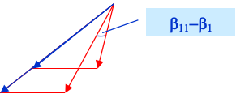

# 本章提要

* 任务：研究结构参数不变、偏离设计(off-design)工况时——级或级组流量与温度、压力的相对变化，以及由此产生的反动度、内功率、效率和轴向推力等的改变，分析和估算对机组安全、经济产生的影响。
* 研究方法：在选定参考工况(如额定设计工况或最大工况)下，以喷嘴非设计工况的运行特性和小参数变化简化分析为基础，将汽轮机通流部分划分为调节级、中间级组和末级组三部分，分析、估算流量与热力参数相对于参考工况的相对变化。
* 核心内容：级或级组的压力流量特性。

# 3.1 渐缩喷嘴的变工况

## （1）变工况流量计算

* 喷嘴流量计算公式：当喷管初压 $p_0^0$ 不变而背压 $p_1$ 变化时

  * 当 $p_1>p_{cr}$ 时，
    
    $$
    G=\mu_{n} A_{n} \sqrt{p_{0}^{0} \rho_{0}^{0}} \sqrt{\frac{2 k}{k-1}\left(\varepsilon_{n}^{\frac{2}{k}}-\varepsilon_{n}^{\frac{k+1}{k}}\right)}=An\beta G_{cr}
    $$

  * 当 $p_1\leq p_{cr}$ 时，
    
    $$
    G_{c r}=0.648 A_{n} \sqrt{p_{0}^{0} \rho_{0}^{0}}
    $$

  

* 变工况时计算公式：当喷管初压 $p_0^0$ 和背压 $p_1$ 同时变化时
  
  $$
  \frac{G_{1}}{G}=\frac{\beta_{1}}{\beta} \frac{G_{c r 1}}{G_{c r}}
  $$

* 当设计工况和变工况均为临界工况时
  
  $$
  \beta_1=\beta=1
  $$

## （2）彭台门数的计算

#### 彭台门数精确计算公式:

$$
\beta=\frac{G}{G_{c r}}=\sqrt{\frac{2}{k-1}\left(\frac{k+1}{2}\right)^{\frac{k+1}{k-1}}\left(\varepsilon_{n}^{\frac{2}{k}}-\varepsilon_{n}^{\frac{k+1}{k}}\right)}
$$

#### 彭台门数近似椭圆计算公式:

$$
\left(\frac{G}{G_{c r}}\right)^2+\left(\frac{\varepsilon_{n}-\varepsilon_{n c}}{1-\varepsilon_{n c}}\right)^2=1\\
\beta=\frac{G}{G_{c}}=\sqrt{1-\left(\frac{\varepsilon_{n}-\varepsilon_{c r}}{1-\varepsilon_{c r}}\right)^{2}}=\sqrt{1-\left(\frac{p_{1}-p_{c}}{p_{0}^{0}-p_{c}}\right)^{2}}
$$

## （3）流量特性分析

#### 初参数不变时的流量特性 

工况改变时：

$$
G_{1} / G=\beta_{1} / \beta
$$

#### 不同初参数时的临界流量关系

$$
\frac{G_{c r 1}}{G_{c r}}=\frac{p_{01}^{0}}{p_{0}^{0}} \sqrt{\frac{T_{0}^{0}}{T_{01}^{0}}}\\\frac{G_{c r 1}}{G_{c r}}=\frac{p_{01}}{p_{0}} \sqrt{\frac{T_{0}}{T_{01}}}\\\frac{G_{c r 1}}{G_{c r}}=\frac{p_{01}^{0}}{p_{0}^{0}}
$$

#### 初、终参数同时改变时的运行特性(不论是否达到临界)

$$
\frac{G_{1}}{G}=\frac{\beta_{1}}{\beta} \frac{G_{c r 1}}{G_{c r}}=\frac{\beta_{1} p_{01}^{0}}{\beta p_{0}^{0}} \sqrt{\frac{T_{0}^{0}}{T_{01}^{0}}}
$$

## （4）流量锥与流量网

* 在实际计算中，大都采用图解法计算流量，即：使用流量锥或是流量网图
* 假设最大初压为 $p_{0m}^*$ ，相应的最大临界流量为 $G_{0m}$
* 相对初压 $\varepsilon_0=p_0^*/p_{0m}^*$ 、相对背压 $\varepsilon_1 =p_1/p_{0m}^*$

通过喷管的流量与 $G_{0m}$ 之比：

#### 系数关系

$$
\begin{align}
&\varepsilon_{0}=\frac{p_{0}^{*}}{p_{0 m}^{*}} ——相对初压\\
&\varepsilon_{1}=\frac{p_{1}}{p_{0 m}^{*}} ——相对背压\\
&\beta_{m}=\frac{G}{G_{0 m}}=\frac{G}{G} \frac{G_{c r}}{G_{0 m}}=\beta \varepsilon_{0} \\
&\varepsilon_{n} \geq \varepsilon_{c r} \rightarrow \beta=\sqrt{1-\left(\frac{\varepsilon_{1}-\varepsilon_{c r} \varepsilon_{0}}{\varepsilon_{0}-\varepsilon_{c r} \varepsilon_{0}}\right)^{2}}=\frac{\beta_{m}}{\varepsilon_{0}}
\end{align}
$$

利用流量网图可以方便地根据三个比值 $\varepsilon_0、\varepsilon_1、\beta_m$ 中的任意两个求出第三个比值。

# 3.2 级与级组的变工况特性

## 3.2.1 级压力—流量特性

### （1）级的临界工况    

* 定义：喷嘴**或**动叶在临界工况下；

* 结论：通过级的流量仅与进口初参数有关。

* 级的临界压比 $\varepsilon_{s c}=p_{c} / p_{0}$。注意：$\varepsilon_{s c} \neq 0.546$

  1）喷嘴临界
  
  $$
  \frac{G_{c r 1}}{G_{c r}}=\frac{p_{01}^{0}}{p_{0}^{0}} \sqrt{\frac{T_{0}^{0}}{T_{01}^{0}}}
  $$
  
  2）动叶临界
  
  $$
  \frac{G_{c r 1}}{G_{c r}}=\frac{p_{11}^{0}}{p_{1}^{0}} \sqrt{\frac{T_{1}^{0}}{T_{11}^{0}}} \approx \frac{p_{11}}{p_{1}} \sqrt{\frac{T_{1}}{T_{11}}}\\
  \Longrightarrow\beta=\frac{G}{G_{c}}=\sqrt{1-\left(\frac{\varepsilon_{n}-\varepsilon_{c r}}{1-\varepsilon_{c r}}\right)^{2}}=\sqrt{1-\left(\frac{p_{1}-p_{c}}{p_{0}^{0}-p_{c}}\right)^{2}}
  $$

##### 证明：动叶临界时流量仅与级的进口参数有关。

由经过喷嘴和动叶流量平衡：

$$
\frac{G_{1}}{G}=\frac{\beta_{1}}{\beta} \frac{p_{01}^{0}}{p_{0}^{0}} \sqrt{\frac{T_{0}^{0}}{T_{01}^{0}}}=\frac{p_{11}}{p_{1}} \sqrt{\frac{T_{1}}{T_{11}}}
$$

略去温度影响，得：

$$
\sqrt{\frac{\left(1-\varepsilon_{c r}\right)^{2}-\left(\varepsilon_{11}-\varepsilon_{c r}\right)^{2}}{\left(1-\varepsilon_{c r}\right)^{2}-\left(\varepsilon_{1}-\varepsilon_{c r}\right)^{2}}}=\frac{\varepsilon_{11}}{\varepsilon_{1}}
$$

方程解为 $\varepsilon_{11}=\varepsilon_{1}$ ；这样，有：

$$
\frac{G_{c r 1}}{G_{c r}}=\frac{p_{01}^{0}}{p_{0}^{0}} \sqrt{\frac{T_{01}^{0}}{T_{01}^{0}}} \approx \frac{p_{01}}{p_{0}} \sqrt{\frac{T_{0}}{T_{01}}}
$$

### （2）级的亚临界工况   

* 变化前后喷嘴、动叶均为亚临界

  1）假想流量    整级膨胀发生在喷嘴中 $G_{a}=\mu_{n} A_{n} \rho_{2 t} \sqrt{2 \Delta h_{t}}$
  
  $$
  G_{a}=\beta G_{c r}=0.648 A_{n} \sqrt{\frac{p_{0}}{v_{0}}} \sqrt{1-\left(\frac{p_{2}-p_{c r}}{p_{0}-p_{c r}}\right)^{2}}
  $$
  
  2）真实流量
  
  $$
  G=\mu_{n} A_{n} c_{1 t} \rho_{1 t}=\left[\mu_{n} A_{n} \rho_{2 t} \sqrt{2 \Delta h_{t}^{0}}\right] \frac{\rho_{1 t}}{\rho_{2 t}} \sqrt{1-\Omega_{m}}=G_{a} \frac{v_{2 t}^{\prime}}{v_{1 t}} \sqrt{1-\Omega_{m}}
  $$
  
  3）非设计工况流量计算
  
  $$
  \frac{G_{1}}{G_{0}}=\frac{G_{a 1} \sqrt{1-\Omega_{m 1}}}{G_{a 0} \sqrt{1-\Omega_{m 0}}} \frac{v_{2 t 1}^{\prime}}{v_{2 t 0}^{\prime}} \frac{v_{1 t 0}}{v_{1 t 1}}\\
  =\sqrt{\frac{\left(p_{01}^{2}-p_{21}^{2}\right)-\left(p_{01}-p_{21}\right)^{2} \varepsilon_{s c} /\left(1-\varepsilon_{s c}\right)}{\left(p_{0}^{2}-p_{2}^{2}\right)-\left(p_{0}-p_{2}\right)^{2} \varepsilon_{s c} /\left(1-\varepsilon_{s c}\right)}} \sqrt{1-\frac{\Delta \Omega_{m}}{1-\Omega_{m}}} \sqrt{\frac{T_{0}}{T_{01}}} \frac{v_{2 t 1}^{\prime}}{v_{2 t 0}^{\prime}} \frac{v_{1 t 0}}{v_{1 t 1}}\\
  $$
  
* 简化模型    

  * 比容变化较小、反动度基本不变，

  * 并略去小量，当 $\left(p_{01}^{2}-p_{21}^{2}\right)>>\left(p_{01}-p_{21}\right)^{2}$ 时：
    
    $$
    \frac{G_{1}}{G_{0}}=\sqrt{\frac{p_{01}^{2}-p_{21}^{2}}{p_{0}^{2}-p_{2}^{2}}} \sqrt{\frac{T_{0}}{T_{01}}}
    $$

### （3）亚临界与临界的混合工况

*  对工况变化前后临界状态发生变化，以临界工况为分界点，作分步计算。

## 3.2.2 级组的压力—流量特性

### （1）级组临界概念

* 1）级组结构与工况划分原则
  * 由**流量相等**前后依次**串联排列**的若干级组成
* 2）级组临界工况    
  * 级组内只要有一列叶栅(喷嘴或动叶)达到临界时，则该级组为临界工况
* 3）级组亚临界工况    
  * 级组内的汽流速度均小于当地音速。

### （2）stodola试验的主要结论与数学描述   

* 上世纪20年代初，stodola在一台转速为4000rpm、8级反动式汽轮机进行试验，研究非设计工况下流量、功率与初压、背压的对应关系（级组临界压比：0.06）

* <u>主要结论1——高真空（低背压）条件下</u>

  * 通流面积不变时，机组的流量近似正比于初压； $（G\ \ p_0）$
  * 电功率近似正比于初压； $（Pe \ \ p_0）$
  * 中间级的级前压力比例于初压； $（p_j \ \ p_0）$

* <u>主要结论2——高背压条件下</u>

  * 背压变、初压不变时：流量与背压呈*椭圆关系*；
  * 背压不变时：则流量与初压按*双曲线关系*变化。

* stodola试验的数学描述

  * 低背压时，级组的流量正比于初压，即
    
    $$
    \frac{G_{1}}{G_{0}}=\frac{p_{01}}{p_{0}}
    $$

  * 考虑温度变化的影响，则
    
    $$
    \frac{G_{1}}{G_{0}}=\frac{p_{01}}{p_{0}} \sqrt{\frac{T_{0}}{T_{01}}}
    $$

#### 1）级组临界工况

级组中只要有1个叶栅达到临界；低压级容易达到临界。

* 临界工况    

  * 临界级
    
    $$
    \frac{G_{c 1}}{G_{c}}=\frac{p_{x 1}}{p_{x}}
    $$

  * 前一级为亚临界
    
    $$
    \frac{G_{c 1}}{G_{c}}=\sqrt{\frac{p_{x-1,1}^{2}-p_{x 1}^{2}}{p_{x-1}^{2}-p_{x}^{2}}} \Longrightarrow \frac{G_{c 1}}{G_{c}}=\frac{p_{x-1,1}}{p_{x-1}}=\frac{p_{x 1}}{p_{x}}
    $$

  * 依次类推，级组临界工况时的压力-流量特性：
    
    $$
    \frac{G_{c 1}}{G_{c}}=\frac{p_{01}}{p_{0}} \sqrt{\frac{T_{0}}{T_{01}}}
    $$
    

#### 2）级组的亚临界工况   

$$
\frac{G 1}{G}=\sqrt{\frac{\left(p_{01}-p_{\operatorname{cr} 1}\right)^{2}-\left(p_{\mathrm{z} 1}-p_{\operatorname{crg} 1}\right)^{2}}{\left(p_{0}-p_{\mathrm{crg} 1}\right)^{2}-\left(p_{\mathrm{z}}-p_{\operatorname{crg} 1}\right)^{2}}}
$$

当级组中级数无限大， $\varepsilon_{crg}$ 趋于零，且同一级组内，级数不变，通流面积不变，则 $\varepsilon_{crg}=\varepsilon_{crg1}=1$ 故有：

$$
\frac{G 1}{G}=\sqrt{\frac{p_{01}^{2}-p_{\mathrm{z} 1}{ }^{2}}{p_{0}^{2}-p_{\mathrm{z}}{ }^{2}}}\Longleftarrow Flugel弗留格尔公式
（级组前温度保持不变条件下）
$$

当变工况前后级组未达到临界状态时，级组的流量与级组前后压力平方差的平方根成正比。

$$
\frac{G 1}{G}=\sqrt{\frac{p_{01}^{2}-p_{\mathrm{z} 1}^{2}}{p_{0}^{2}-p_{\mathrm{z}}^{2}}}\sqrt{\frac{T_0}{T_{01}}}\Longleftarrow 考虑温度修正
$$

### （3）Flugel 公式 $\frac{G 1}{G}=\sqrt{\frac{p_{01}^{2}-p_{\mathrm{z} 1}^{2}}{p_{0}^{2}-p_{\mathrm{z}}^{2}}}\sqrt{\frac{T_0}{T_{01}}}$

上世纪30年代初，Flugel在无穷级、亚临界、各级效率相同且不变、反动度为常数等假设下，理论上对上式作了证明，故称此上式为Flugel公式。

由上式知，<u>初压不变时，流量与背压为椭圆关系；背压不变时，流量与初压为双曲关系。</u>

$$
K=\frac{1}{p_{0}^{2}-p_{z}^{2}} \frac{T_{0}}{T_{01}}\\
\left(\frac{G_{1}}{G}\right)^{2}+\left(\frac{p_{z 1}^{2}}{K}\right)^{2}=\left(\frac{p_{01}^{2}}{K}\right)\\
\left(\frac{p_{01}^{2}}{K}\right)-\left(\frac{G_{1}}{G}\right)^{2}=\left(\frac{p_{z 1}^{2}}{K}\right)^{2}
$$

* Flugel公式的使用条件：
  * 亚临界
  * 通流面积不变
  * 级组中各级流量相等
  * 蒸汽充满流道
  * 级组处于**临界工况时，背压可略去不计**，即流量比例于初压。
  * 当**背压很小时，略去背压的影响**，由流量锥来分析。

* Flugel公式的推广应用

  1. 有抽汽回热级组  大量试验表明：Stodola实验的结论对抽汽回热、中间再热机组同样成立。即在所研究级组中含有抽汽级时，只要是非调整抽汽，抽汽量通常比例于主流流量，此时流量公式仍能使用。

     * 调整抽汽：是指抽汽的压力可以用抽汽的调节门进行调整；
     * 非调整抽汽：是指抽汽的压力不能人为的改变，是随汽轮机的负荷而变化的！

     设 $G_{e x}=k G_{1}, G_{2}=(1-k) G_{1}$

     对这2个级组建立Flugel计算式

     求解得
     
     $$
     \frac{p_{A 1}^{2}-p_{C 1}^{2}}{p_{A}^{2}-p_{C}^{2}}=\frac{p_{B 1}^{2}-p_{C 1}^{2}}{p_{B}^{2}-p_{C}^{2}}
     $$
     
     即有： 
     
     $$
     \frac{G_{1}}{G}=\sqrt{\frac{p_{A 1}^{2}-p_{C 1}^{2}}{p_{A}^{2}-p_{C}^{2}}}
     $$
     
     

  2. 通流部分面积按比例变化  

     * 在通流部分面积按比例变化时，**将流量公式折算为单位面积流量进行计算**。

     * 机组长期运行后通流部分产生均匀性结垢，通流面积减小，导致第一级前的蒸汽压力升高。如果蒸汽流量不变，结垢前后第一级前的蒸汽压力分别为 $p_0、p_{01}$ ，试求通流部分面积的变化率？

       * 设结垢前、后通流面积分别为 $A、A_1$ ，则工况改变前后的单位面积流量与初压的关系为：
         
         $$
         \frac{G_{1} / A_{1}}{G_{0} / A_{0}}=\frac{p_{01}}{p_{0}} \sqrt{\frac{T_{0}}{T_{01}}}
         $$
         
         由此求得：
         
         $$
         \frac{A_{1}}{A}=\frac{p_{0}}{p_{01}} \sqrt{\frac{T_{01}}{T_{0}}}
         $$

***

* 例题1：某凝汽式汽轮机，额定蒸汽流量为 $132.6t/h$ ，调节级汽室压力为 $1.67MPa$ 。当机组流量降为 $90t/h$ 时，试问此时调节级汽室的压力为多少？又，压力级结垢通流面积减少 $5\%$ 后，蒸汽量 $90t/h$ 下调节级汽室压力是多少？
  
  分析思路：
  
  * （1）将通流部分分为调节级和其后的压力级；
  * （2）凝汽式意味着背压远低于初压。
  
  解：
  
  (1)对压力级，不计背压和温度变化的影响。有
  
  $$
  \frac{G_{1}}{G}=\frac{p_{01}}{p_{0}}, \frac{90}{132.6}=\frac{p_{01}}{1.67}, \quad p_{01}=1.133 \mathrm{Mpa}
  $$
  
  (2)结垢后通流面积减少5％，则
  
  $$
  \frac{G_{1} / A_{1}}{G / A}=\frac{p_{01}}{p_{0}}, \frac{90}{132.6} \times \frac{1}{0.95}=\frac{p_{01}}{1.67}, \quad p_{01}=1.193 \mathrm{Mpa}
  $$
  
  * 级数增、减时流量和压力关系：实际应用中，因某种需要拆除某个级，此时要求分析拆除后对一些级的强度的影响。对这类综合应用问题：分析的原则是合理划分级组，从结构没有改变的级组开始计算。

***

* 例题2：某凝汽式汽轮机共有10级，第6级因故障被迫拆除。试问拆除后若流量仍为设计值，则调节级汽室的压力变化多少？哪个级所受影响最大？

  |   级次   |   调节   |    2     |    3     |    4     |    5     |    6     |    7     |    8    |    9    |   10   |
  | :------: | :------: | :------: | :------: | :------: | :------: | :------: | :------: | :-----: | :-----: | :----: |
  | 级后压力 | 1.176MPa | 0.862MPa | 0.612MPa | 0.426MPa | 0.282MPa | 0.179MPa | 0.104MPa | 62.2MPa | 32.3MPa | 4.9MPa |

  分析：将结构不变的级分为一组。

  解：

  本例分为3个级组，第I级组是调节级到第5级，第II级为第6级，第III级组为第7～10级。

  (1)拆除第6级后，因流量没变，故第III级组前的压力不会变化。第I级组后压力由原0.282MPa变为0.179MPa，由级组压力、流量特性关系求调节级后压力变化
  
  $$
  \frac{P_{01}^2-p_6^2}{p_0^2-p_5^2}=\frac{p_{01}^2-0.179^2}{1.176^2-0.282^2}=1,\quad p_{01}=1.1556MPa
  $$
  
  (2)显然，在拆除第6级后，对调节级汽室的影响较小，受影响最大者为第5级，因为
  
  $$
  \frac{p_{41}^{2}-p_{6}^{2}}{p_{4}^{2}-p_{5}^{2}}=\frac{p_{41}^{2}-0.179^{2}}{0.426^{2}-0.282^{2}}=1,\quad p_{41}=0.36459 M P a
  $$
  
  即第5级的压差由
  （4级后）0.426——（5级后）0.282＝0.144MPa
  上升到：0.36459——（6级后） 0.179＝0.18553MPa，约增大28.9%。

  ***

### 主蒸汽流量的虚拟测量  

主蒸汽流量用孔板或喷管测量，产生节流损失，对600MW机组，估计一年损失$ 500,000

基于汽轮机级组压力、流量关系，实现主蒸汽流量的虚拟测量

$$
\frac{G_{1}}{G_{0}}=\sqrt{\frac{p_{01}^{2}-p_{z 1}^{2}}{p_{0}^{2}-p_{z}^{2}}} \sqrt{\frac{T_{0}}{T_{01}}}
\Longrightarrow
G_{1}=K \sqrt{\frac{p_{01}^{2}-p_{z 1}^{2}}{T_{01}}}
$$

### 应用实例

* 某台一次再热超高压凝汽式汽轮机的功率突然下降40%，此时机组无明显振动，机组参数变化如下表所示，负号表示降低。功率降低后，一些参数又基本稳定不变，各监视段压力近似成比例降低

| 负荷 | 给水流量 | 调节级后压力 | 中间再热后压力 | 高压缸效率 | 低压缸效率 |
| :--: | :------: | :----------: | :------------: | :--------: | :--------: |
| -40% |   -36%   |     -42%     |      -44%      |   -1.8%    |   -0.4%    |

* 分析原因：调节级后压力和中间再热后压力降低，表明蒸汽流量变小，这由给水流量也相应变小而证实。由于各监视段压力与流量仅此成正比，故可以认为各非调节级段的工作是正常的，流量的突降是调节级或调节级之前的通流部分故障所致。
* 由于通流部分故障并未引起机组振动情况的改变，因而可以认为流量突降不是转动部分的机械损坏所致，调节级喷嘴、动叶损坏使流量增大，调节级叶片段落可能使非调节级第一级喷嘴堵塞而使调节级后压力升高。但上述情况均与事实相反，因此不大可能是调节级的损坏。
* 调节汽门阀杆断裂将使汽门一直处于关闭或者近于关闭的位置。为了判断故障，移动油动机，握起阀杆，在第一调节汽门应该开大的范围内，发现流量并不增大，表明这一阀门动作失灵
* 停机检查：结果是第一调节汽门阀杆断裂。

# 3.3 变工况下相关参数的变化

## 3.3.1 变工况下比焓降的变化

* 非设计工况下级的焓降变化分析
  * 级的理想比焓降为级前温度和级前后压力比的函数。

$$
\Delta h_{t}=\frac{k}{k-1} p_{0} v_{0}\left[1-\left(\frac{p_{2}}{p_{0}}\right)^{\frac{k-1}{k}}\right]=\frac{k}{k-1} R T_{0}\left[1-\left(\frac{p_{2}}{p_{0}}\right)^{\frac{k-1}{k}}\right]
$$

* 变化规律分析 $（Pel-D-Ɛ-∆h）$
  * 分析时灵活划分级组，充分利用非设计工况下级组流量比例于初压的特殊关系。
  * 在临界或低背压情况下，级组流量相对变化等于初压的相对改变。

### （1）凝汽式汽轮机

* 对级组<u>所有满足流量比例于初压的级，由于级的压比没变，故焓降亦基本不变。</u>
* 调节级：复杂（一阀全开&二阀未开时：焓降最大）
* 中间各级：焓降基本不变、内功率与流量成正比
* 末级：流量降低时——压比增大、比焓降减小
* 背压决定于凝汽器工况和排气管压损，不与流量成正比

### （2）背压式汽轮机的流量、压力、焓降关系

$$
\left(\frac{p_{21}}{p_{01}}\right)^{2}=1-\frac{p_{0}^{2}-p_{2}^{2}}{\left(p_{0}^{2}-p_{z}^{2}\right)+\left(\frac{G}{G_{1}}\right)^{2} p_{z 1}^{2}}
$$

* 当流量 $G1$ 减小时， $G/G1$ 增大， $p_{21}/p_{01}$ 增大，级内比焓降减少，反之增加。
* <u>级组前压力较级组后压力越大，焓降变小则越少</u>，反之亦然。即前几级的焓降降低较缓，后几级则降低较大。
* 结论：在机组负荷降低时，调节级的焓降增大，中间级基本不变，末级或末数级焓降减小。（图3-6）

## 3.3.2 变工况下反动度的变化

### 变化机理

* 非设计工况下反动度的变化取决于**级的焓降变化和反动度的本底值**。在级焓降变化时，动叶汽流相对进口角发生变化，从而破坏了喷嘴、动叶的流量平衡，导致级反动度的变化，使之建立与新工况对应的新的流量平衡。分析以流量平衡为基础。

* 工况变化前后的流量关系：
  
  $$
  \frac{G_{1}}{G}=\frac{A_{n} c_{11}}{v_{11}} / \frac{A_{n} c_{1}}{v_{1}}=\frac{A_{b} w_{21}}{v_{21}} / \frac{A_{b} w_{2}}{v_{2}}
  $$

* 在小变化假设下，认为喷嘴、动叶出口处比容同比例变化，即：
  
  $$
  \frac{v_{1}}{v_{11}} \frac{v_{21}}{v_{2}} \approx 1\\
  由此得\frac{c_{11}}{c_{1}}=\frac{w_{21}}{w_{2}}
  $$
  
  

* 在级焓降减小时， $c_{11}<c_1$ ，则 $\beta_{11}>\beta_1$ ，由速度Δ得，
  
  $$
  \frac{w_{11} \cos \left(\beta_{11}-\beta_{1}\right)}{w_{1}}<\frac{c_{11}}{c_{1}}
  $$

* 动叶汽流相对速度是动叶焓降与进口相对速度有效分量的共同贡献，
  
  $$
  w_{21}=\sqrt{2 \Delta h_{b 1}+\left[w_{11} \cos \left(\beta_{11}-\beta_{1}\right)\right]^{2}}<\sqrt{2 \Delta h_{b 1}+\left(w_{1} c_{11} / c_{1}\right)^{2}}
  =\sqrt{\frac{\Omega_{1}}{1-\Omega_{1}} c_{11}^{2}+w_{1}^{2} \frac{c_{11}^{2}}{c_{1}^{2}}}
  =\frac{c_{11}}{c_{1}} \sqrt{\frac{\Omega_{1}}{1-\Omega_{1}} c_{1}^{2}+w_{1}^{2}}
  $$

如果反动度不变，就有 $w_{21}<\frac{c_{11}}{c_{1}} \sqrt{\frac{\Omega}{1-\Omega} c_{1}^{2}+w_{1}^{2}}=\frac{c_{11}}{c_{1}} w_{2}$ ，与流量平衡关系 $\frac{c_{11}}{c_{1}}=\frac{w_{21}}{w_{2}}$ 矛盾，即焓降变化时反动度必然改变。

* 因 $\Omega/(1-\Omega)$ 为单调增函数，**在级焓降减小时只有增大反动度**，方可使上述关系与流量平衡关系一致。反之亦然。机理上：流入动叶速度小了之后，形成流动阻塞，从而使动叶入口处压力升高，参数调整。
* 由于 $\Omega/(1-\Omega)$ 的增量随 $\Omega$ 的增大而增大，这样，级焓降变化幅度相同时，反动度本底值(基础值)较小的级反动度变化较大才能满足流量平衡关系，而反动度本底值较大的级反动度变化较小即可满足流量平衡关系。即：在非设计工况下，反动度较小的级反动度变化较明显，反动度较大的级反动度变化较小。

### 机组负荷下降时不同级的反动度变化

* 由前非设计工况下（降负荷）焓降分析已知—— 
  * 调节级：焓降增大，则反动度下降；
  * 中间级：焓降基本不变，则反动度亦基本不变；
  * 末级或末数级：焓降减小，则反动度增大，但因反动度的本底值较大， 反动度的变化不很明显。

### 两种特殊情况

* （1）对于反动式汽轮机，动叶的进口角接近于90º，此时无论级的焓降增加还是减小，均会使反动度增大，但改变量很小，通常可以认为不变。
* （2）动叶超临界时，因背压下降而使级焓降增大，则反动度总是增大。

## 3.3.3 变工况下轴向推力的变化

### 影响因素分析

* 转子上的轴向推力是由动叶上的汽流力、压差力和叶轮及转子凸肩两侧的压差力组成。汽流力正比于流量，压差力决定于级前、后的压力和压力反动度，故轴向推力是蒸汽流量、反动度、压力反动度、级前后压差的函数，即 $F_{z}=F_{z}\left(G, \Omega, \Omega_{p}, p_{0}-p_{2}\right)$ 。
* 可以利用Flugel公式分析级非设计工况下这些参数的变化。<u>流量减小，轴向推力减小；反动度和压差增大，轴向推力则上升。</u>

### （1）喷嘴配汽凝汽式汽轮机——其他级

* 在机组负荷下降时，中间级的反动度基本不变，末级或末数级因反动度本底值较大而变化不显著；
* 可以认为动叶前后压差变化不大；
* 这些级的轴向力的变化<u>主要决定于流量的变化</u>，即：随机组负荷减小而减小。

### （2）喷嘴配汽凝汽式汽轮机——调节级

*  $Pel↓$ ，调节级 $Ω↓$ 、流量 $G↓$ ，轴向力 $F_z$ 总趋势是下降的。
* 在机组下降幅度较大时，调节级的焓降增大(压降)引起的轴向力增大<u>接近甚至强于</u>流量减小产生的轴向力减小。
* 变化规律：调节级的 $F_z$ 在 $Pel↓$ 时
  1. 先是 $G$ 减小占主导地位， $F_z$ 随负荷下降而减小；
  2. 其后汽流速度增大引起的轴向力增大逐步逼近于流量减小产生的轴向力减弱，轴向力随负荷下降而下降的趋势减缓；
  3. 调节级轴向力最大点出现在第一调节阀全开而第二阀未开时，比焓降达到最大值。（图3-22点a）。

## 3.3.4 变工况下效率的变化 

* 非设计工况下级效率的变化主要决定于焓降的变化
  * 调节级和末级组焓降在机组负荷下降时发生变化，则级效率下降；
  * 中间级因焓降基本不变，级效率也不变。

机组负荷下降时各级焓降、反动度、轴向力、效率的变化：

|   级   |   焓降   |  反动度  |   轴向力   |   效率   |
| :----: | :------: | :------: | :--------: | :------: |
| 调节级 |   增大   |   减小   |    复杂    |   减小   |
| 中间级 | 基本不变 | 基本不变 | 随流量减小 | 基本不变 |
| 末级组 |   减小   | 略有增大 | 随流量减小 |   减小   |

# 3.4 汽轮机的调节方式和调节级的变工况

>汽轮机需要与电网负荷相适应，当外界负荷改变或者根据电网调度的要求，汽轮机通过调节结构，改变机组出力，使之与电网负荷相适应。

* 汽轮机配汽：改变汽轮机的改变进汽量 $D_0$ 和焓降 $\Delta h$ 来改变功率输出。
* 主要方式：节流配汽、喷嘴配汽、滑压配汽和补汽（旁通）配汽

## 3.4.1 节流配汽

* 原理：利用<u>调节汽阀</u>节流降压改变进汽量和焓降

* 特点

  * 优点：<u>通流部分</u>结构不变和效率及热状态基本不变，机构简单

  * 缺点：节流损失大，效率低;节流产生的节流损失使通流部分的理想焓降减小，因而使汽轮机的<u>相对内效率</u>下降。

  * 规律：节流效率大小（与结构无关，与蒸汽的初终参数和进汽量大小相关）：同 $p_c$ 下， $Pel↓$ ， $\eta_{th}↓$ ；同 $Pel$ ， $p_c$ 越高， $\eta_{th}$ 越 $↓$ 。

    高真空的<u>凝汽式汽轮机</u>采用节流调节时，即使负荷在很大范围内变化，节流效率也下降不多。<u>背压式汽轮机</u>则因其背压太大，而不宜采用节流调节。

    
    
    $$
    \eta_{i}=\frac{\left(\Delta h_{i}^{T}\right)^{\prime}}{\Delta{h}_{t}^{T}}=\frac{\left(\Delta h_{t}^{T}\right)^{\prime}}{\Delta h_{t}^{T}} \frac{\left(\Delta h_{i}^{T}\right)^{\prime}}{\left(\Delta h_{t}^{T}\right)^{\prime}}=\eta_{th} \eta_{i}^{\prime}\\
    $$
    
    $\eta_{i}$ ——节流后汽轮机的相对内效率
    
    $\eta_{t h}$ ——调节阀的节流效率
    
    $\eta_{i}^{\prime}$ ——汽轮机通流部分的相对内效率
    

## 3.4.2 喷嘴配汽

* 原理：多个调节汽门**顺序开启**，改变进汽量，仅有一个调节汽门节流提高效率

* 特点：

  * 设有部分进汽调节级，多个调门、部分节流
  * 理想焓降基本不变，效率高，调节级后温度变化大

  

### 3.4.2.1 喷嘴配汽过程分析

* 阀点时的热力过程分析

  * 阀点：调节汽门顺序开启过程中，调门全开、没有节流损失对应的点。I阀点，II阀点……
  * 方法：通流部分分为调节级和非调级组两部分，且假设调节级的反动度为零。

* 提醒：<u>调节级后压力是分析、计算的关键点 !!!</u>
  
  $$
  \frac{G_{11}}{G_{10}}=\frac{p_{11}}{p_{1}} \sqrt{\frac{T_{10}}{T_{11}}}
  $$

#### 补充知识

* 调节级为什么做成纯冲动级？
  * ①因为调节级均采用部分进汽，工作时动叶通道不是连续地通过工作蒸汽。当旋转着的动叶通过无喷嘴的弧段时，就成为动叶前后的漏汽通道，而**反动级动叶前后压差比较大，严重的漏汽损失将会造成级效率的极大降低**。
  * ②另外冲动级做功能力大且级前后压差小，**满足了调节级便于负荷响应的要求**。所以喷嘴调节的汽轮机调节级采用冲动式。
* 调节级作用与特点
  * 作为汽轮机的第一级,在运行时,可通过改变其通流面积来控制其进汽量，从而达到调节汽轮机负荷的目的。
  * 在调节级，主蒸汽的压力和温度都有很大的降低，**减少了转子上其他级叶片用重要金属的数量和减少缸体及叶片尺寸面积**。

***

* 例：某设有4个调节级喷嘴组的凝汽式汽轮机，主蒸汽 $p_0=16.67\mathrm{MPa},\quad t_0=550\degree C$ ，喷嘴组的喷嘴数依次为4、4、6、8。设计工况下4个调门全开，额定流量 $G=300t/h$ ，此时调节级后压力为 $10.0\mathrm{MPa}$ 。试求I、II、III阀点对应的流量。设调节级的反动度为零。

  解析：<u>各阀点通过调节级的流量一定是最大流量与流量比系数的乘积。</u>

  解：

  (1)由压比 $\varepsilon=\frac{10}{16.67}=0.59988$ 计算：
  
  $$
  \beta=0.99293
  $$
  
  (2)最大流量：
  
  $$
  G_{\text {max }}=G_{0} / \beta=302.14 \mathrm{t} / \mathrm{h}
  $$
  
  (3)III阀点时最大流量：
  
  $$
  G_{\text {max }}^{I I I}=302.14 \times \frac{14}{22}=192.27 \mathrm{t} / \mathrm{h} \\
  $$
  
  (4)II阀点时最大流量：
  
  $$
  G_{\text {max }}^{I I}=302.14 \times \frac{8}{22}=109.87 t / \mathrm{h} \\
  $$
  

  (5)I阀点时最大流量
  
  $$
  G_{\max }^{I}=302.14 \times \frac{4}{22}=54.93 \mathrm{t} / \mathrm{h}
  $$

***

* 非阀点时的热力过程分析  
  * 存在部分节流。解决调门中的蒸汽流量分配和部分开启调门后的压力计算
* 计算方法  
  * 以阀点流量计算为先导，求出各调门的流量分配用喷嘴或单级压力、流量关系计算部分开启调门后的压力

***

* 例：上例中，求蒸汽流量为 $180t/h$ 时的调门流量分配和部分开启调门后的压力。

  解：

  (1) $180t/h$ 时调节级后压力
  
  $$
  p_{11}=10\times\frac{180}{300}=6\mathrm{MPa}
  $$
  
  (2)流量分配：调节级临界，I、II阀全开，III阀部分开启，
  
  $$
  \begin{array}{l}
  G_{\max }^{I I}=302.14 \times \frac{14}{22}=192.27 t / h \\
  G_{\max }^{I I}=302.14 \times \frac{8}{22}=109.87 \mathrm{t} / \mathrm{h} \\
  G_{\max }^{I}=302.14 \times \frac{4}{22}=54.93 \mathrm{t} / \mathrm{h}
  \end{array}
  $$
  
  (3)调门后压力：III喷嘴组当作单独1个级。

  额定工况时流量为 $81.82t/h(=300\times6/22)$

  当前工况流量：
  
  $$
  G^{I I I}=180-109.87=70.13 \mathrm{t} / \mathrm{h}
  $$
  
  级后压力已知，由 $\frac{G_{1}}{G_{0}}=\sqrt{\frac{p_{01}^{2}-p_{11}^{2}}{p_{0}^{2}-p_{1}^{2}}}$ ：
  
  $$
  \frac{70.13}{81.82}=\sqrt{\frac{p_{01}^{2}-6^{2}}{16.67^{2}-10^{2}}} \Longrightarrow p_{01}=\mathrm{1 2 . 9 M P a}
  $$

### 3.4.2.2 调节级变工况分析

* 变工况分析
  * 调节级各喷嘴组的<u>流量</u>、调节级后状态点和调节级各<u>喷嘴组前的进汽状态点</u>。
  * 通常假设：
    * ①调节级的反动度为零，
    * ②级后压力比例于流量，
    * ③各调节汽门顺序开启时没有重迭度。
* 喷嘴配汽的特点
  * 通过多个调节汽门的顺序开启，减小部分负荷时调节汽门的节流损失；
  * <u>调节级结构变化，但调节级后结构不变。</u>

#### （1）调节级后的状态点

* 模型与假设：<u>调节级作为孤立级，非调各级为1个级组。</u>略去调节级后温度变化的影响，且认为背压远低于调节级后压力。
* 流量与压力关系：<u>调节级后压力与流量呈线性关系</u>。
* 焓值确定：<u>质量流量加权平均</u>（按总能量不变原则）。调节级后状态点的焓值决定于<u>对应各喷嘴组动叶出口焓</u>。
* 调节级效率：同样地，调节级的效率也为<u>喷嘴组质量流量加权平均</u>。
* 因为在机组部分负荷下，仅有<u>1个调节汽门部分开启产生节流损失</u>；
* 此外，部分负荷下调节级的<u>熵增小</u>于节流调节，故循环效率影响较小。

因此，喷嘴调节部分负荷下的效率要**高于**节流调节

#### （2）调节级压力、流量关系

* 指调节级后及喷嘴组前的压力与调节级流量的对应关系。
* 在略去调节级后温度变化影响时，调节级后压力与流量成线性正比关系，图中0－8线。

当喷嘴组前的压力高于对应流量下的$p_c'$时，该喷嘴组处于临界流动，反之为亚临界流动。

* 第I调门顺序开启时

  * 将第I喷嘴组与非调各级构成一个级组，在此过程中该级组中通流面积保持不变，可直接利用Flugel公式。
  * 因背压很低，则机组流量直接比例于第I喷嘴组前的压力。也即在第I调门顺序开启过程中，第I喷嘴组前的压力高于 $p_c’$ ，处于临界工况。

* 第II调门顺序开启时

  * 因调节级后已有一定压力，在刚开启时第II调门的节流作用使第II喷嘴组前的压力低于 $p_c’$ ，第II喷嘴组处于亚临界工况，通过该喷嘴组的流量与喷嘴组前的压力成**椭圆曲线关系**。

* 随着第II调门开度的进一步增大

  * 节流作用减弱，第II喷嘴组前的压力逼近并超过 $p_c’$ ，第II喷嘴组由亚临界工况转为临界工况，通过第II喷嘴组的流量与该喷嘴组前的压力由椭圆关系转为**线性关系**。

* 第III调门的顺序开启过程与第II调门类似

  * 所不同的是因调节级后压力升高，第III喷嘴组由亚临界工况与临界工况的转折点推后。

* 第IV调门主要用于加强负荷、低初参数及高背压工况

  * 第IV调门顺序开启时，因调节级后压力已经很高，故第IV喷嘴组在调门顺序开启中基本上处于亚临界工况。

* 顺序开启过程中流量－压力关系：

  * 通过先开调门喷嘴组的流量将随调节级后压力上升而发生变化。

  * 当喷嘴组的压力高于pc’时，该喷嘴组为临界工况，通过的蒸汽量不随调节级压力升高而变化；

  * 而当调节级后压力进一步升高时， $p_c’$ 增大，在 $p_c’$ 高于全开调门喷嘴组前的压力时，该喷嘴组由临界工况转为亚临界工况，通过的流量将随调节级后压力升高而减小。

    

#### （3）喷嘴调节运行特性分析要点

* 着重分析、估算：机组不同负荷或流量下——调节级各喷嘴组的流量分配及各喷嘴组前的压力。
* 紧紧抓住三个关键点
  * 调节级后压力比例于流量
  * 全开调门对应喷嘴组前的压力等于初参数
  * 假设反动度为零
* 计算要点
  * 以<u>调节级后压力计算为切入点</u>，
  * 以判定各喷嘴组临界与亚临界工况以及全开调门喷嘴组最大流量为<u>中介</u>；
  * 以单级或单喷嘴非设计工况压力、流量特性计算为基本算法，求得全开及部分开启调门的<u>流量分配和部分开启喷嘴组前的压力</u>。

***

* 例：某初参数为 $p_0=16.67\mathrm{MPa},\quad t_0=550\degree C$ 的凝汽式汽轮机，设有4个调节级喷嘴组，各喷嘴组的喷嘴数依次为8、6、4、4。设计工况下4个调节汽门完全开启，额定流量为 $G=300t/h$ ，此时调节级后压力为 $10.0\mathrm{MPa}$ 。假定调门开启无重迭度、调节级反动度为零，且全开调门的级相对内效率为 $0.7$ ，调门部分开启的级相对内效率为 $0.65$ ，调门全开时对应喷嘴组前的压力为 $15.88\mathrm{MPa}$ 。
  试求机组流量为 $225t/h$ 时：
  （1）各调门的流量分配，
  （2）部分开启调门前的压力，
  （3）调节级出口状态点。

  解：
  ①计算非设计工况调节级后压力 $p_{11}$
  
  $$
  \frac{G_{1}}{G}=\frac{p_{11}}{p_{1}}, \quad p_{11}=\frac{225}{300} \times 10.0=7.5 \mathrm{MPa}
  $$
  
  ②判定设计与非设计工况全开调门喷嘴组的工作状态设计与非设计工况下调节级的压比分别为：
  
  $$
  \varepsilon=\frac{10.0}{1588}=0.63, \quad \varepsilon_{1}=\frac{7.5}{15.88}=0.472
  $$
  
  显然，<u>设计工况下全开调门的喷嘴组处于亚临界，而非设计工况下全开调门喷嘴组处于临界工况。</u>
  
  由设计工况的压比 $0.63$ ，求得对应的流量比系数：
  
  $$
  \beta=0.982
  $$
  
  由设计工况的实际流量求得对应初参数的临界流量：
  
  $$
  G_{cr}=\frac{300}{0.982}=305.5t/h
  $$
  
  对应单个喷嘴的最大(临界)流量为：
  
  $$
  \frac{305.5}{22}=13.8864t/h
  $$
  
  ③计算非设计工况的流量分配（ $225t/h$ ）
  
  因各调节汽门顺序无重迭开启，且非设计工况下全开调门喷嘴组处于临界工况，则：
  
  第I调门喷嘴组的临界流量 $111.091t/h\Rightarrow$ 第I调门全开
  
  第II调门喷嘴组的临界流量 $83.318t/h\Rightarrow$ 第II调门全开
  
  第II调门喷嘴组的临界流量 $55.5456t/h\Rightarrow$ 第III调门部分开启
  
  即在 $225t/h$ 工况下第III调门的流量分别是 $30.591$ 。
  
  ④计算第III喷嘴组前的压力
  
  $$
  \because\frac{G_{III 1}}{G_{I I I}}=\sqrt{\frac{p_{III 1}^{2}-p_{11}^{2}}{p_{III}^{2}-p_{1}^{2}}}\\
  \therefore p_{III 1}=\sqrt{\left(\frac{30.591}{54.545}\right)^{2}\left(15.88^{2}-10^{2}\right)+7.5^{2}}=10.204 M P a
  $$
  
  ⑤计算调节级出口状态点
  
  分别由全开及部分开启调门喷嘴组前、后的压力和初温，求得对应的理想焓降 $232kJ/kg$ 和 $105kJ/kg$ 
  
  由相对内效率 $(0.7，0.65)$ 分别求得：实际焓降 $162.4kJ/kg$ 和 $68.25kJ/kg$ 。在 $h-s$ 图上求得实际状态点分别为 $3271.6$ 和 $3365.8kJ/kg$ ；
  
  按质量流量加权平均求得非设计工况下调节级出口状态点的焓为 $3284.4 kJ/kg$ 。

### 3.4.2.3 喷嘴配汽实际状况

* （1）调节级后<u>温度变化</u>的影响    
  * 部分负荷时调节级膨胀加大，调节级后温度降低、蒸汽比容减小 $\Rightarrow\Rightarrow$ 故在相同调节级压力下流量增大，亦即相同流量下调节级后压力下降。
* （2）主汽门<u>节流压损</u>随机组流量增大而增大  
  * 机组流量增大后，主汽门的节流压降增大，使各调节汽门前的压力在机组负荷增大时下降。 
* （3）调节汽门开启有一定<u>重迭度</u>    
  * 通过调门的蒸汽流量与调门开度之间呈非线性关系，特别在调门接近全开时，为保证汽轮机控制系统有良好的调节品质，力求使调门升程与流量成线性关系，为弥补先调门接近全开时的非线性，<u>后续调门提前开启</u>。这样，调门开启有一定重迭度。
* （4）调节级有一定<u>反动度</u>
  * 在机组<u>负荷下降</u>时，全开调门喷嘴组的<u>理想焓降增大</u>，<u>反动度下降</u>；反之则增大。
    随机组负荷下降，调节级反动度减小，使喷嘴后压力更接近于调节级动叶后压力。

### 3.4.2.4 喷嘴配汽特征

* 喷嘴配汽的主要特征
  * 【优点】部分负荷下仅有一个调门起着节流降压作用，尽管存在部分进汽损失，但<u>效率仍高于节流配汽</u>。
  * 【缺点】部分负荷下调节级后压力降低，<u>全开调门对应喷嘴组的焓降增大</u>，使调节级后<u>温度下降较大</u>，转子、叶轮等部件上有可能产生<u>较大的热应力</u>，不利于机组的运行安全，**必须限制机组负荷的变化速率。**

## 3.4.3 滑压配汽

### （1）工作机理

* 参数
  * 调节汽门全开或保持某个开度不变
  * 在机组负荷改变时，主蒸汽温度维持不变
  * <u>主蒸汽压力</u>跟随外界负荷变化要求而改变。
* 模型
  * 滑压运行时，<u>汽轮机的通流面积保持不变</u>
  * 故在非设计工况运行特性分析时，<u>可将汽轮机整个通流部分作为一个级组。</u>

#### 滑压运行与定压运行的比较

* 滑压运行：（也称变压运行）指单元机组中，汽轮机调节汽门全开或开度不变，负荷改变时，调节锅炉燃料量、给水量和空气量，改变锅炉出口蒸汽压力与流量，而蒸汽温度保持不变，来实现汽轮机的负荷变化。

* 定压运行：前面讲到的配汽方式（节流调节、喷嘴调节，保持主气阀前蒸汽参数不变，改变调节阀开度）统称为定压运行。

  

### （2）工作特点

1. 对相对内效率的影响
   * 部分负荷下进汽压力下降，并且排汽湿度降低
   * 高压缸：部分负荷时容积流量加大，级相对内效率较喷嘴配汽有所提高
   * 低压级：湿度降低，湿汽损失减小，低压级的相对内效率有所提高。
2. 对循环效率的影响
   * 进汽参数降低，机组的有效焓降减小，循环热效率下降
3. 优缺点
   * 优点是进汽的热状态较稳定
   * 缺点是机组快速响应外界负荷要求（一次调频）的能力较差
4. 补偿作用
   * 若采用变速给水泵：机组负荷、主蒸汽压力下降时
   * 给水压力降低、给水泵转速减小
   * 使给水泵的驱动功率下降。可弥补部
     分负荷时循环效率减小产生的损失。

### （3）滑压配汽的主要方式

1. 纯滑压调节：适应性差

2. 节流滑压调节：适应性强、有节流损失

3. 复合滑压调节：一般采用“定-滑-定”方式

   高负荷区(80%~95%)，定压运行（初压高，热循环效率高）

   中间负荷(80～50%)，滑压运行（节流损失小）

   

## 3.4.4 三种配气方式的运行特性

* 汽轮机配汽特性比较的讨论重点
  * 热经济性
  * 安全性
  * 响应能力（外界负荷变化要求）

### （一）经济性

1. 喷嘴配汽
   * 部分负荷下：调节级温度变化较大，影响非调各级相对内效率
   * 由于至多有一个调门产生节流，尽管调节级效率随机组负荷下降而减小，但整机的理想焓降不变，绝对内效率较高
2. 滑压配汽
   * 汽轮机叶栅通道的进口温度高于节流配汽
   * 滑压配汽的叶栅通道理想焓降大
3. 节流配汽的经济性最差

### （二）安全性（温度、汽流力）

1. 温度变化
   * 喷嘴配汽在机组部分负荷下调节级后温度变化较大
   * 节流、滑压配汽的进汽温度基本不变
   * 低负荷时：节流、滑压配汽方式低压级的温度较小，有利于机组安全
2. 汽流力变化
   * 喷嘴配汽在机组低负荷时，喷嘴的烩降很大：动叶所受汽流加大
   * 顺序开启：则在第调门全开、第即将开启时，调节级的焓降最大，亦即动叶所受的汽流力达到最大

### （三）负荷响应能力

1. 喷嘴、节流配气
   * 由改变调门开度来改变汽轮机的进汽量和焓降
   * 调节汽门的动作速度很快：能快速响应外界扰动
2. 滑压配气
   * 由锅炉改变燃料量和给水量达到控制主蒸汽压力
   * 滞后的时间很长，机组不能快速响应外界

### 小结    

* 节流配汽尽管负荷适应性和响应能力较强，但经济性较差，故一般不采用。
* 滑压配汽的负荷适应性较好，经济在采用变速给水泵后，接近于喷嘴配汽，有与喷嘴配汽竞争的实力。             

不同配汽方式的运行特性比较：

| 配汽方式 | 经济性 | 安全性 | 响应能力 |
| :------: | :----: | :----: | :------: |
| 喷嘴配汽 |   好   |   差   |    好    |
| 节流配汽 |   差   |  较好  |    好    |
| 滑压配汽 |  较好  |   好   |    差    |

# 3.5 凝汽式汽轮机的热力特性和运行工况图

$$
热力性能指标
\begin{cases}
相对内效率\\
绝对内效率\\
热耗率q(或者HR)\\
汽耗量D:电功率为Pel时所消耗的蒸汽量\\
汽耗率d:单位功率所消耗的蒸汽量\\
空载汽耗量D_{nl}：
\begin{cases}
汽轮机空载运行所需的进气量\\
空载汽耗量占机组额定进气量的份额称为空载汽耗率\\
小型机组7～10\%，大型机组3～5\%。
\end{cases}\\
汽耗微增率d_1:
\begin{cases}由于汽轮机在不同负荷下效率不尽相同，\\
在某个负荷点处的汽耗称为汽耗微增率。\\
d_1=dD/dP_{el}
\end{cases}\\
\end{cases}
$$

### 运行工况图    

* 描述汽轮发电机组的**电功率与汽耗量**之间关系的曲线。
* 不同的配汽方式，在机组不同负荷时，汽轮机通流部分的效率不尽相同。因此，运行工况图应与配汽方式相关。

### 节流配汽工况图 

* 空载时效率为零，汽耗率最大。随机组负荷增大，节流损失减小，效率上升，汽耗率下降，汽耗量近似比例于功率。

  

### 喷嘴配汽的工况图  

* 与节流配汽相似，随机组负荷增大，效率提高，汽耗率下降。

* 差别在于喷嘴配汽当调门全开时节流损失最小，故汽耗率、汽耗量及效率均为曲折线。
  
  
  $$
  D=D_{n l}+d_{1} P_{e l} \\
  D=D_{n l}+d_{1}\left(P_{e l}\right)_{e}+d_{1}^{\prime}[P_{e l}-(P_{e l})_{e}]
  $$

#### 不同配汽方式的运行特性

* 图3-21比较了节流调节、喷嘴调节方式下的汽耗状况。

# 3.6 初终参数变化对汽轮机的影响

变工况影响因素： $G、p_0、t_0、p_c$

## （1）主蒸汽压力 $p_0$ 变化的影响

$$
P_{i}=\frac{G \Delta H_{t} \eta_{r i}}{3600}\\
\frac{\Delta P_{i}}{P_{i}}=\left(1+\frac{k-1}{k} \frac{\left(p_{z} / p_{0}\right)^{\frac{k-1}{k}}}{1-\left(p_{z} / p_{0}\right)^{\frac{k-1}{k}}}\right) \frac{\Delta p_{0}}{p_{0}}
$$

#### 经济性：

* 调节汽门开度不变：压力升高，进汽量增大，理想焓降增加，功率增加，经济性越好。
* 维持功率不变：节流损失和朗肯循环效率的影响相互抵消，压力变化，经济性基本不变。

#### 安全性：

* 调门全开时，初压 $p_0$ 上升，所有级均过负荷运行，末级最危险。（压力过高，承压部件和调节级叶片危险。）
*  初压 $p_0$ 下降时，若要保持功率 $P_i$ 不变，则进气量 $G$ 增加，非调节级前压力增大！（压力过低，若要保持功率，则流量增大，末级叶片危险。）

## （2）主蒸汽温度 $t_0$ 变化的影响

#### 经济性：

从流量、理想比焓降分析：
$$
D_1=D\sqrt{T_0/T_{01}}\\
\Delta H_{t1}=\Delta H_t\frac{T_{01}}{T_0}
$$

*  $t_0$ 变化不大时，一定 $p_c$ 下，功率增量与温度增量近似成正比
*  $t_0$ 变化对相对内效率、循环效率均有影响（湿度改变）

#### 安全性：

*  $t_0$ 升高，金属寿命受影响，超过整定值时，要停机！

*  $t_0$ 降低，为保证负荷，则需要增加流量，会使湿度、轴向推力都增大，影响机组的安全。

* 延伸：配备中间再热汽轮机，中间再热温度的变化：

   $t_{rh}$ 的升高——高缸负荷减少，中低缸过负荷；

   $t_{rh}$ 的降低——高缸过负荷，中低缸级的反动度增大，轴向推力增大（级的焓降降低，反动度增大）

## （3）排汽压力(背压) $p_c$ 变化的影响

#### 经济性：

虽然 $p_c$ 变化和功率变化呈直线关系，但是由于 $p_c$ 涉及到凝汽器系统的换热，要综合考虑，得到最佳真空。

#### 安全性：

背压升高，轴向推力增大，排汽温度升高，低缸排汽缸变形，末级还有可能振动，危险！

# 3.7 变工况下的热力计算

* 计算前提：给定通流面积 $A$ 和蒸汽流量 $G$ 
* 详细核算方法：顺序法或者逆序法
  * 一般采用逆序法。
* 计算步骤
  * 确定级后状态点 $\to$ 确定动叶出口状态点以及流动参数 $\to$ 确定动叶进口状态点 $\to$ 确定喷嘴出口状态及对应的流动参数 $\to$ 确定喷嘴进口状态 $\to$ 校核
  * 涉及到一些迭代计算
* 变工况下的逐级计算方法
  * 平移过程线，校核初参数；
  * 最末几级和调节级变化较大，中间级可采用平移法。

# 3.8 变转速汽轮机

#### 小汽机驱动给水泵特点

* 降低末级叶片叶高和末级的余速损失；
* 独立于电网，可保证小汽机转速稳定；
* 可利用小型启动锅炉、厂内汽源，启动灵活；
* 系统复杂、启动时间长。

#### 小汽机的变工况运行

* 特点：变参数、变转速、变功率
* 与汽轮机工况、给水泵、凝汽设备特性有关。

#### 给水泵参数与主蒸汽流量的关系

$$
P_p=0.2778Q_bp/\eta_p\\
p=p_0+\Delta p_0+\Delta p-p_g+\Delta Z\gamma
$$

* <u>滑压运行比定压运行消耗功率小的多</u>
* 滑压运行转速 $n$ 下降，见图3-31

#### 小汽机参数与主蒸汽流量的关系

* 相关参数：理想比焓降、转速、功率
*  $p_{0x}$ 和 $G$ 相关，于是 $\Delta H_t$ 也和 $G$ 同向变化
* 小汽机功率 $P_i$ 随负荷降低的速度不变（ $\Delta H_t$ 变化先慢后快， $n$ 的变化先快后慢）
* 泵效率降低先慢后快，泵扬程相反；因此小汽机调节阀先关小，再开大。（见图3-33）
