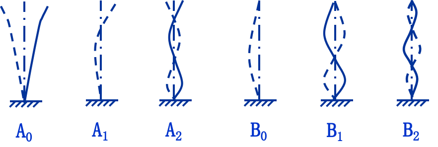
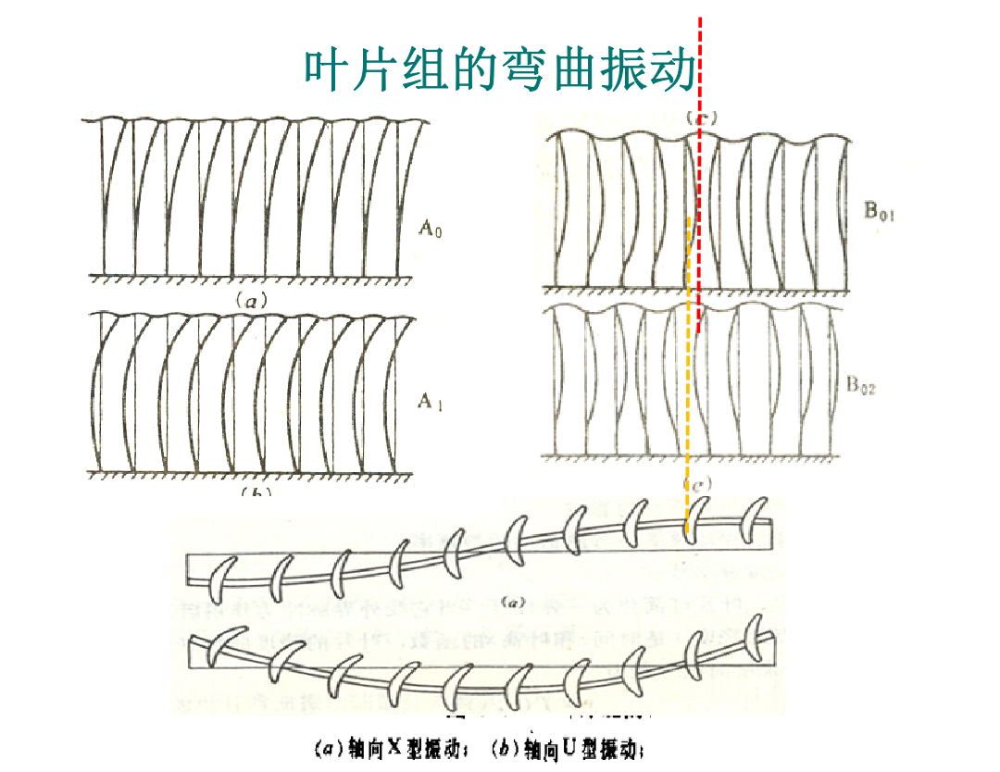
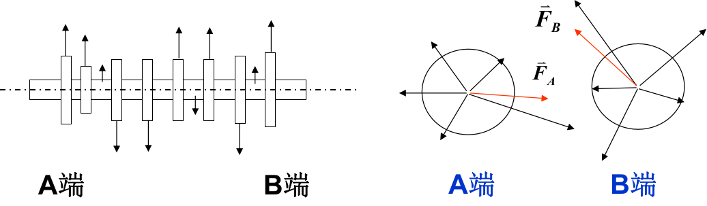

# 5.1 静止部分结构

## 汽轮机的本体结构——静止部分

* 汽缸、隔板、法兰、法兰螺栓、轴承、汽封等

#### 汽缸

* 作用：隔绝汽轮机通流部分和大气，支承汽轮机其他静止部件
* 受力：本体重量、蒸汽流动反作用力、热应力。
* 高中压缸：大机组采用双层结构；采用合缸布置优点在于应力小，轴向推力易平衡，缺点在于形状复杂、布置复杂、安装检修也复杂。
* 低压缸：尺寸大，主要问题在于如何保证其刚度、解决好热膨胀问题。
* 其他：进汽部分、中低压连通管、支承和滑销系统。
* 汽缸结构需满足以下几方面：
  * 保证足够的强度和刚度，足够好的蒸汽严密性
  * 保证各部分受热时能自由膨胀，并能始终保持中心不变
  * 通流部分具有较好的流动性能
  * 汽缸形状要简单、对称，壁厚变化要均匀
  * 节约贵重钢材消耗量
  * 工艺性好，便于加工制造、安装、检修，也便于运输。

#### 隔板、隔板套  /  静叶环、静叶持环

* 隔板：固定汽轮机各级的静叶片和阻止级间漏汽，将汽轮机通流部分分隔为若干级
* 隔板套：用于固定隔板
* 静叶环/静叶持环：反动式汽轮机中无叶轮和隔板，动叶片直接安装在转子外缘，静叶固定在汽缸内壁或静叶持环上。静叶环支承在静叶持环中，静叶持环固定在汽缸上。

# 5.2 汽轮机转动部分结构

## （1）汽轮机的本体结构——转动部分

* 动叶片、叶轮（反动式汽轮机为转鼓）、主轴、联轴器等

#### 转子

* 轮式——具有安装动叶片的叶轮，冲动式汽机；
* 鼓式——没有叶轮，直接安装在转鼓上，**反动式**汽机。

#### 叶轮

* 作用：转叶片，并传递汽流力在叶珊上产生的扭矩。
* 构成：轮缘、轮面和轮毂。

#### 动叶片

* 作用：将蒸汽的热能转换为转子转动的机械能。
* 要求：有良好的流动性能以保证较高的能量转换效率；有足够的强度和完善的振动性能。

## （2）动叶片的结构

* 由叶型、叶根、叶顶三部分组成 

### 1）叶型

* 叶型是动叶片的基本部分，相邻叶片的叶型部分构成汽流通道。

### 2）叶根部分

* 定义：叶根是将动叶片固定在叶轮或轮毂上的连接部分
* 要求：它的结构应保证在任何运行条件下都能牢固地固定，同时力求结构简单、装配方便。
* 分类：常用的叶根型式有T型、叉型和枞树型。
  * **T型叶根**
    * 优点：结构简单，加工方便。缺点：叶根会对轮缘两侧产生弯矩，使轮缘有张开的趋势。
    * 装配方法：周向埋入法。
    * 应用：中短叶片
  * **叉型叶根**
    * 优点：叉尾数目可根据叶片离心力大小选择，因而强度高，适应性好。同时加工简单，更换叶片方便。缺点：装配工作量大，且需要较大的轴向空间，限制了它在整段转子和焊接转子上的应用。
    * 装配方法：从径向插入轮缘上的叉槽中，并用铆钉固定。
    * 应用：多用于大型汽轮机的<u>调节级和末几级</u>。
  * **枞 $(\mathrm{c\bar{o}ng})$ 树型叶根**
    * 优点：这种叶根的承载截面接近按等强度分布，叶根的齿数可按叶片上载荷来选择，因此承载能力大，强度适应性好，拆装方便。
    * 缺点：加工复杂，精度要求高。
    * 装配方法：叶根沿轴向装入轮缘上的枞树型槽中。  
    * 应用：主要用于载荷大的叶片，如末级叶片等。

### 3）叶顶

* 在叶顶处将叶片连接成组的**围带**和在叶型部分将叶片连接成组的**拉金**。

#### 拉金（拉筋）

* 作用：增加叶片的刚性，改善其振动性能。
* 型式：焊接拉金、松装拉金（阻尼拉金）、Z型拉金等。

#### 围带

* 作用：
  * 减小叶片工作的弯<u>应力</u>；
  * 增加叶片<u>刚性</u>，调整叶片的自振频率，以避开共振，提高叶片振动安全性；
  * 使叶片顶部封闭，避免蒸汽从汽道顶部逸出，有的围带还装设汽封，减少了级间<u>漏汽</u>损失。
* 结构型式
  * 整体围带、铆接或焊接围带、弹性拱形围带。

# 5.3 叶片振动

* 对象：汽轮机的零件强度与应力
* 原因：引起叶片振动的激振力
* 分类：叶片振动的基本振型
* 特性：叶片的自振频率
* 准则：叶片动强度的安全准则和叶片调频

## 5.3.1 汽轮机的零件强度

1. 强度：分析计算的要素 & 分类
2. 应力：汽轮机零件的主要应力类型 & 基本计算方法
3. 动叶片的静强度分析
4. 围带、拉筋对叶片弯曲应力的影响

### 一、强度

#### 1）强度定义与强度分析计算的要素 

* 工程材料的强度：抵抗外力产生的某种应力或应变的能力。
* 汽轮机零件的强度：<u>在外力作用下，零件内部所产生的某几种应力或应变与组成零件材料所能抵抗这几种应力或应变的能力</u>。
* 外力、应力或应变、材料的许用极限：成为强度分析、计算的**三要素**。

#### 2）强度分析的分类

* 静强度：外力和应力（或应变）的大小及方向<u>不随时间而变</u>，即静态或准静态力应力。
  * 如：动叶上的离心应力和汽流弯曲应力，转子和汽缸的热应力等。
* 动强度：外力和应力或应变的大小及方向<u>随时间而变</u>，特别是惯性质量对部件运动的影响。
  * 如：动叶和转子的振动等。

### 二、汽轮机零件的主要应力类型和计算方法

$$
\left.\begin{array}{l}
拉伸应力&转子上的离心拉伸应力\longrightarrow高速旋转产生的离心力引起\\
弯曲应力&
\begin{cases}
动叶上的汽流弯曲应力\longrightarrow蒸汽作用力引起\\
拉筋、围带等弯曲应力\longrightarrow拉筋、围带变形引起
\end{cases}\\
扭转应力&
\begin{cases}
转子扭转应力\longrightarrow传递扭矩\\
长叶片扭转应力\longrightarrow扭转变形
\end{cases}\\
剪切应力&叶根销钉等的剪切应力\longrightarrow传递扭矩\\
\end{array}\right\}
静强度\\
振动应力\quad转动部件的振动应力
\left\{\begin{align}
汽流扰动\qquad\qquad\qquad\qquad\quad\\
惯性质量\qquad\qquad\qquad\qquad\quad
\end{align}\right\}
动强度\\
转子和汽缸的热应力\longrightarrow零件内部温度不均匀\\
产生条件: 存在温差、热膨胀受阻、材质不均匀
$$

#### 应力基本计算方法   

* 对应的应力或应变状态：利用力学基本理论与方法，分析特定环境下各零件的受力特征，由受力截面的几何参数计算。
* 三个安全系数计算：然后根据工作条件选定材料的机械性能参数，计算出<u>最大受力工况、最大应力水平所对应的屈服、蠕变和持久强度。</u>

### 三、动叶片的静强度分析

#### 汽流弯曲应力分析

* 对压力级，随机组负荷增大而增大
* 对喷嘴调节的**调节级，最大工况发生于第一调门全开、第二调门即将开启时**，因为此时调节级的焓降最大、而部分进汽度为最小

#### 措施

* 在叶片长度一定时，减小动叶片的汽流弯曲应力，应增大截面惯性矩、减小中性轴出口边缘的距离。
* 如：调节级动叶片采用宽叶片。

### 四、围带、拉筋对叶片弯曲应力的影响

* 基本特征：固定在动叶片顶部的围带和叶片中间部分的紧拉筋，当叶片弯曲变形时，连接处的弯曲变形转角使围带和拉筋产生弯曲变形，随之**产生反抗这种变形的反弯矩**，阻止叶片弯曲变形。
* 影响：围带和拉筋的存在，增强了动叶片的抗弯刚度、进而可以减小叶片的弯曲应力。

## 5.3.2 引起叶片振动的激振力

### 一、激振力现象、原因及后果

* 原理：当叶片的自振频率等于脉冲激振力频率或为其整数倍时，叶片发生**共振**，振幅增大，并产生很大的交变动应力。

* 原因：**由流场不均引起**，与结构因素、制造和安装误差及工况变化等相关。

  流场不均原因：结构扰动、叶栅尾迹扰动

* 性质：对旋转的叶片来说，激振力对叶片的作用是**周期性**的，导致叶片振动，所以叶片是在振动状态下工作的。

* 后果：运行经验表明，在汽轮机事故中，叶片损坏占相当大比重，其中又**以叶片振动损坏为主**。

——据国外统计，叶片事故约占汽轮机事故25％上

——据国内1977年对1156台汽轮机统计，发生叶片损坏或断裂事故者约占31.7％。 

### 二、分类

#### 1）低频激振力

* ##### 概念：

  由于制造加工的误差及结构等方面的原因，<u>**级的轮周上个别地方**</u>汽流速度的大小或方向可能异常，动叶每转到此处所受汽流力就变化一次，这样形成的激振力频率较低，称为低频激振力。

* ##### 产生的原因：

  * 个别喷嘴损坏或其加工尺寸有偏差
  * 上下两隔板接合面处喷嘴错位，或隔板接合面有间隙
  * 级前后有抽汽口
  * 高压级采用窄喷嘴时，为了保证隔板的强度和刚度，在窄喷嘴前圆周向均匀地设置了**加强筋**
  * 采用**喷嘴配汽方式**，每两个喷嘴组之间被不通汽的弧段隔开，且沿圆周向不一定对称

* ##### 低频激振力频率的计算：

  * 假设一级中有 $i$ 个均匀分布的激振源：
    $$
    f_{d}=\frac{1}{T}=\frac{\omega}{2 \pi / i}=\frac{2 \pi n}{2 \pi / i}=i n
    $$
    $T$ ——激振力的周期， $s$ 

    $n$ ——转子转速， $r/s$ 

    $\omega$ ——激振力的圆频率， $rad/s$ 

    能够引起叶片共振的低频激振力的频率 $f_d$ 为转子转速的 $i$ 倍。

#### 2） 高频激振力

* ##### 概念：

  由于<u>**喷管出汽边**</u>有一定的厚度及<u>叶型</u>上的附面层等原因，喷管出口汽流速度沿圆周分布不均匀，使得蒸汽对动叶的作用力分布不均匀，<u>动叶每经过一个喷管</u>所受的汽流力就变化一次，即受到一次激振。
  
* **计算：**

  * 全周进汽的级：该级喷嘴沿圆周向是均匀分布的，整圈喷嘴数目为 $Z$ ，高频激振力频率为：
    $$
    f_d=\frac{2\pi n}{2\pi/Z}=Zn
    $$
    $Z=40～80; n=50 r/s；f_d=2000～4000 Hz$ 

  * **部分进汽的级：**未开调节汽门的喷嘴也包括在不进汽弧段内，设部分进汽度为 $e$ ，则部分进汽级喷嘴尾迹引起的高频激振力频率为：
    $$
    f_d=\frac{Z'}en
    $$
    其中： $\frac{Z'}e$ 称为当量喷嘴数

## 5.3.3 叶片振动的基本振型

### 叶片振动的基本型式

叶片在不均匀汽流力的作用下，可以产生两种型式

* 轴向振动：绕最大主惯性轴的振动为轴向振动。
* 切向振动：由于叶片的最大主惯性轴与轮周方向的夹角较小，故将绕截面最小主惯性轴（沿最大主惯性轴）的振动称为切向振动。气流几乎沿着切向作用在叶片上，而且振动又发生在叶片刚性最小的切线方向。切向振动最容易发生也最危险。

#### 切向振动——振型分类  

* A型振动：叶顶自由、并参与振动的振型
* B型振动：叶顶固定或叶顶基本不动的振型

$$
基本振型
\begin{cases}
自由叶片
\begin{cases}
弯曲振动
\begin{cases}
切向振动\Longrightarrow
叶片绕截面最小主惯性轴的振动
\begin{cases}
A型振动\\
B型振动
\end{cases}
\\
轴向振动\Longrightarrow
叶片绕截面最大主惯性轴的振动
\end{cases}\\
扭转振动
\end{cases}\\
叶片组\begin{cases}
弯曲振动
\begin{cases}
切向振动\\
轴向振动
\end{cases}\\
扭转振动
\end{cases}\\
\end{cases}
$$
叶片是连续质量分布的弹性体，存在着无限多个自振频率节点或节线。 

**节点——振动时不动的点，振幅为0**
$$
切向振动
\left\{\begin{align}
\begin{array}{r}
叶身振动\\
顶端振动
\end{array}\longrightarrow
A型振动\\
\begin{array}{r}
叶身振动\\
顶端不振动
\end{array}\longrightarrow
B型振动
\end{align}\right\}
\begin{array}{l}
A_0、A_1、A_2\cdots\cdots\\
(根据出现节点(不动点)
的多少——几阶振型)\\
B_0、B_1、B_2\cdots\cdots
\end{array}
$$

动叶片最危险的振动为 $A_0$ 型振动， $B_0$ 型次之。

### 单个叶片扭转振动    

* 沿叶片高度方向绕截面形心轴线的振动，主要发生于长扭叶片。与弯曲振动相似，对应于各阶扭转振动自振频率，叶片上多个节线。
* 节线越多，扭振频率越高，节线两侧叶片的扭振方向相反。
* 图中有单、双、三节线的振型，分别称为 $T_1、T_2、T_3$ 型扭振。 

### 叶片组的振动    

* 由围带和拉筋连成叶片组后，叶片同样会产生弯曲振动和扭转振动。
* 弯曲振动有切向和轴向两种形式。

## 5.3.4 叶片振动的自振频率

叶片是一个弹性体，若外力迫使其离开原平衡位置，一旦外力除去，则叶片在平衡位置两侧作往复自由振动，其振动频率为叶片的自振频率。

* 静频率——叶片静止时的自振频率
* 动频率——叶片旋转时的自振频率

叶片的自振频率与尺寸、材料性质以及两端固定的方式有关，是叶片固有特性。

### 叶片自振频率的计算——力学模型    

* 叶片是具有连续质量分布的弹性体，**应由连续介质力学研究振动的自振频率**。

* 在简化分析中，将叶片简化为悬臂梁，在旋转力场中，离心力可简化为一轴向力。建立微元体的力、力矩平衡方程，并由弯矩、转角关系代入力、力矩平衡方程，便可求得叶片振动动力学方程：
  $$
  \frac{\partial^{2}}{\partial x^{2}}\left[E I \frac{\partial^{2} y}{\partial x^{2}}\right]+\rho A_{x} \frac{\partial^{2} y}{\partial \tau^{2}}=0
  $$
  $E$ ——叶片材料的弹性模量， $Pa$ 

  $I$ ——叶片截面的最小形心主惯性矩， $m^4$ 

  $ρ$ ——叶片材料密度， $kg/m^3$ 

  $A$ ——叶片截面面积， $m^2$ 

### 边界条件

* 叶根处：固定，即位移和转角为零；
* 叶顶处：
  * 对A型振动，叶顶为自由，即弯矩和剪力为零；
  * 对B型振动，叶顶为固定，即位移和转角为零。

### 等截面叶片的自振频率

* 对叶片振动动力学方程，可用分离变量法来求解，即认为叶片的自由振动是时间和空间函数的迭加。
  $$
  f_s=\frac{(k l)^{2}}{2 \pi} \sqrt{\frac{E I}{\rho A l^{4}}}=\frac{(k l)^{2}}{2 \pi} \sqrt{\frac{E I}{m l^{3}}}
  $$

  $m$ ——叶片的质量， $kg$ 

  $l$ ——叶片的高度， $m$ 

  $kl$ ——叶片频率方程式的根，其值与叶片振型有关，值可以有无限个。

#### 叶片的自振频率取决于以下因素：

1. 叶片抗弯刚度 $EI$ 。 $EI$ 越大，频率越高。
2. 叶片质量 $m$ 。 $m$ 越大，频率越低。
3. 叶片高度 $l$ 。 $l$ 越高， $m$ 越大，刚度减小，频率越低。
4. 叶片频率方程根 $kl$ ，其值与叶片的振型有关。

由上式可知：叶片自振频率只与结构尺寸和材料性能有关，与激振力大小无关。 

#### 影响叶片自振频率的实际因素

1. ##### 温度修正：

   一般金属材料的弹性模量随温度升高而降低，因此，当叶片温度升高时，其自振频率将降低。温度修正系数为： $K_t=\sqrt{E_t/E_0}$ 。

   $E_t$ 和 $E_0$ 分别为工作温度和20℃时叶片材料的弹性模量。

2. ##### 根部牢固性修正：

   在叶片自振频率计算中，假设叶根为固定。实际中叶根依靠紧力安装在槽道中，在叶片振动时叶根将出现松动，其位移和转角不等于零，<u>相当于降低了叶根处的约束，将导致叶片自振频率下降。</u>用牢固性系数 $K$ 来修正， $f=KK_t(kl)^2/2\pi\times\sqrt{EI/(ml^3)}$ 

3. ##### 离心力修正：

   离心力的存在，相当于在叶片上作用径向力，阻止叶片弯曲变形，即等同于增强叶片抗弯刚度，自振频率必然升高。
   
   $$
   f_d=\sqrt{f_s^2+Bn^2}
   $$
   
   $f_s$ ——经过 $K$ 和 $K_s$ 修正的静频率

   $n$ ——叶片的工作转速

   $B$ ——动频系数
   
   $$
   \begin{aligned}
   等截面:&B=0.8 \frac{D_m}{l}-0.85 \\
   变截面：&B=0.69 \frac{D_m}{l}-0.3+\sin ^{2} \beta
   \end{aligned}
   $$
   
   $l$ ——叶片高度

   $D_m$ ——叶片平均直径

   $β=2/3β_r+1/3β_t$  

   $β_r$ ——根部叶型安装角的余角

   $β_t$ ——顶部叶型安装角的余角

4. ##### 叶片成组 

   * 围带和拉筋产生的反弯矩阻止叶片弯曲，增大叶片抗弯刚度，将使叶片的自振频率升高。
   * 但围带和拉筋的惯性质量又使叶片的自振频率降低。
   * 一般是升高

## 5.3.5  叶片调频与动强度安全倍率

|      | 安全准则旧标准                                       | 安全新准则                                  |
| ---- | ---------------------------------------------------- | ------------------------------------------- |
| 制定 | 苏联1941年第三届叶片与叶轮会议通过的标准             | 我国1980年完成的汽轮机叶片振动强度安全准则  |
| 标
准 | （1）弯应力小于许用应力                              | （1）采用抵抗疲劳破坏能力的安全倍率 $A_b$   |
|      | （2）临界转速避开工作转速的某一范围                  | （2）采用静动载荷联合作用的耐振强度 $σ_a^*$ |
| 特点 | 未考虑承受动应力能力和静应力的大小；
忽视了耐振强度。 |                                             |

### 耐振强度 $σ_a^*$ 

表示材料在承受动静应力时的一种机械性能。

在某一温度和某一静应力下，对 $\phi6$ 无缺口试件在空气环境中，做“弯一弯”实验，循环 $10^7$ 次不破坏可承受的最大动应力，称耐振强度 $σ_a^*$ 。

它与静应力有关。

### 叶片最危险的共振（叶片振动的主振型）

1. 切向 $A_0$ 型振动的动频率与低频激振力频率 $k_n$ 合拍
2. 切向 $B_0$ 型振动的动频率与高频激振力频率 $z_n$ 相等
3. 切向 $A_0$ 型振动的动频率与高频激振力频率 $z_n$ 相等

### 叶片调频    

通过改变叶片的自振频率、或改变激励力的频率分布，使叶片偏离共振状态运行。

### 调频叶片与不调频叶片

* 调频叶片：对于单叶片，对某几个主振型<u>必须通过调频避开某类激励力的频率</u>，才能使叶片的动应力小于许用的耐振强度，保证叶片的运行安全。
* 不调频叶片：某个主振型的频率即使与激励力的频率相等，<u>不作任何调频措施也能保证叶片的运行安全</u>。

#### 1、不调频叶片安全准则

* 对不调频叶片的安全评价，主要应判明叶片共振时的**动应力是否在许用耐振强度值以内**。
* 广泛应用于**国产汽轮机高中压级**。

$$
A_{b}=\frac{\left(\sigma_{a}^{*}\right)}{\left(\sigma_{s . b}\right)} \geq\left[A_{b}\right]
$$

$\sigma_{s.b}$ ——叶片振动方向的蒸汽弯曲应力

$[A_b]$ ——许用安全倍率，叶片安全与危险的界限值。

新准则对不同振型所推荐的许用安全倍率值如下（不调频叶片 $A_0$ 型振动的 $[A_b]$ 值）：

|  $k$  |  2   |  3   |  4   |  5   |  6   |  7   |  8   |  9   |  10  |  11  |  12  |
| :---: | :--: | :--: | :--: | :--: | :--: | :--: | :--: | :--: | :--: | :--: | :--: |
| $A_b$ |      |  10  | 7.8  | 6.2  | 5.0  | 4.4  | 4.1  | 4.0  | 3.9  | 3.8  | 3.7  |

$$
振动倍率\qquad k=\frac{f_d}n
$$

当 $k=2$ 时（有时当 $k=3$ 时），不采用不调频叶片，而是用调频叶片避开共振，确保叶片安全运行。

对 $B_0$ 型振动**与 $z_nn$ 共振**的不调频叶片，取 $[A_b]=10$ 。

对 $A_0$ 型振动**与 $z_nn$ 共振**的不调频叶片，全周进汽级的 $[A_b]=45$ ，部分进汽级的 $[A_b]=55$ 。

#### 2、调频叶片的安全准则

* 当单叶片的某个主振型不能保证运行安全时，必须将此主振型的频率调离激励力的频率一定范围。
* 调频叶片的动强度准则，不仅要求动频率有<u>一定的避开率</u>，而且动强度的<u>安全倍率应大于许用值</u>。

##### 1） $A_0$ 型频率与 $kn$ 的避开要求和安全倍率

###### ① 频率分散度（各叶片或叶片组的制造尺寸、安装质量有所差异，振动频率也有所差异）

$$
\Delta f=\frac{f_{\max }-f_{\min }}{\left(f_{\max }+f_{\min }\right) / 2} \times 100 \%
$$

叶片频率分散度：一个叶轮上测得的各叶片最大与最小自振频率差与平均值比的百分率。一般要求最大分散度小于8%。

说明：频率<u>**分散度大于8%**</u>说明叶片装配质量不合格。

调频叶片的频率可以避开低频激振力的范围：

因动频系数 $B_b>1$ ，当 $n=50r/s$ 时， $f_d>50\mathrm{Hz}$ ，故 $k>1$ 。

当 $k≥7$ 时， $f_d≥350\mathrm{Hz}$ ，考虑到允许8%的频率分散度，即使把叶片频率设计为 $f_d=375\mathrm{Hz}$ ，由于 $\Delta f$ 可达 $28\mathrm{Hz}$ ，即叶片频率可在 $375\mathrm{Hz}$ 基础上，向上或向下分散 $28\mathrm{Hz}$ ，仍有个别叶片的频率为 $350\mathrm{Hz}$ 或 $400\mathrm{Hz}$ ，无法避开 $50\mathrm{Hz}$ 的整数倍。这些叶片会发生共振而损坏。这是不允许的。

* 由于叶片频率存在一定的分散度，因此：

  调频叶片的频率只能避开振动倍率 $k=2～6$ 的低频激振力。当 $k≥7$ 时，对于低频激振力发生共振的叶片，只能制成不调频叶片。

###### ② 要求调频叶片的频率避开低频激振力的范围

<u>对于 $A_0$ 型振动，要求叶片频率与 $k_n$ 避开 $7.5\mathrm{Hz}$ 以上。</u>

如果叶片的动频率 $f_d$ 在 $kn$ 和 $(k-1)n$ 之间，叶片频率与激振力频率之间应满足如下关系：

$$
A_{0}型频率与kn的避开要求:
\left\{\begin{array}{l}
f_{d 1}-(k-1) n_{\max }>7.5 \mathrm{~Hz} \\ k n_{\min }-f_{d 2}>7.5 \mathrm{~Hz}
\end{array}\right.
$$

$f_{d1}$ ——转速 $n$ 为上限时的最低动频率

$f_{d2}$ ——转速 $n$ 为下限时的最高动频率

汽轮机转速变化的上下限：

$$
n_{\min }=49.5 \mathrm{r} / \mathrm{s} \quad n_{\max }=50.5 \mathrm{r} / \mathrm{s}
$$

##### 2） $B_0$ 型振动频率与 $z_nn$ 的避开要求

当要求某叶片的动频率避开高频激振力频率时，该叶片的静频率已经很高，动频率和静频率很接近，可认为 $f_d≈f_s$ 。（B0型振动发生于叶片组的叶片）

新标准中用静频率代替动频率

######  $B_0$ 型频率避开率的要求如下：

$$
\left\{\begin{align}
\Delta f_{1}=\frac{f_{1}-z_{n} n}{z_{n} n} \times 100 \%>15 \% \qquad f_{1}:最低静频率\\
\Delta f_{2}=\frac{z_{n} n-f_{2}}{z_{n} n} \times 100 \%>12 \% \qquad f_{2}:最高静频率
\end{align}\right.
$$

######  $B_0$ 型振动安全倍率的要求：

若叶片组 $B_0$ 型振动的 $A_b$ 值是小于 $10$ 的较大值，如 $A_b=4～9$ ，则对 $B_0$ 型振动的调频叶片频率避开率，推荐用下述经验公式计算：

$$
\left\{\begin{align}
\Delta f_{1}=18-A_{b} \\
\Delta f_{2}=15-A_{b}
\end{align}\right.
$$

由上式可知， <u>$A_b$ 较大说明动强度裕量较大，频率避开率可取得小些</u>；反之，应取得大些。

### 电厂现场调频的方法

1. 重新安装叶片，改善安装质量

   * 叶片经过一段时间运行后，常出现叶根松动，频率下降或频率分散度大于8%的现象。
   * 这时要考虑研磨叶根间接合面，以增加接触面积及叶根与轮缘的紧力，改善安装质量。

2. 增加叶片与围带或拉筋的连接牢固度

   * 重新打铆叶片与围带的铆钉，以及在围带或拉筋与叶片连接处加焊，增加它们对叶片的反弯矩，**相当于增加叶片组抗弯刚度**，使叶片组频率升高。

3. 加大拉筋直径或改用空心拉筋

   加大拉筋直径及在连接处加焊，**增加拉筋对叶片的反弯矩**，或采用空心拉筋使振动体质量减小，提高频率。
   
4. 增加拉筋数目（可以较明显的提高叶片组的频率。但**增加拉筋数目，会增加对汽流的扰动**，使级效率降低。）

5. 改变成组叶片数目

6. 增设拉筋或围带

7. 叶顶钻孔

8. 采用长弧围带

# 5.4 汽轮机转子的振动

## （1）转子临界转速：

机组启动或停机过程中，在某些转速下，会出现振幅增大的现象。**工程上，把出现振幅峰值的转速称为转子的临界速度**，由低到高依次为第一阶、第二阶、……临界转速，用 $n_{c1}、n_{c2}$ …表示。

$$
n_{c}=\frac{60 \omega_{k}}{2 \pi}=\frac{30 n^{2} \pi}{l^{2}} \sqrt{\frac{E I}{\rho A}}
$$
据转子工作转速是否高于其第一临界转速，将转子分为：刚性转子和挠性转子。

#### 转子临界转速：

与转子直径、重量、几何形状、两段轴承的跨度、轴承支承刚度有关

转子直径越大，重量越轻，跨度越小，轴承支承刚度越大，转子临界速度越高。
$$
n_0<n_{c1}\qquad刚性转子
$$
出于安全的考虑。对刚性转子，一般要求：
$$
n_{c 1}=(1.25 \sim 1.8) n_{0}\\
\\
n_{0}>n_{c 1} \qquad  挠性转子
$$
若挠性转子的工作转速介于 $n_{c1}$ 和 $n_{c2}$ 之间，则临界转速应满足下列安全要求：
$$
1.4 n_{c 1} \leq n_{0} \leq 0.7 n_{c 2}
$$
大型汽轮机转子,因轴系很长,为减少轴向尺寸和重量，刚度较小，转速较高，一般为挠性转子。

## （2）分类：强迫振动和自激振动

### 引起强迫振动的原因

* 机组内存在<u>机械性干扰力</u>

  转子质量不平衡、转子连接和对中有缺陷、转子弯曲、转子受到机械摩擦力。

* 转子支承系统的条件改变

* <u>电磁力的不平衡</u>

### 引起自激振动的原因

* 轴承<u>油膜</u>振荡
* <u>间隙</u>振荡（汽隙振荡）

# 5.5 汽轮机动静平衡试验简介

* 转子不平衡
  * 静不平衡、动不平衡、混合不平衡
* 刚性转子的平衡精确度
  * 刚性转子找静平衡
  * 低速找动平衡、高速找动平衡
* 挠性转子的平衡
* 轴系平衡

### （1）静平衡

在转子一个校正面上进行校正平衡，校正后的剩余不平衡量，以保证转子在静态时是在许用不平衡量的规定范围内，为静平衡<u>又称单面平衡</u>。

### （2）动平衡

在转子两个校正面上同时进行校正平衡，校正后的剩余不平衡量，以保证转子动态时是在许用不平衡量的规定范围内，为动平衡<u>又称双面平衡</u>。

#### 实际刚性转子的动平衡

实际中，汽轮机是一个连续质量体。

把转子分段，每段都存在质量不平衡，将每段的偏心离心力分别分解到两端。在两端分别形成一个不平衡离心力。

在两端分别加平衡质量，将两个不平衡离心力平衡。
