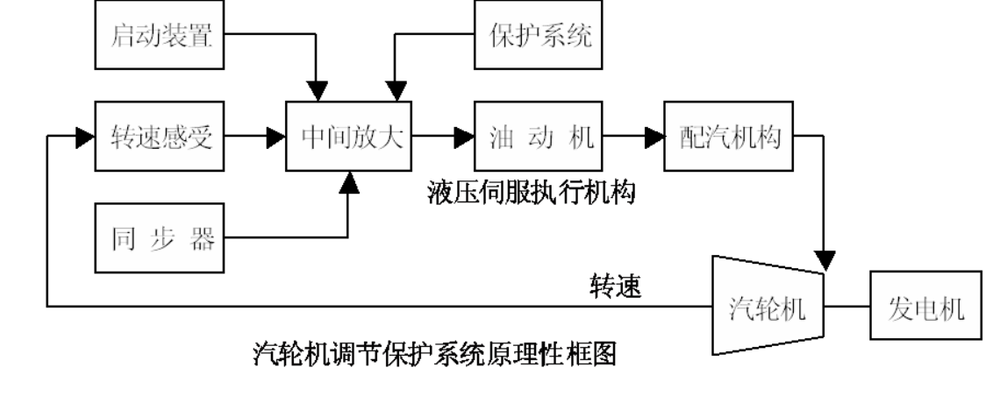

# 6.1 汽轮机调节的任务与组成

### 汽轮机调节的必要性

* 能不易大量储存
* 电力用户的耗电量不断变化

### 汽轮机调节的任务

* 供电数量：保证汽轮机发电机组能够根据用户需求及时提供足够的电力。

* 供电质量：电压、频率

  <u>同步发电机的运行特性：</u>
  $$
  \begin{array}{l}
  端电压&\Longleftarrow无功功率&\Longleftarrow励磁&\Longleftarrow励磁系统&电压调节\\
  频率&\Longleftarrow有功功率&\Longleftarrow原动机功率&\Longleftarrow功率控制系统&频率调节
  \end{array}
  $$

* 汽轮机转速：根据转速偏差改变调节气阀的开度，调节进汽量和比焓降，改变发电机的有功功率，满足外界负荷变化。

* 电网有功负荷变化

  * 第一类变化　

    幅度小、周期短，具有随机性。幅度小于5%，秒级。

  * 第二类变化

    幅度较大、周期较长，有一定可预测性。大于5%，分级。

  * 第三类变化　

    幅度大、周期长，由生产、生活和气象等节律引起的。

    

* 基本特征：以24小时为周期的大幅、慢变上迭加随机、小幅、快变波动。

主动力矩：蒸汽驱动力矩

阻力矩：电磁阻力矩、机械摩擦阻力矩
$$
J \frac{d^{2} \varphi}{d t^{2}}=M_{s t}-M_{e m}-M_{f}
$$

当外界电负荷下降时，发电机的电磁阻力矩减小，导致转子的转速上升；反之，转子的转速减小。

因此，汽轮机应根据转速偏差改变调节汽门的开度，使蒸汽的驱动力矩与电磁阻力矩及摩擦力矩相平衡。

### 转子运动方程与汽轮机调速 

* 机组的自调节特性
  * 外界负荷改变时，可自动稳定到一个新工况。
* 有差调节
  * 调节系统调节后，若 $n_A$ 和 $n_B$ 有差值，称为有差调节。

#### 一次调频

由汽轮机<u>转速控制或调节器</u>感受电网频率（周波）变化，改变有功功率输出，维持同步区域电网负荷平衡。

* 特点：机组调节，**有差调节**，机组功率改变量正比于频率偏差。

#### 二次调频

电网根据区域电网频率偏差和网际交换功率偏差，通过<u>平移机组调节静态特性线</u>改变组的功率输出（同步器）。

* 特点：电网调节，**消除频率偏差**，维持电网频率在额定值附近。

对调节系统的要求：驱动功率大；惯性小，动作速度快；控制精度高。

### 调节系统的组成和基本工作原理

* 可分直接调节系统、间接调节系统
* 闭环的汽轮机自调节系统组成
  * 转速感受机构
  * 传动放大机构
  * 执行机构
  * 调节对象

* 转速感受机构：转子转速转变为一次控制信号
* 中间放大机构：中间功率放大
* 油动机：执行机构
* 配汽机构：油动机行程与蒸汽流量非线性校正机构
* 同步器：单机时改变机组转速和并网时改变机组功率
* 启动装置：启动冲转、提升转速至同步器动作转速