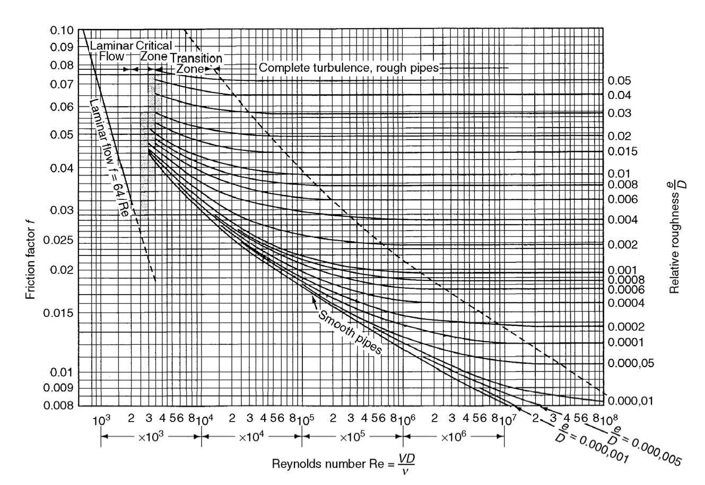

# 4.1沿程损失和局部损失

### 一、流动阻力与能量损失的两种形式

流动阻力与能量损失的大小与流道的形状有关，因为在不同的流动情形，流场内部的流动结构与流体粘性所起的作用均有差别。为了方便地分析一维流动，一般根据流动边界形状的不同，将流动阻力与水头损失分为两种类型：沿程阻力与沿程水头损失；局部阻力与局部水头损失。

1. 沿程阻力与沿程损失

   * 沿程水头损失 $h_f$
     $$
     h_f=\sum h_{fi}
     $$

   * 沿程压力损失 $p_f$
     $$
     p_f=\sum p_{fi}
     $$

2. 局部阻力与局部损失

   在流道发生突变的局部区域，流动属于变化较剧烈的急变流，流动结构急剧调整，流速大小、方向迅速改变，往往伴有流动分离与漩涡运动，流体内部的摩擦作用增大。称这种流动急剧调整产生的流动阻力为**局部阻力**，流体为克服局部阻力而产生的水头损失为局部水头损失或**局部损失**。以 $h_m$ （或 $p_m$ ）表示。
   $$
   h_m=\sum h_{mi}\\
   p_m=\sum p_{mi}
   $$
   

### 二、能量损失的计算公式（达西公式）

1. 沿程水头损失
   $$
   h_f=\lambda\frac ld\frac{v^2}{2g}\\
   p_f=\lambda\frac ld\frac{\rho v^2}{2}
   $$

2. 局部水头损失
   $$
   h_m=\zeta\frac{v^2}{2g}\\
   p_m=\zeta\frac{\rho v^2}2\\
   \zeta——局部阻力系数
   $$
   

# 4.2层流与紊流、雷诺数

## 一、雷诺实验，层流和紊流

流体的阻力特性直接影响到流体流动时的能量损失，为探索流体摩擦阻力的规律，人们进行了长期研究。1883年，雷诺（Osborne Reynolds）通过大量实验，终于发现了液体在管道中流动时有着两种不同的流动状态，阻力特性也不相同。这种现象可用雷诺实验装置观测出来。

层流（Laminar）：有规则的、层次分明的流动

紊流（Turbulence）：运动轨迹极不规则，各部分流体互相掺混

## 二、流态的判别——雷诺数（Reynolds Number）：

雷诺数： 
$$
Re=\frac{\rho vd}\mu=\frac{vd}{\nu}\\
\mu——流体的动力黏度\\
\nu——运动粘滞系数
$$
临界雷诺数：
$$
Re_k=\frac{\rho v_kd}{\mu}
$$
对于圆管： $Re_k取2000$
$$
Re<2000——层流\\
2000<Re<4000——过渡区\\
Re>4000——紊流
$$

## 三、紊流的成因

层流受扰动后，当年需的稳定作用起主导作用时，扰动就受到粘性的阻滞而衰减下来，层流就是稳定的。当扰动占上风时，粘性额定稳定作用无法克服使扰动衰减下来，于是扰动便变为紊流。因此流动呈现何流动状态，取决于扰动的惯性作用与粘性的稳定作用相互斗争的结果。
$$
[惯性力]=[m][a]=[\rho][L]^3[L]/[T]^2=[\rho][L][\nu]^2[L]^{-1}\\
[粘性力]=[\mu][A][\frac{du}{dn}]=[\mu][L]^2[\nu][L]^{-1}\\
\frac{[惯性力]}{[粘性力]}=\frac{[\nu][L]}{[v]}=[Re]
$$

# 4.3圆管中的层流运动

## 一、均匀流动方程式

均匀流的过流断面（渐变流）：
$$
\frac P\gamma+z=const
$$
由能量方程，易得：
$$
h_f=(\frac{p_1}{\gamma}+z_1)-(\frac{p_2}{\gamma}+z_2)
$$
轴向力的平衡：
$$
（p_1-p_2)\pi r_0^2+\gamma\pi r_0^2l\cos\alpha-\tau_02\pi r_0l=0
$$
水力坡度：
$$
J=\frac{h_f}l=\frac{2\tau_0}{\gamma r_0}
$$

## 二、断面流速分布特征

1. 最大流速
   $$
   \nu_{max}=\frac{\gamma J}{4\mu}r_0^2=\frac{\gamma J}{16\mu}d^2
   $$

2. 平均流速
   $$
   \nu=\frac Q{\pi r_0^2}=\frac{\gamma J}{32\mu}d^2
   $$

3. 沿程损失及沿程阻力系数
   $$
   h_f=J\cdot l=\frac{32\mu v l}{\gamma d^2}=\lambda\frac ld\frac{v^2}{2g}\\
   \lambda=\frac{64}{Re}
   $$

4. 动能修正系数
   $$
   \alpha=\frac{\int_Au^3dA}{v^3A}=2
   $$

# 4.4紊流运动的特征和紊流阻力

## 一、紊流运动的特征

紊流内部有着许许多多尺度不同的涡旋。由于脉动的随机性，统计平均法是处理紊流流动的的基本方法。统计平均法有时均法和体均法等。

1. 时均化方法

   速度分量 $u_x$ 的时均值：
   $$
   \overline{u_x}(x,y,z,t)=\frac1T\int_{t-\frac T2}^{t+\frac T2}u_x(x,y,z,\xi)d\xi
   $$
   脉动值：
   $$
   u_x=\overline{u_x}+u_x'
   $$

2. 紊流度 $\varepsilon$ ——判别紊流脉动的强弱程度
   $$
   \varepsilon=\frac1{\overline u}\sqrt{\frac13(u_x'^2+u_y'^2+u_z'^2)}
   $$

紊流的脉动将引起流体微团之间的质量、动量和能量的交换，从而产生了紊流扩散、紊流摩阻和紊流热传递等。与能量损失有关的紊流阻力的特点如下：

在紊流中一方面因时均流速不同，各流层间的相对运动，仍然存在着粘性切应力，另一方面还存在着由脉动所引起的动量交换产生的惯性切应力。因此，紊流阻力包括粘性切应力和惯性切应力。

## 二、紊流阻力

1. 粘性切应力

   紊流中，一方面因时均流速的不同，各流层间的相对运动，仍然存在着粘性切应力 $\tau_1$ ：
   $$
   \tau_1=\mu\frac {d\overline u}{dy}
   $$

2. 惯性切应力
   $$
   \overline{\tau_2}=\rho\overline{u_x'u_y'}
   $$
   这就是因紊流横向脉动产生的素流惯性切应力。

由于脉动流量测量的困难，因此利用脉动量直接计算惯性切应力实际上是不可能的，由于脉动量的存在和应用上主要关注的是平均值，因此紊流理论主要就是研究脉动值和平均值之间的关系。

## 三、混合长度（Mixing Length）理论

宏观上流动质点脉动引起惯性切应力，这与分子微观运动引起粘性切应力十分相似。因此，Prandtl（1904）将流体质点的脉动与分子运动相类比，提出了混合长度的概念。

混合长度：假设在脉动过程中，存在着一个与分子平均自由路程相当的距离。流体微团在该距离内不会和其它微团相碰撞。因此，该流体微团保持原有的物理属性，例如，保持动量不变。只是在经过这段距离后，才与周围流体相混合，并取得与新位置原有流体相同的动量。

由普朗特混合长度理论，可以导出：
$$
\overline{\tau_2}=\rho l^2(\frac{d\overline{u}}{dy})^2
$$
式中 $l$ 称为混合长度。一般情况下，它是未知的，需根据具体情况作出新的假定并结合实验结果才能确定。

# 4.6尼古拉兹实验

## 一、沿程阻力系数的影响因素

人工均匀粗糙：

尼古拉兹（Nikuradse, 1933-1934）在实验中将大小基本相同，形状近似球体的砂粒用漆汁均匀而稠密地粘附于管壁上，这种尼古拉兹使用的人工均匀粗糙叫尼古拉兹粗糙。

绝对粗糙度 $K$ ：粗糙凸起的高度

相对粗糙高度： $K/d$ ，其倒数称为相对光滑度

## 二、沿程阻力系数的测定及阻力分区图

$$
\lambda=f(Re,\frac Kd)
$$

$\lambda$ 的分区：

1. 层流区 $\lambda=\frac{64}{Re}=f_1(Re)$
2. 临界过渡区 $\lambda=f_2(Re)$ 
3. 紊流光滑区 $\lambda=f_3(Re)$ 
4. 紊流过渡区 $\lambda=f_4(Re,\frac Kd)$ 
5. 紊流粗糙区（阻力平方区） $\lambda=f_5(\frac Kd)$ 

紊流断面结构：

* 紊流核心
* 过渡层
* 层流底层 $\delta$ 
* 管壁

## 三、人工均匀粗糙管的计算公式

1. 层流区
   $$
   \lambda=\frac{64}{Re}
   $$

2. 临界过渡区（略）

3. 紊流光滑区

   勃拉休斯经验公式：
   $$
   \lambda=\frac{0.3164}{Re^{0.25}}(Re<10^5)
   $$

4. 紊流过渡区（略）

5. 紊流粗糙区

   阿里特苏里经验公式（紊流三区通用）：
   $$
   \lambda=0.11(\frac Kd+\frac{68}{Re})^{0.25}
   $$

# 4.6工业管道 $\lambda$ 的计算

### 过渡区 $\lambda$ 的计算公式

在过渡区工业管道实验曲线和尼古拉兹曲线存在较大的差异。工业管道在较小的 $Re$ 下就偏离光滑曲线，且随 $Re$ 的增加平滑下降，而尼古拉兹曲线存在着上升的部分。因此，尼古拉兹的过渡区的实验资料对工业管道是完全不适用的

1. Colebrook（柯列勃洛克）公式
   $$
   \frac1{\sqrt\lambda}=-2\lg(\frac K{3.7d}+\frac{2.51}{Re\sqrt\lambda})\\
   K:工业管道的当量糙粒高度
   $$
    $Re$ 很小时，第一项忽略，该式接近尼古拉兹光滑区公式；

    $Re$ 很大时，第二项忽略，公式接近尼古拉兹粗糙公式。系紊流的综合公式

2. 阿里特苏里公式：
   $$
   \lambda=0.11(\frac Kd+\frac{68}{Re})^{0.25}
   $$

### 莫迪图：

查找沿程阻力系数 $\lambda(或f)$ 

# 4.7非圆管的沿程损失

工程上除圆形管道外，还有经常用到的非圆形管（如通风系统中的风管等，是矩形或正方形的)。如何计算此类管道的沿程损失是一个需要解决的问题。思路有两个：一是直接对各种形状非圆管进行实验，以期对各种具体形状的非圆管得到可用的入曲线或经验公式。另一个思路是能否借用已有的圆管的结果，将非圆管类的计算问题折合成对圆管的计算。显然，后一种思路具有可行性，而且简便。关键是如何
将非圆管计算问题折合成圆管的计算问题。这种“折合”方法是通过建立当量直径的概念来实现的。

### 一、水力半径 $R$

$$
R=\frac A\chi
$$

$A$ ——过流断面面积

$\chi$ ——湿周（过流断面周长）

$A$ 和 $\chi$ 是过流断面上影响沿程损失的两个基本因素。在紊流中，由于断面上的流速变化主要集中在邻近管壁的流层内，因此，沿程损失主要集中在这里，流体与固壁接触面的大小，即湿周的大小是影响能量损失大小的主要外因。若两种不同断面形式具有相同的湿周，平均流速亦相同，则 $A$ 越大，流量 $Q$ 越大，故单位流量流体的 $h_f$ 越小。相反，若 $A$ 一定，流速一定，即 $Q$ 一定，则湿周越大， $h_f$ 越大。因此，沿程损失和水力半径成反比，水力半径基本上能反映过流断面大小、形状对沿程损失综合影响的物理量。
$$
h_f\propto\frac1R
$$
圆管： $R=\frac d4$

正方形管： $R=\frac a4$

矩形管： $R=\frac{ab}{2(a+b)}$

### 二、当量直径

如果某一非圆管与圆管的水力半径 $R$ 、管长 $L$ 、平均流速 $V$ 均相同，则我们可以近似认为两者的沿程损失 $h_f$ 是相等的。这样，我们就将该圆管的直径 $d_e$ 成为此非圆管的当量直径。
$$
R_圆=R_{非圆}=R\Longrightarrow\frac{d_e}4=R_{非圆}=R\\
\Longrightarrow d_e=4R\\
矩形管：d_e=4R=\frac{2ab}{a+b}
$$

#### 说明：

* ①我们可以用 $d_e$ 来计算非圆管的 $Re$ 数。

* ②可用 $d_e$ 计算非圆管的相对粗糙度，并以它求 $\lambda$ 。

* ③对矩形、方形、三角形断面（较接近圆形），使用当量直径原理，所得试验数据结果与圆管是很接近的，但长缝形和星形断面，则差别较大，故对此类非圆管，不易使用当量直径原理计算。

  非圆形截面的形状和圆形的偏差越大，应用当量直径的可靠性越小。

* ④若管中流动为层流二者误差亦偏大，亦不宜使用当量直径进行折合计算。因损失不像紊流那样集中在管壁附近，这样单纯用湿周大小作为影响能量损失的主要外因条件，对层流来说就不充分了。

# 4.8管道流动的局部损失

### 一、局部损失一般分析

如流体以层流经过局部阻碍，而且受到干扰后流动仍能保持层流时，局部损失也还是由各流层之间的粘性切应力引起的。只是因边壁的变化，促进了流速的重新调整，流体质点产生剧烈变形，加强了相邻流层之间安的相对运动，因而加大了这一局部地区的水头损失。
$$
\zeta=\frac B{Re}
$$
$B$ 取决于局部阻碍的形状。即层流的局部损失也与平均流速的一次方成正比。只有当 $Re$ 远小于2000时才有可能。紊流的**局部阻力系数** $\zeta$ 一般来说决定于局部阻碍的几何形状、固体壁面的相对粗糙度和雷诺数。即：
$$
\zeta=f(局部阻碍形状、相对粗糙、Re)
$$
局部阻碍形状始终是一个起主导作用的因素。

相对粗糙只对尺寸较长（曲率半径较大）且相对粗糙较大的局部阻碍才需考虑。

$Re$ 影响：随 $Re$ 增大，局部阻力系数减小，当达一定值后，进入阻力平方区，但受边壁的干扰，进入平方区的 $Re$ 远比沿程损失小。界限为 $2×10^5$ 。

#### 突然扩大 

波达——卡诺特（Borda-Carnot）公式：
$$
h_m=\left(1-\frac{A_1}{A_2}\right)^2\frac{v_1^2}{2g}=\zeta_1\frac{v_1^2}{2g}\\
或\\
h_m=\left(\frac{A_2}{A_1}-1\right)^2\frac{v_2^2}{2g}=\zeta_2\frac{v_2^2}{2g}
$$
即突然扩大的阻力系数为：
$$
\zeta_1=\left(1-\frac{A_1}{A_2}\right)^2\quad或\quad\zeta_2=\left(\frac{A_2}{A_1}-1\right)^2
$$

#### 突然缩小

$$
\zeta=0.5\left(1-\frac{A_2}{A_1}\right)
$$

#### 管道进口

锐缘进口—— $\zeta=0.5$

圆角进口—— $\zeta=0.25$

流线型进口—— $\zeta=0.06～0.005$

管道伸入进口—— $\zeta=1.0$

#### 弯管的局部损失（二次流的概念）：

弯管流段，流体的流动方向发生改变，而平均流速大小并不变。流动方向的改变不仅使弯管的内侧和外侧可能出、现两个旋涡区，而且还产生了二次流(secondary flow)现象，即弯管中在垂直轴线的过流断面上，产生一对涡流，它和主流(primary flow)迭加在一起，使通过弯管的流体质点作螺旋运动，这也加大了弯管的损失。

三通：合流、分流

# 4.9减少阻力措施

思路1：流体本身，减小流体黏性

思路2：改善边壁条件
