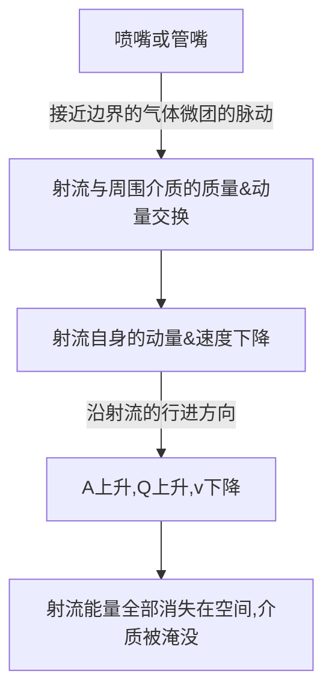
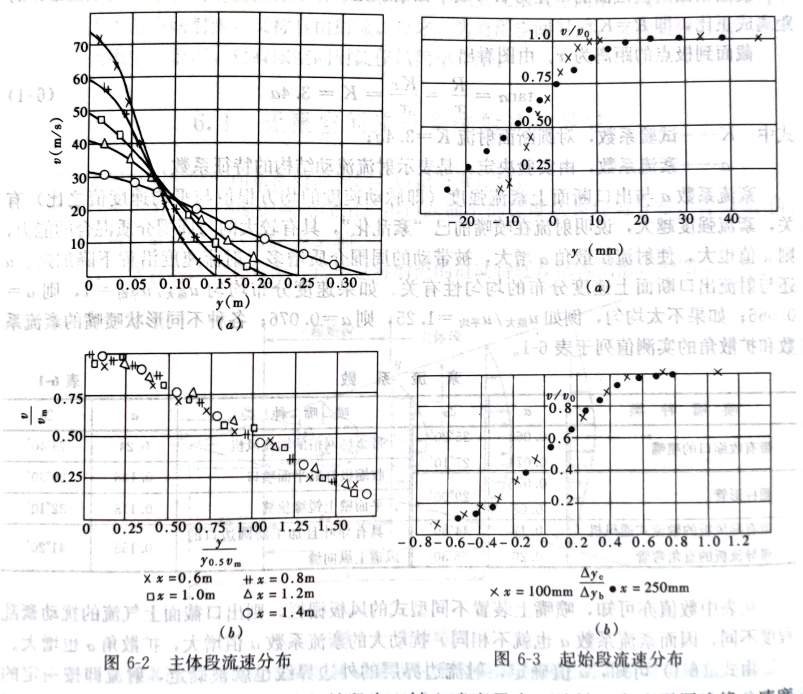

气体自孔口、管嘴或条缝向外喷射所形成的流动称为气体淹没射流，简称为气体射流。研究对象：主要研究出流后的流场的物理量（如速度、温度等）的分布规律。
$$
射流分类
\begin{cases}
\underrightarrow{流动状态}
\begin{cases}
层流\\
紊流(工程上)
\end{cases}\\
\underrightarrow{出流空间大小对射流的影响}
\begin{cases}
无限空间射流(自由射流)\\
有限空间射流(受限射流)
\end{cases}\\
\underrightarrow{射流与周围流体的区别}
\begin{cases}
淹没射流:速度不同\\
等温射流:温度不同\\
浓差射流:浓度不同
\end{cases}\\
\end{cases}
$$

# 6.1无限空间淹没紊流射流的特征

## 一、射流场的形成与结构

了解：过渡断面、起始段、主体段、边界层内边界、边界层外边界

## 二、紊流系数 $a$ 及射流场的几何特征

$$
\tan\alpha=K=\varphi\cdot a=
\begin{cases}
3.4a圆断面射流\\
2.44a平面射流
\end{cases}\\
\varphi——形状系数\\
a——紊流系数
$$

#### 紊流系数表：

| 喷嘴种类                             | $a$          | $2\alpha$      |
| ------------------------------------ | ------------ | -------------- |
| 带有收缩口的喷嘴                     | 0.066～0.071 | 25°20'～27°10' |
| 圆柱形管                             | 0.071～0.08  | 29°00'         |
| 带有导风板的轴流式通风机             | 0.12         | 44°30'         |
| 带导流板的直角弯管                   | 0.20         | 68°30'         |
| 带金属网格的轴流风机                 | 0.24         | 78°40'         |
| 收缩极好的平面喷口                   | 0.108        | 29°30'         |
| 平面壁上锐缘狭缝                     | 0.118        | 32°10'         |
| 具有导叶且加工磨圆边口的风道上纵向缝 | 0.155        | 41°20'         |

紊流系数由实验决定，是表示射流流动结构的特征系数。紊流系数与喷口断面的紊流强度和速度分布和均匀性有关。紊流强度越大，出口断面速度分布越不均匀，则紊流系数越大。
$$
\varepsilon=\frac1{\overline u}\sqrt{\frac13(u_x'^2+u_y'^2+u_z'^2)}
$$

## 三、射流的几何特性

射流按一定的扩散角 $\alpha$ 向前作扩散运动。
$$
\frac{R}{r_{0}}=\frac{x}{x_{0}}=\frac{x_{0}+s}{x_{0}}=1+\frac{s}{r_{0} / \tan \alpha}=1+3.4 a \frac{s}{r_{0}}=3.4\left(\frac{a s}{r_{0}}+0.294\right) \\
\frac{D}{d_{0}}=6.8\left(\frac{a s}{d_{0}}+0.147\right) \\
\frac{R}{r_{0}}=\frac{x_{0}+s}{x_{0}}=\frac{x_{0} / r_{0}+s / r_{0}}{x_{0} / r_{0}}=\frac{\bar{x}_{0}+\bar{s}}{\bar{x}_{0}}=3.4 a \bar{x}
$$
射流的无量纲半径正比于由极点算起的无量纲距离。

## 四、射流边界层的运动特征

特征：不同断面速度分布的相似性。
$$
\frac{\Delta y_c}{\Delta y_b}=\frac{y-y_{0.5v_0}}{y_{0.9v_0}-y_{0.1v_0}}
$$
结果表明：

1. 无论主体段或起始段，轴心速度最大，从轴心向边界层边缘，速度逐渐减小；
2. 距喷嘴距离越远，边界层厚度越大，轴心速度越小；
3. 但用无量纲速度和无量纲距离表示这种关系时，射流各断面上的速度分布完全相似。

# 6.2圆断面射流的运动分析

# 6.3平面射流
