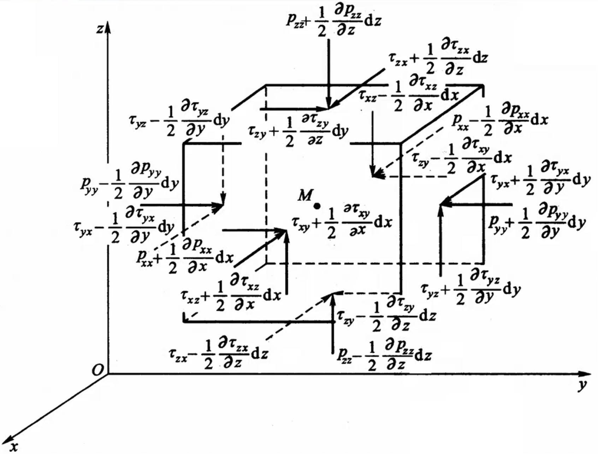

#### 本章主要内容

1. 流体微团的基本运动形式:平移、旋转、线变形运动和角变形运动；
2. 旋转角速度的定义；
3. 不可压缩流体的连续性微分方程及其积分；
4. 理想流体运动微分方程以及N-S方程。

# 7.1流体微团运动的分析

## 一、流体微团

1. 概念：在连续性介质模型中，流体质点是宏观上充分小，可视为只有质量而无体积的“点”，流体微团则是由大量流体质点所组成的具有一定体积的微小流体团。
2. 流体微团的运动特点：由于流场速度分布不均匀，流体微团各点的速度不相等而产生平移、转动、线变形和角变形等4种运动形式。

## 二、流体微团的基本运动形式分析

### 1、平移

### 2、线变形速度

一般将单位时间单位长度流体线的伸长量定义为线变形速度。

$$
\varepsilon_{xx}=\frac{\partial u_x}{\partial x}\\
\varepsilon_{yy}=\frac{\partial u_y}{\partial y}\\
\varepsilon_{zz}=\frac{\partial u_z}{\partial z}
$$

### 3、旋转角速度

把原来互相垂直的两邻边在 $xy$ 平面运动的旋转角速度的平均值定义为 $A$ 点流体旋转角速度在垂直该平面方向的分量，用 $\omega$ 表示。

$$
\omega_x=\frac12(\frac{\partial u_z}{\partial y}-\frac{\partial u_y}{\partial z})\\
\omega_y=\frac12(\frac{\partial u_x}{\partial z}-\frac{\partial u_z}{\partial x})\\
\omega_z=\frac12(\frac{\partial u_y}{\partial x}-\frac{\partial u_x}{\partial y})\\
\vec{\omega}=\omega_x\vec{i}+\omega_y\vec{j}+\omega_z\vec{k}\\
\omega=\sqrt{\omega_x^2+\omega_y^2+\omega_z^2}
$$

### 4、角变形速度

直角边的变形速度定义为流体微团的角变形速度

$$
\varepsilon_{xy}=\varepsilon_{yx}=\frac12(\frac{\partial u_y}{\partial x}+\frac{\partial u_x}{\partial y})\\
\varepsilon_{xz}=\varepsilon_{zx}=\frac12(\frac{\partial u_x}{\partial z}+\frac{\partial u_z}{\partial x})\\
\varepsilon_{yz}=\varepsilon_{zy}=\frac12(\frac{\partial u_z}{\partial y}+\frac{\partial u_y}{\partial z})
$$

## 三、亥姆霍兹速度分解定理

$$
\begin{align}
&u_{x}=u_{x_{0}}+d u_{x} \\
&d u_{x}=\left(\frac{\partial u_{x}}{\partial x}\right)_{M_{0}} d x+\left(\frac{\partial u_{x}}{\partial y}\right)_{M_{0}} d y+\left(\frac{\partial u_{x}}{\partial z}\right)_{M_{0}} d z\\
&\Rightarrow u_{x}=u_{x_{0}}+\left(\frac{\partial u_{x}}{\partial x}\right)_{M_{0}} d x+\frac{1}{2}\left(\frac{\partial u_{x}}{\partial y}-\frac{\partial u_{y}}{\partial x}\right)_{M_{0}} d y+\frac{1}{2}\left(\frac{\partial u_{x}}{\partial y}+\frac{\partial u_{y}}{\partial x}\right)_{M_{0}} d y+\frac{1}{2}\left(\frac{\partial u_{x}}{\partial z}-\frac{\partial u_{z}}{\partial x}\right)_{M_{0}} d z+\frac{1}{2}\left(\frac{\partial u_{x}}{\partial z}+\frac{\partial u_{z}}{\partial x}\right)_{M_{0}} d z \\
&=u_{x_{0}}+\theta_{x} d x-\omega_{z} d y+\omega_{y} d z+\varepsilon_{z x} d y+\varepsilon_{y x} d z
\end{align}
$$

# 7.2应力和变形速度的关系

粘性流体本构方程：在一定假设下，得到流体应力张量 $(P_{ij})$ 与变形速度张量 $(S_{ij})$ 之间关系的方程称为流体力学的本构方程。

其推导基于Stokes三假设：

* 假设1：静止流体切向应力为零
* 假设2：应力是应变率的线性函数
* 假设3：流体是各向同性的。

$$
\left[\begin{matrix}
p_{x x} & p_{x y} & p_{x z} \\
p_{y x} & p_{y y} & p_{y z} \\
p_{x} & p_{z y} & p_{z}
\end{matrix}\right]=f
\left(\left[\begin{matrix}
\frac{\partial u}{\partial x} & \frac{1}{2}\left(\frac{\partial u}{\partial y}+\frac{\partial v}{\partial x}\right) & \frac{1}{2}\left(\frac{\partial u}{\partial z}+\frac{\partial w}{\partial x}\right) \\
\frac{1}{2}\left(\frac{\partial v}{\partial x}+\frac{\partial u}{\partial y}\right) & \frac{\partial v}{\partial y} & \frac{1}{2}\left(\frac{\partial w}{\partial y}+\frac{\partial v}{\partial z}\right) \\
\frac{1}{2}\left(\frac{\partial w}{\partial x}+\frac{\partial u}{\partial z}\right) & \frac{1}{2}\left(\frac{\partial w}{\partial y}+\frac{\partial v}{\partial z}\right) & \frac{\partial w}{\partial z}
\end{matrix}\right]\right)
$$

## 一、切向应力和角变形速度的关系

$$
\tau_{xy}=\tau_{yx}=2\mu\varepsilon_{xy}=\mu\left(\frac{\partial u_x}{\partial y}+\frac{\partial u_y}{\partial x}\right)\\
\tau_{zx}=\tau_{xz}=2\mu\varepsilon_{xz}=\mu\left(\frac{\partial u_z}{\partial x}+\frac{\partial u_x}{\partial z}\right)\\
\tau_{zy}=\tau_{yz}=2\mu\varepsilon_{zy}=\mu\left(\frac{\partial u_z}{\partial y}+\frac{\partial u_y}{\partial z}\right)
$$

## 二、法向应力和线变形速度的关系

$$
p_{x x}=-p+2 \mu \frac{\partial u_{x}}{\partial x}-\frac{2}{3} \mu\left(\frac{\partial u_{x}}{\partial x}+\frac{\partial u_{y}}{\partial y}+\frac{\partial u_{z}}{\partial z}\right) \\
p_{y y}=-p+2 \mu \frac{\partial u_{y}}{\partial y}-\frac{2}{3} \mu\left(\frac{\partial u_{x}}{\partial x}+\frac{\partial u_{y}}{\partial y}+\frac{\partial u_{z}}{\partial z}\right) \\
p_{z z}=-p+2 \mu \frac{\partial u_{z}}{\partial z}-\frac{2}{3} \mu\left(\frac{\partial u_{x}}{\partial x}+\frac{\partial u_{y}}{\partial y}+\frac{\partial u_{z}}{\partial z}\right)
$$

其中：
$$
p=-\frac{1}{3}\left(p_{x x}+p_{y y}+p_{z z}\right)
$$

# 7.3不可压缩流体连续性微分方程

## 一、推导

原理：体积流量平衡

 $d t$ 时间内，沿 $x$ 向流出、流入微元控制体的净体积:
$$
\left(u_{x}+\frac{\partial u_{x}}{\partial x} \frac{d x}{2}\right) d y d z d t-\left(u_{x}-\frac{\partial u_{x}}{\partial x} \frac{d x}{2}\right) d y d z d t=\frac{\partial u_{x}}{\partial x} d x d y d z d t
$$
同理， $d t$ 时间内，沿 $y, z$ 向流出、流入微元控制体的净体积分别为:

$$
\frac{\partial u_{y}}{\partial y} d x d y d z d t \quad ; \quad \frac{\partial u_{z}}{\partial z} d x d y d z d t
$$
由不可压缩流体连续性条件。流出、流入控制体的净流体体积为零，即

$$
\left(\frac{\partial u_{x}}{\partial x}+\frac{\partial u_{y}}{\partial y}+\frac{\partial u_{z}}{\partial z}\right) d x d y d z d t=0
$$
不可压缩流体连续性微分方程: 
$$
 \quad \frac{\partial u_{x}}{\partial x}+\frac{\partial u_{y}}{\partial y}+\frac{\partial u_{z}}{\partial z}=0
$$
  柱坐标系下:  
$$
\quad \frac{u_{r}}{r}+\frac{\partial {u}_{r}}{\partial r}+\frac{\partial u_{\theta}}{r \partial \theta}+\frac{\partial u_{z}}{\partial z}=0
$$

# 7.4黏性流体运动微分方程式

## 一、黏性流体的内应力

$$
\left[\begin{matrix}
p_{xx}&\tau_{xy}&\tau_{xz}\\
\tau_{yx}&p_{yy}&\tau_{yz}\\
\tau_{zx}&\tau_{zy}&p_{zz}
\end{matrix}\right]
$$

应力符号的**第一个角标**代表作用面的外法线方向，**第二个角标**表示应力方向

## 二、以应力表示的运动微分方程

根据牛顿第二定律， $x$ 方向上有如下关系
$$
\begin{align}
\rho X d x d y d z&+\left(p_{x x}+\frac{1}{2} \frac{\partial p_{x x}}{\partial x}\right) d x d y d z+\left[-\left(p_{x x}-\frac{1}{2} \frac{\partial p_{x x}}{\partial x} d x\right) d y d z\right] \\
&+\left(\tau_{y x}+\frac{1}{2} \frac{\partial \tau_{y x}}{\partial y} d y\right) d x d z+\left[-\left(\tau_{y x}-\frac{1}{2} \frac{\partial \tau_{y x}}{\partial y} d y\right) d x d z\right] \\
&+\left(\tau_{z x}+\frac{1}{2} \frac{\partial \tau_{z x}}{\partial z} d z\right) d x d y+\left[-\left(\tau_{z x}-\frac{1}{2} \frac{\partial \tau_{z x}}{\partial z} d z\right) d x d y\right] \\
&=\rho d x d y d z \frac{d u_{x}}{d t}
\end{align}
$$
代入应力与变形速度关系式，整理得：
$$
\frac{d u_{x}}{d t}=X-\frac{1}{\rho} \frac{\partial p}{\partial x}+\frac{\mu}{\rho}\left(\frac{\partial^{2} u_{x}}{\partial x^{2}}+\frac{\partial^{2} u_{x}}{\partial y^{2}}+\frac{\partial^{2} u_{x}}{\partial z^{2}}\right)+\frac{1}{3} \frac{\mu}{\rho} \frac{\partial}{\partial x}\left(\frac{\partial u_{x}}{\partial x}+\frac{\partial u_{y}}{\partial y}+\frac{\partial u_{z}}{\partial z}\right)
$$
对于不可压缩流体而言:  
$$
\left(\frac{\partial u_{x}}{\partial x}+\frac{\partial u_{y}}{\partial y}+\frac{\partial u_{z}}{\partial z}\right)=0 \\
则  \frac{d u_{x}}{d t}=X-\frac{1}{\rho} \frac{\partial p}{\partial x}+\frac{\mu}{\rho}\left(\frac{\partial^{2} u_{x}}{\partial x^{2}}+\frac{\partial^{2} u_{x}}{\partial y^{2}}+\frac{\partial^{2} u_{x}}{\partial z^{2}}\right)
$$
整理得：
$$
\begin{aligned}
&\frac{d u_{x}}{d t}=X+\frac{1}{\rho}\left(\frac{\partial p_{x x}}{\partial x}+\frac{\partial \tau_{y x}}{\partial y}+\frac{\partial \tau_{z x}}{\partial z}\right) \\
&\frac{d u_{y}}{d t}=Y+\frac{1}{\rho}\left(\frac{\partial \tau_{x y}}{\partial x}+\frac{\partial p_{y y}}{\partial y}+\frac{\partial \tau_{z y}}{\partial z}\right) \\
&\frac{d u_{z}}{d t}=Z+\frac{1}{\rho}\left(\frac{\partial \tau_{x z}}{\partial x}+\frac{\partial \tau_{y z}}{\partial y}+\frac{\partial p_{z z}}{\partial z}\right)
\end{aligned}
$$
十二个未知量，四个方程，不封闭。

代入前述的应力和变形速度的关系：

## 三、纳维一斯托克斯方程

将上述两个方程代到应力形式表示的黏性流体运动微分方程式中，整理得：
$$
\frac{d u_{x}}{d t}=X-\frac{1}{\rho} \frac{\partial p}{\partial x}+\nu\left(\frac{\partial^{2} u_{x}}{\partial x^{2}}+\frac{\partial^{2} u_{x}}{\partial y^{2}}+\frac{\partial^{2} u_{x}}{\partial z^{2}}\right) \\
\frac{d u_{y}}{d t}=Y-\frac{1}{\rho} \frac{\partial p}{\partial y}+\nu\left(\frac{\partial^{2} u_{y}}{\partial x^{2}}+\frac{\partial^{2} u_{y}}{\partial y^{2}}+\frac{\partial^{2} u_{y}}{\partial z^{2}}\right) \\
\frac{d u_{z}}{d t}=Z-\frac{1}{\rho} \frac{\partial p}{\partial z}+\nu\left(\frac{\partial^{2} u_{z}}{\partial x^{2}}+\frac{\partial^{2} u_{z}}{\partial y^{2}}+\frac{\partial^{2} u_{z}}{\partial z^{2}}\right)
$$
这就是著名的纳维-斯托克斯方程，简称N-S方程。

它是实际流体运动的一般形式的控制方程。

加上连续性方程，四个方程四个未知量，方程组封闭。

>纳维-斯托克斯方程（英文名：Navier-Stokes equations），描述粘性不可压缩流体动量守恒的运动方程。简称N-S方程。粘性流体的运动方程首先由纳维在1827年提出，只考虑了不可压缩流体的流动。泊松在1831年提出可压缩流体的运动方程。圣维南与斯托克斯在1845年独立提出粘性系数为一常数的形式，都称为Navier-Stokes方程，简称N-S方程。三维空间中的N-S方程组光滑解的存在性问题被美国克雷数学研究所设定为七个于禧年大奖难题之一。
>
>纳维是法国力学家、工程师。1785年2月10日生于第戎，1836年8月21日卒于巴黎。少年时由他舅父、工程师E.M.戈泰(1732~1807)照料。1802年进巴黎综合工科学校求学，1804年毕业后进桥梁公路学校求学，1806年毕业。1819年起在桥梁公路学校讲授应用力学，1830年起任教授。1824年被选为法国科学院院士。
>
>纳维的科学活动开始于1809年编辑出版戈泰的著作和修订B.F.de贝利多（1698~1761）的《工程科学》一书，从此引起他对工程科学基础理论的兴趣。巴黎综合工科学校数学分析的传统教育以及在土木工程方面的实践经验，有利于他的力学研究。纳维的主要贡献是分别为流体力学和弹性力学建立了基本方程。1821年他推广了L.欧拉的流体运动方程，考虑了分子间的作用力，从而建立了流体平衡和运动的基本方程。方程中只含有一个粘性常数。1845年G.G.斯托克斯从连续统的模型出发，改进了他的流体力学运动方程，得到有两个粘性常数的粘性流体运动方程（后称纳维-斯托克斯方程，即N-S方程）的直角坐标分量形式。1821年，纳维还从分子模型出发，把每一个分子作为一个力心，导出弹性固体的平衡和运动方程(发表于1827年)，这组方程只含有一个弹性常数。有两个弹性常数的各向同性弹性力学基本方程是1823年A.-L.柯西得出的。
>
>斯托克斯的主要贡献是对粘性流体运动规律的研究。C.-L.-M.-H.纳维从分子假设出发，将L.欧拉关于流体运动方程推广，1821年获得带有一个反映粘性的常数的运动方程。1845年斯托克斯从改用连续系统的力学模型和牛顿关于粘性流体的物理规律出发，在《论运动中流体的内摩擦理论和弹性体平衡和运动的理论》（On the theories of the internal friction of fluids motion, and of the equilibrium and motion of elastic solids)中给出粘性流体运动的基本方程组，其中含有两个常数。这组方程后称纳维-斯托克斯方程，它是流体力学中最基本的方程组。

## 四、时变加速度和位变加速度

$$
\frac{d u_{x}}{d t}=\frac{\partial u_{x}}{\partial t}+\frac{\partial u_{x}}{\partial x} \frac{d x}{d t}+\frac{\partial u_{x}}{\partial y} \frac{d y}{d t}+\frac{\partial u_{x}}{\partial z} \frac{d z}{d t} \\
=\frac{\partial u_{x}}{\partial t}+u_{x} \frac{\partial u_{x}}{\partial x}+u_{y} \frac{\partial u_{x}}{\partial y}+u_{z} \frac{\partial u_{x}}{\partial z}
$$

$u_x$ 对时间 $t$ 的全微分时，指的是某一任取的流体质点的速度对时间的微分，这种描述方式是基于拉格朗日法的。上述的式子是从拉格朗日法到欧拉法转换。

$\frac{\partial u_x}{\partial t}$ 为时变加速度； $u_{x} \frac{\partial u_{x}}{\partial x}+u_{y} \frac{\partial u_{x}}{\partial y}+u_{z} \frac{\partial u_{x}}{\partial z}$ 为位变加速度。

N-S方程表达为：
$$
X-\frac{1}{\rho} \frac{\partial p}{\partial x}+\nu\left(\frac{\partial^{2} u_{x}}{\partial x^{2}}+\frac{\partial^{2} u_{x}}{\partial y^{2}}+\frac{\partial^{2} u_{x}}{\partial z^{2}}\right) \\
=\frac{\partial u_{x}}{\partial t}+u_{x} \frac{\partial u_{x}}{\partial x}+u_{y} \frac{\partial u_{x}}{\partial y}+u_{z} \frac{\partial u_{x}}{\partial z} \\
Y-\frac{1}{\rho} \frac{\partial p}{\partial y}+\nu\left(\frac{\partial^{2} u_{y}}{\partial x^{2}}+\frac{\partial^{2} u_{y}}{\partial y^{2}}+\frac{\partial^{2} u_{y}}{\partial z^{2}}\right) \\
=\frac{\partial u_{y}}{\partial t}+u_{x} \frac{\partial u_{y}}{\partial x}+u_{y} \frac{\partial u_{y}}{\partial y}+u_{z} \frac{\partial u_{y}}{\partial z} \\
Z-\frac{1}{\rho} \frac{\partial p}{\partial z}+\nu\left(\frac{\partial^{2} u_{z}}{\partial x^{2}}+\frac{\partial^{2} u_{z}}{\partial y^{2}}+\frac{\partial^{2} u_{z}}{\partial z^{2}}\right) \\
=\frac{\partial u_{z}}{\partial t}+u_{x} \frac{\partial u_{z}}{\partial x}+u_{y} \frac{\partial u_{z}}{\partial y}+u_{z} \frac{\partial u_{z}}{\partial z}
$$

# 7.5流体流动的初始条件和边界条件

* 初始条件：解方程组在初始时刻应满足的条件（非恒定流）

* 边界条件：在流场的边界上，方程组的解应满足的条件。

  大致包含三种类型。

  1. 流动介质和固体壁面，此时 $\left(u_{x}, u_{y}, u_{z}\right)_{f}=\left(u_{x}, u_{y}, u_{z}\right)_{w}$ 

     若固体壁面静止则 $\left(u_{x}, u_{y}, u_{z}\right)_{f}=\left(u_{x}, u_{y}, u_{z}\right)_{w}=0$ 

     这就是所谓的黏性流体固壁无滑移条件

  2. 两种流体介质的分界面，包含气-气，气-液，液-液。

  3. 管道出入口

总结：合理给出流动的初始条件和边界条件，对于确定简捷的计算方法和获得准确的计算结果是非常重要的。

# 7.6不可压缩黏性流体素流运动的基本方程及其封闭条件

紊流流动时，对于纳维-斯托克斯方程及连续性方程进行时均化处理。
$$
u_{\mathrm{x}}=\bar{u}_{\mathrm{x}}+u_{\mathrm{x}}^{\prime},\\
u_{\mathrm{y}}=\bar{u}_{\mathrm{y}}+u_{\mathrm{y}}^{\prime},\\
u_{\mathrm{z}}=\bar{u}_{\mathrm{z}}+u_{\mathrm{z}}^{\prime},\\
p=\bar{p}+p^{\prime}
$$
代入N-S方程和连续性方程，忽略质量力：
$$
\frac{\partial \bar{u}_{x}}{\partial x}+\frac{\partial \bar{u}_{y}}{\partial y}+\frac{\partial \bar{u}_{z}}{\partial z}=0\\
\rho\left(\frac{\partial \bar{u}_{\mathrm{x}}}{\partial t}+\bar{u}_{\mathrm{x}} \frac{\partial \bar{u}_{\mathrm{x}}}{\partial x}+\bar{u}_{\mathrm{y}} \frac{\partial \bar{u}_{\mathrm{x}}}{\partial y}+\bar{u}_{\mathrm{z}} \frac{\partial \bar{u}_{\mathrm{x}}}{\partial z}\right)=-\frac{\partial \bar{p}}{\partial x}+\mu \Delta \bar{u}_{\mathrm{x}}
+\frac{\partial\left(-\rho \overline{u_{\mathrm{x}}^{\prime 2}}\right)}{\partial x}+\frac{\partial\left(-\rho \overline{u_{\mathrm{x}}^{\prime} u_{\mathrm{y}}^{\prime}}\right)}{\partial y}+\frac{\partial\left(-\rho \overline{u_{\mathrm{x}}^{\prime} u_{\mathrm{z}}^{\prime}}\right)}{\partial z}\\
\rho\left(\frac{\partial \bar{u}_{y}}{\partial t}+\bar{u}_{\mathrm{x}} \frac{\partial \bar{u}_{y}}{\partial x}+\bar{u}_{\mathrm{y}} \frac{\partial \bar{u}_{\mathrm{y}}}{\partial y}+\bar{u}_{\mathrm{z}} \frac{\partial \bar{u}_{\mathrm{y}}}{\partial z}\right)=-\frac{\partial \bar{p}}{\partial y}+\mu \Delta \bar{u}_{\mathrm{y}}
+\frac{\partial\left(-\rho \overline{u_{\mathrm{x}}^{\prime} u_{\mathrm{y}}^{\prime}}\right)}{\partial x}+\frac{\partial\left(-\rho \overline{u_{\mathrm{y}}^{2}}\right)}{\partial y}+\frac{\partial\left(-\rho \overline{u_{\mathrm{y}}^{\prime} u_{z}^{\prime}}\right)}{\partial z}\\
\rho\left(\frac{\partial \bar{u}_{z}}{\partial t}+\bar{u}_{\mathrm{x}} \frac{\partial \bar{u}_{z}}{\partial x}+\bar{u}_{\mathrm{y}} \frac{\partial \bar{u}_{z}}{\partial y}+\bar{u}_{\mathrm{z}} \frac{\partial \bar{u}_{z}}{\partial z}\right)=-\frac{\partial \bar{p}}{\partial z}+\mu \Delta \bar{u}_{z}
+\frac{\partial\left(-\rho \overline{u_{x}^{\prime} u_{z}^{\prime}}\right)}{\partial x}+\frac{\partial\left(-\rho \overline{u_{y}^{\prime} u_{z}^{\prime}}\right)}{\partial y}+\frac{\partial\left(-\rho \overline{u_{z}^{\prime 2}}\right)}{\partial z}
$$
$\Delta$ ——拉普拉斯算子

多出了9个和脉动参数有关的应力，称为雷诺应力
$$
\begin{matrix}
-\rho \overline{u_{\mathrm{x}}^{\prime} u_{\mathrm{x}}^{\prime}} & -\rho \overline{u_{\mathrm{x}}^{\prime} u_{\mathrm{y}}^{\prime}} & -\rho \overline{u_{\mathrm{x}}^{\prime} u_{\mathrm{z}}^{\prime}} \\
-\rho \overline{u_{\mathrm{y}}^{\prime} u_{\mathrm{x}}^{\prime}} & -\rho \overline{u_{\mathrm{y}}^{\prime} u_{\mathrm{y}}^{\prime}} & -\rho \overline{u_{\mathrm{y}}^{\prime} u_{\mathrm{z}}^{\prime}} \\
-\rho \overline{u_{\mathrm{z}}^{\prime} u_{\mathrm{x}}^{\prime}} & -\rho \overline{u_{\mathrm{z}}^{\prime} u_{\mathrm{y}}^{\prime}} & -\rho \overline{u_{\mathrm{z}}^{\prime} u_{\mathrm{z}}^{\prime}}
\end{matrix}
$$
雷诺应力和时均参数之间的关系，即为紊流模型。

