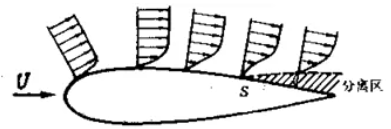

# 本章主要内容

* 理想不可压缩流体平面无旋流动的势流理论
  $$
  \left.\begin{align}
  无旋流动\\
  平面无旋流动
  \end{align}\right\}
  \varphi,\psi
  $$

* 边界层理论基础

* 绕流阻力的一般规律

# 8.1无旋流动

## 一、势函数 $\varphi$ 

势函数存在的充要条件：无旋流动

若若流动无旋，则在整个流场中， $\vec{\omega}=0$ 

无旋流动的条件是：
$$
\left.\begin{align}
\frac{\partial u_{z}}{\partial y}=\frac{\partial u_{y}}{\partial z} \\
\frac{\partial u_{x}}{\partial z}=\frac{\partial u_{z}}{\partial x} \\
\frac{\partial u_{y}}{\partial x}=\frac{\partial u_{x}}{\partial y}
\end{align}\right\}
$$
由高等数学的学习，我们知道上式即是速度势函数存在的柯西-黎曼条件，即存在一个函数 $\varphi$ ，满足：
$$
\frac{\partial \varphi}{\partial x}={u}_{x} \\
\frac{\partial \varphi}{\partial y}={u}_{y} \\
\frac{\partial \varphi}{\partial z}={u}_{z}
$$
对于不可压缩流体流动，速度场应同时满足连续性方程，则：
$$
\frac{\partial^{2} \varphi}{\partial x^{2}}+\frac{\partial^{2} \varphi}{\partial y^{2}}+\frac{\partial^{2} \varphi}{\partial z^{2}}=0
$$
该方程为拉普拉斯方程。满足拉普拉斯方程的函数称为调和函数。

对于不可压缩平面无旋流动，显然，速度场应同时满足
$$
\left\{\begin{align}
&\frac{\partial u_x}{\partial y}=\frac{\partial u_y}{\partial x}\\
&\frac{\partial u_x}{\partial x}+\frac{\partial u_y}{\partial y}=0
\end{align}\right.
$$
从而，不难导出速度势函数满足Laplace方程： $\frac{\partial^{2} \varphi}{\partial x^{2}}+\frac{\partial^{2} \varphi}{\partial y^{2}}=0$ 

#### 速度与势函数 $\varphi$ 之间的关系：

1) 直角坐标系下：

$$
d \varphi=u_{x} d x+u_{y} d y \\
u_{x}=\frac{\partial \varphi}{\partial x}\\
u_{y}=\frac{\partial \varphi}{\partial y}
$$

2) 极坐标系下：

$$
d \varphi=u_{r} d r+u_{\theta} r d \theta \\
u_{r}=\frac{\partial \varphi}{\partial r} \\
u_{\theta}=\frac{1}{r} \frac{\partial \varphi}{\partial \theta}
$$

## 二、流函数 $\psi$ 

### 1、流函数的引入

流函数存在条件是：不可压缩流体平面（二元）流动。

由二元连续性微分方程
$$
\frac{\partial u_x}{\partial x}+\frac{\partial u_y}{\partial y}=0
$$
人为地定义一函数如下：
$$
\left\{\begin{align}
&u_{x}=\frac{\partial \psi}{\partial y} \\
&u_{y}=-\frac{\partial \psi}{\partial x}
\end{align}\right.
$$
显然，它自动满足连续性方程，该函数即称为流函数。

### 2、平面势流

对于不可压缩平面势流，类似于势函数，不难证明流函数也满足Laplace方程，即 $\frac{\partial^2\psi}{\partial x^2}+\frac{\partial^2\psi}{\partial y^2}=0$ 

#### 流函数 $\psi$  与速度之间的关系：

1. 直角坐标系下：

$$
d\psi=u_xdy-u_ydx\\
u_x=\frac{\partial\psi}{\partial y}\\
u_y=-\frac{\partial\psi}{\partial x}
$$

2. 极坐标系下：

$$
d\psi=u_rr\cdot d\theta-u_\theta dr\\
u_r=\frac1r\frac{\partial\psi}{\partial\theta}\\
u_\theta=-\frac{\partial\psi}{\partial r}
$$

### 3、流函数的物理意义

（1）流函数等值线 $\psi(x,y)=c$ 就是流线。

流线方程：
$$
\frac{u_{x}}{d x}=\frac{u_{y}}{d y} \Rightarrow \frac{\frac{\partial \psi}{\partial y}}{d x}=\frac{-\frac{\partial \psi}{\partial x}}{d y} \Rightarrow \frac{\partial \psi}{\partial y} d y+\frac{\partial \psi}{\partial x} d x=0
$$
（2）不可压缩流体的平面流动中，任意两条流线的流函数之差 $\Delta\psi$ 等于这两条流线间所通过的单位宽度流量。

（3）对不可压缩平面势流，必然同时存在流函数和势函数，且二者是共轭调和函数，并满足柯西-黎曼条件：
$$
\frac{\partial \varphi}{\partial x}=\frac{\partial \psi}{\partial y} ; \frac{\partial \varphi}{\partial y}=-\frac{\partial \psi}{\partial x} \\
\frac{\partial \varphi}{\partial x} \frac{\partial \psi}{\partial x}+\frac{\partial \varphi}{\partial y} \frac{\partial \psi}{\partial y}=0
$$

# 8.2绕流运动和附面层

#### 什么是附面层？提出附面层概念对绕流运动研究有何意义?

附面层（边界层）是指贴近平板很薄的流层内，速度梯度很大，粘性的影响不能忽略的薄流层。它的提出为解决粘性流体绕流问题开辟了新途径（绕流区域分成两个区：附面层区和势流区），使流体绕流运动中一些复杂现象得到解释。

在大雷诺数的绕流中，由于流体的惯性力远远大于作用在流体上的黏性力，黏性力相对于惯性力可以忽略不计，将流体视为理想流体，由理想流体的流动理论求解流场中的速度分布和压强分布。但是在靠近物体的一薄层内， 由于存在着强烈的剪切流动，黏性力却大到约与惯性力相同的数量级，因此，在这一薄层（称为附面层）内，黏性力不能忽略。在附面层内，由于存在着强烈的剪切涡旋运动，黏性对绕流物体的阻力、能量耗损、扩散和传热等问题，起着主要的作用。

基于上述缘由，在处理大雷诺数下的绕流问题时，可以用附面层理论处理附面层内的流动，而用理想流体动力学理论求解附面层外流场中的流动，将两者衔接起来，就可以解决整个绕流问题。
$$
\frac{d u_{x}}{d t}=X-\frac{1}{\rho} \frac{\partial p}{\partial x}+v\left(\frac{\partial^{2} u_{x}}{\partial x^{2}}+\frac{\partial^{2} u_{x}}{\partial y^{2}}+\frac{\partial^{2} u_{x}}{\partial z^{2}}\right)\\
\frac{d u_{y}}{d t}=Y-\frac{1}{\rho} \frac{\partial p}{\partial y}+v\left(\frac{\partial^{2} u_{y}}{\partial x^{2}}+\frac{\partial^{2} u_{y}}{\partial y^{2}}+\frac{\partial^{2} u_{y}}{\partial z^{2}}\right)\\
\frac{d u_{z}}{d t}=Z-\frac{1}{\rho} \frac{\partial p}{\partial z}+v\left(\frac{\partial^{2} u_{z}}{\partial x^{2}}+\frac{\partial^{2} u_{z}}{\partial y^{2}}+\frac{\partial^{2} u_{z}}{\partial z^{2}}\right)
$$
在势流区，没有速度梯度，看成无粘性流体，N-S方程简化为：
$$
\frac{d u_{x}}{d t}=X-\frac{1}{\rho} \frac{\partial p}{\partial x}\\
\frac{d u_{y}}{d t}=Y-\frac{1}{\rho} \frac{\partial p}{\partial y}\\
\frac{d u_{z}}{d t}=Z-\frac{1}{\rho} \frac{\partial p}{\partial z}
$$

## 一、附面层（边界层）的概念

当粘性流体以大雷诺数平滑地绕流静止物体时，在壁面附近将出现一个流速由壁面上的零值迅速增至与来流速度相同数量级的薄层，称为附面层。

在物面上作出法线，沿法线测量流体速度，当边界层某点的速度 $u$ 与该处势流速度 $u_\infty$ 仅差 $1\%$ ，即 $u=0.99u_\infty$ 时，该点到物面距离就规定为边界层的厚度，记作 $\delta$ 。

## 二、附面层的基本性质

1. 附面层内沿壁面法线方向速度梯度很大；
2. 与物体的特征长度相比，边界层的厚度很小，例如绕流翼型的边界层最大厚度只为弦长的几百分之一，汽轮机叶片出气边的边界层厚度只有零点几毫米，图中所示都明显地夸大了；
3. 边界层沿流体流动方向逐渐增厚，其外缘与流线不重合；
4. 在边界层内粘滞力与惯性力属于同一数量级；
5. 边界层内沿壁面法线方向各点的压强相等，都等于主流在边界层外缘对应点上的压强；
6. 边界层内流体的流动也有层流和紊流两种流动状态。判别边界层内层流和紊流的准则数仍是雷诺数，其特征长度是离物体前缘点的距离 $x$ ，特征速度取边界层外缘对应点的速度。

临界雷诺数为：
$$
Re_{x_k}=\frac{u_\infty x_k}{\nu}=(3.5～5.0)\times10^5
$$
若长度取流态转化点的附面层厚度 $\delta_k$ ，则相应的临界雷诺数为：
$$
Re_{\delta_k}=\frac{u_\infty\delta_k}{\nu}=3500～3500
$$

## 三、管流附面层

从入口到形成充分发展的管流的长度称入口段长度，对于层流和紊流，入口段长度不同：

层流：
$$
\frac{L'}d=0.028Re
$$
紊流：
$$
\frac{L'}d=50
$$

### 附面层的分离

S点以后靠近壁面的流体质点在与主流方向相反的压差和粘性阻力双重作用下，将产生反方向的回流，而离固体壁面较远的流体，由于附面层外部流体对它的带动作用，仍能保持前进的速度。这样回流和前进这两部分运动方向相反的流体相接触，就形成漩涡。漩涡出现势必使附面层与壁面脱离，这种现象就称为附面层的分离。

边界层分离的两个必要条件：

1. 固体壁面
2. 存在逆压梯度 $\frac{\partial p}{\partial x}>0$ 

#### 形状阻力

附面层分离后，物体后部形成许多无规则的旋涡，由此产生的阻力称形状阻力。（分离点的位置，旋涡区的大小都与物体的形状有关，故称形状阻力。

常见的流线形外形物体的例子：飞机机翼；鱼、鸟的外型等，都是为了退后分离点，缩小漩涡区，从而达到减小形状阻力的目的。

# 8.3绕流阻力和升力

## 一、绕流阻力

### 1、绕流阻力的分类

1. 摩擦阻力：是流体作用在物体表面上的切向应力在来流方向投影的总和，是流体粘性直接作用的结果。*圆盘绕流没有摩擦阻力。*
2. 形状阻力：附面层分离后，物体后部形成许多无规则的旋涡，由此产生的阻力称形状阻力。（分离点的位置，旋涡区的大小都与物体的形状有关，故称形状阻力。）*平板绕流没有形状阻力。*

#### 绕流阻力的计算式：

$$
F_D=C_dA\cdot\frac{\rho u_0^2}{2}
$$

$A$ ——物体投影面积，如果主要受形状阻力时，采用垂直于来流速度方向的投影面积。

$C_d$ ——无因次的阻力系数

$F_D$ ——绕流阻力

### 2、绕流阻力系数的变化规律

#### Stokes公式：

以圆球绕流为例，设圆球作匀速直线运动，流动雷诺数 $Re=\frac{u_0d}{\nu}$ ， $d$ （为圆球直径）很小，在忽略惯性力的前提下，可以导出：
$$
F_{D}=3 \pi \mu d u_{0} \\
F_{D}=3 \pi \mu d u_{0} \stackrel{F_{D}=C_{d}+\frac{\rho u_{0}^{2}}{2}}{\longrightarrow} C_{d}=\frac{24}{\operatorname{Re}}
$$
由实验可以证明上述公式只适用在 $Re<1$ 条件下。这么小的雷诺数只能用来计算空气中微笑尘埃或露珠运动时的阻力，以及经水中直径 $d<0.05mm$ 的泥沙颗粒的沉降速度等。
$$
\begin{cases}
圆盘绕流:只有形状阻力，分离点固定在圆盘的边线\\
圆球绕流：
\begin{cases}
摩擦阻力\\
形状阻力
\end{cases}
分离点的位置随雷诺数的增大而前移
\end{cases}
$$
$Re=3\times10^5$ ，紊流的掺混 $\Rightarrow$ 分离点位置后移，漩涡区显著减小，形状阻力 $\darr$ 

#### 结论：

1. 细长流线型：摩擦阻力，与雷诺数有关；
2. 钟形曲面或曲率很大的曲面物体（圆球或圆柱）：摩擦阻力（低雷诺数时）和形状阻力（高雷诺数时）
3. 尖锐边缘的物体（迎流方向的圆盘，即圆盘垂直于流动方向）：形状阻力

### 3、物体的阻力系数

物体的阻力系数很难用理论方法求出，目前主要依靠实验方法求得。物体阻力系数的定义是：
$$
C_d=\frac{F_D}{A\cdot\frac{\rho u_0^2}2}
$$
$F_D$ ——阻力

$u_0$ ——无穷远来流速度

$A$ ——迎风面积。

在实用中， $C_d$ 常常以图表的形式给出。对于圆球阻力，人们还总结了下面的经验公式：
$$
C_d=
\left\{\begin{align}
&\frac{24}{Re},\quad Re<1\\
&\frac{13}{\sqrt{Re}},\quad Re=10～10^3\\
&0.48,\quad Re=10^3～2\times10^5
\end{align}\right.
$$
式中， $Re=\frac{u_0d}\nu$ 

## 二、悬浮速度（气力输送、除尘和燃烧技术）

悬浮速度是颗粒所受的绕流阻力、浮力和重力平衡时的流速设在上升气流中，小球受力情况中， $F_B$ 是浮力， $F_D$ 是绕流阻力， $G$ 为重力。

* 当 $F_B+F_D>G$ 时，小球随气流上升；
* 当 $F_B+F_D<G$ 时，小球沉降；
* 当 $F_B+F_D=G$ 时，小球处于悬浮状态。

三力平衡时，可以导出悬浮速度 $u$ 的计算公式
$$
u=\sqrt{\frac{4}{3 C_{d}}\left(\frac{\rho_{m}-\rho}{\rho}\right) g d}
$$
$\rho_{m}$ 为小球密度， $\rho$ 为气体密度， $\rho_{m}>\rho$  
$$
C_{d}=\left\{\begin{align}
&24 / \operatorname{Re}, \operatorname{Re}<1 \longrightarrow u=\frac{1}{18 \mu} d^{2}\left(\rho_{m}-\rho\right) g \\
&13 / \sqrt{\operatorname{Re}}, \operatorname{Re}=10 \sim 10^{3} \\
&0.48, \operatorname{Re}=10^{3} \sim 2 \times 10^{5}
\end{align}\right.
$$
