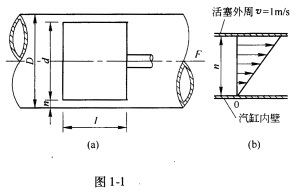
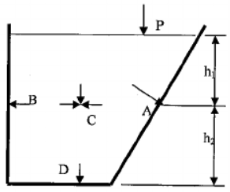
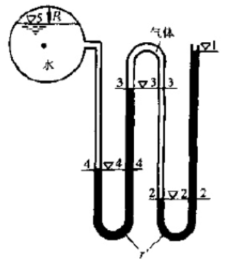
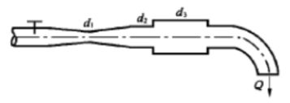
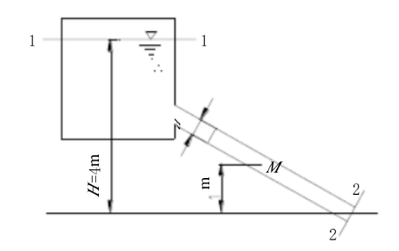
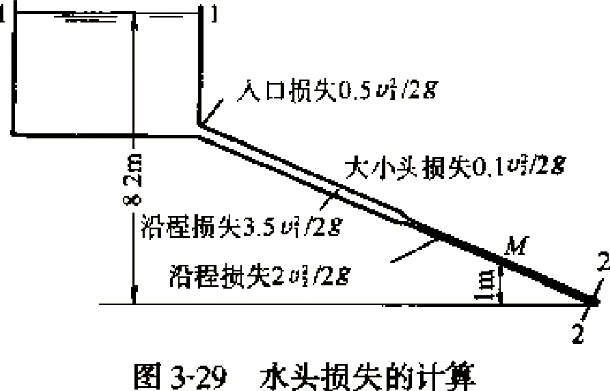
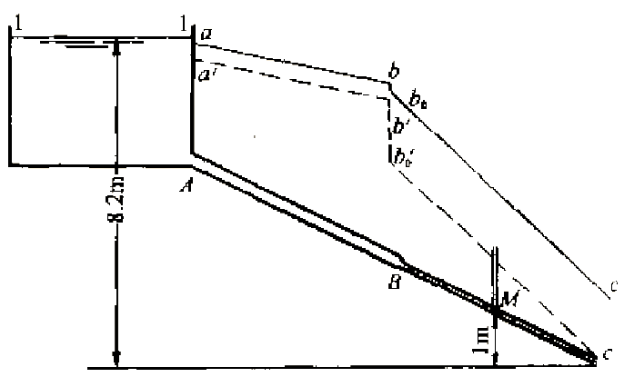
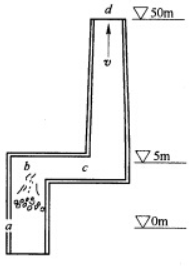

# 题型

1. 填空题 10题 一题2分共20分
2. 选择题 10题 一题2分共20分
3. 计算题 6题 一题10分共60分

第10章完全不考

第5章 5.1、5.2、5.3完全不考

第2章 2.5、2.6完全不考

第3章 3.12、3.13完全不考

第9章 9.4、9.5完全不考

## 第一章 绪论

1. 液体和气体，统称为流体

2. 基本单位是：长度用米，符号为 $m$ ；时间用秒，符号为 $s$ ；质量用千克，符号为 $kg$ ；力为导出单位，采用牛顿，符号为 $N$ 。 $1N=1kg\cdot m/s^2$ 

3. 作用在流体上的力分为**质量力**和**表面力**两类。

4. **质量力**是作用在流体的每一个质点（或微团）上的力。

5. **表面力**是作用在所考虑的流体即分离体表面上的力。（分离体/隔离体：在流体中去除一块由封闭表面所包围的一部分流体）

6. 流体的主要力学性质：流动性、惯性、黏性、压缩性和热胀性、表面张力特性。

7. 水的密度： $\rho=1000kg/m^3$ ；汞的密度： $\rho_{Hg}=13595kg/m^3$ ；干空气在温度为290K（20℃），压强为760mmHg时的密度为 $\rho_{a}=1.2kg/m^3$ 

8. 内摩擦力的数学表达形式：
   
   $$
   T=\mu A\frac{du}{dy}
   $$
   
   若以 $\tau$ 代表单位面积上的内摩擦力，称**切应力**。
   
   $$
   \tau=\frac TA=\mu\frac{du}{dy}
   $$
   
   $\tau$ ——切应力，单位为 $\mathrm{Pa}$ 

   $\mu$ ——动力黏度，单位为 $N/(m^2/s)$ 

   $\nu$ ——运动黏度，单位为 $m^2/s$ 。 $\nu=\frac\mu\rho$ 

9. 对于液体，**分子间的吸引力**是决定性因素，所以**液体的黏度随温度升高而减小**；对于气体，**分子间的热运动产生动量交换**是决定性因素，所以**气体的黏度随温度升高而增大**。

10. 通常压强对流体的黏度影响不大，可以认为影响因素只有温度。

11. **「例1-1」**在图中，汽缸内壁的直径 $D=12~cm$ ，活塞的直径 $d=11.96~cm$ ，活塞的长度 $l=14~cm$ ，活塞运动的往复的速度为 $1~m/s$ ，润滑油的 $μ=1.0~Pa\cdot s$ ，试问作用在活塞上的黏滞力为多少？

    

    **「解」**因黏性作用，粘附在气缸内壁的润滑油层速度为零，粘附在活塞外沿的润滑油层与活塞速度相同，即 $v=1m/s$ 。因此，润滑油层的速度由零增至 $1m/s$ ，油层间因相对运动产生切应力，用 $\tau=\frac{du}{dy}$ 计算。该切应力乘以活塞面积，就是作用于活塞上的黏滞力 $T$ 。

    将间隙 $n$ 放大，绘出该间隙中的速度分布图(b)。由于活塞与气缸的间隙 $n$ 很小，速度分布近似认为是直线分布。故：
    
    $$
    \frac{du}{dy}=\frac vn=\frac{1m/s}{\frac12\times(0.12-0.1196)m}=5\times10^3~[s^{-1}]
    $$
    
    由牛顿内摩擦定律，有
    
    $$
    \begin{align}
    \tau&=\mu\frac{du}{dy}=0.1\cdot s\times5\times10^3=5\times10^2~[N/m^2]\\
    A&=\pi dl=\pi\times0.1196\times0.14=0.053~[m^2]\\
    \therefore~T&=A\tau=0.053\times(5\times10^2)=26.5~[N]
    \end{align}
    $$

12. 流体受压，体积缩小，密度增大的性质，称为流体的**压缩性**。流体受热，体积膨胀，密度减小的性质，称为流体的**热胀性**。

13. 体膨胀系数 $\alpha_V$ 值越大，液体的热胀性越大。单位为 $T^{-1}$ 
    
    $$
    \alpha_V=dV/V/dT
    $$

14. 气体状态方程式
    
    $$
    \frac p\rho=RT
    $$
    
    $p$ ——气体的绝对压强， $Pa$ 

    $T$ ——气体的热力学温度， $K$ 

    $\rho$ ——气体的密度， $kg/m^3$ 

    $R$ ——气体常数， $J/(kg\cdot K)$ 。对于空气， $R=287$ 。

15. 流体力学模型：“连续介质”模型，无黏性流体，不可压缩流体

## 第二章 流体静力学

1. **流体静压强**的特性：在静止的流体中，任一点的流体静压强的大小**与作用面的方向无关**，只与该点的位置有关。流体静压强只是空间位置的函数。

2. **「例2-1」**水池中盛水如图所示。已知液面压强 $p_0=98.07kPa$ ， $h_1=1m$ ， $h_2=0.6m$ 。求水中C点，以及池壁A、B点和池底D点所受的水静压强。

   

   **「解」**A、B、C三点在同一水平面上，水深 $h$ 均为 $1m$ ，所以压强相等。即
   
   $$
   \begin{align}
   p&_A=p_B=p_C=p\\
   \therefore~p&=p_0+\rho gh\\
   &=98.07+1000\times9.8\times1\\
   &=107.87~kPa\\
   \end{align}
   $$
   
   D点的水深是 $1.6m$ ，故
   
   $$
   p_D=98.07+1000\times 9.8\times1.6=113.75~kPa
   $$

3. 液体静力学基本方程式 
   
   $$
   Z+\frac p{\rho g}=位置水头+压强水头=const
   $$

4. **分界面和自由面是水平面**

5. 压强有两种计算基准：绝对压强 $p'$ 和相对压强 $p$ 

   当相对压强为正值时候称该压强为正压（即压力表读数）；为负值时，称为负压。**负压的绝对值**称为**真空度**（即真空表读数），以 $p_v$ 表示。 $p_v>0$ 

6. 压强换算
   $$
   \begin{array}{c}
   1mmH_2O=9.806Pa=100at\\
   1atm=101325Pa=760mmHg
   \end{array}
   $$

7. **「例2-4」**对于压强较高的密封容器，可以采用**复式水银测压计**，如图所示。测压管中各液面高程为 $\grad_1=1.5m$ ， $\grad_2=0.2m$ ， $\grad_3=1.2m$ ， $\grad_4=0.4m$ ， $\grad_5=2.1m$ 。求液面压强 $p_5$ 。

   

   **「解」**根据等压面的规律，2-2、3-3、4-4都分别为等压面。则
   $$
   p_2=\rho'g(\grad_1-\grad_2)
   $$
   由于气体密度远小于液体密度，因此，2-2及3-3间气柱所产生的压强可以忽略不计，即认为 $p_2=p_3$ 。于是
   $$
   \begin{align}
   p_4&=p_3+\rho'g(\grad_3-\grad_4)=p_2+\rho'g(\grad_3-\grad_4)\\
   &=\rho'g(\grad_1-\grad_2)+\rho'g(\grad_3-\grad_4)\\
   &=\rho'g(\grad_1-\grad_2+\grad_3-\grad_4)\\
   p_5&=p_4-\rho g(\grad_5-\grad_4)\\
   &=\rho'g(\grad_1-\grad_2+\grad_3-\grad_4)-\rho g(\grad_5-\grad_4)\\
   &=13595\times9.8\times(1.5-0.2+1.2-0.4)-1000\times9.8\times(2.1-0.4)\\
   &=263.1kPa
   \end{align}
   $$

8. 质量力作用的方向就是压强递增率的方向，**等压面与质量力方向垂直**。

## 第三章 一元流体动力学基础

1. 拉格朗日法的基本特点是追踪流体质点的运动。

   欧拉法是通过描述物理量在空间中的分布来研究流体运动的方法。

2. 运动不平衡的流动，在流场中**各点流速随时间变化**，各点压强、黏性力和惯性力也随着速度的变化而变化。这种流速等物理量的空间分布与时间有关的流动称为**非恒定流动**。

   运动平衡的流动，流场中**各点流速不随时间变化**，由流速决定的压强，黏性力和惯性力也不随时间变化，这种流动成为**恒定流动**。

3. 流线上任一点的速度方向和曲线在该点的切线方向重合，可以写出它的微分方程式。
   $$
   \frac{dx}{u_x}=\frac{dy}{u_y}=\frac{dz}{u_z}
   $$

4. （体积）流量公式 $Q_V=Av$ 

5. 在不可压缩流体一元流动中，平均流速与断面积成反比变化。

6. **「例3-1」**如图所示的管段， $d_1=2.5~cm$ ， $d_2=5~cm$ ， $d_3=10~cm$ 。

   （1）当流量为 $4L/s$ 时，求各管段的平均流速。

   （2）旋动阀门，使流量增加至 $8L/s$ 或使流量减少至 $2L/s$ 时，平均流速如何变化？

   

   **「解」**（1）根据连续性方程
   $$
   \begin{align}
   Q_V&=v_1A_1=v_2A_2=v_3A_3\\
   v_1&=\frac{Q_V}{A_1}=\frac{4\times10^{-3}}{\frac\pi4\times(2.5\times10^{-2})}=8.16~m/s\\
   v_2&=v_1\frac{A_1}{A_2}=v_1\left(\frac{d_1}{d_2}\right)^2=8.16\times\left(\frac{2.5\times10^{-2}}{5\times10^{-2}}\right)^2=2.04~m/s\\
   v_3&=v_1\left(\frac{d_1}{d_3}\right)^2=8.16\times\left(\frac{2.5\times10^{-2}}{10\times10^{-2}}\right)^2=0.51~m/s
   \end{align}
   $$
   （2）各断面流速比例保持不变，流量增加至 $8L$ 时，即流量增加两倍，则各段流速亦增加两倍。即
   $$
   v_1=16.32~m/s,\quad v_2=4.08~m/s,\quad v_3=1.02~m/s
   $$
   流量减小至 $2L$ 时，即流量减小至一半，则各段流速亦为原值的 $\frac12$ 。即
   $$
   v_1=4.08~m/s,\quad v_2=1.02~m/s,\quad v_3=0.255~m/s
   $$

7. 对元流的任意断面
   $$
   \frac p{\rho g}+Z+\frac{u^2}{2g}=单位压能+单位位能+单位动能=const
   $$
   测压管水头 $H_p=\frac p{\rho g}+Z$ ，表示受单位重力作用的流体具有的势能，称为单位势能。

   总水头 $H=\frac p{\rho g}+Z+\frac{u^2}{2g}$ ，表示受单位重力作用的流体具有的总能量，称为单位总能量。

8. **「例3-4」**用毕托管测定（1）风道中的空气流速；（2）管道中的水流速。两种情况均测得水柱 $h_V=3~cm$ 。空气的密度 $\rho=1.20~kg/m^3$ ；流速系数 $\varphi$ 值取 $1$ ，分别求流速。

   **「解」**（1）风道中空气流速
   $$
   u=\varphi\sqrt{2g\times\frac{\rho'}\rho h_V}=\sqrt{2\times9.8\times\frac{1000}{1.20}\times0.03}=22.1~m/s
   $$
   $\rho'$ ——液体压差计所用液体的密度

   $\rho$ ——流动气体本身的密度

   （2）水管中的水流速
   $$
   u=\varphi\sqrt{2g\times h_V}=0.766~m/s
   $$

9. **「例3-7」**如图用直径 $d=100mm$​ 的管道从水箱中引水。如水箱中的水面恒定，水面高出管道出口中心的高度 $H=4m$ ，管道的损失假设沿管道均匀发生， $h_l=3\frac{v^2}{2g}$ 。求：

   （1）通过管道的流速 $v$ 和流量 $Q_V$ ；

   （2）管道中点 $M$ 的压强 $p_M$ 。

   

   **「解」**整个流动是从水箱水面通过水箱本体经管道流入大气中，它和大气相接的断面是水箱水面1-1和出流断面2-2，这就是我们取断面的对象。基准水平面0-0通过出口断面形心，是流动的最低点。

   （1）射流断面2-2压力水头为0。水箱中1-1压力水头为0，面积比管道断面大得多，流速较小，动能忽略不计，所以速度水头也为0。取动能修正系数 $\alpha=1$ 。

   写1-1、2-2的能量方程
   $$
   \begin{align}
   &Z_1+\frac{p_1}{\rho g}+\frac{\alpha_1v_1^2}{2g}=Z_2+\frac{p_2}{\rho g}+\frac{\alpha_2v_2^2}{2g}+h_l\\
   \Rightarrow&~4+0+0=0+0+\frac{1\cdot v^2}{2g}+3\frac{v^2}{2g}\\
   \Rightarrow&~\frac{v^2}{2g}=1~m\\
   \therefore~v&=4.43~m/s\\
   Q_V&=vA=4.43\times\frac{3.14\times0.1^2}{4}=0.0348~m^2/s
   \end{align}
   $$
   （2）为求 $M$ 点的压强，必须在 $M$ 点取断面。另一断面取在和大气相接的水箱水面或管流出口断面，现在选择在出口断面。则
   $$
   \begin{align}
   Z_1=1m,\quad\frac{p_1}{\rho g}&=\frac{p_M}{\rho g},\quad\frac{\alpha_1v_1^2}{2g}=1m\\
   Z_2=0,\quad\frac{p_2}{\rho g}=0,\quad\frac{\alpha_2v_2^2}{2g}&=1m,\quad h_l=\frac12\times3\frac{v^2}{2g}=1.5m
   \end{align}
   $$
   代入能量方程式，得
   $$
   \begin{align}
   1+\frac{p_m}{\rho g}+1&=0+0+1+1.5\\
   \Rightarrow~\frac{p_m}{\rho g}&=0.5m\\
   \therefore\quad p_m&=4.904kPa
   \end{align}
   $$

10. **「例3-8」**设文丘里管的两管直径为 $d_1=200mm$ ， $d_2=100mm$​ ，测得两断面的压强 $\Delta h=0.5m$ ，流量系数 $μ=0.98$ ，求流量。

    **「解」**
    $$
    \begin{align}
    K&=\frac\pi4d_1^2\sqrt\frac{2g}{\left(\frac{d_1}{d_2}\right)^4-1}=\frac\pi4\times0.2^2\times\sqrt\frac{2\times9.8}{\left(\frac{200}{400}\right)^4-1}=0.036~m^{2.5}/s\\
    Q_V&=K\sqrt{\Delta h}=0.98\times0.036\times\sqrt{0.5}=0.0249m^3/s=24.9L/s
    \end{align}
    $$

11. **「例3-10」**水流由水箱经前后相接的两管流出大气中。大小管断面的比例为 $2:1$ 。全部水头损失的计算式参见图中。（1）求出口流速 $v_2$ ；（2）绘总水头线和测压管水头线；（3）根据水头线求 $M$ 点的压强 $p_M$ 。

    

    **「解」**（1）选取水面1-1断面及出流断面2-2，基准面通过管轴出口。则
    $$
    \begin{align}
    p_1=0,&\quad Z_1=8.2m,\quad v_1=0\\
    p_2=0,&\quad Z_2=0
    \end{align}
    $$
    写能量方程
    $$
    8.2+0+0=0+0+\frac{v_2^2}{2g}+h_l
    $$
    由图得
    $$
    h_l=0.5\frac{v_1^2}{2g}+0.1\frac{v_2^2}{2g}+3.5\frac{v_1^2}{2g}+2\frac{v_2^2}{2g}
    $$
    由于两断面之比 $2:1$ ，两管流速之比 $1:2$ ，即 $v_2=2v_1$ ，则 $\frac{v_2^2}{2g}=4\frac{v_1^2}{2g}$ 。代入得
    $$
    \begin{align}
    h_l&=3.1\frac{v_2^2}{2g}\\
    \Rightarrow8.2&=4.1\frac{v_2^2}{2g}\\
    \therefore~\frac{v_2^2}{2g}&=2m,\quad v_2=6.25m/s\\
    \frac{v_1^2}{2g}&=0.5m
    \end{align}
    $$
    （2）从1-1断面开始绘总水头线。静水水面高 $H=8.2m$ ，总水头线就是水面线。入口有局部损失， $0.5\frac{v_1^2}{2g}=0.25m$ 。则 $1-a$ 的铅直向下长度为 $0.25m$ 。从A到B的沿程损失为 $3.5\frac{v_1^2}{2g}=1.75m$ ，则 $b$ 低于 $a$ 的铅直距离为 $1.75m$ 。依次类推。

    测压管水头线在总水头线之下，距总水头线的铅直距离：在A-B管段为 $\frac{v_1^2}{2g}=0.5m$，在B-C管段为 $\frac{v_2^2}{2g}=2m$ 。由于断面不变，流速水头不变。两管段的测压管水头线，分别与各管段的总水头线平行。

    

    （3）测量图中测压管水头线至BC管中点的铅直距离。
    $$
    \frac{p_M}{\rho g}=1m\quad\Longrightarrow\quad p_M=9807Pa
    $$

12. 恒定气流能量方程式
    $$
    p_1+(\gamma_a-\gamma)(z_2-z_1)+\frac{\rho v_1^2}2=p_2+\frac{\rho v_2^2}2+p_{l_{1-2}}
    $$
    $p_1、p_2$ ——**静压**

    $\frac{\rho v_1^2}2、\frac{\rho v_2^2}2$ ——**动压**

    $(\gamma_a-\gamma)(z_2-z_1)$ ——**位压**

13. **「例3-13」**如图所示，空气由炉口 $a$ 流入，通过燃烧后，废气经 $b、c、d$ 由烟囱流出。烟气 $\rho=0.6kg/m^3$ ，空气 $ρ_a=1.2kg/m^3$ ，由 $a$ 到 $c$ 的压强损失为 $9\times\frac{\rho v^2}2$ ， $c$ 到 $d$ 的损失为 $20\frac{\rho v^2}2$ 。求（1）出口流速 $v$ ；（2） $c$ 处静压 $p_c$ 。

    

    **「解」**（1）在进口前 $0m$ 高程和出口 $50m$ 高程处两断面写能量方程
    $$
    \begin{align}
    &p_{1}+\left(\gamma_{a}-\gamma\right)\left(z_{2}-z_{1}\right)+\frac{\rho v_{1}^{2}}{2}=p_{2}+\frac{\rho v_{2}^{2}}{2}+p_{ac}+p_{cd} \\
    &0+9.8 \times(1.2-0.6) \times(50-0)+0=0+0.6 \times \frac{v^{2}}{2}+9 \times 0.6 \frac{v^{2}}{2}+20 \times 0.6 \frac{v^{2}}{2} \\
    &\Rightarrow~30 \times 0.6 \frac{v^{2}}{2}=294 \mathrm{~N} / \mathrm{m}^{2} \\
    &\Rightarrow~v=5.7 \mathrm{~m} / \mathrm{s}
    \end{align}
    $$
    （2）列 $c、d$ 断面的能量方程
    $$
    \begin{align}
    &p_{c}+\left(\gamma_{\mathrm{a}}-\gamma\right)\left(z_{2}-z_{1}\right)+\frac{\rho v^{2}}{2}=p_{d}+\frac{\rho v^{2}}{2}+p_{c d} \\
    &p_{c}+9.8 \times(1.2-0.6) \times(50-5)+0.6 \times \frac{v^{2}}{2}=0+0.6 \times \frac{v^{2}}{2}+20 \times 0.6 \frac{v^{2}}{2}\\
    &\Rightarrow~p_c=-68.6\mathrm{~Pa}
    \end{align}
    $$

## 第四章 流动阻力和能量损失

1. **紊流**：液体质点的运动轨迹极不规则，各部分流体互相剧烈掺混的流动状态。

2. 临界雷诺数： $\mathrm{R}e\mathrm{_K}=\frac{v_Kd}\nu=2000$ 

3. **「例4-3」**某户内燃气管道，用具前支管管径 $d=15mm$ ，燃气流量 $Q_V=2m^3/h$ ，燃气的运动粘度 $\nu=26.3\times10^{-6}~m^2/s$ 。试判别该燃气支管内的流态。

   **「解」**管内燃气流速
   $$
   v=\frac{Q_V}A=\frac{\frac2{3600}}{\frac\pi4\times0.015^2}=3.15~m/s
   $$
   雷诺数为
   $$
   \mathrm Re=\frac{vd}\nu=\frac{3.15\times0.015}{26.3\times10^{-6}}=1767<2000
   $$
   故管中为层流。

4. 圆管中的层流运动中，平均流速等于最大流速的一半。
   $$
   v=\frac12u_\max
   $$

5. 圆管层流的沿程阻力系数 $\lambda$ （ $\lambda=\frac dl\frac{2g}{v^2}h_f$ ）
   $$
   \lambda=\frac{64}{\mathrm Re}
   $$
   圆管层流运动的动能修正系数 $\alpha$ 和动量修正系数 $\alpha_0$ 
   $$
   \alpha=2,\quad\alpha_0=1.33
   $$

6. **「例4-4」**设圆管的直径 $d=2cm$ ，流速 $v=12cm/s$ ，水温 $t=10℃$ 。试求在管长 $L=20m$ 上的沿程水头损失。

   **「解」**先判明流态，查得在 $10℃$ 时水的运动黏度 $\nu=0.013cm^2/s$ 
   $$
   \mathrm Re=\frac{v d}{\nu}=\frac{12 \mathrm{~cm} / \mathrm{s} \times 2 \mathrm{~cm}}{0.013 \mathrm{~cm}^{2} / \mathrm{s}}=1840<2000\quad故为层流
   $$
   求沿程阻力系数 $\lambda$ 
   $$
   \lambda=\frac{64}{\mathrm R e}=\frac{64}{1840}=0.0348
   $$
   **沿程损失**为
   $$
   h_{\mathrm{f}}=\lambda \cdot \frac{l}{d} \cdot \frac{v^{2}}{2 g}=0.0348 \times \frac{2000 \mathrm{~cm}}{2 \mathrm{~cm}} \times \frac{(12 \mathrm{~cm} / \mathrm{s})^{2}}{2 \times 980 \mathrm{~cm} / \mathrm{s}^{2}}=2.6 \mathrm{~cm}
   $$

7. **瞬时值与平均值之差为脉动值**。脉动速度为
   $$
   u_x'=u_x-\overline{u_x}
   $$

8. 紊流阻力包括**黏性切应力**和**惯性切应力**

9. 根据 $\lambda$ 变化的特征分为五个阻力区：

   1. 层流区： $\mathrm Re<2000$ 时， $\lambda=\frac{64}{\mathrm Re}$ 
   2. 临界区： $\mathrm Re=2000～4000$ 
   3. 紊流光滑区： $\mathrm Re>4000$ 后， $\lambda=\frac{0.3164}{\mathrm Re^{0.25}}$ 
   4. 紊流过渡区
   5. 紊流粗糙区

10. 紊流三区通用公式——**阿里特苏里公式**：
    $$
    \lambda=0.11(\frac Kd+\frac{68}{\mathrm Re})^{0.25}
    $$

11. 水力半径 $R$ 的定义为过流断面面积 $A$ 和湿周 $\chi$ 之比。
    $$
    R=\frac A\chi
    $$
    当量直径 $d_e=4R$ 

12. **「例4-11」**某钢管制作的风道，断面尺寸为 $400mm\times200mm$ ，管长 $80m$ 。管内平均流速 $v=10m/s$ 。空气温度 $t=20℃$ ，求压强损失 $p_f$ 。

    **「解」**（1）当量直径
    $$
    d_{\mathrm{e}}=\frac{2 a b}{(a+b)}=\frac{2 \times 0.2 \mathrm{~m} \times 0.4 \mathrm{~m}}{(0.2+0.4) \mathrm{m}}=0.267 \mathrm{~m} \\
    $$
    （2）求 $\mathrm Re$ 。查表， $t=20℃$ 时， $\nu=15.7\times10^{-6}$ 
    $$
    \mathrm Re=\frac{v d_{\mathrm{e}}}{\nu}=\frac{10 \mathrm{~m} / \mathrm{s} \times 0.267 \mathrm{~m}}{15.7 \times 10^{-6} \mathrm{~m}^{2} / \mathrm{s}}=1.7 \times 10^{5}
    $$
    为紊流

    （3）求 $K/d$ 。钢板制风道， $K=0.15mm$ 
    $$
    \frac{K}{d_{\mathrm{e}}}=\frac{0.15 \times 10^{-3} \mathrm{~m}}{0.267 \mathrm{~m}}=5.62 \times 10^{-4}
    $$
    （4）求 $\lambda$ 。根据阿里特苏里公式
    $$
    \lambda=0.11(\frac Kd+\frac{68}{\mathrm Re})^{0.25}=0.11\times(5.62\times10^{-4}+\frac{68}{1.7\times10^5})^{0.25}=0.0194
    $$
    （5）计算压强损失
    $$
    p_{\mathrm{f}}=\lambda \frac{l}{d_{\mathrm{e}}} \frac{\rho v^{2}}{2}=0.0194 \times \frac{80 \mathrm{~m}}{0.267 \mathrm{~m}} \times \frac{1.2 \mathrm{~kg} / \mathrm{m}^{3} \times(10 \mathrm{~m} / \mathrm{s})^{2}}{2}=348.76 \mathrm{~Pa} 
    $$

## 第五章 孔口管嘴管路流动