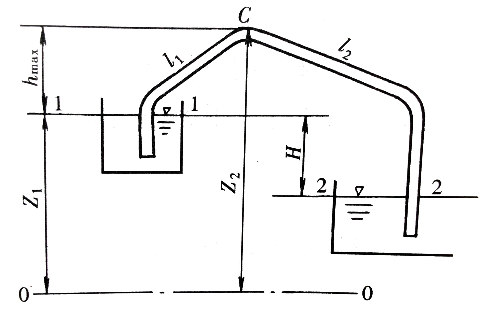
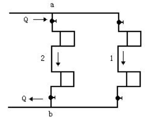

# 题型

1. 填空题 10题 一题2分共20分
2. 选择题 10题 一题2分共20分
3. 计算题 6题 一题10分共60分

第2章 2.5、2.6完全不考

第3章 3.12、3.13完全不考

第5章 5.1、5.2、5.3完全不考

第9章 9.4、9.5完全不考

第10章完全不考

## 第一章 绪论

1. 液体和气体，统称为流体

2. 基本单位是：长度用米，符号为 $m$ ；时间用秒，符号为 $s$ ；质量用千克，符号为 $kg$ ；力为导出单位，采用牛顿，符号为 $N$ 。 $1N=1kg\cdot m/s^2$ 

3. 作用在流体上的力分为**质量力**和**表面力**两类。

4. **质量力**是作用在流体的每一个质点（或微团）上的力。

5. **表面力**是作用在所考虑的流体即分离体表面上的力。（分离体/隔离体：在流体中去除一块由封闭表面所包围的一部分流体）

6. 流体的主要力学性质：流动性、惯性、黏性、压缩性和热胀性、表面张力特性。

7. 水的密度： $\rho=1000kg/m^3$ ；汞的密度： $\rho_{Hg}=13595kg/m^3$ ；干空气在温度为290K（20℃），压强为760mmHg时的密度为 $\rho_{a}=1.2kg/m^3$ 

8. 内摩擦力的数学表达形式：
   
   $$
   T=\mu A\frac{du}{dy}
   $$
   
   若以 $\tau$ 代表单位面积上的内摩擦力，称**切应力**。
   
   $$
   \tau=\frac TA=\mu\frac{du}{dy}
   $$
   
   $\tau$ ——切应力，单位为 $\mathrm{Pa}$ 

   $\mu$ ——动力黏度，单位为 $N/(m^2/s)$ 

   $\nu$ ——运动黏度，单位为 $m^2/s$ 。 $\nu=\frac\mu\rho$ 

9. 对于液体，**分子间的吸引力**是决定性因素，所以**液体的黏度随温度升高而减小**；对于气体，**分子间的热运动产生动量交换**是决定性因素，所以**气体的黏度随温度升高而增大**。

10. 通常压强对流体的黏度影响不大，可以认为影响因素只有温度。

11. **「例1-1」**在图中，汽缸内壁的直径 $D=12~cm$ ，活塞的直径 $d=11.96~cm$ ，活塞的长度 $l=14~cm$ ，活塞运动的往复的速度为 $1~m/s$ ，润滑油的 $μ=1.0~Pa\cdot s$ ，试问作用在活塞上的黏滞力为多少？

    

    **「解」**因黏性作用，粘附在气缸内壁的润滑油层速度为零，粘附在活塞外沿的润滑油层与活塞速度相同，即 $v=1m/s$ 。因此，润滑油层的速度由零增至 $1m/s$ ，油层间因相对运动产生切应力，用 $\tau=\frac{du}{dy}$ 计算。该切应力乘以活塞面积，就是作用于活塞上的黏滞力 $T$ 。

    将间隙 $n$ 放大，绘出该间隙中的速度分布图(b)。由于活塞与气缸的间隙 $n$ 很小，速度分布近似认为是直线分布。故：
    
    $$
    \frac{du}{dy}=\frac vn=\frac{1m/s}{\frac12\times(0.12-0.1196)m}=5\times10^3~[s^{-1}]
    $$
    
    由牛顿内摩擦定律，有
    
    $$
    \begin{align}
    \tau&=\mu\frac{du}{dy}=0.1\cdot s\times5\times10^3=5\times10^2~[N/m^2]\\
    A&=\pi dl=\pi\times0.1196\times0.14=0.053~[m^2]\\
    \therefore~T&=A\tau=0.053\times(5\times10^2)=26.5~[N]
    \end{align}
    $$

12. 流体受压，体积缩小，密度增大的性质，称为流体的**压缩性**。流体受热，体积膨胀，密度减小的性质，称为流体的**热胀性**。

13. 体膨胀系数 $\alpha_V$ 值越大，液体的热胀性越大。单位为 $T^{-1}$ 
    
    $$
    \alpha_V=dV/V/dT
    $$

14. 气体状态方程式
    
    $$
    \frac p\rho=RT
    $$
    
    $p$ ——气体的绝对压强， $Pa$ 

    $T$ ——气体的热力学温度， $K$ 

    $\rho$ ——气体的密度， $kg/m^3$ 

    $R$ ——气体常数， $J/(kg\cdot K)$ 。对于空气， $R=287$ 。

15. 流体力学模型：“连续介质”模型，无黏性流体，不可压缩流体

## 第二章 流体静力学

1. **流体静压强**的特性：在静止的流体中，任一点的流体静压强的大小**与作用面的方向无关**，只与该点的位置有关。流体静压强只是空间位置的函数。

2. **「例2-1」**水池中盛水如图所示。已知液面压强 $p_0=98.07kPa$ ， $h_1=1m$ ， $h_2=0.6m$ 。求水中C点，以及池壁A、B点和池底D点所受的水静压强。

   

   **「解」**A、B、C三点在同一水平面上，水深 $h$ 均为 $1m$ ，所以压强相等。即
   
   $$
   \begin{align}
   p&_A=p_B=p_C=p\\
   \therefore~p&=p_0+\rho gh\\
   &=98.07+1000\times9.8\times1\\
   &=107.87~kPa\\
   \end{align}
   $$
   
   D点的水深是 $1.6m$ ，故
   
   $$
   p_D=98.07+1000\times 9.8\times1.6=113.75~kPa
   $$

3. 液体静力学基本方程式 
   
   $$
   Z+\frac p{\rho g}=位置水头+压强水头=const
   $$

4. **分界面和自由面是水平面**

5. 压强有两种计算基准：绝对压强 $p'$ 和相对压强 $p$ 

   当相对压强为正值时候称该压强为正压（即压力表读数）；为负值时，称为负压。**负压的绝对值**称为**真空度**（即真空表读数），以 $p_v$ 表示。 $p_v>0$ 

6. 压强换算
   
   $$
   \begin{array}{c}
   1mmH_2O=9.806Pa=100at\\
   1atm=101325Pa=760mmHg
   \end{array}
   $$

7. **「例2-4」**对于压强较高的密封容器，可以采用**复式水银测压计**，如图所示。测压管中各液面高程为 $\grad_1=1.5m$ ， $\grad_2=0.2m$ ， $\grad_3=1.2m$ ， $\grad_4=0.4m$ ， $\grad_5=2.1m$ 。求液面压强 $p_5$ 。

   

   **「解」**根据等压面的规律，2-2、3-3、4-4都分别为等压面。则
   
   $$
   p_2=\rho'g(\grad_1-\grad_2)
   $$
   
   由于气体密度远小于液体密度，因此，2-2及3-3间气柱所产生的压强可以忽略不计，即认为 $p_2=p_3$ 。于是
   
   $$
   \begin{align}
   p_4&=p_3+\rho'g(\grad_3-\grad_4)=p_2+\rho'g(\grad_3-\grad_4)\\
   &=\rho'g(\grad_1-\grad_2)+\rho'g(\grad_3-\grad_4)\\
   &=\rho'g(\grad_1-\grad_2+\grad_3-\grad_4)\\
   p_5&=p_4-\rho g(\grad_5-\grad_4)\\
   &=\rho'g(\grad_1-\grad_2+\grad_3-\grad_4)-\rho g(\grad_5-\grad_4)\\
   &=13595\times9.8\times(1.5-0.2+1.2-0.4)-1000\times9.8\times(2.1-0.4)\\
   &=263.1kPa
   \end{align}
   $$

8. 质量力作用的方向就是压强递增率的方向，**等压面与质量力方向垂直**。

## 第三章 一元流体动力学基础

1. 拉格朗日法的基本特点是追踪流体质点的运动。

   欧拉法是通过描述物理量在空间中的分布来研究流体运动的方法。

2. 运动不平衡的流动，在流场中**各点流速随时间变化**，各点压强、黏性力和惯性力也随着速度的变化而变化。这种流速等物理量的空间分布与时间有关的流动称为**非恒定流动**。

   运动平衡的流动，流场中**各点流速不随时间变化**，由流速决定的压强，黏性力和惯性力也不随时间变化，这种流动成为**恒定流动**。

3. 流线上任一点的速度方向和曲线在该点的切线方向重合，可以写出它的微分方程式。
   
   $$
   \frac{dx}{u_x}=\frac{dy}{u_y}=\frac{dz}{u_z}
   $$

4. （体积）流量公式 $Q_V=Av$ 

5. 在不可压缩流体一元流动中，平均流速与断面积成反比变化。

6. **「例3-1」**如图所示的管段， $d_1=2.5~cm$ ， $d_2=5~cm$ ， $d_3=10~cm$ 。

   （1）当流量为 $4L/s$ 时，求各管段的平均流速。

   （2）旋动阀门，使流量增加至 $8L/s$ 或使流量减少至 $2L/s$ 时，平均流速如何变化？

   

   **「解」**（1）根据连续性方程
   
   $$
   \begin{align}
   Q_V&=v_1A_1=v_2A_2=v_3A_3\\
   v_1&=\frac{Q_V}{A_1}=\frac{4\times10^{-3}}{\frac\pi4\times(2.5\times10^{-2})}=8.16~m/s\\
   v_2&=v_1\frac{A_1}{A_2}=v_1\left(\frac{d_1}{d_2}\right)^2=8.16\times\left(\frac{2.5\times10^{-2}}{5\times10^{-2}}\right)^2=2.04~m/s\\
   v_3&=v_1\left(\frac{d_1}{d_3}\right)^2=8.16\times\left(\frac{2.5\times10^{-2}}{10\times10^{-2}}\right)^2=0.51~m/s
   \end{align}
   $$
   
   （2）各断面流速比例保持不变，流量增加至 $8L$ 时，即流量增加两倍，则各段流速亦增加两倍。即
   
   $$
   v_1=16.32~m/s,\quad v_2=4.08~m/s,\quad v_3=1.02~m/s
   $$
   
   流量减小至 $2L$ 时，即流量减小至一半，则各段流速亦为原值的 $\frac12$ 。即
   
   $$
   v_1=4.08~m/s,\quad v_2=1.02~m/s,\quad v_3=0.255~m/s
   $$

7. 对元流的任意断面
   
   $$
   \frac p{\rho g}+Z+\frac{u^2}{2g}=单位压能+单位位能+单位动能=const
   $$
   
   测压管水头 $H_p=\frac p{\rho g}+Z$ ，表示受单位重力作用的流体具有的势能，称为单位势能。

   总水头 $H=\frac p{\rho g}+Z+\frac{u^2}{2g}$ ，表示受单位重力作用的流体具有的总能量，称为单位总能量。

8. **「例3-4」**用毕托管测定（1）风道中的空气流速；（2）管道中的水流速。两种情况均测得水柱 $h_V=3~cm$ 。空气的密度 $\rho=1.20~kg/m^3$ ；流速系数 $\varphi$ 值取 $1$ ，分别求流速。

   **「解」**（1）风道中空气流速
   
   $$
   u=\varphi\sqrt{2g\times\frac{\rho'}\rho h_V}=\sqrt{2\times9.8\times\frac{1000}{1.20}\times0.03}=22.1~m/s
   $$
   
   $\rho'$ ——液体压差计所用液体的密度

   $\rho$ ——流动气体本身的密度

   （2）水管中的水流速
   
   $$
   u=\varphi\sqrt{2g\times h_V}=0.766~m/s
   $$

9. **「例3-7」**如图用直径 $d=100mm$​ 的管道从水箱中引水。如水箱中的水面恒定，水面高出管道出口中心的高度 $H=4m$ ，管道的损失假设沿管道均匀发生， $h_l=3\frac{v^2}{2g}$ 。求：

   （1）通过管道的流速 $v$ 和流量 $Q_V$ ；

   （2）管道中点 $M$ 的压强 $p_M$ 。

   

   **「解」**整个流动是从水箱水面通过水箱本体经管道流入大气中，它和大气相接的断面是水箱水面1-1和出流断面2-2，这就是我们取断面的对象。基准水平面0-0通过出口断面形心，是流动的最低点。

   （1）射流断面2-2压力水头为0。水箱中1-1压力水头为0，面积比管道断面大得多，流速较小，动能忽略不计，所以速度水头也为0。取动能修正系数 $\alpha=1$ 。

   写1-1、2-2的能量方程
   
   $$
   \begin{align}
   &Z_1+\frac{p_1}{\rho g}+\frac{\alpha_1v_1^2}{2g}=Z_2+\frac{p_2}{\rho g}+\frac{\alpha_2v_2^2}{2g}+h_l\\
   \Rightarrow&~4+0+0=0+0+\frac{1\cdot v^2}{2g}+3\frac{v^2}{2g}\\
   \Rightarrow&~\frac{v^2}{2g}=1~m\\
   \therefore~v&=4.43~m/s\\
   Q_V&=vA=4.43\times\frac{3.14\times0.1^2}{4}=0.0348~m^2/s
   \end{align}
   $$
   
   （2）为求 $M$ 点的压强，必须在 $M$ 点取断面。另一断面取在和大气相接的水箱水面或管流出口断面，现在选择在出口断面。则
   
   $$
   \begin{align}
   Z_1=1m,\quad\frac{p_1}{\rho g}&=\frac{p_M}{\rho g},\quad\frac{\alpha_1v_1^2}{2g}=1m\\
   Z_2=0,\quad\frac{p_2}{\rho g}=0,\quad\frac{\alpha_2v_2^2}{2g}&=1m,\quad h_l=\frac12\times3\frac{v^2}{2g}=1.5m
   \end{align}
   $$
   
   代入能量方程式，得
   
   $$
   \begin{align}
   1+\frac{p_m}{\rho g}+1&=0+0+1+1.5\\
   \Rightarrow~\frac{p_m}{\rho g}&=0.5m\\
   \therefore\quad p_m&=4.904kPa
   \end{align}
   $$

10. **「例3-8」**设文丘里管的两管直径为 $d_1=200mm$ ， $d_2=100mm$​ ，测得两断面的压强 $\Delta h=0.5m$ ，流量系数 $μ=0.98$ ，求流量。

    **「解」**
    
    $$
    \begin{align}
    K&=\frac\pi4d_1^2\sqrt\frac{2g}{\left(\frac{d_1}{d_2}\right)^4-1}=\frac\pi4\times0.2^2\times\sqrt\frac{2\times9.8}{\left(\frac{200}{400}\right)^4-1}=0.036~m^{2.5}/s\\
    Q_V&=K\sqrt{\Delta h}=0.98\times0.036\times\sqrt{0.5}=0.0249m^3/s=24.9L/s
    \end{align}
    $$

11. **「例3-10」**水流由水箱经前后相接的两管流出大气中。大小管断面的比例为 $2:1$ 。全部水头损失的计算式参见图中。（1）求出口流速 $v_2$ ；（2）绘总水头线和测压管水头线；（3）根据水头线求 $M$ 点的压强 $p_M$ 。

    

    **「解」**（1）选取水面1-1断面及出流断面2-2，基准面通过管轴出口。则
    
    $$
    \begin{align}
    p_1=0,&\quad Z_1=8.2m,\quad v_1=0\\
    p_2=0,&\quad Z_2=0
    \end{align}
    $$
    
    写能量方程
    
    $$
    8.2+0+0=0+0+\frac{v_2^2}{2g}+h_l
    $$
    
    由图得
    
    $$
    h_l=0.5\frac{v_1^2}{2g}+0.1\frac{v_2^2}{2g}+3.5\frac{v_1^2}{2g}+2\frac{v_2^2}{2g}
    $$
    
    由于两断面之比 $2:1$ ，两管流速之比 $1:2$ ，即 $v_2=2v_1$ ，则 $\frac{v_2^2}{2g}=4\frac{v_1^2}{2g}$ 。代入得
    
    $$
    \begin{align}
    h_l&=3.1\frac{v_2^2}{2g}\\
    \Rightarrow8.2&=4.1\frac{v_2^2}{2g}\\
    \therefore~\frac{v_2^2}{2g}&=2m,\quad v_2=6.25m/s\\
    \frac{v_1^2}{2g}&=0.5m
    \end{align}
    $$
    
    （2）从1-1断面开始绘总水头线。静水水面高 $H=8.2m$ ，总水头线就是水面线。入口有局部损失， $0.5\frac{v_1^2}{2g}=0.25m$ 。则 $1-a$ 的铅直向下长度为 $0.25m$ 。从A到B的沿程损失为 $3.5\frac{v_1^2}{2g}=1.75m$ ，则 $b$ 低于 $a$ 的铅直距离为 $1.75m$ 。依次类推。

    测压管水头线在总水头线之下，距总水头线的铅直距离：在A-B管段为 $\frac{v_1^2}{2g}=0.5m$，在B-C管段为 $\frac{v_2^2}{2g}=2m$ 。由于断面不变，流速水头不变。两管段的测压管水头线，分别与各管段的总水头线平行。

    

    （3）测量图中测压管水头线至BC管中点的铅直距离。
    
    $$
    \frac{p_M}{\rho g}=1m\quad\Longrightarrow\quad p_M=9807Pa
    $$

12. 恒定气流能量方程式
    
    $$
    p_1+(\gamma_a-\gamma)(z_2-z_1)+\frac{\rho v_1^2}2=p_2+\frac{\rho v_2^2}2+p_{l_{1-2}}
    $$
    
    $p_1、p_2$ ——**静压**

    $\frac{\rho v_1^2}2、\frac{\rho v_2^2}2$ ——**动压**

    $(\gamma_a-\gamma)(z_2-z_1)$ ——**位压**

13. **「例3-13」**如图所示，空气由炉口 $a$ 流入，通过燃烧后，废气经 $b、c、d$ 由烟囱流出。烟气 $\rho=0.6kg/m^3$ ，空气 $ρ_a=1.2kg/m^3$ ，由 $a$ 到 $c$ 的压强损失为 $9\times\frac{\rho v^2}2$ ， $c$ 到 $d$ 的损失为 $20\frac{\rho v^2}2$ 。求（1）出口流速 $v$ ；（2） $c$ 处静压 $p_c$ 。

    

    **「解」**（1）在进口前 $0m$ 高程和出口 $50m$ 高程处两断面写能量方程
    
    $$
    \begin{align}
    &p_{1}+\left(\gamma_{a}-\gamma\right)\left(z_{2}-z_{1}\right)+\frac{\rho v_{1}^{2}}{2}=p_{2}+\frac{\rho v_{2}^{2}}{2}+p_{ac}+p_{cd} \\
    &0+9.8 \times(1.2-0.6) \times(50-0)+0=0+0.6 \times \frac{v^{2}}{2}+9 \times 0.6 \frac{v^{2}}{2}+20 \times 0.6 \frac{v^{2}}{2} \\
    &\Rightarrow~30 \times 0.6 \frac{v^{2}}{2}=294 \mathrm{~N} / \mathrm{m}^{2} \\
    &\Rightarrow~v=5.7 \mathrm{~m} / \mathrm{s}
    \end{align}
    $$
    
    （2）列 $c、d$ 断面的能量方程
    
    $$
    \begin{align}
    &p_{c}+\left(\gamma_{\mathrm{a}}-\gamma\right)\left(z_{2}-z_{1}\right)+\frac{\rho v^{2}}{2}=p_{d}+\frac{\rho v^{2}}{2}+p_{c d} \\
    &p_{c}+9.8 \times(1.2-0.6) \times(50-5)+0.6 \times \frac{v^{2}}{2}=0+0.6 \times \frac{v^{2}}{2}+20 \times 0.6 \frac{v^{2}}{2}\\
    &\Rightarrow~p_c=-68.6\mathrm{~Pa}
    \end{align}
    $$

## 第四章 流动阻力和能量损失

1. **紊流**：液体质点的运动轨迹极不规则，各部分流体互相剧烈掺混的流动状态。

2. 临界雷诺数： $\mathrm{R}e\mathrm{_K}=\frac{v_Kd}\nu=2000$ 

3. **「例4-3」**某户内燃气管道，用具前支管管径 $d=15mm$ ，燃气流量 $Q_V=2m^3/h$ ，燃气的运动粘度 $\nu=26.3\times10^{-6}~m^2/s$ 。试判别该燃气支管内的流态。

   **「解」**管内燃气流速
   
   $$
   v=\frac{Q_V}A=\frac{\frac2{3600}}{\frac\pi4\times0.015^2}=3.15~m/s
   $$
   
   雷诺数为
   
   $$
   \mathrm Re=\frac{vd}\nu=\frac{3.15\times0.015}{26.3\times10^{-6}}=1767<2000
   $$
   
   故管中为层流。

4. 圆管中的层流运动中，平均流速等于最大流速的一半。
   
   $$
   v=\frac12u_\max
   $$

5. 圆管层流的沿程阻力系数 $\lambda$ （ $\lambda=\frac dl\frac{2g}{v^2}h_f$ ）
   
   $$
   \lambda=\frac{64}{\mathrm Re}
   $$
   
   圆管层流运动的动能修正系数 $\alpha$ 和动量修正系数 $\alpha_0$ 
   
   $$
   \alpha=2,\quad\alpha_0=1.33
   $$

6. **「例4-4」**设圆管的直径 $d=2cm$ ，流速 $v=12cm/s$ ，水温 $t=10℃$ 。试求在管长 $L=20m$ 上的沿程水头损失。

   **「解」**先判明流态，查得在 $10℃$ 时水的运动黏度 $\nu=0.013cm^2/s$ 
   
   $$
   \mathrm Re=\frac{v d}{\nu}=\frac{12 \mathrm{~cm} / \mathrm{s} \times 2 \mathrm{~cm}}{0.013 \mathrm{~cm}^{2} / \mathrm{s}}=1840<2000\quad故为层流
   $$
   
   求沿程阻力系数 $\lambda$ 
   
   $$
   \lambda=\frac{64}{\mathrm R e}=\frac{64}{1840}=0.0348
   $$
   
   **沿程损失**为
   
   $$
   h_{\mathrm{f}}=\lambda \cdot \frac{l}{d} \cdot \frac{v^{2}}{2 g}=0.0348 \times \frac{2000 \mathrm{~cm}}{2 \mathrm{~cm}} \times \frac{(12 \mathrm{~cm} / \mathrm{s})^{2}}{2 \times 980 \mathrm{~cm} / \mathrm{s}^{2}}=2.6 \mathrm{~cm}
   $$

7. **瞬时值与平均值之差为脉动值**。脉动速度为
   
   $$
   u_x'=u_x-\overline{u_x}
   $$

8. 紊流阻力包括**黏性切应力**和**惯性切应力**

9. 根据 $\lambda$ 变化的特征分为五个阻力区：

   1. 层流区： $\mathrm Re<2000$ 时， $\lambda=\frac{64}{\mathrm Re}$ 
   2. 临界区： $\mathrm Re=2000～4000$ 
   3. 紊流光滑区： $\mathrm Re>4000$ 后， $\lambda=\frac{0.3164}{\mathrm Re^{0.25}}$ 
   4. 紊流过渡区
   5. 紊流粗糙区

10. 紊流三区通用公式——**阿里特苏里公式**：
    
    $$
    \lambda=0.11(\frac Kd+\frac{68}{\mathrm Re})^{0.25}
    $$

11. 水力半径 $R$ 的定义为过流断面面积 $A$ 和湿周 $\chi$ 之比。
    
    $$
    R=\frac A\chi
    $$
    
    当量直径 $d_e=4R$ 

12. **「例4-11」**某钢管制作的风道，断面尺寸为 $400mm\times200mm$ ，管长 $80m$ 。管内平均流速 $v=10m/s$ 。空气温度 $t=20℃$ ，求压强损失 $p_f$ 。

    **「解」**（1）当量直径
    
    $$
    d_{\mathrm{e}}=\frac{2 a b}{(a+b)}=\frac{2 \times 0.2 \mathrm{~m} \times 0.4 \mathrm{~m}}{(0.2+0.4) \mathrm{m}}=0.267 \mathrm{~m} \\
    $$
    
    （2）求 $\mathrm Re$ 。查表， $t=20℃$ 时， $\nu=15.7\times10^{-6}$ 
    
    $$
    \mathrm Re=\frac{v d_{\mathrm{e}}}{\nu}=\frac{10 \mathrm{~m} / \mathrm{s} \times 0.267 \mathrm{~m}}{15.7 \times 10^{-6} \mathrm{~m}^{2} / \mathrm{s}}=1.7 \times 10^{5}
    $$
    
    为紊流

    （3）求 $K/d$ 。钢板制风道， $K=0.15mm$ 
    
    $$
    \frac{K}{d_{\mathrm{e}}}=\frac{0.15 \times 10^{-3} \mathrm{~m}}{0.267 \mathrm{~m}}=5.62 \times 10^{-4}
    $$
    
    （4）求 $\lambda$ 。根据阿里特苏里公式
    
    $$
    \lambda=0.11(\frac Kd+\frac{68}{\mathrm Re})^{0.25}=0.11\times(5.62\times10^{-4}+\frac{68}{1.7\times10^5})^{0.25}=0.0194
    $$
    
    （5）计算压强损失
    
    $$
    p_{f}=\lambda \frac{l}{d_{\mathrm{e}}} \frac{\rho v^{2}}{2}=0.0194 \times \frac{80 \mathrm{~m}}{0.267 \mathrm{~m}} \times \frac{1.2 \mathrm{~kg} / \mathrm{m}^{3} \times(10 \mathrm{~m} / \mathrm{s})^{2}}{2}=348.76 \mathrm{~Pa}
    $$

## 第五章 孔口管嘴管路流动

1. 对于简单管路，有
   
   $$
   h_l=(\lambda\frac ld+\sum\zeta)\frac{v^2}{2g}=\frac{8(\lambda\frac ld+\sum\zeta)}{\pi^2d^4g}Q_V^2
   $$
   
   阻抗
   
   $$
   S_H=\frac{8(\lambda\frac ld+\sum\zeta)}{\pi^2d^4g}\qquad S_P=\frac{8(\lambda\frac ld+\sum\zeta)\rho}{\pi^2d^4}
   $$
   
   则沿程损失
   
   $$
   h_l=S_HQ_V^2\qquad p_l=S_PQ_V^2
   $$

2. **「例5-5」**某矿渣混凝土板风道，断面积为 $1m\times1.2m$ ，长为 $50m$ ，局部阻力系数 $\sum\zeta=2.5$ ， 流量为 $14m^3/s$ ，空气温度为 $20℃$ ，求压强损失。

   **「解」**矿渣混凝土板 $K=1.5mm$ ， $20℃$ 空气的运动黏度为 $\nu=15.7\times10^{-6}m/s$ 

   对矩形风道计算阻力损失应用当量直径 $d_e$ 
   
   $$
   d_e=\frac{2ab}{a+b}=\frac{2\times1\times1.2}{1+1.2}=1.09~m
   $$
   
   求矩形风道流动速度 $v$ 
   
   $$
   v=\frac{Q_V}A=\frac{14}{1\times1.2}=11.65~m/s
   $$
   
   求雷诺数 $\mathrm Re$ 
   
   $$
   \begin{align}
   \mathrm Re&=\frac{vd_e}\nu=\frac{11.65\times1.09}{15.7\times10^{-6}}=8\times10^5\\
   \frac{K}{d_e}&=\frac{1.5}{1.09\times10^3}=1.38\times10^{-3}\\
   \lambda&=0.11(\frac K{d_e}+\frac{68}{\mathrm Re})^{0.25}=0.11\times(1.38\times10^{-3}+\frac{68}{8\times10^5})^{0.25}=0.021
   \end{align}
   $$
   
   计算 $S_p$ 值
   
   $$
   \begin{align}
   S_P&=\frac{(\lambda\frac ld+\sum\zeta)\rho}{2A^2}=\frac{(0.021\times\frac{50}{1.09}+2.5)\times1.2}{2\times1.2^2}=1.443~kg/m^7\\
   p&=S_P\cdot Q_V^2=1.443\times14^2=282.83~Pa
   \end{align}
   $$

3. **「例5-6」**给出图中具体数值如下： $H=2m$ ， $l_1=15m$ ， $l_2=20m$ ， $d=200mm$ ， $\zeta_e=1$ ， $\zeta_b=0.2$ ， $\zeta_0=1$ ， $\lambda=0.025$ ， $[h_V]=7m$ 

   求通过虹吸管流量及管顶最大允许安装高度。

   

   **「解」**由公式求得流量
   
   $$
   \begin{aligned}
   Q_{\mathrm{v}} & =\frac{\frac{1}{4} \pi d^{2}}{\sqrt{\zeta_{\mathrm{e}}+3 \zeta_{\mathrm{b}}+\zeta_{0}+\lambda \frac{l_{1}+l_{2}}{d}}} \sqrt{2 g H} \\
   & =\frac{0.0314 \mathrm{~m}^{2}}{\sqrt{1+3 \times 0.2+1+4.38}} \cdot \sqrt{39.2 \mathrm{~m}^{2} / \mathrm{s}^{2}} \\
   & =0.0745 \mathrm{~m}^{3} / \mathrm{s}
   \end{aligned}
   $$
   
   由公式求得最大安装高度
   
   $$
   Z_{\mathrm{C}}-Z_{1}=\frac{p_{\mathrm{a}}-p_{\mathrm{C}}}{\rho g}-\frac{1+\zeta_{\mathrm{e}}+2 \zeta_{\mathrm{b}}+\lambda l_{1} / d}{\zeta_{\mathrm{e}}+3 \zeta_{\mathrm{b}}+\zeta_{0}+\lambda \frac{l_{1}+l_{2}}{d}} \cdot H
   $$
   
   当 $\frac{p_{\mathrm{a}}-p_{\mathrm{C}}}{\rho g}=\left[h_{\mathrm{v}}\right]$ 时， $Z_{\mathrm{C}}-Z_{1}=h_{\text {max }}$ 
   
   $$
   \begin{aligned}
   h_{\max } & =\left[h_{\mathrm{v}}\right]-\frac{1+\zeta_{\mathrm{e}}+2 \zeta_{\mathrm{b}}+\lambda l_{1} / d}{\zeta_{\mathrm{e}}+3 \zeta_{\mathrm{b}}+\zeta_{\mathrm{a}}+\lambda \frac{l_{1}+l_{2}}{d}} \cdot H \\
   & =7 \mathrm{~m}-\frac{4.275}{6.98} \times 2 \mathrm{~m}=5.78 \mathrm{~m}
   \end{aligned}
   $$

4. 节点质量平衡原理：流入的质量数量与流出的质量流量相等。

   对于串联管路， 
   
   $$
   \begin{align}
   Q_{V1}&=Q_{V2}=Q_{V3}\\
   h_{l1-3}&=h_{l1}+h_{l2}+h_{l3}\\
   &=S_1Q_{V1}^2+S_2Q_{V2}^2+S_3Q_{V3}^2\\
   S&=S_1+S_2+S_3
   \end{align}
   $$
   
   对于并联管路，
   
   $$
   \begin{align}
   Q_V&=Q_{V1}+Q_{V2}+Q_{V3}\\
   h_{l1}&=h_{l2}=h_{l3}=h_{la-b}\\
   S_1Q_{V}^2&=S_1Q_{V1}^2=S_2Q_{V2}^2=S_3Q_{V3}^2\\
   \frac1{\sqrt{S}}&=\frac1{\sqrt{S_1}}+\frac1{\sqrt{S_2}}+\frac1{\sqrt{S_3}}
   \end{align}
   $$

5. **「例5-7」**某两层楼的供暖立管，管段 $1$ 的直径为 $20mm$ ，总长为 $20m$ ， $\sum\zeta_1=15$ 。管段 $2$ 的直径为 $20mm$ ，总长为 $10m$ ， $\sum\zeta_2=15$ 。管路的 $\lambda=0.025$ ，干管中的流量 $Q_V=1\times10^{-3}m/s$ ，求 $Q_{V1}$ 和 $Q_{V2}$ 。

   

   **「解」**由图可知，节点 $a、b$ 并联 $1、2$ 两管段。可得
   
   $$
   \frac{Q_{\mathrm{V} 1}}{Q_{\mathrm{V} 2}}=\sqrt{\frac{S_{2}}{S_{1}}}
   $$
   
   计算 $S_1、S_2$ 
   
   $$
   \begin{align}
   S_{1}&=\left(\lambda \frac{l_1}{d}+\sum \zeta_{1}\right) \frac{8 \rho}{\pi^{2} d^{4}}=\left(0.025 \times \frac{20 \mathrm{~m}}{0.02 \mathrm{~m}}+15\right) \frac{8 \times 1000 \mathrm{~m}^{3} / \mathrm{s}}{3.14^{2} \times(0.02 \mathrm{~m})^{4}}=2.03 \times 10^{11} \mathrm{~kg} / \mathrm{m}^{7} \\
   S_{2}&=\left(\lambda \frac{l_2}{d}+\sum \zeta_{2}\right) \frac{8 \rho}{\pi^{2} d^{4}}=\left(0.025 \times \frac{10 \mathrm{~m}}{0.02 \mathrm{~m}}+15\right) \frac{8 \times 1000 \mathrm{~m}^{3} / \mathrm{s}}{3.14^{2} \times(0.02 \mathrm{~m})^{4}}=1.39 \times 10^{11} \mathrm{~kg} / \mathrm{m}^{7}\\
   \therefore~&\frac{Q_{\mathrm{V1}}}{Q_{\mathrm{V} 2}}=\sqrt{\frac{1.39 \times 10^{11} \mathrm{~kg} / \mathrm{m}^{7}}{2.03 \times 10^{11} \mathrm{~kg} / \mathrm{m}^{7}}}=0.828\\
   &\Rightarrow~Q_{V1}=0.828Q_{V2}\\
   \because~&Q_{\mathrm{V}}=Q_{\mathrm{V} 1}+Q_{\mathrm{V} 2}=0.828 Q_{\mathrm{V} 2}+Q_{\mathrm{V} 2}=1.828 Q_{\mathrm{V} 2} \\
   \therefore~&Q_{\mathrm{V} 2}=\frac{1}{1.828} \cdot Q_{\mathrm{V}}=0.55 \times 10^{-3} \mathrm{~m}^{3} / \mathrm{s}\\
   &Q_{\mathrm{V} 1}=0.828 Q_{\mathrm{V} 2}=0.828 \times 0.55 \times 10^{-3} \mathrm{~m}^{3} / \mathrm{s}=0.45 \times 10^{-3} \mathrm{~m}^{3} / \mathrm{s} 
   \end{align}
   $$

6. 管网是由简单管路、并联、串联管路组合而成，基本上可以分为**枝状管网**和**环状管网**两种。

7. **水击**：有压管中运动着的液体，由于阀门或水泵突然关闭，使得液体速度和动量发生急剧变化，从而引起液体压强的骤然变化的现象。

## 第六章 气体射流

1. 气体自孔口、管嘴或条缝向外喷射所形成的流动，称为**气体淹没射流**。

2. **「例6-1」**用轴流风机水平送风，风机直径 $d_0=600mm$ 。出口风速 $10m/s$ ，求距出口 $10m$ 处的轴心速度和风量。

   **「解」**由表查得**紊流系数** $a=0.12$ 。由公式得
   
   $$
   \begin{aligned}
   \frac{轴心速度}{出口速度}&=\frac{v_{\mathrm{m}}}{v_{0}}=\frac{0.48}{\frac{a s}{d_{0}}+0.147}=\frac{0.48}{\frac{0.12 \times 10 \mathrm{~m}}{0.6 \mathrm{~m}}+0.147}=0.225 \\
   轴心速度&=v_{\mathrm{m}}=0.225 v_{0}=0.225 \times 10 \mathrm{~m} / \mathrm{s}=2.25 \mathrm{~m} / \mathrm{s} \\
   \frac{风量}{单位体积风量}&=\frac{Q_{\mathrm{V}}}{Q_{\mathrm{V} 0}}=4.4\left(\frac{a s}{d_{0}}+0.147\right)=4.4 \times 2.147=9.45 \\
   风量&=Q_{\mathrm{V}}=9.45 Q_{\mathrm{V} 0}=9.45 \times \frac{\pi}{4} d_{0}^{2} v_{0}=9.45 \times \frac{\pi}{4} \times(0.6 \mathrm{~m})^{2} \times 10 \mathrm{~m} / \mathrm{s}=26.7 \mathrm{~m}^{3} / \mathrm{s}
   \end{aligned}
   $$

3. 气体从狭长缝隙中外射运动时，射流在条缝长度方向几乎无扩散运动，只能在垂直条缝长度的各个平面上扩散运动。这种流动可视为平面运动，故称为平面射流。

4. **「例6-5」**室外空气以射流方式，由位于热车间外墙上离地板 $7.0m$​ 处的孔口送入，孔口高 $0.35m$ ，长 $12m$ ，室外空气的温度为 $-10℃$ ，室内空气温度为 $20℃$ ，射流初速度为 $2m/s$ ，求地板上的温度。

   **「解」**紊流系数 $a$ 取 $0.12$ 
   
   $$
   \begin{align}
   射流半高度&=b_0=\frac{d_0}2=\frac{0.35}{2}\\
   无因次距离&=\bar{y}=\frac{}{}=\frac{y}{2 b_{0}}=\frac{7.0 \mathrm{~m}}{0.35 \mathrm{~m}}=20\\
   阿基米德准数&=\mathrm{Ar}=\frac{g\left(2 b_{0}\right) \Delta T_{0}}{v_{0}^{2} T_{\mathrm{e}}}=\frac{9.8 \mathrm{~m} / \mathrm{s}^{2} \times 0.35 \mathrm{~m} \times(-10-20) \mathrm{K}}{(2 \mathrm{~m} / \mathrm{s})^{2} \times(273+20) \mathrm{K}}=\frac{103}{1170}=0.088 \\
   \sqrt\frac{室内热力学温度}{室外热力学温度}&=\sqrt{\frac{T_{\mathrm{e}}}{T_{0}}}=\frac{\sqrt{(20+273) \mathrm{K}}}{\sqrt{(-10+273) \mathrm{K}}}=1.0555 \\
   &\therefore~\frac{\bar{y}}{\mathrm{Ar}} \cdot \sqrt{\frac{T_{\mathrm{e}}}{T_{0}}}=\frac{20 \sqrt{293 \mathrm{~K} / 263 \mathrm{~K}}}{0.088}=220\\
   由&\frac{\bar{y}}{\mathrm{Ar}} \cdot \sqrt{\frac{T_{\mathrm{e}}}{T_{0}}}=\frac{0.226}{a^2}(a\bar x+0.205)^\frac52求得\\
   &\bar x =23\\
   \therefore~&\frac{x}{2 b_{0}}=23 \quad \frac{x}{b_{0}}=46 \\
   \frac{轴心温差}{出口断面温差}&=\frac{\Delta T_{\mathrm{m}}}{\Delta T_{0}}=\frac{1.032}{\sqrt{0.12 \times 46+0.41}}=\frac{1.032}{\sqrt{5.93}}=0.425 \\
   \Rightarrow~&\frac{T-T_{\mathrm{e}}}{T_{0}-T_{\mathrm{e}}}=\frac{t-20^{\circ} \mathrm{C}}{-10^{\circ} \mathrm{C}-20^{\circ} \mathrm{C}}=0.425 \\
   \Rightarrow~&t=7.3^{\circ} \mathrm{C}
   \end{align}
   $$

## 第七章 不可压缩流体动力学基础

1. **线变形速度**：
   
   $$
   \left.\begin{align}
   \varepsilon_{xx}=\frac{\partial u_x}{\partial x}\\
   \varepsilon_{yy}=\frac{\partial u_y}{\partial y}\\
   \varepsilon_{zz}=\frac{\partial u_z}{\partial z}
   \end{align}\right\}
   $$
   
   **旋转角速度**：
   
   $$
   \left.\begin{align}
   \omega_x=\frac12(\frac{\partial u_z}{\partial y}-\frac{\partial u_y}{\partial z})\\
   \omega_y=\frac12(\frac{\partial u_x}{\partial z}-\frac{\partial u_z}{\partial x})\\
   \omega_z=\frac12(\frac{\partial u_y}{\partial x}-\frac{\partial u_x}{\partial y})
   \end{align}\right\}
   $$
   
   **角变形速度**：
   
   $$
   \left.\begin{align}
   \varepsilon_{xy}=\varepsilon_{yx}=\frac12(\frac{\partial u_y}{\partial x}+\frac{\partial u_x}{\partial y})\\
   \varepsilon_{xz}=\varepsilon_{zx}=\frac12(\frac{\partial u_x}{\partial z}+\frac{\partial u_z}{\partial x})\\
   \varepsilon_{yz}=\varepsilon_{zy}=\frac12(\frac{\partial u_z}{\partial y}+\frac{\partial u_y}{\partial z})
   \end{align}\right\}
   $$

2. 不可压缩流体的连续性微分方程
   
   $$
   \quad \frac{\partial u_{x}}{\partial x}+\frac{\partial u_{y}}{\partial y}+\frac{\partial u_{z}}{\partial z}=0
   $$

3. **「例7-4」**试证流速为

   （1） $u_x=-ky,~u_y=kx,~u_z=0$ ；

   （2） $u_x=-\frac y{x^2+y^2},~u_y=\frac x{x^2+y^2},~u_z=0$ 的流动满足连续性条件。

   **「解」**（1） $u_{\mathrm{x}}=-k y,~u_{\mathrm{y}}=k x,~u_{z}=0$ 
   
   $$
   \begin{align}
   \because~&\frac{\partial u_{x}}{\partial x}=0, \frac{\partial u_{y}}{\partial y}=0, \frac{\partial u_{z}}{\partial z}=0 \\
   \therefore~&\frac{\partial u_{x}}{\partial x}+\frac{\partial u_{y}}{\partial y}+\frac{\partial u_{z}}{\partial z}=0
   \end{align}
   $$
   
   （2） $u_x=-\frac y{x^2+y^2},~u_y=\frac x{x^2+y^2},~u_z=0$ 
   
   $$
   \begin{align}
   \because~&\frac{\partial u_{\mathrm{x}}}{\partial x}=\frac{2 x y}{\left(x^{2}+y^{2}\right)^{2}}, \frac{\partial u_{y}}{\partial y}=\frac{-2 x y}{\left(x^{2}+y^{2}\right)^{2}} \\
   \therefore~&\frac{\partial u_{x}}{\partial x}+\frac{\partial u_{y}}{\partial y}+\frac{\partial u_{z}}{\partial z}=0
   \end{align}
   $$

4. **初始条件**是指方程组的解在初始时刻应 $t=t_0$ 时满足的条件

## 第八章 流体运动基本方程的求解

1. 流场中各点旋转角速度等于零的运动，称为**无旋流动**。

   无旋流动的条件是：
   
   $$
   \left.\begin{align}
   \frac{\partial u_{z}}{\partial y}=\frac{\partial u_{y}}{\partial z} \\
   \frac{\partial u_{x}}{\partial z}=\frac{\partial u_{z}}{\partial x} \\
   \frac{\partial u_{y}}{\partial x}=\frac{\partial u_{x}}{\partial y}
   \end{align}\right\}
   $$

2. 函数 $\varphi$ 称为速度势函数。存在着速度势函数的流动，称为有势流动。只有无旋流动才存在势函数。

   势函数分速度：
   
   $$
   \left.\begin{align}
   \frac{\partial \varphi}{\partial x}={u}_{x} \\
   \frac{\partial \varphi}{\partial y}={u}_{y} \\
   \frac{\partial \varphi}{\partial z}={u}_{z}
   \end{align}\right\}
   $$
   
   存在着势函数的前提是流场内部不存在旋转角速度。

   如果在流动过程中没有受到边壁摩擦的显著作用，就可以当作理想流体来考虑。

3. 函数 $\psi$ 称为流函数。无论是有旋流动还是无旋流动都存在流函数。
   
   $$
   \left.\begin{align}
   &u_{x}=\frac{\partial \psi}{\partial y} \\
   &u_{y}=-\frac{\partial \psi}{\partial x}
   \end{align}\right\}
   $$
   
   只要满足不可压缩流体平面流动的连续性方程，流动即存在流函数。

4. **「例8-1」**已知平面流动的速度分布 $u_x=x^2-y^2,~u_y=-2xy$ 。试判断流动

   （1）是否满足不可压缩流体平面流动的连续性方程；

   （2）是否有旋；

   （3）若流动存在势函数和流函数，试求速度势函数和流函数。

   **「解」**

   （1） $\frac{\partial u_x}{\partial x}+\frac{\partial u_y}{\partial y}=2x-2x=0$ ，满足不可压缩流体平面流动的连续性方程，流动存在流函数。

   （2）平面流动，必有 $\omega_x=0,~\omega_y=0$ 
   
   $$
   \omega_z=\frac12(\frac{\partial u_y}{\partial x}-\frac{\partial u_x}{\partial y})=\frac12(-2y+2y)=0
   $$
   
   流动无旋，存在速度势函数。

   （3）速度势函数
   
   $$
   \varphi=\int d\varphi=\int u_xdx+u_ydy=\int_0^xx^2dx+\int_0^y-2xydy=\frac13x^3-xy^2
   $$
   
   流函数
   
   $$
   \psi=\int d\psi=\int u_xdy-u_ydx=x^2y-\frac13y^3
   $$

5. 在大雷诺数的绕流中，由于流体的惯性力远远大于作用在流体上的黏性力，黏性力相对于惯性力可以忽略不计，将流体视为理想流体，由理想流体的流动理论求解流场中的速度分布和压强分布。但是在靠近物体的一薄层内，由于存在着强烈的剪切流动，黏性力却大到约与惯性力相同的数量级，因此，在这一薄层（称为附面层）内，黏性力不能忽略在附面层内，由于存在着强烈的剪切涡旋运动，黏性对绕流物体的阻力、能量耗损、扩散和传热等问题，起着主要的作用。

6. 如特征尺寸取流态转化点的附面层厚度 $\delta_k$ ，则相应的临界雷诺数为
   
   $$
   \mathrm Re_{\delta_k}=3000～3500
   $$

7. 从入口到形成充分发展的管流的长度称为入口段长度，以 $x_E$ 表示。

   对于层流：
   
   $$
   \frac{x_E}d=0.028Re
   $$
   
   对于紊流：
   
   $$
   \frac{x_E}d=50
   $$

8. 附面层分离后，物体后部形成许多无规则的旋涡，由此产生的阻力称**形状阻力**。

9. 绕流阻力由压差阻力和摩擦阻力组成。压差阻力主要取决于物体的形状，因此也称**形状阻力**。

   绕流阻力的计算式：
   
   $$
   F_D=C_dA\cdot\frac{\rho u_0^2}{2}
   $$

   $A$ ——物体投影面积，如果主要受形状阻力时，采用垂直于来流速度方向的投影面积。

   $C_d$ ——无因次的阻力系数

   $F_D$ ——绕流阻力

   $\frac{\rho u_0^2}2$ ——动压

10. **「例8-3」**一圆柱烟囱，高 $l=20m$ ，直径 $d=0.6m$ 。求风速 $u_0=18m/s$ 横向吹过时，烟囱所受的总推力。已知空气密度 $\rho=1.293kg/m^3$ ，运动黏度 $\nu=13\times10^6m^2/s$ 。

    **「解」**流动的雷诺数
    
    $$
    \mathrm Re=\frac{u_0d}\nu=\frac{18\times0.6}{13\times10^{-6}}=8.3\times10^5
    $$
    
    可近似由图查得阻力系数 $C_d=0.35$ 

    烟囱的总推力，即绕流阻力为
    
    $$
    F_D=C_dLd\frac{\rho u_0^2}2=0.35\times20\times0.6\times\frac{1.293\times18}2=612N
    $$

11. 数值求解方法已形成计算**流体力学（Computational Fluid Dynamics，简称CFD）**学科。

## 第九章 一元气体动力学基础

1. 气体一元绝热流动，对任意两断面有
   
   $$
   \frac{k}{k-1}\cdot\frac{p_1}{\rho_1}+\frac{v_1^{2}}{2}=\frac{k}{k-1}\cdot\frac{p_2}{\rho_2}+\frac{v_2^{2}}{2}=const
   $$

2. 气体等熵流动，即理想气体绝热流动，沿流任意断面上，单位质量气体所具有的内能、压能和动能三项之和均为一常数。
   
   $$
   u(内能)+\frac p\rho+\frac{v^2}2=const
   $$

3. 声速公式
   
   $$
   c=\sqrt\frac{dp}{d\rho}=\sqrt{k\frac p\rho}=\sqrt{kRT}
   $$
   
   空气： $k=1.4,~R=287J/(kg\cdot K)$ 

4. 气流某断面的流速，设想以无摩擦从绝热过程降低至零时，断面各参数所达到的值，称为气流在该断面上的**滞止参数**。

5. 马赫数 $Ma$ 
   
   $$
   Ma=\frac vc
   $$
   
   $Ma$ 数是气体动力学中一个重要的无因次数，它反映惯性力与弹性力的相对比值。

6. **「例9-3」**某飞机在海平面和 $11000m$ 高空均以速度为 $1150km/h$ 飞行，问这架飞机在海平面和在高空的飞行马赫数是否相同? 

   **「解」**飞机的飞行速度
   
   $$
   v=1150km/h=319m/s
   $$
   
   由于海平面上的声速为 $340m/s$ ，故在海平面上的马赫数为 $Ma=\frac{319}{340}=0.938$ ，为亚声速飞行。

   在 $11000m$ 高空的声速为 $295m/s$ ，故在高空的马赫数为 $Ma=\frac{319}{295}=1.08$ ，为超声速飞行。 

7. 超声速与亚声速区别

   * 亚声速 $Ma<1$ ，流向上面积增大，流速减小；面积减小，流速增大
   * 超声速 $Ma>1$ ，流向上面积增大，流速增大；面积减小，流速减小

## 第十一章 相似性原理和因次分析

1. 如果两个同一类的物理现象，在对应的时空点，各标量物理量的大小成比例，各向量物理量除大小成比例外，且方向相同，则称两个现象相似。要保证两个流动问题的力学相似，必须是两个流动几何相似、运动相似和动力相似，以及两个流动的边界条件和起始条件相似。（单值性条件）

2. 欧拉数是压差和惯性力的相对比值
   
   $$
   Eu=\frac{\Delta p}{\rho v^2}
   $$

3. 弗诺得数是惯性力与重力的相对比值
   
   $$
   Fr=\frac{v^2}{gl}
   $$

4. **「例11-1」** 某车间长 $30m$ ，宽 $15m$ ，高 $10m$ ，用直径为 $0.6m$ 的风口送风。风口风速为 $8m/s$ 。如长度比例常数取为 $5$ ，确定模型的尺寸及出口风速。

   **「解」**（1）模型尺寸

   由于 $\lambda_1=5$ ，模型长为 $\frac{30}5=6m$ ，模型宽为 $\frac{15}5=3m$ ，模型高为 $\frac{10}5=2m$ ，风口直径 $\frac{0.6}5=0.12m$ 

   （2）模型出口风速

   原型雷诺数，用空气 $\nu=0.0000157m^2/s$ 
   
   $$
   \mathrm Re_n=\frac{0.6\times8}{0.0000157}=3.06\times10^7
   $$
   
   气流处于阻力平方区，采用粗糙度较大的管子。阻力平方区的最低雷诺数 $\mathrm Re=50000$ ，与此相应的模型气流出口流速 $v_m$ 为。
   
   $$
   \begin{align}
   \frac{v_m\times0.12}{0.0000157}&=50000\\
   \Rightarrow~v_m=6.5m&/s
   \end{align}
   $$
   
   流速比例尺
   
   $$
   \lambda_v=\frac{8}{6.5}=1.23
   $$
   
   （3）假定在模型空间内所得的流速为 $4m/s$ ，则原型相应点的流速为
   
   $$
   v_n=v_m\times\lambda_v=4\times1.23=4.92m/s
   $$

5. 因次分析法就是通过对现象中物理量的因次以及因次之间相互联系的各种性质的分析来研究现象相似性的方法。它以方程式的因次和谐性为基础。

6. **「例11-3」**有压管流中的压强损失 ⭐ 

   **「解」**根据实验，知道压强损失与管长 $l$ 、管径 $d$ 、管壁粗糙度 $K$ 、流体运动黏度 $\nu$ 、密度 $\rho$ 和平均流速 $v$ 有关，即
   
   $$
   \Delta p=f(l,d,K,\nu,\rho,v)
   $$
   
   在这七个量中，基本因次数为3，因而可以选择三个基本量，取
   
   $$
   \begin{array}{l}
   管径d&\dim d=L\\
   平均流速v&\dim v=LT^{-1}\\
   密度\rho&\dim\rho=ML^{-3}
   \end{array}
   $$

用为止指数写出无因次参数 $\pi_i[i:1～(n-m)=7-3=4]$ ：

$$
\begin{cases}
\pi_1=v^{\alpha_1}d^{\beta_1}\rho^{\gamma_1}\nu\\
\pi_2=v^{\alpha_2}d^{\beta_2}\rho^{\gamma_2}\Delta p\\
\pi_3=v^{\alpha_3}d^{\beta_3}\rho^{\gamma_3}l\\
\pi_4=v^{\alpha_4}d^{\beta_4}\rho^{\gamma_4}K
\end{cases}
$$

将各量的因次代入，写出因次公式

$$
\begin{cases}
\dim\pi_1=(LT^{-1})^{\alpha_1}(L)^{\beta_1}(ML^{-3})^{\gamma_1}(L^2T^{-1})=1\\
\dim\pi_2=(LT^{-1})^{\alpha_2}(L)^{\beta_2}(ML^{-3})^{\gamma_2}(ML^{-1}T^{-2})=1\\
\dim\pi_3=(LT^{-1})^{\alpha_3}(L)^{\beta_3}(ML^{-3})^{\gamma_3}(L)=1\\
\dim\pi_4=(LT^{-1})^{\alpha_4}(L)^{\beta_4}(ML^{-3})^{\gamma_4}(L)=1
\end{cases}
$$

对每一个 $\pi_i$ 写出因次和谐方程组

$$
\begin{array}{l}
\pi_{1}\left\{\begin{array}{l}
L: \alpha_{1}+\beta_{1}-3 \gamma_{1}+2=0 \\
T:-\alpha_{1}-1=0 \\
M: \gamma_{1}=0
\end{array}\right. \\

\pi _ { 2 } \left\{\begin{array}{l}
L: \alpha_{2}+\beta_{2}-3 \gamma_{2}-1=0 \\
T:-\alpha_{2}-2=0 \\
M: \gamma_{2}+1=0
\end{array}\right. \\

\pi_{3}\left\{\begin{array} { l } 
{ L : \alpha _ { 3 } + \beta _ { 3 } - 3 \gamma _ { 3 } + 1 = 0 } \\
{ T : - \alpha _ { 3 } = 0 } \\
{ M : \gamma _ { 3 } = 0 }
\end{array}\right. \\

\pi_{4}\left\{\begin{array}{l}
L: \alpha_{4}+\beta_{4}-3 \gamma_{4}+1=0 \\
T:-\alpha_{4}=0 \\
M: \gamma_{4}=0
\end{array}\right.
\end{array}
$$

分别解得

$$
\left\{\begin{array}{l}
\alpha_{1}=-1, &\beta_{1}=-1, &\gamma_{1}=0 \\
\alpha_{2}=-2, &\beta_{2}=0, &\gamma_{2}=-1 \\
\alpha_{3}=0, &\beta_{3}=-1, &\gamma_{3}=0 \\
\alpha_{4}=0, &\beta_{4}=-1, &\gamma_{4}=0
\end{array}\right.
$$

故有

$$
\left\{\begin{align}
&\pi_1=v^{-1} d^{-1} \rho^{0} \nu=\frac{\nu}{v d}=\frac{1}{\operatorname{Re}} \\
&\pi_2=v^{-2} d^{0} \rho^{-1} \Delta p=\frac{\Delta p}{\rho v^{2}}=E u\\
&\pi_3=\frac ld\\
&\pi_4=\frac Kd
\end{align}\right.
$$

根据 $\pi$ 定理，得

$$
f(\pi_1,\pi_2,\pi_3,\pi_4)=0
$$

或 

$$
\pi_2=F(\pi_1,\pi_3,\pi_4)
$$

于是，便得

$$
Eu=\frac{\Delta p}{\rho v^2}=F\left(Re,\frac ld,\frac Kd\right)
$$

式中函数的具体形式由实验确定。由实验得知，压差与管长 $l$ 成正比，即有

$$
\Delta p=\lambda(K/d,Re)\frac ld\cdot\frac{\rho v^2}2
$$
