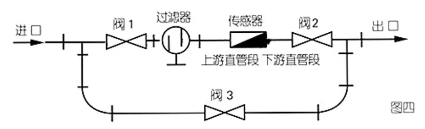

流量有瞬时流量和累积流量之分。

# 第一节 压差式流量计

## 一、压差流量计的组成

三部分：节流装置、导压管、显示仪表（或差压变送器+二次仪表）

## 二、节流式传感器工作原理

管道中固定放置一个有通流孔的阻流体，当流体流经此局部阻力时，将发生节流过程。

连续流动的流体受到孔板的约束，引起流束收缩，因而平均流速增大，静压降低，使孔板前后产生静压力差。

对于确定的节流件，此静压差与管内平均流速或流量之间存在一定的函数关系，测得此压差即可反映流量。

## 三、流量基本方程及压力损失公式

#### 1、不可压缩流体流量方程式

质量流量：
$$
M=\alpha F_0\sqrt{2\rho(P_1-P_2)}\\
=\alpha\frac\pi4d^2\sqrt{2\rho\Delta P}\quad(kg/s)
$$
体积流量：
$$
Q=\frac M\rho=\alpha\frac\pi4d^2\sqrt{\frac{2\Delta P}{\rho}}\quad(m^3/s)
$$
$\alpha$ ——流量系数

$F_0$ ——节流件开孔面积， $m^2$

$d$ ——节流件直径， $m$

$\rho$ ——流体密度， $kg/m^3$

$\Delta P$ ——节流件前后的压差值， $Pa$

#### 2、可压缩流体流量方程

质量流量：
$$
M=\alpha\varepsilon\frac\pi4d^2\sqrt{2\rho_1\Delta P}\quad(kg/s)
$$
体积流量：
$$
Q=\alpha\varepsilon\frac\pi4d^2\sqrt{\frac{2\Delta P}{\rho_1}}\quad(m^3/s)
$$
$\varepsilon$ ——流束膨胀系数， $\varepsilon<1$

$\rho_1$ ——节流件前流体密度

#### 3、节流元件压力损失

$$
\delta_P\approx\frac{1-\alpha m^2}{1+\alpha m^2}\Delta P
$$

$m$ ——孔板开孔面积 $F_0$ 与管道内截面积 $F$ 之比，简称截面比

$\alpha$ ——流量系数

$\Delta P$ ——孔板前后压差

## 四、实用流量方程式

$$
M=0.003998\alpha\varepsilon d_2\sqrt{\rho_1\Delta P}\quad(kg/h)\\
Q=0.003998\alpha\varepsilon d_2\sqrt{\Delta P/\rho_1}\quad(m^3/h)
$$

常数项 $0.003998=\frac{\sqrt2\pi\times3600}{4\times10^6}$

## 五、流量系数的确定

流量系数 $\alpha$ 由实验取得，它与节流件的形式，取压方式，孔径比（或截面比 $m$ ），以及流体的流动状态有关。

## 六、标准节流装置

对节流式流量计，按一定标准设计、制造、安装、使用，可保证一定的流量测量精度。

1. 标准节流件

   标准孔板、标准喷嘴、椭圆喷嘴

2. 标准取压装置

   角接取压、法兰取压

# 第二节 转子流量计

## 一、概述

转子流量计具有结构简单、使用方便、价格便宜、量程比大、刻度均匀、直观性好等特点，可测量各种液体和气体的体积流量，并将所测得的流量信号就地显示或变成标准的电信号或气信号远距离传送。

转子流量计主要由转子（浮子）、锥形管及支撑连接部分组成。

用途：气体和液体皆可；精确度，1-2%。

1. 使用特点：气体，液体测量；价格低廉，读数直观
2. 结构特点
   * 转子材料：胶木、硬橡木、有机玻璃、不锈钢
   * 锥管材料：玻璃管（高硼硬盘，有机)，金属管

## 二、转子流量计的工作原理

#### 节流前后差压与体积流量之间的关系为：

$$
Q=\alpha A_0\sqrt\frac{2\Delta P}\rho\\
Q=\alpha A_0\sqrt\frac{2gV_f}{A_f}\cdot\sqrt\frac{\rho_f-\rho}{\rho}
$$

$\alpha$ ——流量系数，与转子形状、尺寸有关

$A_0$ ——转子与锥形管壁之间环形通道面积

$V_f$ ——转子体积

$A_f$ ——转子最大横截面积

$\rho_f$ ——转子材料密度

$\rho$ ——被测流体密度

#### 面积问题：

$$
A_0=A-A_f=\pi r^2-\pi r_0^2\\
\frac{r-r_0}h=\tan\varphi\approx\varphi\\
r-r_0=\varphi h\Rightarrow r=r_0+\varphi h\\
A_0=\pi(r_0+\varphi h)^2-\pi r_0^2=\pi\varphi^2h^2+2\pi\varphi h\\
A_0=\pi\varphi^2h^2+2\pi\varphi h\approx2\pi\varphi h=Ch\\
Q=\alpha Ch\sqrt\frac{2gV_f}{A_f}\cdot\sqrt\frac{\rho_f-\rho}{\rho}
$$

1. 旋转式转子
   $$
   Re\geq10^4\\
   C_{R1}=0.98
   $$

2. 圆盘式转子
   $$
   Re\geq10^2\\
   C_{R2}=0.78
   $$

3. 板式转子
   $$
   Re\geq10^2\\
   C_{R3}=0.61
   $$
   

## 三、刻度校正

#### 1、校正原因

实际被测流体与流量计出厂标定流体不一致。

#### 2、校正系数

$$
K_1=\sqrt\frac{(\rho_f-\rho)\rho_0}{(\rho_f-\rho_0)\rho}
$$

$\rho_0$ ——仪表原刻度时介质密度

$\rho_f$ ——转子材料密度

$\rho$ ——在工作状态下被测介质的密度
$$
Q=K_1Q'
$$
若原刻度介质为空气，而当介质温度、压力改变时，根据上述道理，也只作密度校正。
$$
K_2=\sqrt\frac{\rho_0}\rho\\
Q=K_2Q'
$$

# 第四节 电磁流量计

## 一、电磁流量计传感器工作原理（基于电磁感应定律）：

导电流体在磁场中作垂直方向运动切割磁力线时，产生感应电势 $E$ （由管道二侧的电极引出）。

感应电势 $E$ 与流速 $V$  成正比，即
$$
E=B D V \bullet 10^{-4} \\
\therefore \quad E=\frac{4 \times 10^{-4} B}{\pi D} q_{v}=K q_{v}
$$

### 结构

电磁流量计的结构主要由磁路系统、测量导管、电极、 外壳、衬里和转换器等部分组成。

* 磁路系统：其作用是产生均匀的直流或交流磁场。直流磁路用永久磁铁来实现，其优点是结构比较简单，受交 流磁场的干扰较小，但它易使通过测量导管内的电解质液体极化，使正电极被负离子包围，负电极被正离子包围，即电极的极化现象，因而严重影响仪表正常工作。当管道直径较大时，永久磁铁相应也很大，笨重且不经济，所以电磁流量计一般采用交变磁场，且是 $50 \mathrm{Hz}$ 工频电源激励产生的。
* 测量导管：其作用是让被测导电性液体通过。为了使磁力线通过测量导管时磁通量不被分流或短路，测量导管必须采用不导磁、低导电率、低导热率和具有一定机械强度的材料制成，可选用不导磁的不锈钢、玻璃钢、高强度塑料、铝等。
* 电极：其作用是引出和被测量成正比的感应电势信号。电极一般用非导磁的不锈钢制成，且被要求与衬里齐平，以便流体通过时不受阻碍。它的安装位置宜在管道的垂直方向，以防止沉淀物堆积在其上面而影响测量精度。
* 外壳：应用铁磁材料制成，是分配自动励磁线圈的外罩，并隔离外磁场的干扰。
* 衬里：在测量导管的内侧及法兰密封面上，有一层完整的电绝缘衬里。它直接接触被测液体，其作用是增加测量导管的耐腐蚀性，防止感应电势被金属测量导管管壁短路。衬里材料多为耐腐蚀、 耐高温、耐磨的聚四氟乙烯塑料、陶瓷等。

### 特点

1. 测量管内光滑无阻，压力损失极小；
2. 采用防腐衬里时，可测量腐蚀性流体或含固体颗粒及悬浮物的流体；
3. 输出信号与不受流体物理性质变化的影响；
4. 对流量变化反应速度快；
5. 流动状态对示值影响小；
6. 缺点：被测流体必须是导电流体，**不能测气体和蒸汽**

### 性能

* 测量精度：0.5级
* 量程比：100:1；
* 流量计口径：几mm至1m以上。
* 注意事项：使用温度，0~200°C ；垂直安装；单独设置接地点。

#### 无电极电磁流量计：

* 没有穿过衬里与流体接触的电极，在衬里外面形成平面状的信号电极。通过信号电极和流体间形成静电容，检测出流体所产生的电动势。
* 优点：抗干扰能力强；能稳定地测量低导电性流体。

根据污水具有流量变化大、含杂质、腐蚀性小、有一定的导电能力等特性，测量污水的流量，电磁流量计是一个很好的选择。它结构紧凑、体积小，安装、操作、维护方便，如测量系统采用智能化设计，整体密封加强，能在较恶劣的环境下正常工作。可选用氯丁橡胶衬里，含钼不锈钢(OCrI8Ni12Mo2Ti)电极的电磁流量计，即可满足污水流量测量的要求。

某冶炼厂在生产中，由于生产工艺的需要，会产生大量的工业污水，污水处理分厂必须对污水的流量进行监控。在以往的设计中，流量仪表不少都选用旋涡流量计和孔板流量计。而实际应用中发现测量的流量显示值与实际流量偏差较大，而改用电磁流量计偏差大大减小。

# 第五节 其它流量计

## 涡街流量计

涡街流量计作为一种新型流量计，80年代中期以来发展较快，它在流量测量方面有着诸多的优点和长处，在现代流量测量中应用越来越广泛。在国内使用涡街流量计进行流量测量也愈来愈得到重视，目前我国已有性能优良并有自主知识产权的产品系列。

由于漩涡之间的相互影响，其形成通常是不稳定的。冯·卡门对涡列的稳定条件进行了研究，于1911年得到结论：只有当两漩涡列之间的距离 $h$ 和同列的两漩涡之间的距离 $L$ 之比满足  $\frac{h}{L}=0.281$ 所产生的涡街才是稳定的。

圆柱体后漩涡发生的频率为：
$$
f=S_{t} \frac{v}{d}
$$
$S_{t}$ 是与雷诺数有关的无量纲数，称为斯特罗哈数。
$$
f=S_{t} \frac{v}{d}=0.21 \times \frac{v}{d}
$$

## 涡轮流量计

涡轮流量计在以下一些测量对象获得广泛应用:石油、有机液体、无机液、液化气、天然气和低温流体。据统计，在欧洲和美国，涡轮流量计在用量上是仅次于孔板流量计的天然气计量仪表，仅荷兰在天然气管线上就采用了2600多台各种尺寸，压力从0.8~6. 5MPa的气体涡轮流量计，它们已成为优良的天然气计量仪表。

### 组成

涡轮流量变送器、指示积算仪

### 结构与工作原理

* 涡轮流量变送器结构：叶轮、导流器、磁检测器
* 原理：涡轮安装在非导磁材料制成的水平管段内，涡轮受到流体冲击而旋转，使得涡轮叶片通过磁电感应转换器中的永久磁钢时，由于磁路中的磁阻发生周期性变化，从而在感应线圈中产生脉动电势，经放大和整形后获得与流量成正比的脉动信号作为流量测量信息，再据脉动累计数求出总量。涡轮的转速与通过的体积流量成正比。

### 流量公式

$$
Q=\frac fK
$$

式中：

$Q$ ——体积流量， $m^3/s$ 

$f$ ——流量计输出信号的频率， $Hz$ 

$K$ ——流量计的仪表系数， $P/m^3$

该比例系数亦称为涡轮流量计的仪表系数。它是实际标定出来的。但它是一个平均值，它和不同流量点下的仪表系数是有差值的。同时每次标定出来的仪表常数也不一样。表的系数为多点、多次标定后，取各检定点系数中最大值与各检定点系数中最小值的算术平均值其表达式为：
$$
K=\frac{K_\max+K_\min}2
$$
仪表系数与流量之间的关系：

在流量很小时，即使有流体通过变送器，涡轮并不转动，只有流量大于某一最小值时，克服了启动摩擦力矩，涡轮才开始转动。这一最小流量值与流体的密度成平方根关系，所以变送器对密度较大的流体感度较好，在流量较小时，仪表特性很坏，主要是受粘性磨擦阻力矩的影响。

当流量大于某一数值后，流量与转数才近似为线性关系，这就是变送器的工作区域。当然由于轴承寿命和压损等条件的限制，涡轮也不能转的太快，所以涡轮流量计和其它流量计一样，也有测量范围的限制。涡轮流量计所测得的液体，一般是低粘度的低腐蚀性的液体。

### 优点

1. 准确度高：涡轮流量计的准确度在0.5-0.1%左右。在线性流量范围内，即使流量发生变化，累积流量准确度也不会降低。并且在短时间内，涡轮流量计的再现性可达0.05%.
2. 量程比宽：中大口径可达40:1或10:1，小口径为6:1或5:1，涡轮流量计的最大流量值大于很多其它流量计。
3. 适应性强：涡轮流量计可以做成封闭结构，其转速信号是非接触测量，所以容易实现耐高压设计。口径4-750mm，压力达250MPa，温度为-240～700°C，刻度线性。
4. 反映迅速，可测脉动流量。
5. 数字信号输出：涡轮流量计输出为与流量成正比的脉冲数字信号。它具有在传输过程中准确度不降低、易于
   累积、易于送入计算机系统的优点。

### 缺点

1. 轴承与轴之间的摩擦导致磨损，使仪表的准确度下降。
2. 不适用与高粘度液体，随着粘度的增大，流量计测量下限值提高，范围度缩小， 线性度变差 。
3. 要求被测介质洁净，减少对轴承的磨损，并防止涡轮被卡住，应在变送器前加过滤装置。
4. 仪表的精确度与范围度有关，同一台仪表如果要求精确度等级较高，只能在较低的范围度得到，如果想得到较大范围度，则必须要降低精确度等级。如范围度 $5:1$ 、精度 $\pm0. 2\%R$ ；范围度 $10: 1$ 、精度 $\pm0.5\%R$ 。
5. 汽-液两相流、气-固两相流、浓-固两相流均不能用涡轮流量计进行测量。

## 三、容积式流量计

容积式流量计又称排量流量计，在流量仪表中是精度最高的一类。

利用机械测量元件把流体连续不断地分割成单个已知的体积部分，根据计量室逐次、重复地充满和排放该体积部分流体的次数来测量体积流量。

### 1、椭圆齿轮流量计

$$
Q=4nV_0
$$
式中：

$Q$ ——液体的体积流量， $m^3/s$

$n$ ——转轮转数， $r/s$

$V_0$ ——计量室标定体积（半月形容积）， $m^3$

如累积齿轮转速，便知道一段时间内流体的总量。

#### 应用

中小流量液体的测量： $3L/h～540m^3/h$;

容积室直径： $10～250mm$

显示方式：就地、远传；测量准确度较高， $0.2～1.0$ 级，适合计量清洁原料油。

#### 注意事项

* 正常测量流量 $Q_\mathrm{com}=50～80\%Q_\max$ ；
* 测量精度与流体流动状态无关，被测液体粘度越大齿轮间隙的泄露量越小，由此引起的误差也越小，特别适合高粘度流体的测量；
* 被测流体中不能有固体颗粒，否则容易将齿轮卡住或引起严重磨损；
* 流体温度不能超过规定范围，否则将由于热胀冷缩可能发生卡死或增加测量误差；
* 安装时应使椭圆齿轮的旋转轴处于水平位置。

### 2、腰轮（罗茨）流量计

结构及工作原理：

在流量计的壳体内有一个计量室，计量室内有一对或两对可以相切旋转的腰轮。在流量计壳体外面与两个搜轮同轴安装了一对传动齿轮，它们相互啮合使两个腰轮可以相互联动。

性能：精度， $\pm0.1\%$ ；测量范围， $0.1～2500m^3/h$ ；口径， $16～500mm$

比较：椭圆齿轮流量计对杂质敏感；腰轮（罗茨）流量计对杂质不敏感。

还可以对气体进行流量测量
