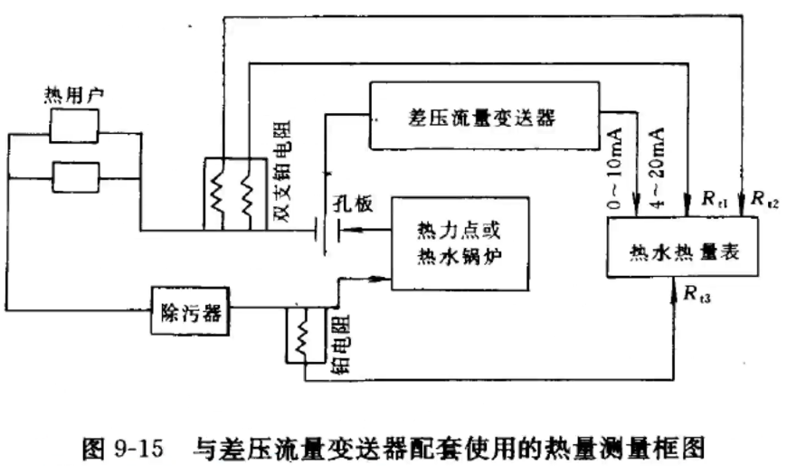
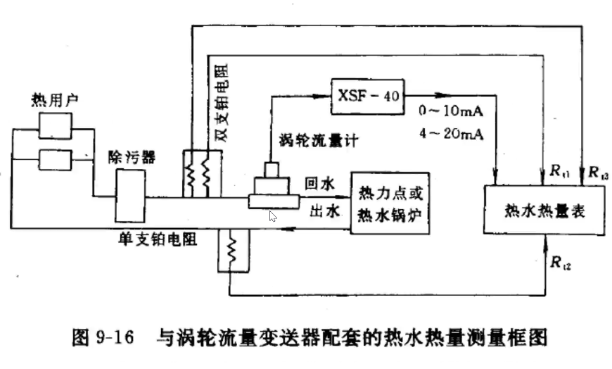
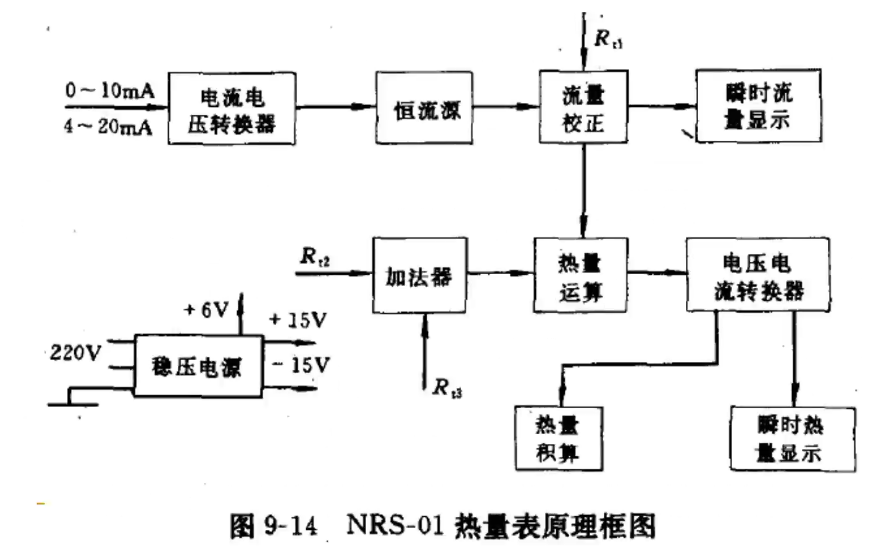
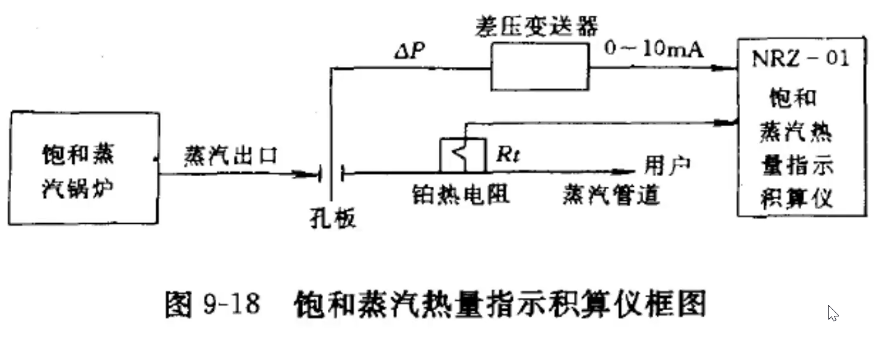
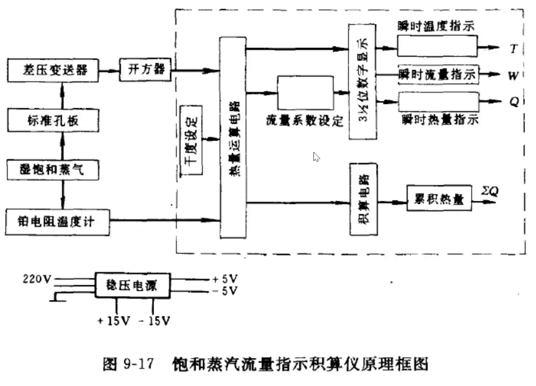

* 热流计是指测定热流的仪表。热流是在单位时间内流经单位面积的热量，也可把热流理解为热能通过单位面积的速率。热流单位是 $W/m^2$ 。为测量某一局部的热辐射强度、热对流强度、热传导强度或总的传热速率，常采用热流计。
* 热阻式热流计主要用来测量**导热传热**的热流密度。

温差的测量

采用热电偶
$$
\Delta E=c'\Delta t
$$
$c'$ ——热电偶系数
$$
q=\frac{\lambda\Delta E}{\delta c'}=C\Delta E
$$
$C$ ——热流计系数

$C$ 下降，对于相同热流量 $q$ ， $\Delta E$ 升高，灵敏度增加。

$C$ 增加，对于相同热流量 $q$ ， $\Delta E$ 减少，灵敏度下降。

降低 $C$ 提高灵敏度的措施：

* 提高热阻 $\frac\delta\lambda$ 
* 提高热电偶系数 $C'$

如果热流测头材料和几何尺寸确定，那么只要测出测头

提高热电偶系数 $C'$ 实现的方法：串联热电偶。

平板热流传感器是由若干块10mmX100mm热电堆片镶嵌于一块边框中制成。边框尺寸一般为130mmX130mm左右，材料是厚1mm左右的环氧树脂玻璃纤维板。

热电堆片是由很多对热电偶串联绕在基板上组成。

用于常温下测量的热流传感器，基板为层压板;

用于高温下测量的热流传感器，基板为陶瓷片。

由于采用串联连接，总热电势等于各分电势叠加。虽然基板两面温差 $\Delta t$ 很小，但也会产生足够大的热电势。
$$
q=CE
$$
$E$ ——测头输出的热电势， $mV$ 

$C$ ——热流测头系数， $W / (m^2\cdot mV)$ 

$q$ ——热流密度， $W/m^2$ 

测头系数是热阻式热流测头的重要参数，其值与测头的材料、结构、几何尺寸、热电特性等有关。C值的大小反映了热流测头的灵敏度，C值越小测头灵敏度越高，反之，测头灵敏度越低，因此有的文献把C值的倒数称为测头的灵敏度。

热阻式热流测头只需要较小的温度梯度就可以产生较大的输出信号，这对于测量较小热流密度的传热过程是有利的。热阻式热流测头能够测量几 $W / m^2$ 到几万 $W/m^2$ 的热流密度。表面接触式安装的测头使用温度一般在200°C以内，特殊结构的测头可以测到500~ 700°C。热阻式热流测头反应时间一般较长，随热阻层的性能和厚度不同，反应时间从几秒到几十分钟或更长，可见这类测头比较适合变化缓慢的或稳定的热流测量。

板式（WYP型）：用于测量平壁面

可挠（WYR型）：用于测量管道

#### (一)指针式热流显示仪表

指针式热流显示仪表是以指针式表头作为显示部件，其结构比较简单，成本低，是应用较为广泛的一种热流显示仪表，下图所示为WY-1型热流显示仪表。主要由直流放大器和指针式表头组成。热流测头将热流密度信号转换成电势信号，经直流放大器放大后驱动指示表头工作，表头直接指示被测热流密度。指示表头是1.0级的直流微安表。

仪表电源采用9V积层电池，功耗50mW，正常情况下，电池可使用1~2个月。显示仪表除直流放大器和指示表头外，在表盘上还设有一些必要的开关、旋钮和插口，使用仪表时，将热流测头引线插头插入测头插口，电源开关接通，再把工作状态开关拨至调零位置，转动调零旋钮，使仪表指针指零。然后根据所需要的测量范围，把量程转换开关打到适当位置，并使工作状态开关投向工作状态，此时仪表即可使用。

#### (二)数字式热流显示仪表

数字式热流显示仪主要是解决弱小信号的放大和显示问题，尤其是在测量较小的热流量时，传感器输出信号可能低于1mV，需要经过放大才能显示，这就需要低漂移的精度高的仪表放大器。热流的测量往往是在现场进行的，使用体积较大的仪表、或者在现场布置很多导线都是不便的，因此，这类仪表大多数是便携式的。

由于热流传感器本身是一块具有有限大面积和一定厚度的物体，它引起的传热变化是一个很复杂的三维传热问题。但为了使问题简化，不难理解当被测热阻层导热系数与热流传感器材料导热系数相差不大时，或者热流传感器的厚度相对被测热阻层厚度很小时，用一维传热的计算方法来估计测量误差，还是相当准确的。未安装热流传感器时，通过热阻层的热流密度为
$$
q=\frac{t_1-t_2}{\frac1{\alpha_1}+\frac\delta\lambda+\frac1{\alpha_2}}
$$
$t_1,t_2$ ——热阻层两侧的温度

$\alpha_1,\alpha_2$ ——热阻层两侧的对流换热系数

$\lambda$ ——热阻层的导热系数

$\delta$ ——热阻层的厚度

### 三、热阻式热流计的安装

热流传感器的安装有三种方法：埋入式、表面粘贴式和空间辐射式。埋入式和表面粘贴式是热阻式热流传感器常用的两种安装方法。

在安装热流传感器时，不管采用埋入式还是采用粘贴式，总要使用一些黏结剂等材料，在热流传感器与被测热阻层之间产生一定的接触热阻。这样热流传感器本身以及所产生的接触热阻，都会影响热阻层原有的传热情况。

粘贴式：
$$
q^{\prime}=\frac{t_{1}-t_{2}}{\frac{1}{\alpha_{1}}+\frac{\delta}{\lambda}+\frac{\delta^{\prime}}{\lambda^{\prime}}+R+\frac{1}{\alpha_{2}}} \quad W / m^{2} \\
$$
埋入式：
$$
q^{\prime \prime}=\frac{t_{1}-t_{2}}{\frac{1}{\alpha_{1}}+\frac{\delta-\delta^{\prime}}{\lambda}+\frac{\delta^{\prime}}{\lambda^{\prime}}+R+\frac{1}{\alpha_{2}}} \quad W / m^{2}
$$

#### 对流和辐射引起的误差

对流换热系数的变化也会引起一定的误差。但由于对流换热热阻远小于保温层热阻，因此对于测量引起的误差很小。辐射对测量过程的影响是由于热流传感器与被测表面的辐射系数的差别及外界辐射变化两方面所造成的。

# 第二节 热水热量指示积算仪

## 一、工作原理

$$
Q=m(h_s-h_r)
$$

$Q$ ——热水的热量， $kJ/h$ 

$m$ ——热水的质量流量， $kg/h$ 

$h_r$ ——回水焓值， $kJ/kg$ 

$h_s$ ——供水焓值， $kJ/kg$ 

热水的焓值为其定压比热与温度之积，即
$$
h=c_pt\\
Q=km(t_s-t_r)
$$
$t_s、t_r$ ——分别为供回水温度， $\degree C$ 

$k$ ——仪表常数， $k=c_p$ 

## 二、结构组成

## 四、最大流量和最大热量

### 1、最大流量

孔板流量计，实际使用的最大流量，水温为 $70\degree C$ 
$$
M_\max=M_{d\max}\sqrt{\frac{\rho_{70}}{\rho_{d}}}
$$
$\rho_{70}$ —— $70\degree C$ 时水的密度（在供水温度变化范围内， $\rho_{70}$ 为最大）， $kg/m^3$

$\rho_d$ ——孔板设计温度 $t_d$ 时的密度， $kg/m^3$ 

$M_{d\max}$ ——孔板设计时的最大质量流量， $t/h$ 

$M_\max$ ——供水温度为  $70\degree C$ 时的质量流量， $t/h$  

$M_\max$ 即为流量指示仪表 $100\%$ 刻度所对应的最大瞬时流量

### 2、最大热流量

热流最大值应该是最大流量与最大焓差的乘积
$$
Q_\max=M_\max\Delta h_\max
$$
供水温度 $t_s=70～150\degree C$ ，回水温度 $t_r=50～100\degree C$ 
$$
M_{\max }=M_{\mathrm{dmax}} \sqrt{\frac{\rho_{150}}{\rho_{\mathrm{d}}}} \\
\Delta h_{\max }=h_{150}-h_{50}
$$

# 第三节 饱和蒸汽热量指示积算仪

## 一、工作原理

$$
Q=m(h_s-h_r)
$$

$Q$ ——蒸汽质量， $kJ/h$ 

$m$ ——蒸汽质量流量， $kJ/kg$ 

$h_s$ ——蒸汽焓值， $kJ/kg$ 

$h_r$ ——凝水焓值， $kJ/kg$ 

$h_s>>h_r$ ：
$$
Q=mh_s
$$
饱和湿蒸汽的干度修正：对于含有少量水份的湿蒸汽
$$
m=x_cm_h
$$
$m$ ——饱和蒸汽质量流量， $kg/h$ 

$m_h$ ——湿蒸汽质量流量， $kg/h$ 

$x_c$ ——流量计算中引入的干度修正系数
$$
x_c=(1.56-0.56x)/\sqrt x
$$

## 二、结构原理

# 第四节 氧化锆氧量计

气体成分分析研究的意义：

成分分析在工业生产及科学研究中具有广泛的用途，例如：在燃烧过程中，可以通过对烟气中的 $O_2$ 或 $CO_2$ 含量的分析来了解燃烧状况：

在环境保护方面，分析排烟中 $NO_x$ 的含量、可以了解环境状况等。

具体的说：锅炉燃烧控制质量的好坏，直接关系到电厂燃料消耗率的高低。为了使燃料达到完全燃烧，同时又不过多增加排烟量和降低排烟温度，首先要控制燃料和空气的比例，使**过剩空气系数 $a$ ** 保持在最佳范围内。**当鼓风量过大时**（即**空燃比**偏大），虽然能使燃料充分燃烧，但烟气中过剩空气量偏大，表现为烟气中 $O_2$含量高，过剩空气带走的热损失 $Q_1$ 值增大，导致热效率 $η$ 偏低。与此同时，过量的氧气会与燃料中的 $S$ 、烟气中的 $N_2$ 反应生成 $SO_2$ 、 $NO_x$ 等有害物质。**当鼓风量偏低时**（即空燃比减小），表现为烟气中 $O_2$ 含量低， $CO$ 含量高，虽说排烟热损失小，但燃料没有完全燃烧，热损失 $Q_2$ 增大，热效率 $\eta$ 也将降低。另外，烟囱也会冒黑烟而污染环境。由于烟气含氧量与过剩空气系数 $a$ 有单值对应关系，因此可以用氧量计测量炉膛排烟的含氧量，连续监测燃烧质量，以便及时调整燃料和空气的比例。

氧化锆：珠宝行业中的锆石钻，陶瓷工业应用非常多

目前广泛应用的是氧化锆氧量计，它是目前最佳的燃烧气氛测量方式，具有结构简单、响应迅速、维护容易、使用方便、测量准确等优点。运用该传感器进行燃烧气氛测量和控制，既能稳定和提高产品质量，又可缩短生产周期，节约能源。

## 一、氧化锆测氧原理

氧化锆 $(ZrO_2)$ 是一种固体电解质，具有离子导电特性。

氧化锆 $(ZrO_2)$ 是一种陶瓷，一种具有离子导电性质的固体。在常温下为单斜晶体，当温度升高到1150°C时，晶型转变为立方晶体，同时约有7%的体积收缩；当温度降低时，又变为单斜晶体。若反复加热与冷却， $ZrO_2$ 就会破裂。因此，纯净的 $ZrO_2$ 不能用作测量元件。

另外即使在高温， $ZrO_2$ 晶体中含有的氧离子空穴浓度也很小，虽然热激发会造成氧离子空穴，但其浓度仍十分有限，使得 $ZrO_2$ 还不足以作为良好的固体电解质。

若在 $ZrO_2$ 中掺入少量的其他低价氧化物，如 $CaO$ 、Y,O3 (氧化钇)等，+2价的钙离子 $Ca_2+$ 会进入 $ZrO_2$ 晶体，置换出 $+4$ 价的锆离子 $Zr_4+$ 、而在晶体中留下了一个氧离子空穴。

空穴的多少与掺杂量有关。

当温度上升到 $800°C$ 以上时，掺有 $CaO$ 的 $ZrO_2$ ，便是一种良好的氧离子导体。

本节讨论的氧化锆，便是这种掺入 $CaO$ 的 $ZrO_2$ 材料。

氧化锆管内外侧的铂电极分别为正极和负极。根据能斯特方程，两极间的理论电势为：
$$
E=\frac{RT}{nF}\ln\frac{P_2}{P_1}
$$
$E$ ——理论浓差电势， $V$

$R$ ——气体常数

$T$ ——气体绝对温度， $K$ 

$F$ ——法拉第常数， $F = 96487C/ mol$

$n=4$ 

在混合气体中，某气体组的分压力和总压力之比与浓度成正比，即：
$$
\frac{P_1}P=\varphi_1\\
\frac{P_2}P=\varphi_2\\
$$
则有：
$$
E=\frac{RT}{nF}\ln\frac{\varphi_2}{\varphi_1}
$$
$φ_2=20.8\%$ ，代入其他常数可得：
$$
E = 0.0338T - 0.0496T \lg \varphi_1
$$
氧化锆传感器也称氧化锆探头，带恒温装置的氧化锆传感器结构示意图。

一般使用时， 氧化锆管内部通入参比气体——空气，外部则流过被经陶瓷过滤器过滤过的被测气体——烟气。陶瓷过滤器主要用来滤除烟气中的杂质颗粒（如烟尘、炭粉等）并可对信号起阻尼作用，防止指针抖动。