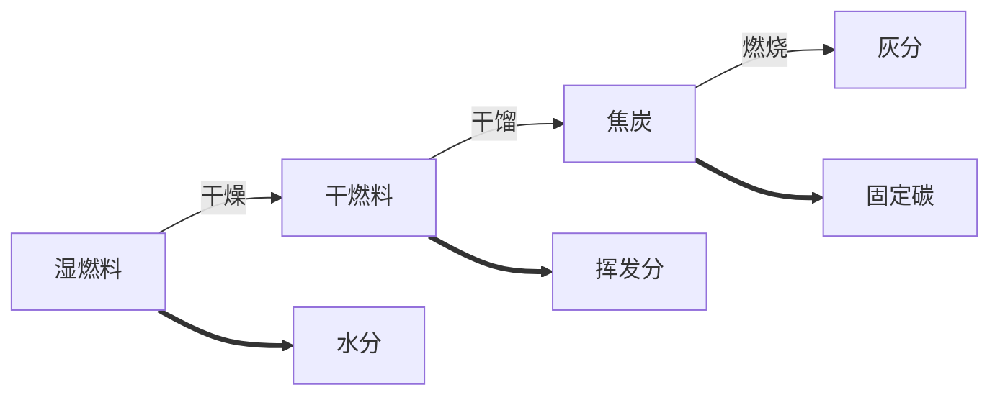

# 第二章 燃料及燃烧计算

1. 为何要研究锅炉燃料？

   锅炉口粮，其组成、分类、特性、对燃烧有重大意义。

2. 为什么要进行燃烧计算？

   是整个锅炉热力计算的一部分，为热平衡计算、传热计算、通风机械选择提供依据。

## 第一节 燃料的化学成分

燃料的种类很多、燃烧特性也有很大差异，其空气量、烟气量、灰渣量也不相同。不同燃料通常要采用不同的燃烧方式和燃烧设备，所以必需熟悉工厂主要燃料（尤其是煤炭）的基本燃烧特性，了解燃料的燃烧过程。

锅炉燃料：

* 固体（煤炭、木废料等）
* 液体（重油、渣油等）
* 气体

我国燃料概况：煤炭资源丰富、石油、天然气资源不足；煤炭**含硫量**高

#### 一、燃料的元素分析成分

燃料是复杂的化合物，主要含C、H、S、O、N、水分（M）、灰分（A）各成分特性如下：

* 碳（C）

  * 主要可燃成分——约占可燃成分的70～95%
  * 决定煤发热量高低的主要元素——无烟煤发热量高
  * 着火温度（着火点）较高——不容易着火燃烧和燃尽（例如：无烟煤）
  * 温室气体的主要来源——天然气、石油含碳量低

* 氢（H）

  * 主要可燃成分之一——煤中氢可占可燃成分的2～8%
  * 发热量很高——比碳高
  * 碳氢化合物多——易分解，冒黑烟，污染环境
  * 着火点较低——烟煤、褐煤、木质燃料易着火

* 硫（S）

  * 主要有害元素，分可燃硫（有机硫、FeS~2~），不可燃硫（FeSO~4~）等。可燃硫燃烧会污染环境，在燃料中占可燃成分的0.1～8.0%左右

  * 烟气结露——腐蚀设备
  * 排入大气——危害人及动物、植物、污染环境

* 氧（O）、氮（N）

  * 是杂质，习惯上仍算可燃成分——无用
  * 一般无害——NOx污染环境——有毒的光化学烟雾

* 水分（M）

  * 主要杂质之一——含量越大燃料的发热量就越低
  * 水汽化——降低炉温，不利燃烧；带走大量热量
  * 烟气结露（露点温度）——低温受热面的积灰和腐蚀
  * 煤中应保持适当的水分——以8～10%为宜

* 灰分（A）

  * 最主要的杂质——使发热量降低
  * 受热面积灰、积渣现象比较严重
  * 加大金属磨损
  * 大气污染
  * 有效的除尘设备——设备投资也要增加
  * 增加运输负担——运煤、运煤渣

#### 二、燃料成分的表示方法

1. 分析基准

   组成成分的表示方法——四个计算基准

   固体、液体燃料的组成成分、用质量百分数表示；气体燃料的组成成分，用体积百分数表示。

   对于故意液体燃料——在说明成分数值时，必须同时说明计算这种百分数时所用的***计算基准***。老的计算基准符号放在**上标**位置；新的标准放在**下标**位置。

   * 收到基（ar），旧应用基y——炉前燃料；适合热力计算
   * 空气干燥基（ad），旧分析基f——实验室条件，$20^\circ C，60\%$；适合分析、测试
   * 干燥基（d），旧干燥基g——燃料无水分；适合分析灰分
   * 干燥无灰基（daf），旧可燃基r——无水分，无灰分；适合煤矿

2. 元素分析法

   元素分析法技术要求高，用处大，数据准确，工业分析实用性强。

3. 各种基成分关系及转换

   挥发分：$可燃基成分C^y+H^y+S^y+O^y+N^y=100\%$

   灰分：$干燥基成分C^g+H^g+S^g+O^g+N^g+A^g=100\%$

   煤质：$分析基成分C^f+H^f+S^f+O^f+N^f+W^f+A^f=100\%$

   燃烧计算：$应用基成分C^y+H^y+S^y+O^y+N^y+W^y+A^y=100\%$

   换算关系为：欲求基成分=已知基成分&times;换算系数K

## 第二节 煤的燃烧特性

了解燃烧特性的目的

* 根据锅炉选购合适的燃料——配煤
* 替代燃料
* 适宜的燃烧操作

#### 一、煤的工业分析

还可以根据煤在炉中燃烧时的物质变化情况来表示——工业分析成分（更具实用价值）。

元素分析成分计算公式：

收到基：$C_{ar}+H_{ar}+O_{ar}+N_{ar}+S_{ar}+A_{ar}+M_{ar}=100\%$

干燥基：$C_d+H_d+O_d+N_d+S_d+A_d+M_d=100\%$

#### 二、燃烧特性指标

1. ##### 发热量

   > 每kg煤完全燃烧时所放出的热量 $kJ/kg$
   
   * 高位发热量——包括燃烧生成物中水蒸气的汽化潜热
   * 低位发热量——燃烧计算依据 $Q_{net,ar}$ 
   
   如何获得燃料发热量数据？
   
   * 供应商提供
   
   * 手册
   
   * 门捷列夫经验公式进行近似计算
     $$
     Q_{net,ar}^y=339C_{ar}+1030H_{ar}-109(O_{ar}-S_{ar})-25M_{ar}
     $$
   
   * 测量——**氧弹量热计**
   
     标准煤：统一的能源计量单位
   
     kg标准煤（或t标准煤，toc）
   
     $29308kJ/kg（7000 kcal/kg）$
   
     标准煤量：$B_b=(B\cdot Q_{net,ar})/29308$
   
2. ##### 挥发分

   煤样隔绝空气时产生的气态物质（ $C_mH_n、H_2、CO等$ ），其百分数含量称为煤的**挥发分**（ $V_{daf}$ ），它是煤的重要特性指标，与发热量一起作为划分煤种的**主要依据**。

   $V_{daf}$高的煤，发热量不一定高，对锅炉运行有很大影响

   如褐煤： $V_{daf}40\%，而Q_{net,ar}=3000kcal/kg$

   * $V_{daf}$高的煤（如烟煤）着火迅速，易于燃尽
   * $V_{daf}$高，可燃气体多，在炉膛中燃烧时，需足够的炉膛空间、足够的时间，需要一定的扰动
   * $V_{daf}$高，在低温缺氧燃烧时，挥发分会裂解，容易冒黑烟（好像爆米花机），污染环境

3. ##### 煤的结焦性（焦结性）

   * 焦炭呈粉状的煤称为不结焦性煤

     ——焦末、炭屑漏落或被气流吹起

   * 焦炭呈坚硬块状的煤称为强结焦性煤

     ——较大的焦块——通风阻力大

   * 两者之间的煤称为弱结焦性煤

     **层燃炉宜燃用弱结焦性煤**

4. ##### 灰熔点

   灰熔点即煤灰变形、软化时的温度，主要看变形时的温度。变形温度、软化温度、半球温度、流动温度

   低熔点（低于1200°C）的灰易在炉内结渣——堵塞炉排——裹住焦炭

## 第三节 煤的分类

| 煤种         | 主要特点                                                     |
| ------------ | ------------------------------------------------------------ |
| 石煤、煤矸石 | 灰分高，发热量极低，挥发分少，难点燃，均属劣质燃料。         |
| 褐煤         | 外表一般呈褐色，无光泽，质脆易碎易燃，挥发分很高，极易着火。但水分和灰分也很高，发热量较低，属低质燃料。 |
| 无烟煤       | 白煤，质地坚硬，具有明亮的黑色光泽。发热量很高；挥发分含量很低，所以着火困难，燃烧不稳定。 |
| 贫煤         | 其燃烧特性介于无烟煤和烟煤之间，比较接近于烟煤。             |
| 烟煤         | 外表呈黑色，无光泽，质地松软，其挥发分含量较高，一般 $V^2=20～40\%$ ，易于着火，发热量也比较高。烟煤是锅炉较理想的固体燃料。 |

## 第四节 燃料的燃烧计算

### 一、燃料的燃烧过程

1. ##### 着火前的热力准备阶段

   * 干燥阶段——100°C

   * 干馏阶段：

     褐煤130°C——烟煤——无烟煤400°C

     开始析出挥发分——热分解——碳黑

     同时生成焦炭

     特点：需高温环境，基本不需要空气

2. ##### 挥发物与焦炭的燃烧阶段

   * 挥发分着火燃烧阶段

     挥发分着火燃烧温度 $\approx$ 着火温度

     褐煤250～450°C，烟煤400～500°C，而无烟煤600～700°C

   * 焦炭燃烧阶段

     特点：放出大量热量，需要充足的空气，足够的燃烧时间，燃料与空气良好接触。

3. ##### 燃尽阶段

   即灰渣形成段，焦炭燃尽阶段。

   特点：仍需高温的环境，需少量的空气，一定的燃烧时间。

怎样使燃料充分燃烧？

* 分区送风或分阶段送风

* 击碎大块煤，磨成煤粉

* 前、后拱

* 空气预热

* 足够的炉排面积、炉膛空间

* 倒转炉排，老鹰铁

* 通风出渣设备，烟囱等

  烟囱高的好处：出气能力强、环保、排放的区域更大、有害物相对浓度低

### 二、燃烧计算

1. ##### 计算内容

   （空气量、烟气量、烟气焓）

2. ##### 计算目的

   * 提供足够而适量（稍过量）的空气——多少？鼓风机风量？
   * 排出烟气——多大风量的鼓风机？
   * 烟气余热利用——烟气量？

3. ##### 计算步骤

   * 理论空气量——实际空气量—— $V_k=\alpha V_k^0$

   * 理论烟气量——实际烟气量—— $V_y=V_y^0+1.0161(\alpha'-1)V_k^0$

     0.0161——空气中水蒸汽的含量

4. ##### 计算方法

   * 理论分析——需元素分析成分

   * 经验公式计算——根据发热量

   * 大致数值（ $Nm^3/kg$ ）

     | 燃料种类   | 褐煤     | 烟煤     | 无烟煤 | 木质燃料（干） |
     | ---------- | -------- | -------- | ------ | -------------- |
     | 理论空气量 | 3.5～6.5 | 7.5～8.5 | 9～10  | 4.6            |

### 三、燃料需要的空气量计算

碳的完全燃烧反应方程式为：
$$
C+O_2=CO_2\\
12kgC+22.4m^3O_2=22.4m^3CO_2
$$
每kg氢完全燃烧时需要 $5.55Nm^3$ 氧气，并产生 $11.1Nm^3$ 水蒸气。

氧气量为：
$$
V_{O_2}^k=1.866\frac{C_{ar}}{100}+0.7\frac{S_{ar}}{100}+5.55\frac{H_{ar}}{100}-0.7\frac{O_{ar}}{100}（Nm^3/kg）
$$
理论水蒸汽体积有四个来源：

* 燃料中氢完全燃烧生成的水蒸汽
* 燃料中水分形成的水蒸汽
* 理论空气量 $V_k^0$ 带入的水蒸汽
* 燃用重油且用蒸汽雾化时带入炉内的水蒸汽

$$
V_{H_2O}^0=0.111H_{ar}+0.0124M_{ar}+0.0161V_k^0+1.24G_{Wh}(Nm^3/k)
$$

### 五、烟气焓和空气焓的计算

理论空气焓的计算式：
$$
I_k^0=V_k^0(c\vartheta)_k
$$
