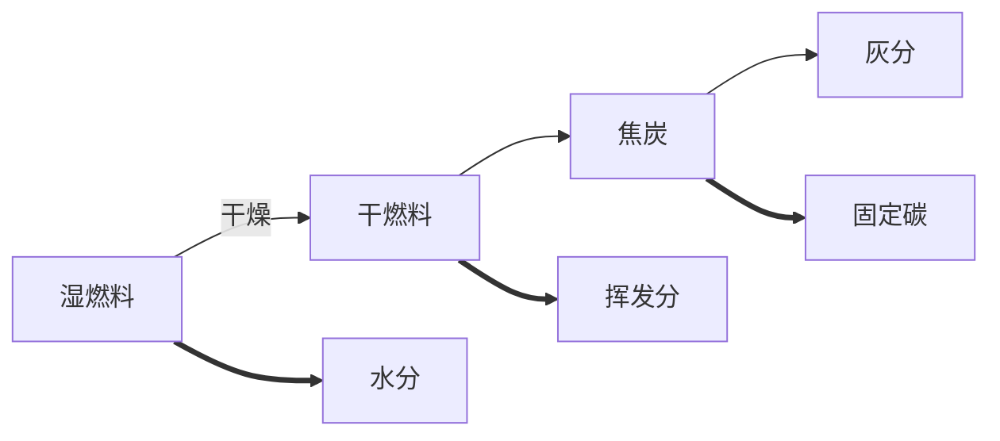

# 第二章 燃料及燃烧计算

1. 为何要研究锅炉燃料？

   锅炉口粮，其组成、分类、特性、对燃烧有重大意义。

2. 为什么要进行燃烧计算？

   是整个锅炉热力计算的一部分，为热平衡计算、传热计算、通风机械选择提供依据。

## 第一节 燃料的化学成分

燃料的种类很多、燃烧特性也有很大差异，其空气量、烟气量、灰渣量也不相同。不同燃料通常要采用不同的燃烧方式和燃烧设备，所以必需熟悉工厂主要燃料（尤其是煤炭）的基本燃烧特性，了解燃料的燃烧过程。

锅炉燃料：

* 固体（煤炭、木废料等）
* 液体（重油、渣油等）
* 气体

我国燃料概况：煤炭资源丰富、石油、天然气资源不足；煤炭**含硫量**高

#### 一、燃料的元素分析成分

燃料是复杂的化合物，主要含C、H、S、O、N、水分（M）、灰分（A）各成分特性如下：

* 碳（C）

  * 主要可燃成分——约占可燃成分的70～95%
  * 决定煤发热量高低的主要元素——无烟煤发热量高
  * 着火温度（着火点）较高——不容易着火燃烧和燃尽（例如：无烟煤）
  * 温室气体的主要来源——天然气、石油含碳量低

* 氢（H）

  * 主要可燃成分之一——煤中氢可占可燃成分的2～8%
  * 发热量很高——比碳高
  * 碳氢化合物多——易分解，冒黑烟，污染环境
  * 着火点较低——烟煤、褐煤、木质燃料易着火

* 硫（S）

  * 主要有害元素，分可燃硫（有机硫、FeS~2~），不可燃硫（FeSO~4~）等。可燃硫燃烧会污染环境，在燃料中占可燃成分的0.1～8.0%左右

  * 烟气结露——腐蚀设备
  * 排入大气——危害人及动物、植物、污染环境

* 氧（O）、氮（N）

  * 是杂质，习惯上仍算可燃成分——无用
  * 一般无害——NOx污染环境——有毒的光化学烟雾

* 水分（M）

  * 主要杂质之一——含量越大燃料的发热量就越低
  * 水汽化——降低炉温，不利燃烧；带走大量热量
  * 烟气结露（露点温度）——低温受热面的积灰和腐蚀
  * 煤中应保持适当的水分——以8～10%为宜

* 灰分（A）

  * 最主要的杂质——使发热量降低
  * 受热面积灰、积渣现象比较严重
  * 加大金属磨损
  * 大气污染
  * 有效的除尘设备——设备投资也要增加
  * 增加运输负担——运煤、运煤渣

#### 二、燃料成分的表示方法

1. 分析基准

   组成成分的表示方法——四个计算基准

   固体、液体燃料的组成成分、用质量百分数表示；气体燃料的组成成分，用体积百分数表示。

   对于故意液体燃料——在说明成分数值时，必须同时说明计算这种百分数时所用的***计算基准***。老的计算基准符号放在**上标**位置；新的标准放在**下标**位置。

   * 收到基（ar），旧应用基y——炉前燃料；适合热力计算
   * 空气干燥基（ad），旧分析基f——实验室条件，$20^\circ C，60\%$；适合分析、测试
   * 干燥基（d），旧干燥基g——燃料无水分；适合分析灰分
   * 干燥无灰基（daf），旧可燃基r——无水分，无灰分；适合煤矿

2. 元素分析法

   元素分析法技术要求高，用处大，数据准确，工业分析实用性强。

3. 各种基成分关系及转换

   挥发分：$可燃基成分C^y+H^y+S^y+O^y+N^y=100\%$

   灰分：$干燥基成分C^g+H^g+S^g+O^g+N^g+A^g=100\%$

   煤质：$分析基成分C^f+H^f+S^f+O^f+N^f+W^f+A^f=100\%$

   燃烧计算：$应用基成分C^y+H^y+S^y+O^y+N^y+W^y+A^y=100\%$

   换算关系为：欲求基成分=已知基成分&times;换算系数K

## 第二节 煤的燃烧特性

了解燃烧特性的目的

* 根据锅炉选购合适的燃料——配煤
* 替代燃料
* 适宜的燃烧操作

#### 一、煤的工业分析

还可以根据煤在炉中燃烧时的物质变化情况来表示——工业分析成分（更具实用价值）。

元素分析成分计算公式：

受到基：$C_{ar}+H_{ar}+O_{ar}+N_{ar}+S_{ar}+A_{ar}+M_{ar}=100\%$

干燥基：$C_d+H_d+O_d+N_d+S_d+A_d+M_d=100\%$

#### 二、燃烧特性指标

1. 发热量

   > 每kg煤完全燃烧时所放出的热量$kJ/kg$